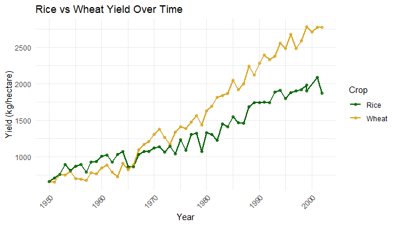
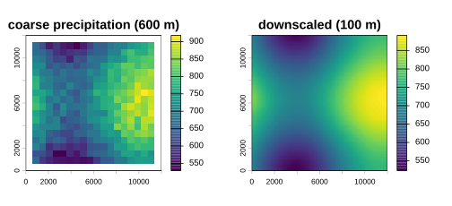
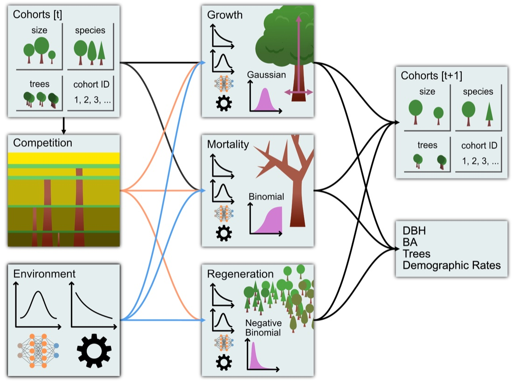
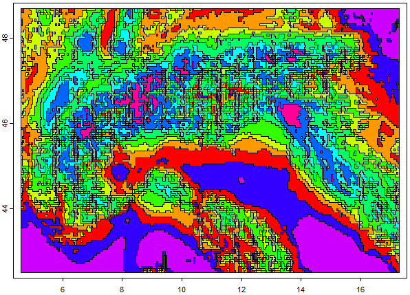
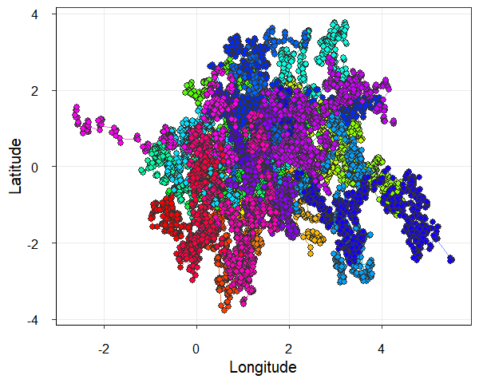

Three hundred fifty-three new packages were submitted to CRAN in July. Here are my Top 40 picks in nineteen categories: Causal Inference, Chemistry, Climate Studies, Computational Methods, Ecology, Economics, Econometrics, Genomics, Geomorphometry, Mathematics, Machine Learning, Medical Statistics, Meta-Analysis, Networks, Statistics, Surveys, Time Series, Utilities, and Visualization.

{fig-alt=""}

:::: {.columns}

::: {.column width="45%"}

### Agriculture

[agridatasets](https://cran.r-project.org/package=agridatasets) v0.1.1: Offers a rich and diverse collection of datasets focused on agriculture, agronomy, animal science, and related fields. The package includes experimental, observational, and field-trial data on crops such as rice, wheat, corn, soybean, cotton, coffee, avocado, and orange, as well as forestry species including bamboo, eucalyptus, and timber. Datasets cover plant breeding and genetics, factorial and randomized block experiments, herbicide and insecticide efficacy trials, pest and disease infestation, soil characteristics and land suitability, plant growth regulators, seed germination, and crop yield modeling. See the [vignette](https://cran.r-project.org/web/packages/agridatasets/vignettes/agridatasets.html).

{fig-alt="Rice vs Wheat Time Series"}

## Aartificial Intelligence

[commons](https://cran.r-project.org/package=commons) v0.1.0: Implements trustworthy large language model agents. Connect raw data sources, a pool of trusted calculations, and a searchable context layer that demonstrates how to interpret them. Then, deploy data agents that answer questions, log interactions, and can be evaluated and improved over time. See the vignettes [Introduction](https://cran.r-project.org/web/packages/commons/vignettes/commons.html) and [Security and governamce](https://cran.r-project.org/web/packages/commons/vignettes/governance.html).

### Climate Studies

[topocast](https://cran.r-project.org/package=topocast) v0.0.5: Downscales coarse-resolution raster data to a finer grid by fitting local linear regressions of a response, such as a climate variable, on one or more fine-resolution predictors, such as elevation and other terrain indices, within a moving window.  Multiplicative and additive anomaly application downscale time series relative to a baseline climatology, following the regression-on-elevation approach used for high-resolution climate surfaces described in [Karger et al. (2017)](doi:10.1038/sdata.2017.122). See the vignettes [Getting started](https://cran.r-project.org/web/packages/topocast/vignettes/getting-started.html) and [How moving-window downscaling works](https://cran.r-project.org/web/packages/topocast/vignettes/how-it-works.html).

{fig-alt="Heat map showing the result of downscaling"}

### Ecology

[FINN](https://cran.r-project.org/package=FINN) v0.1.0: Implements a hybrid dynamic forest model that can be configured as a fully mechanitic, process-based model, like classic forest gap models, or with its demographic processes (growth, mortality, regeneration) replaced by deep neural networks, or any combination of the two. Provides functions to define a model and its mechanistic or empirical components, calibrate it to forest inventory data, and interpret the calibrated processes. FINN is implemented with the `torch` package but no knowledge of `torch` is required. The hybrid modeling approach is described in [Pichler and Käber (2026)](doi:10.1111/2041-210x.70347). There are five vignettes including [Introduction](https://cran.r-project.org/web/packages/FINN/vignettes/A-Introduction_to_FINN.html) and [Mortality: a binomial response and a neural-network process](https://cran.r-project.org/web/packages/FINN/vignettes/E-Mortality.html).

{fig-alt="Illustration of how FINN works"}

[gbif.range](https://cran.r-project.org/package=gbif.range) v1.9.2: Implements a end-to-end workflow to generate ecologically informed species range maps from sparse observations using environmental clustering and convex hulls. Serves as a standalone framework or complementary approach to Species Distribution Models (SDMs). By constraining estimated ranges within authoritative or custom ecoregion boundaries, the approach prevents spurious range over-prediction common in geometric hull methods. There are five vignettes including [Getting Started](https://cran.r-project.org/web/packages/gbif.range/vignettes/getting-started.html) and [Part 2: Ecoregion-Based Range Inference](https://cran.r-project.org/web/packages/gbif.range/vignettes/ecoregion-constrained-range-inference.html).

{fig-alt="Map showing 10 classes over the European Alps, using two CHELSA bioclimatic layers"}

[PhysMove](https://cran.r-project.org/package=PhysMove) v1.2.5: Provides tools to analyse animal movement and space-use patterns from telemetry data using methods derived from statistical physics. Methods span displacement-based approaches, distribution fitting, space-use metrics (including the influence of correlations on space-use), network-based community detection, and measures of entropy and predictability. The package enables characterisation of these patterns across spatial and temporal scales. For applications of these methods in ecological studies see [Rodríguez et al. (2017)](doi:10.1038/s41598-017-00165-0) and [Sequeira et al. (2018)](doi:10.1073/pnas.1716137115). There are four vignettes including [Introduction](https://cran.r-project.org/web/packages/PhysMove/vignettes/pt1_introduction.html) and [Movement Patterns](https://cran.r-project.org/web/packages/PhysMove/vignettes/pt2_movement_patterns.html).

{fig-alt="Map showing simulated movement patterns"}

### Medical Statistics

[CausalState](https://cran.r-project.org/package=CausalState) v0.10.2: Implements Sequential Doubly Robust and infinite-dimensional Targeted Maximum Likelihood estimators for longitudinal modified treatment policies in settings with transitioning states, such as ICU, ward, or emergency department care episodes. Treatment is permitted in active states and becomes structurally inapplicable after a state transition (e.g. discharge or death). Methods based on [Diaz et al. (2021)](doi:10.1080/01621459.2021.1955691) and [Luedtke et al. (2017)](doi:10.48550/arXiv.1705.02459). There are three vignettes including [Getting started](https://cran.r-project.org/web/packages/CausalState/vignettes/getting-started.html) and [Wu-Benkeser density-ratio metalearner](https://cran.r-project.org/web/packages/CausalState/vignettes/wb-metalearner.html).

[rdborrow](https://cran.r-project.org/package=rdborrow) v0.0.4.0: Implements causal inference methods for incorporating external control data into randomized controlled trials with longitudinal outcomes. Provides an analysis module supporting weighting-based methods such as inverse probability weighting  and augmented inverse probability weighting, difference-in-differences. Methods are based on [Zhou et al. (2024)](doi:10.1093/biostatistics/kxae012) and [Zhou et al. (2024)](doi:10.1080/01621459.2024.2395586). There are five vignettes including [Introduction]https://cran.r-project.org/web/packages/rdborrow/index.html) and [Primary Analysis Workflow](https://cran.r-project.org/web/packages/rdborrow/vignettes/primary_analysis_workflow.html).

:::

::: {.column width="10%"}

:::

::: {.column width="45%"}

### Networks

### Statistics

end

:::

::::
