Three hundred fifty-three new packages were submitted to CRAN in July. Here are my Top 40 picks in nineteen categories: Causal Inference, Chemistry, Climate Studies, Computational Methods, Ecology, Economics, Econometrics, Genomics, Geomorphometry, Mathematics, Machine Learning, Medical Statistics, Meta-Analysis, Networks, Statistics, Surveys, Time Series, Utilities, and Visualization.

{fig-alt=""}

:::: {.columns}

::: {.column width="45%"}

### Agriculture

[agridatasets](https://cran.r-project.org/package=agridatasets) v0.1.1: Offers a rich and diverse collection of datasets focused on agriculture, agronomy, animal science, and related fields. The package includes experimental, observational, and field-trial data on crops such as rice, wheat, corn, soybean, cotton, coffee, avocado, and orange, as well as forestry species including bamboo, eucalyptus, and timber. Datasets cover plant breeding and genetics, factorial and randomized block experiments, herbicide and insecticide efficacy trials, pest and disease infestation, soil characteristics and land suitability, plant growth regulators, seed germination, and crop yield modeling. See the [vignette](https://cran.r-project.org/web/packages/agridatasets/vignettes/agridatasets.html).

{fig-alt="Rice vs Wheat Time Series"}

## Artificial Intelligence

[commons](https://cran.r-project.org/package=commons) v0.1.0: Implements trustworthy large language model agents. Connect raw data sources, a pool of trusted calculations, and a searchable context layer that demonstrates how to interpret them. Then, deploy data agents that answer questions, log interactions, and can be evaluated and improved over time. See the vignettes [Introduction](https://cran.r-project.org/web/packages/commons/vignettes/commons.html) and [Security and governamce](https://cran.r-project.org/web/packages/commons/vignettes/governance.html).

[diffuseR](https://cran.r-project.org/package=diffuseR) v0.2.2: A native `R` implementation of diffusion models providing a functional interface to state-of-the-art generative AI. Inspired by the `Python` library 'diffusers' from [Hugging Face](https://huggingface.co/) that generate and manipulate images from text prompts using models such as `Stable Diffusion`, with no `Python` dependency. Supports multiple diffusion schedulers and device acceleration. See the [vignette](https://cran.r-project.org/web/packages/diffuseR/vignettes/performance-levers.html) and [README](https://cran.r-project.org/web/packages/diffuseR/readme/README.html) for more informaion.

{fig-alt="Sample Output"}

[Rhobots](https://cran.r-project.org/package=Rhobots) v0.1.10: Implements the `BERTopic` topic modeling pipeline directly in `R`: transformer-based sentence embedding, Uniform Manifold Approximation and Projection dimensionality reduction, Hierarchical Density-Based Spatial Clustering of Applications with Noise clustering, and class-based term frequency-inverse document frequency topic extraction - all without any dependency on `Python`, `conda`, or `reticulate`. Every stage runs in `R` through `torch`, `safetensors`, `tok`, `uwot`, and `dbscan`. The package mirrors the accessor API of the original `Python` package, adds integrated quality metrics and hyperparameter search tools, and introduces part-of-speech filtered and C-value-ranked representation models. See [README](https://cran.r-project.org/web/packages/Rhobots/readme/README.html) for more information.

### Climate Studies

[topocast](https://cran.r-project.org/package=topocast) v0.0.5: Downscales coarse-resolution raster data to a finer grid by fitting local linear regressions of a response, such as a climate variable, on one or more fine-resolution predictors, such as elevation and other terrain indices, within a moving window.  Multiplicative and additive anomaly application downscale time series relative to a baseline climatology, following the regression-on-elevation approach used for high-resolution climate surfaces described in [Karger et al. (2017)](doi:10.1038/sdata.2017.122). See the vignettes [Getting started](https://cran.r-project.org/web/packages/topocast/vignettes/getting-started.html) and [How moving-window downscaling works](https://cran.r-project.org/web/packages/topocast/vignettes/how-it-works.html).

{fig-alt="Heat map showing the result of downscaling"}

### Computational Methods

[openfhe.R](https://cran.r-project.org/package=openfhe.R) v1.5.1.1: Provides an R interface to `OpenFHE, the open-source C++ library for fully homomorphic encryption [Badawi et al. ((2022)](https://eprint.iacr.org/2022/915>), which allows computation directly on encrypted data without access to the secret key. Supports the [Brakerski-Fan-Vercauteren  (2012)](https://eprint.iacr.org/2012/144), [Brakerski-Gentry-Vaikuntanathan (2014)](doi:10.1145/2633600), and [Cheon-Kim-Kim-Song (2017)](https://eprint.iacr.org/2016/421) schemes for arithmetic on encrypted numbers. There are three vignettes including [Introduction](https://cran.r-project.org/web/packages/openfhe.R/vignettes/introduction.html) and [CKKS Bootstrapping](https://cran.r-project.org/web/packages/openfhe.R/vignettes/ckks-bootstrapping.html).

### Ecology

[FINN](https://cran.r-project.org/package=FINN) v0.1.0: Implements a hybrid dynamic forest model that can be configured as a fully mechanitic, process-based model, like classic forest gap models, or with its demographic processes (growth, mortality, regeneration) replaced by deep neural networks, or any combination of the two. Provides functions to define a model and its mechanistic or empirical components, calibrate it to forest inventory data, and interpret the calibrated processes. FINN is implemented with the `torch` package but no knowledge of `torch` is required. The hybrid modeling approach is described in [Pichler and Käber (2026)](doi:10.1111/2041-210x.70347). There are five vignettes including [Introduction](https://cran.r-project.org/web/packages/FINN/vignettes/A-Introduction_to_FINN.html) and [Mortality: a binomial response and a neural-network process](https://cran.r-project.org/web/packages/FINN/vignettes/E-Mortality.html).

{fig-alt="Illustration of how FINN works"}

[gbif.range](https://cran.r-project.org/package=gbif.range) v1.9.2: Implements a end-to-end workflow to generate ecologically informed species range maps from sparse observations using environmental clustering and convex hulls. Serves as a standalone framework or complementary approach to Species Distribution Models (SDMs). By constraining estimated ranges within authoritative or custom ecoregion boundaries, the approach prevents spurious range over-prediction common in geometric hull methods. There are five vignettes including [Getting Started](https://cran.r-project.org/web/packages/gbif.range/vignettes/getting-started.html) and [Part 2: Ecoregion-Based Range Inference](https://cran.r-project.org/web/packages/gbif.range/vignettes/ecoregion-constrained-range-inference.html).

{fig-alt="Map showing 10 classes over the European Alps, using two CHELSA bioclimatic layers"}

[PhysMove](https://cran.r-project.org/package=PhysMove) v1.2.5: Provides tools to analyse animal movement and space-use patterns from telemetry data using methods derived from statistical physics. Methods span displacement-based approaches, distribution fitting, space-use metrics (including the influence of correlations on space-use), network-based community detection, and measures of entropy and predictability. The package enables characterisation of these patterns across spatial and temporal scales. For applications of these methods in ecological studies see [Rodríguez et al. (2017)](doi:10.1038/s41598-017-00165-0) and [Sequeira et al. (2018)](doi:10.1073/pnas.1716137115). There are four vignettes including [Introduction](https://cran.r-project.org/web/packages/PhysMove/vignettes/pt1_introduction.html) and [Movement Patterns](https://cran.r-project.org/web/packages/PhysMove/vignettes/pt2_movement_patterns.html).

{fig-alt="Map showing simulated movement patterns"}

### Epidemiology

[RtForecastR](https://cran.r-project.org/package=RtForecastR) v0.1.1: Provides functions for filtered (real-time/causal) and smoothed (retrospective) estimation of the time-varying effective reproduction number from case-count time series, using the EpiFilter algorithm of [Parag (2021)](doi:10.1371/journal.pcbi.1009347), together with a one-step-ahead in-sample prediction check, a genuine out-of-sample one-step forecast with predictive intervals, elimination probability P(Rt < 1), and forecast calibration metrics. See the [vignette](https://cran.r-project.org/web/packages/RtForecastR/vignettes/rtforecastr-walkthrough.html).

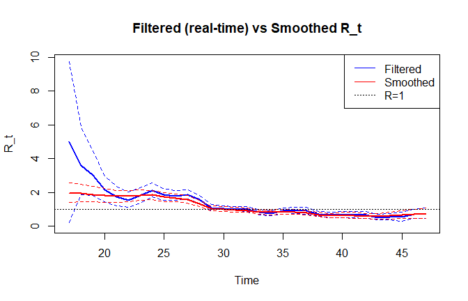{fig-alt="Filtered realtime vs smoothed R_t"}

### Genomics

[diffwrap](https://cran.r-project.org/package=diffwrap) v0.6-3: Provides functions for differential expression analysis of read counts from messenger RNA (mRNA) sequencing (RNA-Seq) data or micro RNA (miRNA) expression values generated by the Comprehensive Analysis Pipeline for microRNA Sequencing 'expression_reports.sh' script. The workflow follows the Bioconductor `edgeR`-`limma` expression data analysis pipeline providing options for different approaches, such as pure `edgeR`, `voom` or paired samples.  Methods are described in [Robinson, McCarthy and Smyth (2010)](doi:10.1093/bioinformatics/btp616), [Ritchie et al. (2015)](doi:10.1093/nar/gkv007), [Law et al. (2014](doi:10.1186/gb-2014-15-2-r29) and [Sun et al. (2014)](doi:10.1186/1471-2164-15-423). See the [vignette]().

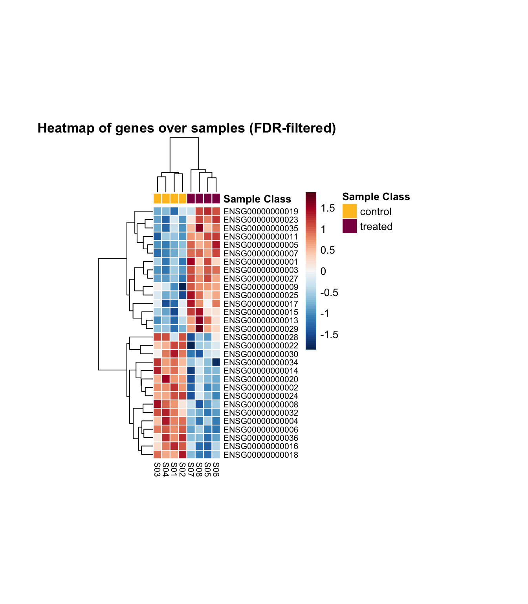{fig-alt="Heat map of genes over FDR-filtered samples"}

### Machine Learning

[figsr](https://cran.r-project.org/package=figsr) v0.1.1: Implements flexible, interpretable machine learning algorithm for additive tree sums. Fits a sum of shallow classification and regression trees (CART) by greedily minimizing residual impurity, growing a new tree or deepening an existing one at each step, whichever reduces the residuals most. Supports regression and two-class classification, variable importance, bootstrap ensembling and seamless integration with `parsnip` and `tidymodels` workflows. The method is described in [Tan et al. (2023)](doi:10.1073/pnas.2310151122). See the [vignette](https://cran.r-project.org/web/packages/figsr/vignettes/figsr-intro.html).

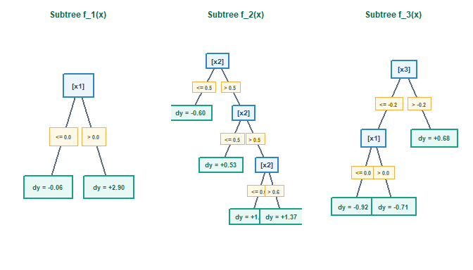{fig-alt="Visualization of the tree sum"}

[NBvarsel](https://cran.r-project.org/package=NBvarsel) v0.1.1: Performs exhaustive or groupwise (backward elimination) variable selection for binary outcome prediction models using cross-validated Net Benefit as the optimization criterion. It supports predictor costs, restricted cubic splines, interaction terms, permutation importance, and parallel computation. It includes visualizations for model comparison and variable importance. References include [Vickers & Elkin (2006)](doi:10.1177/0272989X06295361) and [Van Calster et al. (2018)](doi:10.1016/j.eururo.2018.08.038). See the [vignette](https://cran.r-project.org/web/packages/NBvarsel/vignettes/nb-varsel-tutorial.html).

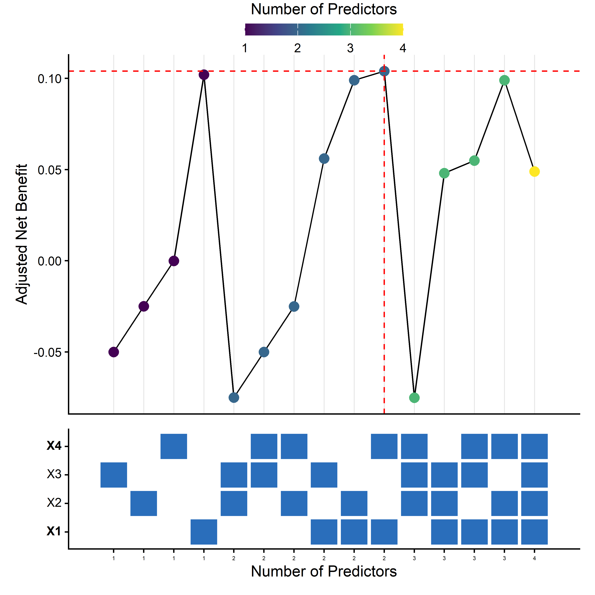{fig-alt="Adjusted net benefit for predictors"}

### Medical Statistics

[CausalState](https://cran.r-project.org/package=CausalState) v0.10.2: Implements Sequential Doubly Robust and infinite-dimensional Targeted Maximum Likelihood estimators for longitudinal modified treatment policies in settings with transitioning states, such as ICU, ward, or emergency department care episodes. Treatment is permitted in active states and becomes structurally inapplicable after a state transition (e.g. discharge or death). Methods based on [Diaz et al. (2021)](doi:10.1080/01621459.2021.1955691) and [Luedtke et al. (2017)](doi:10.48550/arXiv.1705.02459). There are three vignettes including [Getting started](https://cran.r-project.org/web/packages/CausalState/vignettes/getting-started.html) and [Wu-Benkeser density-ratio metalearner](https://cran.r-project.org/web/packages/CausalState/vignettes/wb-metalearner.html).

[expoquimR](https://cran.r-project.org/package=expoquimR) v0.1.0: Provides a unified toolkit for occupational chemical exposure risk assessment, implementing three internationally recognised methods: the qualitative control-banding methods COSHH Essentials (UK Health and Safety Executive) and the method of the French National Research and Safety Institute (INRS), together with the quantitative statistical procedure of the UNE-EN 689 standard for comparing measured exposure levels against occupational exposure limits. Every step of each method is implemented as a small, independently callable, and unit-tested function, so assessments are reproducible and auditable. Optional `shiny` applications provide a guided, interactive workflow. References: [UK Health and Safety Executive (2003)](https://www.hse.gov.uk/coshh/essentials/index.htm) and Mallet, Pilorget and Berne (2013), ISBN:978-2-7389-2166-2. There are three vignettes including [COSHH Essentials: Qualitative Chemical Risk Assessment](https://cran.r-project.org/web/packages/expoquimR/vignettes/coshh-essentials.html) and [INRS Method: Qualitative Inhalation Risk Assessment](https://cran.r-project.org/web/packages/expoquimR/vignettes/inrs-method.html)

[rdborrow](https://cran.r-project.org/package=rdborrow) v0.0.4.0: Implements causal inference methods for incorporating external control data into randomized controlled trials with longitudinal outcomes. Provides an analysis module supporting weighting-based methods such as inverse probability weighting  and augmented inverse probability weighting, difference-in-differences. Methods are based on [Zhou et al. (2024)](doi:10.1093/biostatistics/kxae012) and [Zhou et al. (2024)](doi:10.1080/01621459.2024.2395586). There are five vignettes including [Introduction]https://cran.r-project.org/web/packages/rdborrow/index.html) and [Primary Analysis Workflow](https://cran.r-project.org/web/packages/rdborrow/vignettes/primary_analysis_workflow.html).

### Meta Analysis

[metaselection](https://cran.r-project.org/package=metaselection) v0.3.0: Fits a flexible class of p-value selection models for meta-analysis and meta-regression models, providing standard errors and confidence intervals based on either cluster-robust variance estimators (i.e., sandwich estimators) or cluster-level bootstrapping to handle dependent effect size estimates, as described in [Pustejovsky, Citkowicz, and Joshi (2025)](doi:10.31222/osf.io/qg5x6_v1) and [Citkowicz, Pustejovsky, and Joshi (2026)](doi:10.31222/osf.io/wjpxk_v1). Supported models include generalizations of the step-function selection model as proposed by [Vevea and Hedges (1995)](doi:10.1007/BF02294384) and the beta-function selection model as proposed by [Citkowicz and Vevea (2017)](doi:10.1037/met0000119). See the [vignette](https://cran.r-project.org/web/packages/metaselection/vignettes/selection-models.html).

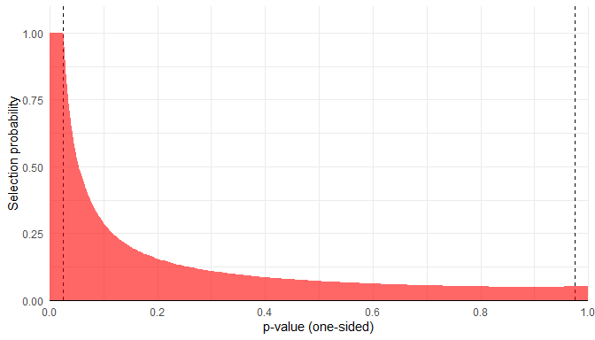{fig-alt="Distribution of one sided p-value"}

### Networks

[idiographic](https://cran.r-project.org/package=idiographic) v0.3.4:  Provides functions to make person-specific and within-person network estimation from intensive longitudinal and panel data. Estimators include ordinary vector autoregression (VAR), graphical vector autoregression, multilevel vector autoregression, rolling ordinary and graphical VAR, native Bayesian VAR, multilevel Bayesian VAR, unified Structural Equation Modeling, and Group Iterative Multiple Model Estimation. Methods are described in [Saqr et al. 2025](doi:10.1007/978-3-031-95365-1_20) and [Epskamp et al. (2018)](doi:10.1080/00273171.2018.1454823). There are seven vignettes including an [introduction](https://cran.r-project.org/web/packages/idiographic/vignettes/idiographic.html) and  [Multilevel VAR](https://cran.r-project.org/web/packages/idiographic/vignettes/mlvar.html).

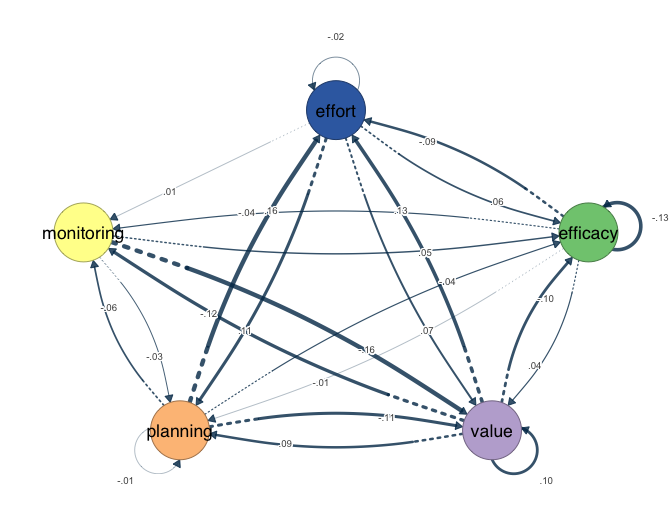{fig-alt="Example of within person netowrk"}

[lame](https://cran.r-project.org/package=lame) v1.3.4: Implements additive and multiplicative effects models for both cross-sectional and longitudinal network analysis and supports square and rectangular network structures. Key features include: (1) Cross-sectional network analysis  with support for binary, continuous, ordinal, and count data; (2) Longitudinal network analysis  with additive sender/receiver and multiplicative latent-factor effects that can evolve over time through AR(1) processes' ([Sewell and Chen (2015)](doi:10.1080/01621459.2014.988214) and [Durante and Dunson (2014)](doi:10.1093/biomet/asu040)); (3) Handling of changing actor compositions across time periods in longitudinal models; and (4) Performance improvements. There are seven vignettes including [Overveiew](https://cran.r-project.org/web/packages/lame/vignettes/lame-overview.html) and [Getting Started](https://cran.r-project.org/web/packages/lame/vignettes/lame.html).

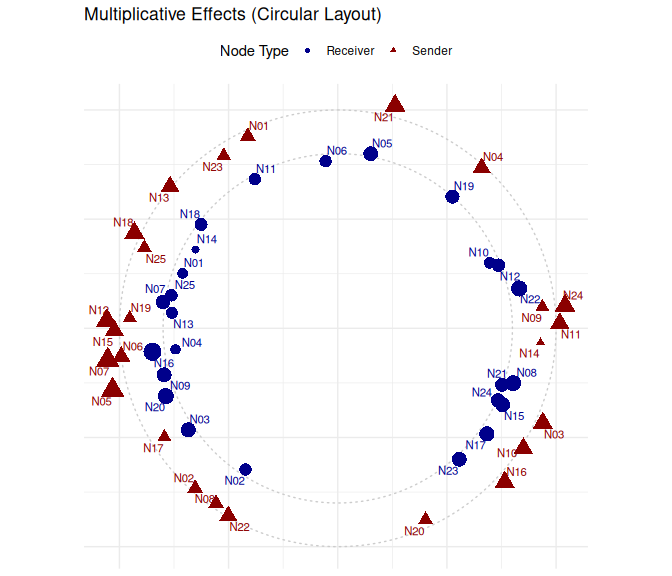{fig-alt="Circular plot showing multiplicative effects"}

[tabulergm](https://cran.r-project.org/package=tabulergm) v0.1.0: Creates publication-ready tables documenting exponential-family random graph models (ERGMs), a class of statistical models for social networks ([Robins et al. (2007)](doi:10.1016/j.socnet.2006.08.002)). Tables describe model terms through their definitions, mathematical representations, and graphical representations, and can be generated from ERGM formulas or from models fitted with the `ergm` package ([Hunter et al. (2008)](doi:10.18637/jss.v024.i03). Resulting tables can be integrated into `quarto` and `rmarkdown` documents.

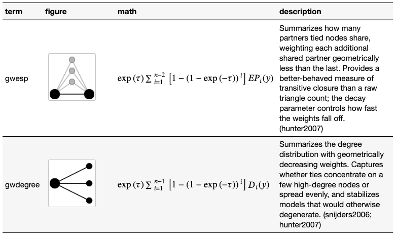{fig-alt="Table with glyphs and equations"}

:::

::: {.column width="10%"}

:::

::: {.column width="45%"}

### Process Control

[gpci](https://cran.r-project.org/package=gpci) v0.1.0: Implements a comprehensive, generalized framework for computing, estimating, and validating generalized process capability indices. Supports user-supplied probability density functions, cumulative distribution functions, survival functions, and quantile functions with uncensored data parameter estimation via Maximum Likelihood Estimation. Provides several classical and non-normal capability indices, including Cpy ([Maiti, Saha and Nanda, (2010)](doi:10.1080/16843703.2010.11673233), Spmk ([Dey and Saha (2019)](doi:10.1007/s41872-019-00081-4), CpTk ([Saha, Dey and Maiti (2019)](doi:10.1007/s13198-019-00789-7) and others. Functions also compute parametric and non-parametric bootstrap confidence intervals, confidence levels using percentile, highest posterior density intervals and Heidelberger-Welch convergence diagnostics. See [Maiti, Saha and Nanda (2010)](doi:10.1080/16843703.2010.11673233) and [Saha, Dey and Maiti (2018)](doi:10.1080/21681015.2018.1437793) for background. See the vignettes [Getting Started](https://cran.r-project.org/web/packages/gpci/vignettes/getting-started.html) and [Using Custom Distributions](https://cran.r-project.org/web/packages/gpci/vignettes/custom-distributions.html).

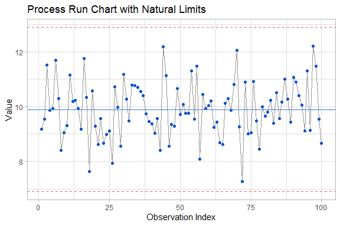{fig-alt="Process run chart"}

### Programming

[polyglotSQL](https://cran.r-project.org/package=polyglotSQL) v0.1.0: Provides functions to parse, tokenize, validate, format, analyze and translate SQL between more than 30 dialects (`PostgreSQL`, `MySQL`, `BigQuery`, `Snowflake`, `DuckDB`, `T-SQL`, and others) using `polyglot-sql` [Rust crate](ttps://github.com/tobilg/polyglot). All processing happens locally in the `R` session. Includes column-level lineage, structural query analysis, query optimization, `AST` diffing and `OpenLineage` facet generation. There are four vignettes including [Getting Started](https://cran.r-project.org/web/packages/polyglotSQL/vignettes/getting-started.html) and [Parsing, validation and lineage](https://cran.r-project.org/web/packages/polyglotSQL/vignettes/parsing-validation-lineage.html).

### Public Transit

[transittraj](https://cran.r-project.org/package=transittraj) v1.1.0: Today's public transit vehicles produce a large amount of automatic vehicle location (AVL) data. This data is very useful for planning and performance studies, but can be noisy, error-prone, and sparse. This package provides tools for cleaning AVL point data and turning it into continuous, differentiable, monotonic, and invertible vehicle trajectory functions, based on the work of [Robbennolt et al. (2025)](doi:10.48550/arXiv.2509.00119) and [Huang et al. (2023)](doi:10.1109/ITSC57777.2023.10422524). See the vignettes [Introduction](https://cran.r-project.org/web/packages/transittraj/vignettes/intro-trajectories.html) and [The AVL Cleaning Workflow](https://cran.r-project.org/web/packages/transittraj/vignettes/intro-trajectories.html).

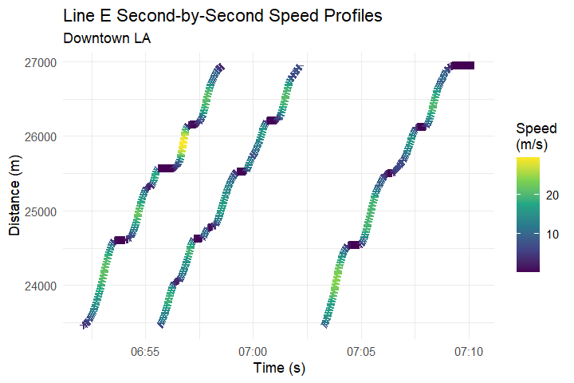{fig-alt="Plot of LA E line vehicle trajectories"}

### Statistics

[chaidr](https://cran.r-project.org/package=chaidr) v0.1.0: Implements the CHAID (Chi-squared Automatic Interaction Detection) decision tree algorithm of [Kass (1980)](doi:10.2307/2986296) and the Exhaustive CHAID variant of [Biggs, de Ville, and Suen (1991)](ithms documentation). Supports nominal, ordinal (with floating missing category), and continuous predictors, and nominal, ordinal, and continuous response variables using Pearson chi-squared, Goodman row-effects, and one-way ANOVA F tests respectively. Includes prediction, rule extraction, gains and lift analysis, validation on holdout data, and visualization via base graphics, `Graphviz` DOT, `plotly`, and conversion to `partykit` objects. See the [Introduction](https://cran.r-project.org/web/packages/chaidr/vignettes/chaidr.html) and the [Japanese tutorial](https://cran.r-project.org/web/packages/chaidr/vignettes/chaidr-ja.html).

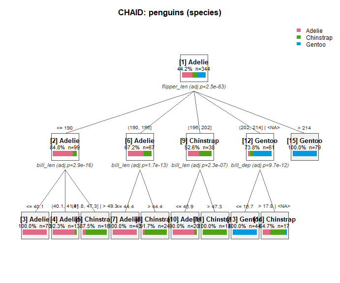{fig-alt="CHAID decision tree"}

[citcdf](https://cran.r-project.org/package=citcdf) v1.1.0: Complex hypothesis testing through conditional cumulative distribution function estimation. Method is detailed in: [Gauthier et al. (2021)](doi:10.1101/2021.05.21.445165). See the [vignette](https://cran.r-project.org/web/packages/citcdf/vignettes/citcdf-userguide.html).

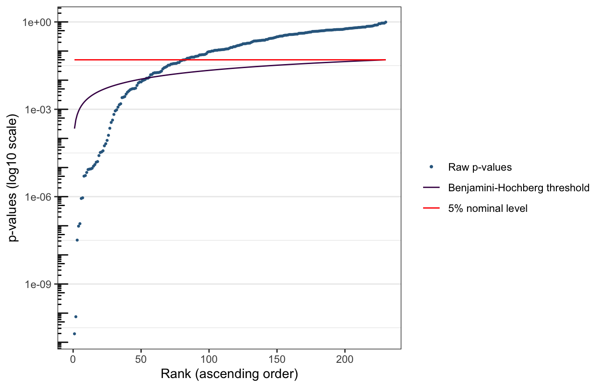{fig-alt="Plot of p-values sorted against BH threshold"}

[falsifyr](https://cran.r-project.org/package=falsifyr) v1.0.0: Attacks fitted R model claims by searching for small plausible perturbations that make a target result disappear. The package focuses on claim-level fragility, smallest-kill reporting, and reproducible caveated robustness checks for ordinary fitted model objects. The methods draw on the fragility-index concept of [Walsh et al. (2014)](doi:10.1016/j.jclinepi.2013.10.019), multiverse analysis of [Steegen et al. (2016)](doi:10.1177/1745691616658637), specification-curve analysis of [Simonsohn et al. (2020)](doi:10.1038/s41562-020-0912-z), and robust covariance estimation of [Zeileis (2004)](doi:10.18637/jss.v011.i10). See the vignettes [Attacking a Regression Claim](https://cran.r-project.org/web/packages/falsifyr/vignettes/attacking-a-regression-claim.html) and [Interpreting Survival Scores](https://cran.r-project.org/web/packages/falsifyr/vignettes/interpreting-survival-scores.html).

[FPScausal](https://cran.r-project.org/package=FPScausal) v0.1.1: Implements functional propensity score  weighting for causal inference with functional treatments. The method estimates weights that balance observed confounders by removing their dependence on the functional treatment and uses a dual formulation of the weighting problem for efficient unconstrained optimization. The framework supports scalar, binary, and functional outcomes, as well as functional covariates, and can be used to estimate marginal causal effects in settings with time-varying exposures. The methodology follows [Ciardulli et al. (2026)](doi:10.48550/arXiv.2608.03200). See the [vignette](https://cran.r-project.org/web/packages/FPScausal/vignettes/FPScausal.html).

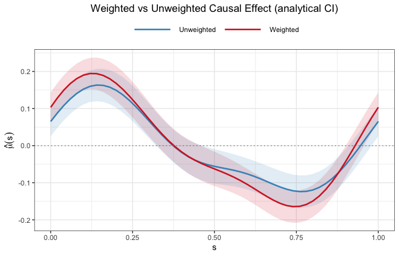{fig-alt="Plot weighted vs unweighted causal effects"}

[LRErdd](https://cran.r-project.org/package=LRErdd) v0.1.0: Provides functions for the design and analysis of Regression Discontinuity Designs as local randomized experiments within the potential outcome approach as formalized in [Li, Mattei and Mealli (2015)](doi:10.1214/15-AOAS809) including functions to implement the design phase of the study, where the focus is on the selection of suitable subpopulations for which valid causal inference can be drawn. These functions provide summary statistics of pre- and post-treatment variables by treatment status and select suitable subpopulations around the threshold where pre-treatment variables are well balanced between treatment groups. See the [vignette](https://cran.r-project.org/web/packages/LRErdd/vignettes/LRErdd.html)There is aslsa `Shiny` application.

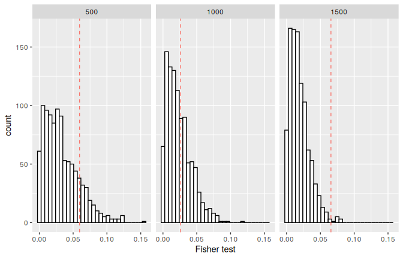{fig-alt="Distribution plots for Fisher test."}

[mvboxcox](https://cran.r-project.org/package=mvboxcox) v0.1.4: Fits bivariate logistic Box-Cox regression models for binary outcomes and positive continuous predictors. Transformation parameters are selected by cross-validated grid search with adaptive refinement and thin-plate spline smoothing. The package also provides prediction, empirical and sampling-weighted median effects, simulation tools, and sampling-weighted model fitting. The methodology extends the logistic Box-Cox approach of [Xing et al. (2021)](doi:10.1002/cjs.11587). See the [vignette](https://cran.r-project.org/web/packages/mvboxcox/vignettes/introduction.html).

### Surveys

[sondage](https://cran.r-project.org/package=sondage) v0.9.1: Implements survey sampling algorithms for single-stage probability sampling from finite populations, written in `C`. Provides equal probability methods (simple random sampling, systematic, Bernoulli), unequal probability methods (conditional Poisson / maximum entropy, Sampford, Brewer, systematic PPS, Pareto, sequential Poisson, Poisson, Chromy's minimum replacement, multinomial), balanced sampling via the cube method, and spatially balanced sampling via the local pivotal method and spatially correlated Poisson sampling. Functions compute joint inclusion probabilities, pairwise expectations, and sampling covariances for variance estimation. See [Tillé (2006)]doi:10.1007/0-387-34240-0) for background. There are two vignettes [Getting Started](https://cran.r-project.org/web/packages/sondage/vignettes/sondage.html) and [Extending sondage with Custom Methods](https://cran.r-project.org/web/packages/sondage/vignettes/custom-methods.html).

### Time Series

[scanr](https://cran.r-project.org/package=scanr) v0.1.1: Detects change points in long univariate time series using the [SCAN framework](https://arxiv.org/html/2608.28110v1). The implementation uses a native `Rust` backend exposed to `R` via `extendr`. See the [vignette](https://cran.r-project.org/web/packages/scanr/vignettes/scanr-introduction.html).

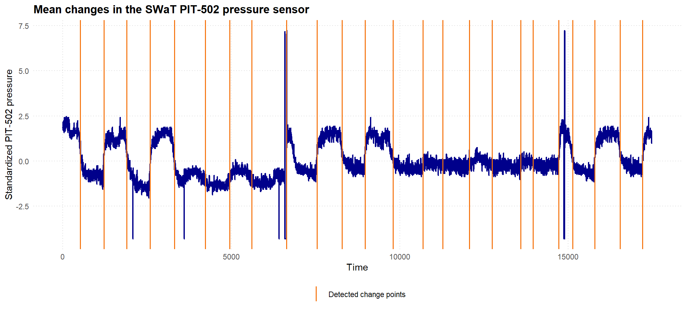{fig-alt="Plot of time series with detected change points"}

### Utilities

[rmoriebricklayer](https://cran.r-project.org/package=rmoriebricklayer) v0.5.1: Tools for building brick-proof, reproducible, self-contained data capsules. Resolves open-data sources through the [Comprehensive Knowledge Archive Network](https://ckan.org/) package_show and package_search endpoints, records and verifies provenance with Secure Hash Algorithm 256 ('SHA-256') digests and Internet Archive [Wayback Machine](https://web.archive.org/) snapshots, validates downloaded data against a pinned schema, and falls back to schema-driven synthetic data when the real source is unreachable. Run records are captured in a manifest plus a plain-language summary so any result can be traced back to its inputs. Distributional drift between a pinned capsule and a fresh fetch is tested because a re-released extract can be statistically identical yet differ byte-for-byte, and a column can keep its name and type while having been silently rescaled. Manifests can be authenticated with keyed digests ('HMAC-SHA-256', RFC 2104) or post-quantum hash-based signatures. There are eight vignettes including [Building reproducible data capsules](https://cran.r-project.org/web/packages/rmoriebricklayer/vignettes/capsules.html) and [Provenance you can verify](https://cran.r-project.org/web/packages/rmoriebricklayer/vignettes/provenance.html).

[scimesh](https://cran.r-project.org/package=scimesh) v0.4.0: Implements a fast, GPU-free 3D software renderer written in modern `C++17` with native `R` bindings. Renders triangle meshes to publication-quality images entirely on the CPU, requiring no display server or graphics hardware. Features multi-light Blinn-Phong shading, screen-space ambient occlusion, anti-aliasing, depth fog, transparency, wireframe rendering, texture mapping, screen-space lines and text labels, and procedural geometry generation. Supports standard mesh file formats with PNG and PPM output. Works on high-performance computing clusters, headless servers, containers, and continuous integration pipelines, making it suitable for scientific visualization across neuro-imaging, molecular structures, and general 3D graphics. See the [vignette](https://cran.r-project.org/web/packages/scimesh/vignettes/scimesh.html).

### Visualization

[dgraphs](https://cran.r-project.org/web/packages/dgraphs/vignettes/data-derived-graph-workflow.html) v0.2.0: Constructs data-derived graphs from numerical observations using mutual, shared-neighbor, intersection, geodesic, radius, adaptive-radius, and minimum-spanning-tree completion methods. Provides graph conversion, pruning, diagnostics, spectral embedding, endpoint detection, and path utilities. The implemented graph constructions include methods described by [Jarvis and Patrick (1973)](doi:10.1109/T-C.1973.223640), [Brito et al. (1997)](doi:10.1016/S0167-7152(96)00213-1), [Berry and Sauer (2019)](doi:10.3934/fods.2019001), and [Gower and Ross (1969)](doi:10.2307/2346439). See the [vignette](https://cran.r-project.org/web/packages/dgraphs/vignettes/data-derived-graph-workflow.html).

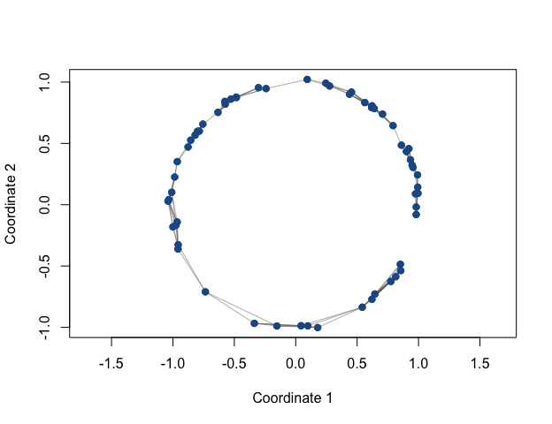{fig-alt="Continuous-kNN graph on the variable-density circular point cloud"}

[gghotelling](https://cran.r-project.org/package=gghotelling) v0.2.1: Calculate Hotelling's T² ellipses and detect multivariate outliers both for base `R` plots and `ggplot2` plots. Optionally, uses robust covariance estimation to reduce the influence of outliers on the ellipses. Also included: bagplots, kernel density plots and outlier diagnostic plots. See the [vignette](https://cran.r-project.org/web/packages/gghotelling/vignettes/gghotelling.html).

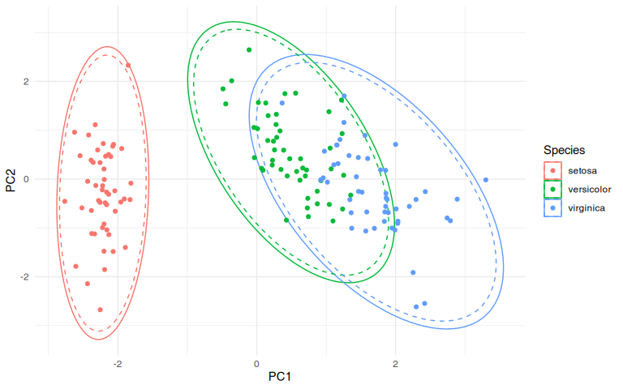{fig-alt="Plot of Hotelling ellipses with minimum covariance determinant estimator"}

[ggmultiglyph](https://cran.r-project.org/package=ggmultiglyph) v0.1.0: Provides `ggplot2` geoms for visualizing multivariate data using glyphs. The package implements several established glyph designs described in the information visualization literature, including the review by [Borgo et al. (2013)](doi:10.2312/conf/EG2013/stars/039-063).

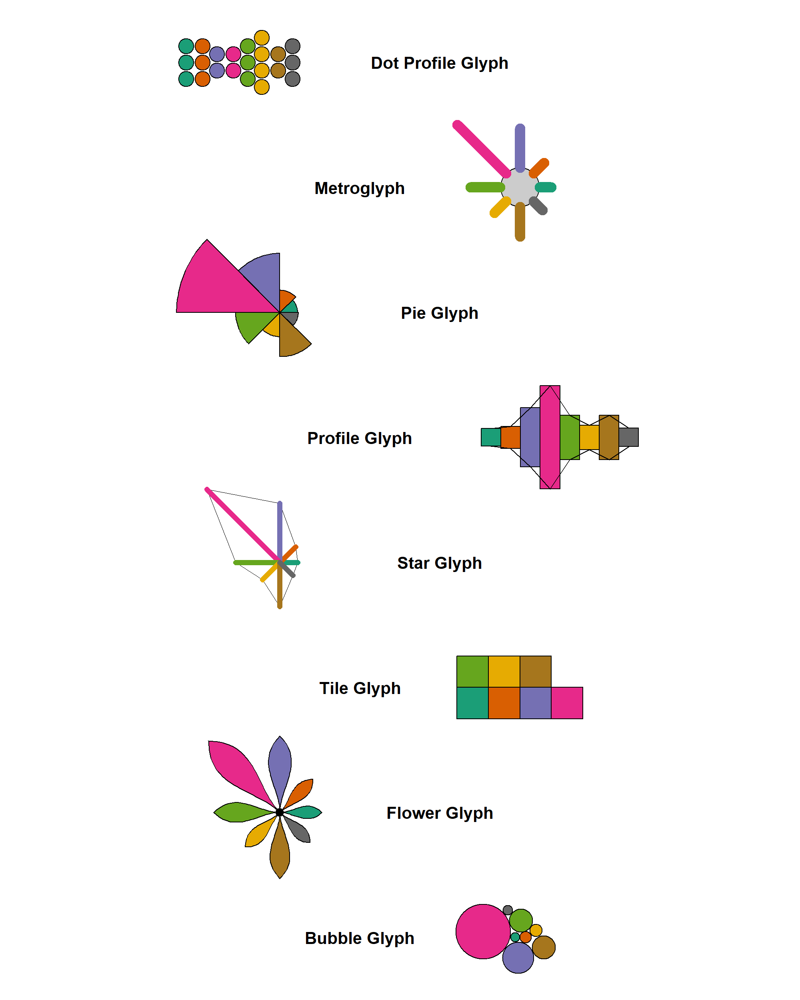{fig-alt="Glyphs"}

[grip](https://cran.r-project.org/package=grip) v0.2.0: Implements GRIP multiscale graph layout with a unified choice between hop-count and geometry-aware edge-length graph metrics in 2D and 3D. Provides layout scoring, candidate comparison, multiscale trace diagnostics, synthetic graph families, and advanced experimental geodesic-KK utilities for weighted-layout evaluation and polish. Based on [Gajer and Kobourov (2002)](doi:10.7155/jgaa.00052) and [Gajer, Goodrich and Kobourov (2004)](doi:10.1016/j.comgeo.2004.03.014). There are four vignettes including [Getting Started](https://cran.r-project.org/web/packages/grip/vignettes/grip-examples.html) and [Weighted Graph Layouts](https://cran.r-project.org/web/packages/grip/vignettes/weighted-grip-intro.html).

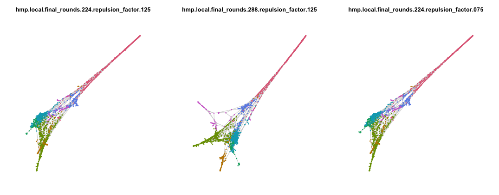{fig-alt="Plots of large graph weighted patterns"}

[orbis](https://cran.r-project.org/package=orbis) v0.1.0: Implements a layered grammar of graphics that compiles plots to a resolution-independent scene description and renders it through two back-ends: a self-contained SVG writer with embedded `JavaScript` for interactive figures (tooltips, hover highlighting, zoom, pan and legend toggling) and `R`s own graphics devices for publication-quality output at any resolution. Geographic layers are first class. The layered grammar follows [Wickham (2010)](doi:10.1198/jcgs.2009.07098); projections follow [Snyder (1987)](doi:10.3133/pp1395) and, for Equal Earth, [Savric, Patterson and Jenny (2019)](doi:10.1080/13658816.2018.1504949); line simplification uses [Douglas and Peucker (1973)](doi:10.3138/FM57-6770-U75U-7727); the default colour scales follow the guidance on perceptually uniform palettes of [Crameri, Shephard and Heron (2020)](doi:10.1038/s41467-020-19160-7). See the [vignette](https://cran.r-project.org/web/packages/orbis/vignettes/orbis.html)

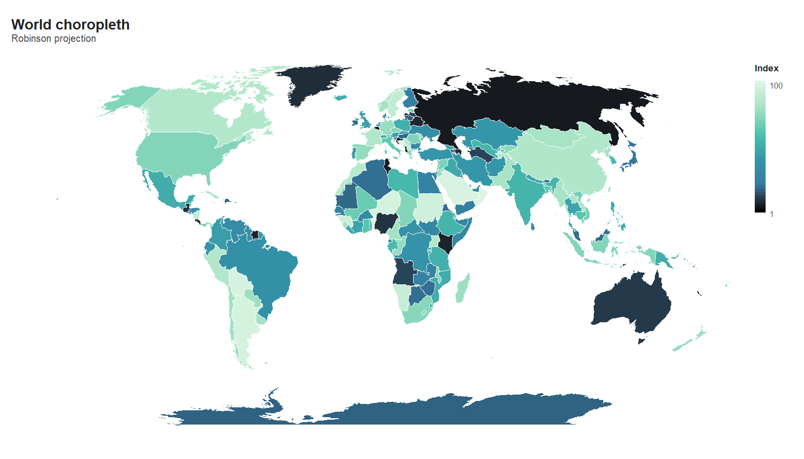{fig-alt="World choropleth: Robinson projection"}

:::

::::
