---
title: "February 2026 Top 40 New CRAN Packages"
author: "Joseph Rickert"
date: 2026-02-27
description: "An attempt to capture the depth and breadth of what's new on CRAN."
image: ""
image-alt: ""
categories: "Top 40"
editor: source
---

Two hundred forty-one of the new packages submitted to CRAN in February were still there in mid-March. Here are my Top 40 picks in nineteen categories: Artificial Intelligence, Computational Methods, Data, Dynamical Systems, Ecology, Economics, Epidemiology, Finance, Genetics, Genomics, High Performance Computing,  Mathematics, Machine Learning, Medical Application, Networks, Statistics, Time Series, Utilities, and Visualization.

{fig-alt=""}

:::: {.columns}

::: {.column width="45%"}

### Artificial Intelligence

[quallmer](https://cran.r-project.org/package=quallmer) v0.3.0: Provides tools for AI-assisted qualitative data coding using large language models ('LLMs') via the `ellmer` package, supporting providers including *OpenAI*, *Anthropic*, *Google*, *Azure*, and local models via *Ollama* including built-in *codebooks* for common applications such as sentiment analysis and policy coding. Functions enable creating custom notebooks, support systematic replication across models and settings, compute inter-coder reliability statistics and validation metrics, and provide audit trails for documenting coding workflows following [Lincoln and Guba's (1985)](https://www.amazon.com/Naturalistic-Inquiry-Yvonna-S-Lincoln/dp/0803924313) framework for establishing trustworthiness in qualitative research. See the [vignette](https://cran.r-project.org/web/packages/quallmer/vignettes/getting-started.html) to get started.

### Biology

[BioGSP](https://cran.r-project.org/package=BioGSP) v1.0.0: Implementation of Graph Signal Processing methods including Spectral Graph Wavelet Transform for analyzing spatial patterns in biological data and provides tools for multi-scale analysis of biology spatial signals, including forward and inverse transforms, energy analysis, and visualization functions tailored for biological applications. See [Hammond, Vandergheynst, and Gribonval (2011)](https://www.sciencedirect.com/science/article/pii/S1063520310000552?via%3Dihub), [Yao et al. (2024)](https://www.biorxiv.org/content/10.1101/2024.12.20.629650v1) for  biological application example, and the [vignette](https://cran.r-project.org/web/packages/BioGSP/vignettes/sgwt_simulation_demo.html) to get started.

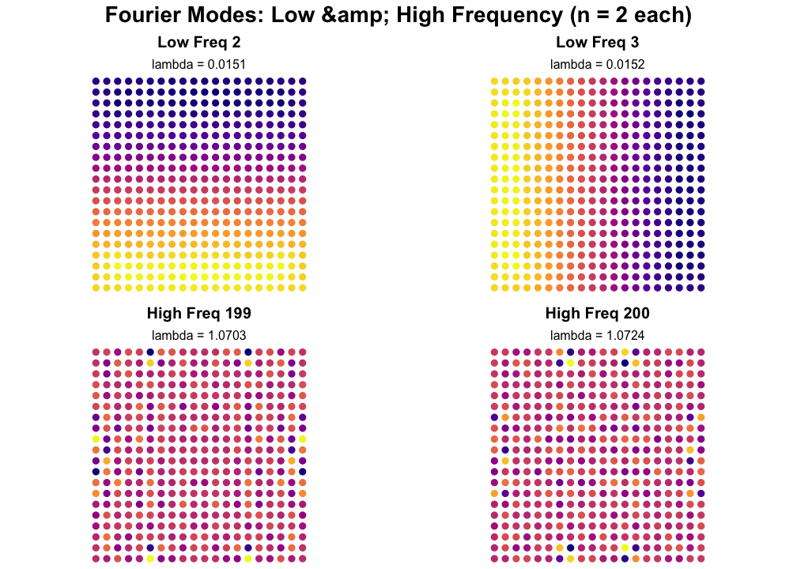{fig-alt="Plots of Fourier Modes"}

[RuHere](https://cran.r-project.org/package=RuHere) v1.0.1: Automatically flags common spatial errors in biological collection data using metadata, a six stage workflow and functions that specifically integrate specialist-curated range information to identify geographic errors and introductions that often escape standard automated validation procedures. For details on the methodology see [Trindade & Caron (2026)](https://www.biorxiv.org/content/10.64898/2026.02.02.703373v1). There are five vignettes including [Reducing sampling bias](https://cran.r-project.org/web/packages/RuHere/vignettes/sampling_bias.html) and [Enuring spatial consistency](https://cran.r-project.org/web/packages/RuHere/vignettes/spatial_consistency.html).

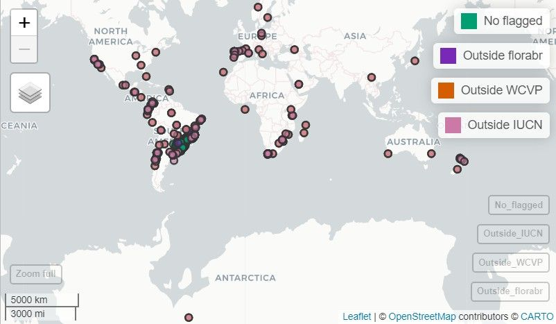{fig-alt="Snapshot of interactive map"}

### Buddhism

[tipitaka.critical](https://cran.r-project.org/package=tipitaka.critical) v1.0.0: A lemmatized critical edition of the complete Pali Canon (Tipitaka), the canonical scripture of Theravadin Buddhism. Based on a five-witness collation of the Pali Text Society (PTS) edition (via 'GRETIL'), 'SuttaCentral', the Vipassana Research Institute (VRI) Chattha Sangayana edition, the Buddha Jayanti Tipitaka (BJT), and the Thai Royal Edition. All text is lemmatized using the 'Digital Pali Dictionary', grouping inflected forms by dictionary headword. Covers all three pitakas (Sutta, Vinaya, Abhidhamma) with 5,777 individual text units. The companion package 'tipitaka' provides the original VRI edition data and Pali text tools. For background on the collation method, see [Zigmond (2026)](https://github.com/dangerzig/tipitaka.critical) and the [vignette](https://cran.r-project.org/web/packages/tipitaka.critical/vignettes/tipitaka-critical.html).

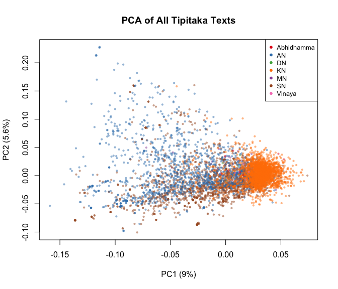{fig-alt="PCA plot of all Tipitaka texts"}

### Climate Science

[tidyextreme](https://cran.r-project.org/package=tidyextreme) v1.00: Provides functions to calculate [Expert Team on Climate Change Detection and Indices](https://www.wcrp-climate.org/etccdi) from daily or hourly temperature and precipitation data along with functions for flexible data handling. See the [vignette](https://cran.r-project.org/web/packages/tidyextreme/vignettes/tidyextreme-tutorial.html).

### Computational Methods

[compositional.mle](https://cran.r-project.org/package=compositional.mle) v2.0.0: Provides composable optimization strategies for maximum likelihood estimation (MLE). Solvers are first-class functions that combine via sequential chaining, parallel racing, and random restarts. Implements gradient ascent, Newton-Raphson, quasi-Newton (BFGS), and derivative-free methods with support for constrained optimization and tracing. Returns `mle` objects compatible with `algebraic.mle` for downstream analysis. Methods based on [Nocedal J, Wright SJ (2006)](https://link.springer.com/book/10.1007/978-0-387-40065-5). There are five vignettes including [Getting Started](https://cran.r-project.org/web/packages/compositional.mle/vignettes/getting-started.html) and [Theory and Intuition Behind Numerical MLE](https://cran.r-project.org/web/packages/compositional.mle/vignettes/theory-and-intuition.html).

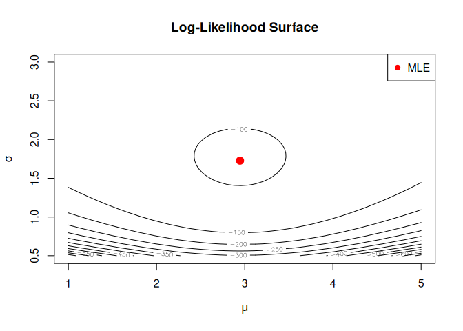{fig-alt="Plot of log-likelihood surface"}

[nabla](https://cran.r-project.org/package=nabla) v0.7.1: Enables exact automatic differentiation for R functions and provides a composable derivative operator D that computes gradients, Hessians, Jacobians, and arbitrary-order derivative tensors at machine precision. D(D(f)) gives Hessians, D(D(D(f))) gives third-order tensors for skewness of maximum likelihood estimators, and so on to any order. Works through any R code including loops, branches, and control flow. There are five vignettes including an [Introduction](https://cran.r-project.org/web/packages/nabla/vignettes/introduction.html) and [Gradient andHessian Computation](https://cran.r-project.org/web/packages/nabla/vignettes/mle-workflow.html).

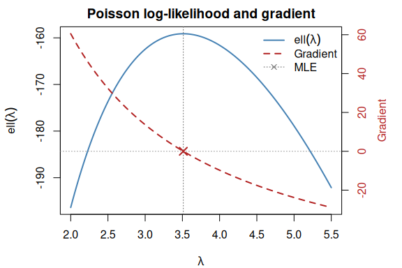{fig-alt="Plot of log-likelihood and gradient"}

[rLifting](https://cran.r-project.org/package=rLifting) v0.9.0: Performs Wavelet Lifting Transforms focusing on signal denoising and functional data analysis (FDA). Implements a hybrid architecture with a zero-allocation `C++` core for high-performance processing. Features include unified offline (batch) denoising, causal (real-time) filtering using a ring buffer engine, and adaptive recursive thresholding. There are five vignettes including an [Introduction](https://cran.r-project.org/web/packages/rLifting/vignettes/introduction.html) and [Real-time signal smoothing](https://cran.r-project.org/web/packages/rLifting/vignettes/realtime.html).

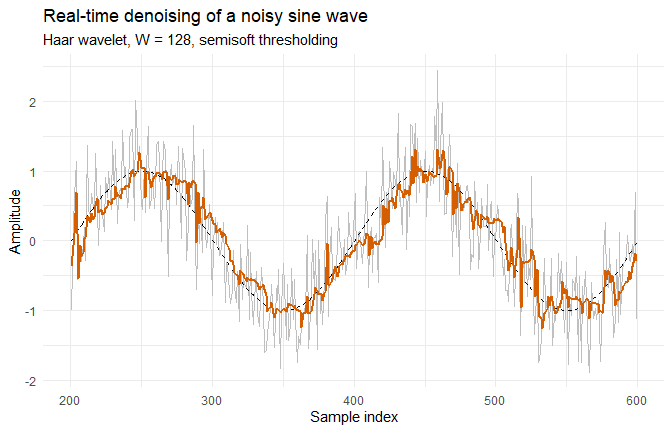{fig-alt="Plot showing real-time denoising of a noisy sine wave"}

### Ecology

[spacemodR](https://cran.r-project.org/package=spacemodR) v0.1.3: Provides tools for modeling food web transfer based on an initial ground raster. It provides a directed acyclic graph structure for a set of rasters representing the flow of elements (e.g., food, energy, contaminants). It also includes tools for working with dispersal algorithms, enabling the combination of flux data with population movement. See the [tutorial](https://cran.r-project.org/web/packages/spacemodR/vignettes/Tutorial.html).

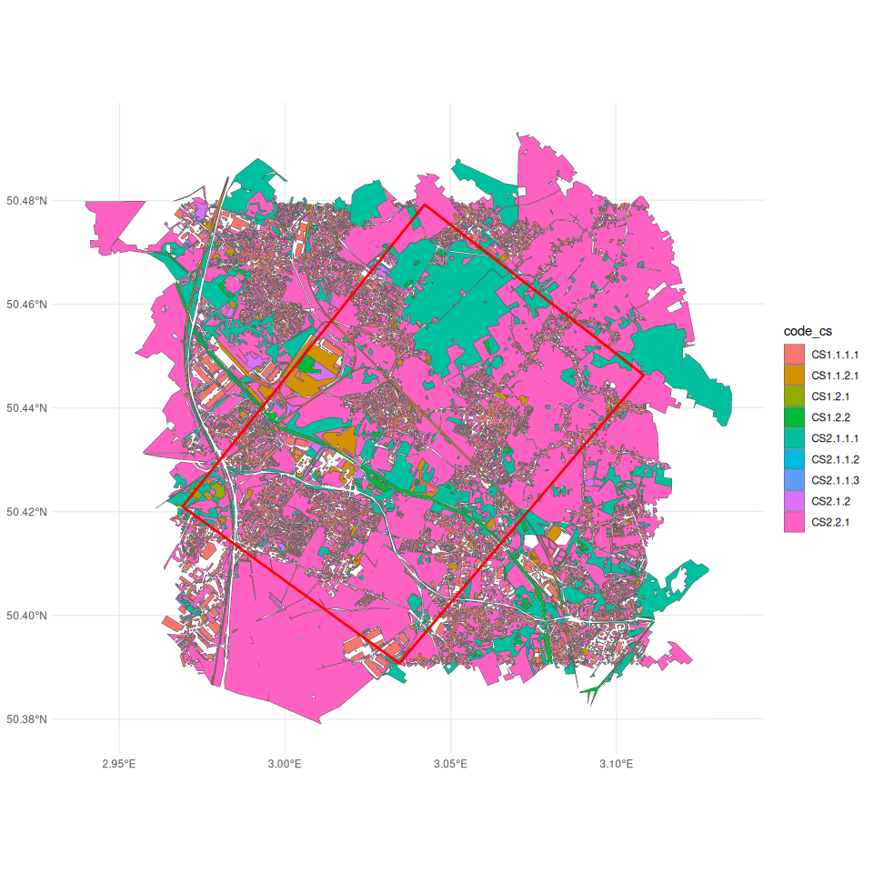{fig-alt="Plot of OCS GE (Occupation du Sol à Grande Échelle) data set"}

:::

::: {.column width="10%"}

:::

::: {.column width="45%"}

### Machine Learning

[nadir](https://cran.r-project.org/package=nadir) v0.0.1: Provides a functional programming implementation of the super learner algorithm, [van der Laan et al. (2007)](https://biostats.bepress.com/ucbbiostat/paper222/), with an emphasis on supporting the use of formulas to specify learners. Includes the ability to use random-effects specified in formulas e.g. (y ~ (age | strata) + ...) and to construct new learners by passing a functions. See the [vignette](https://cran.r-project.org/web/packages/nadir/vignettes/Basic-Examples.html) for basic examples.

### Statistics

[BCFM](https://cran.r-project.org/package=BCFM) v1.0.0: Implements the Bayesian Clustering Factor Models for simultaneous clustering and latent factor analysis of multivariate longitudinal data. The model accounts for within-cluster dependence through shared latent factors while allowing heterogeneity across clusters, enabling flexible covariance modeling in high-dimensional settings.  The methodology is described in [Shin, Ferreira, and Tegge (2018)](https://onlinelibrary.wiley.com/doi/10.1002/sim.70350). See the [vignette](https://cran.r-project.org/web/packages/BCFM/vignettes/introduction-to-BCFM.html) for examples.

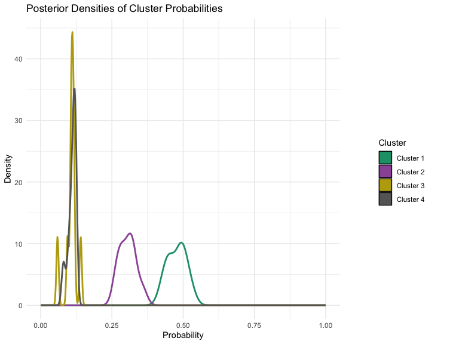{fig-alt="Plot of posterior densities for cluster probabilities"}

[clmstan](https://cran.r-project.org/package=clmstan) v0.1.1: Provides functions to fit cumulative link models for ordinal categorical data using `CmdStanR`. Supports various link functions including logit, probit, cloglog, loglog, cauchit, and flexible parametric links such as Generalized Extreme Value (GEV), Asymmetric Exponential Power (AEP), and Symmetric Power.  Methods are described in [Agresti (2010)](https://onlinelibrary.wiley.com/doi/10.1111/j.1467-842X.2011.00601.x), [Wang and Dey (2011)](https://link.springer.com/article/10.1007/s10651-010-0154-8), and [Naranjo, Perez, and Martin (2015)](https://dl.acm.org/doi/abs/10.1007/s11222-014-9449-1).See the [vignette](https://cran.r-project.org/web/packages/clmstan/vignettes/getting-started.html) to get started.

[dtms](https://cran.r-project.org/package=dtms) v0.4.2: Implements discrete-time multistate models, several ways of estimating parametric and nonparametric multistate models, and an extensive set of Markov chain methods which use transition probabilities derived from the multistate model. See [Schneider et al. (2024)](https://www.tandfonline.com/doi/full/10.1080/00324728.2023.2176535), [Dudel (2021)](https://journals.sagepub.com/doi/10.1177/0049124118782541), [Dudel & Myrskylä (2020)](https://link.springer.com/article/10.1186/s12963-020-00217-0), and  [van den Hout (2017)](https://www.taylorfrancis.com/books/mono/10.1201/9781315374321/multi-state-survival-models-interval-censored-data-ardo-van-den-hout) for background and [README](https://cran.r-project.org/web/packages/dtms/readme/README.html) to get started.

{fig-alt="Plot of evolution of transition probabilities"}

[GAReg](https://cran.r-project.org/package=GAReg) v0.1.0: Provides a genetic algorithm framework for regression problems requiring discrete optimization over model spaces with unknown or varying dimension, where gradient-based methods and exhaustive enumeration are impractical. The computation is built on the *GA* engine of [Scrucca (2017)](https://journal.r-project.org/articles/RJ-2017-008/index.html), and *changepointGA* engine from [Li and Lu (2024)](https://arxiv.org/abs/2410.15571). In challenging high-dimensional settings, functions enable efficient search and delivers near-optimal solutions. See the [vignette](https://cran.r-project.org/web/packages/GAReg/vignettes/vignette.html).

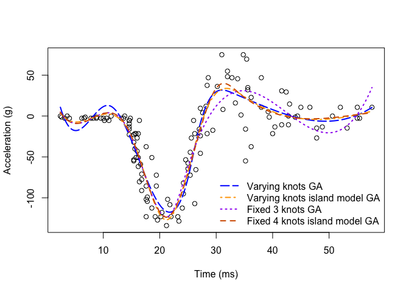{fig-alt="Plot showing spline options"}

[mixpower](https://cran.r-project.org/package=mixpower) v0.1.0: Implements a simulation-based toolkit for power and sample-size analysis for linear and generalized linear mixed-effects models (LMMs and GLMMs). Supports Gaussian, binomial, Poisson, and negative binomial families via `lme4`; Wald and likelihood-ratio tests; multi-parameter sensitivity grids; power curves and minimum sample-size solvers; parallel evaluation with deterministic seeds; and functions for reproducibility. Run time diagnostics include failure rate, singular-fit rate, effective N and publication-ready summary tables. There are five brief vignettes including an [Introduction](https://cran.r-project.org/web/packages/mixpower/vignettes/mixpower-intro.html) and [Running simulations](https://cran.r-project.org/web/packages/mixpower/vignettes/mixpower-simulations.html).

[rblimp](https://cran.r-project.org/package=rblimp) v1.0.: Provides an interface to [`Blimp`](https://www.appliedmissingdata.com/blimp) software for Bayesian latent variable modeling, missing data analysis, and multiple imputation. The package generates `Blimp` syntax, executes `Blimp` models, and imports results back into `R` as structured objects with methods for visualization and analysis. See [README](https://cran.r-project.org/web/packages/rblimp/readme/README.html) to get started.

[rareflow](https://cran.r-project.org/package=rareflow) v0.1.0: Provides variational flow-based methods for modeling rare events using Kullback–Leibler (KL) divergence, normalizing flows, Girsanov change of measure, and Freidlin–Wentzell action functionals and tools for rare-event inference, minimum-action paths, and quasi-potential computation in stochastic dynamical systems. Methods are based on [Rezende and Mohamed (2015)](https://arxiv.org/abs/1505.05770), [Girsanov (1960)](https://epubs.siam.org/doi/10.1137/1105027),  and [Freidlin and Wentzell (2012)](https://link.springer.com/book/10.1007/978-3-642-25847-3). See the [vignette](https://cran.r-project.org/web/packages/rareflow/vignettes/rareflow.html).

{fig-alt="2D potential plot"}

[sshist](https://cran.r-project.org/package=sshist) v0.1.3: Implements the Shimazaki-Shinomoto method for optimizing the bin width of a histogram. This method minimizes the mean integrated squared error and features a `C++` backend for high performance and shift-averaging to remove edge-position bias. Ideally suits for time-dependent rate estimation and identifying intrinsic data structures. Supports both 1D and 2D data distributions. See [Shimazaki and Shinomoto (2007)](https://direct.mit.edu/neco/article-abstract/19/6/1503/7188/A-Method-for-Selecting-the-Bin-Size-of-a-Time?redirectedFrom=fulltext) for more details and the [vignette](https://cran.r-project.org/web/packages/sshist/vignettes/introduction.html) for an introduction. 

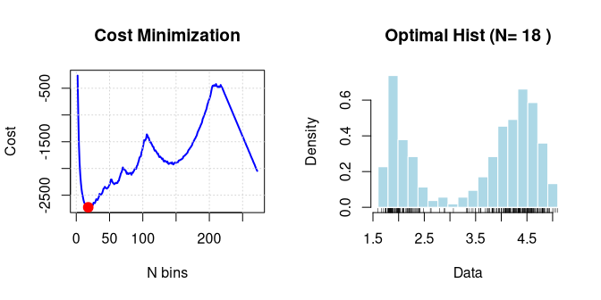{fig-alt="Plots showing optimal histogram for cost minimization"}

### Surveys

[heaping](https://cran.r-project.org/package=heaping) v0.1.0: Provides methods for correcting heaping (digit preference) in survey data at the individual record level. Age heaping, where respondents disproportionately report ages ending in 0 or 5, is a common phenomenon that can distort demographic analyses. Unlike traditional smoothing methods that only correct aggregated statistics, this package corrects individual values by replacing a calculated proportion of heaped observations with draws from fitted truncated distributions. See the [vignette](https://cran.r-project.org/web/packages/heaping/vignettes/heaping-intro.html).

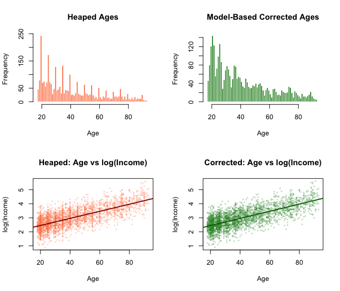{fig-alt="Plots showing corrections for heaping"}

[metasurvey](https://cran.r-project.org/package=metasurvey) v0.0.21: Provides a step-based pipeline for reproducible survey data processing, building on the `survey` package for complex sampling designs. Supports rotating panels with bootstrap replicate weights, and provides a recipe system for sharing and reproducing data transformation workflows across survey editions. There are thirteen vignettes including [Getting Started](https://cran.r-project.org/web/packages/metasurvey/vignettes/getting-started.html) and [Survey design and Validation](https://cran.r-project.org/web/packages/metasurvey/vignettes/complex-designs.html).

### Time Series

[mhpfilter](https://cran.r-project.org/package=mhpfilter) v0.1.0: Implements the Modified Hodrick-Prescott Filter for decomposing macroeconomic time series into trend and cyclical components via efficient `C++` routines. Unlike the standard HP filter, functions estimate series-specific lambda values that minimize the GCV criterion. See [Choudhary, Hanif and Iqbal (2014)](https://www.tandfonline.com/doi/abs/10.1080/00036846.2014.894631), and [Coe and McDermott (1997)](https://www.elibrary.imf.org/view/journals/024/1997/001/article-A003-en.xml) for background. There is an [Introduction](https://cran.r-project.org/web/packages/mhpfilter/vignettes/introduction.html) and a vignette on [Modified HP Filter Theory](https://cran.r-project.org/web/packages/mhpfilter/vignettes/methodology.html).

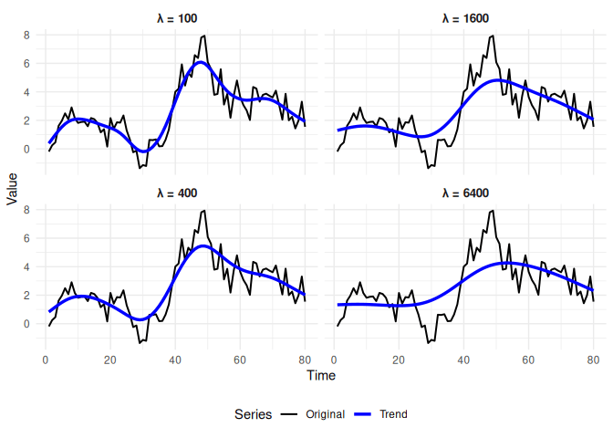{fig-alt="Plots showing effects of lambda"}

[RegimeChange](https://cran.r-project.org/package=RegimeChange) v0.1.1: Implements a unified framework for detecting regime changes (changepoints) in time series data. that include both frequentist and Bayesian methods that handle univariate and multivariate series with detection of changes in mean, variance, trend, and distributional properties. See [Page (1954)](https://academic.oup.com/biomet/article-abstract/41/1-2/100/456627?redirectedFrom=fulltext&login=false), [Killick, Fearnhead, and Eckley (2012)](https://www.tandfonline.com/doi/full/10.1080/01621459.2012.737745) for frequentist methods and [Adams and MacKay (2007)](https://arxiv.org/abs/0710.3742). for Bayesian menthds. There are three vignettes including and [Introduction](https://cran.r-project.org/web/packages/RegimeChange/vignettes/introduction.html) and [Bayesian Changepoint Detection](https://cran.r-project.org/web/packages/RegimeChange/vignettes/bayesian-methods.html).

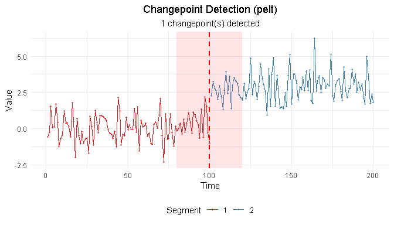{fig-alt="Plot of changepoint detection with PELT"}

### Visualization

[dtGAP](https://cran.r-project.org/package=dtGAP) v0.0.2: Provides supervised generalized association plots based on decision trees and enhances decision tree visualization by incorporating Generalized Association Plots (GAP) through matrix-based visualizations including confusion matrix maps, decision tree matrix maps, and predicted class membership maps. See [README](https://cran.r-project.org/web/packages/dtGAP/readme/README.html).

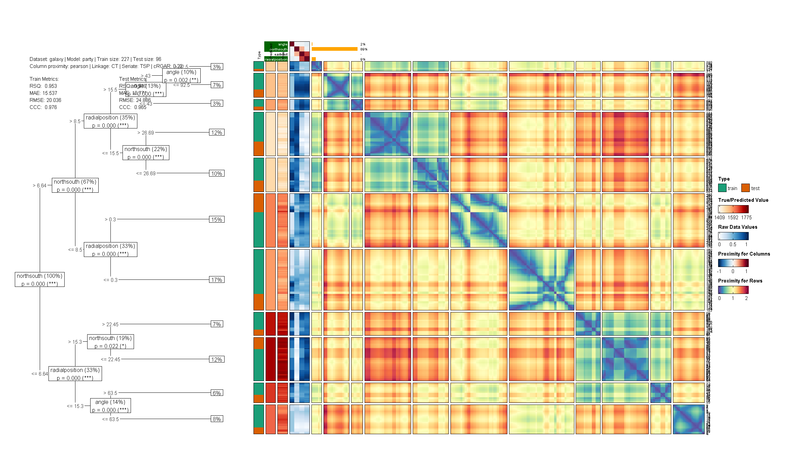{fig-alt="Plot of decision tree with heatmap"}

[ggInterval](https://cran.r-project.org/package=ggInterval) v0.2.4: Implements an extension of `ggplot2` (formerly 'ggESDA') to  visualize symbolic interval-valued data with various plots via more general and flexible input arguments. Additionally, it provides a function to transform classical data into symbolic data using both clustering algorithms and customized methods. See the [vignette](https://cran.r-project.org/web/packages/ggInterval/vignettes/ggInterval_Intro.html).

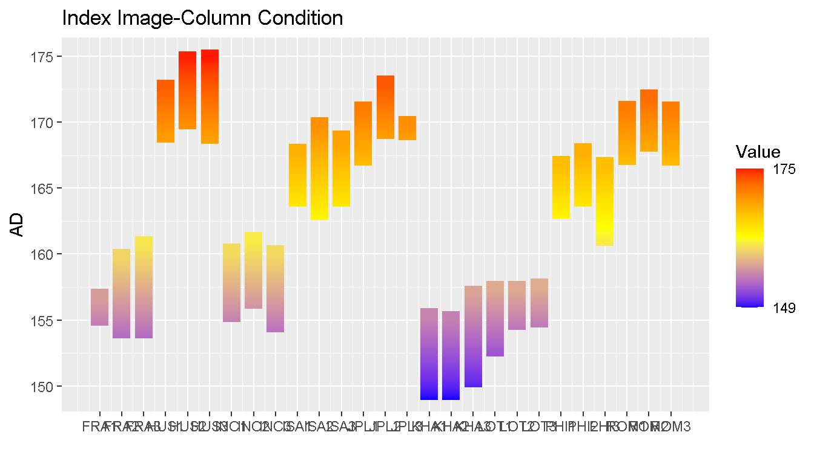{fig-alt="Plot of Index Image-Column Condition"}

[nomiShape](https://cran.r-project.org/package=nomiShape) v1.0.1: Provides tools for visualizing and analyzing the shape of discrete nominal frequency distributions and introduces centered frequency plots, in which nominal categories are ordered from the most frequent category at the center toward less frequent categories on both sides, facilitating the detection of distributional patterns such as uniformity, dominance, symmetry, skewness, and long-tail behavior. In addition, the package supports Pareto charts for the study of dominance and cumulative frequency structure in nominal data. There are twelve vignettes including [Visualizing and Analyzing Distributions of Nominal Variables](https://cran.r-project.org/web/packages/nomiShape/vignettes/nominal_distribution_shapes.html) and [Pareto Plots for Nominal Distributions](https://cran.r-project.org/web/packages/nomiShape/vignettes/pareto.html).

{fig-alt="Example of a Pareto Plot"}

:::

::::