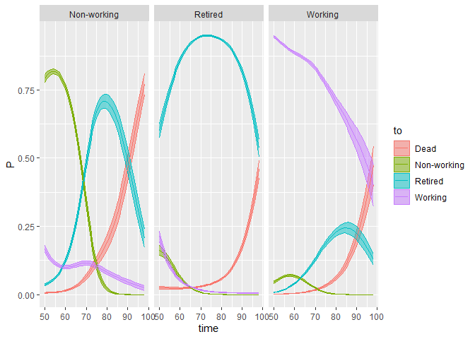
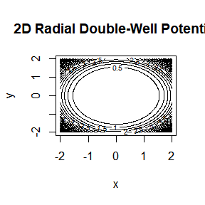
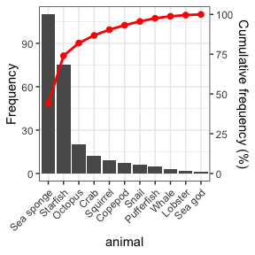

---
title: "February 2026 Top 40 New CRAN Packages"
author: "Joseph Rickert"
date: 2026-02-27
description: "An attempt to capture the depth and breadth of what's new on CRAN."
image: ""
image-alt: ""
categories: "Top 40"
editor: source
---

Two hundred forty-one of the new packages submitted to CRAN in February were still there in mid-March. Here are my Top 40 picks in nineteen categories: Artificial Intelligence, Computational Methods, Data, Dynamical Systems, Ecology, Economics, Epidemiology, Finance, Genetics, Genomics, High Performance Computing,  Mathematics, Machine Learning, Medical Application, Networks, Statistics, Time Series, Utilities, and Visualization.

{fig-alt=""}

:::: {.columns}

::: {.column width="45%"}

### Artificial Intelligence

:::

::: {.column width="10%"}

:::

::: {.column width="45%"}

### Machine Learning

[nadir](https://cran.r-project.org/package=nadir) v0.0.1: Provides a functional programming implementation of the super learner algorithm, [van der Laan et al. (2007)](https://biostats.bepress.com/ucbbiostat/paper222/), with an emphasis on supporting the use of formulas to specify learners. Includes the ability to use random-effects specified in formulas e.g. (y ~ (age | strata) + ...) and to construct new learners by passing a functions. See the [vignette](https://cran.r-project.org/web/packages/nadir/vignettes/Basic-Examples.html) for basic examples.

### Statistics

[dtms](https://cran.r-project.org/package=dtms) v0.4.2: Implements discrete-time multistate models, several ways of estimating parametric and nonparametric multistate models, and an extensive set of Markov chain methods which use transition probabilities derived from the multistate model. See [Schneider et al. (2024)](https://www.tandfonline.com/doi/full/10.1080/00324728.2023.2176535), [Dudel (2021)](https://journals.sagepub.com/doi/10.1177/0049124118782541), [Dudel & Myrskylä (2020)](https://link.springer.com/article/10.1186/s12963-020-00217-0), and  [van den Hout (2017)](https://www.taylorfrancis.com/books/mono/10.1201/9781315374321/multi-state-survival-models-interval-censored-data-ardo-van-den-hout) for background and [README](https://cran.r-project.org/web/packages/dtms/readme/README.html) to get started.

{fig-alt="Plot of evolution of transition probabilities"}

[rblimp](https://cran.r-project.org/package=rblimp) v1.0.: Provides an interface to [`Blimp`](https://www.appliedmissingdata.com/blimp) software for Bayesian latent variable modeling, missing data analysis, and multiple imputation. The package generates `Blimp` syntax, executes `Blimp` models, and imports results back into `R` as structured objects with methods for visualization and analysis. See [README](https://cran.r-project.org/web/packages/rblimp/readme/README.html) to get started.

[rareflow](https://cran.r-project.org/package=rareflow) v0.1.0: Provides variational flow-based methods for modeling rare events using Kullback–Leibler (KL) divergence, normalizing flows, Girsanov change of measure, and Freidlin–Wentzell action functionals and tools for rare-event inference, minimum-action paths, and quasi-potential computation in stochastic dynamical systems. Methods are based on [Rezende and Mohamed (2015)](https://arxiv.org/abs/1505.05770), [Girsanov (1960)](https://epubs.siam.org/doi/10.1137/1105027),  and [Freidlin and Wentzell (2012)](https://link.springer.com/book/10.1007/978-3-642-25847-3). See the [vignette](https://cran.r-project.org/web/packages/rareflow/vignettes/rareflow.html).

{fig-alt="2D potential plot"}

### Visualization

[nomiShape](https://cran.r-project.org/package=nomiShape) v1.0.1: Provides tools for visualizing and analyzing the shape of discrete nominal frequency distributions and introduces centered frequency plots, in which nominal categories are ordered from the most frequent category at the center toward less frequent categories on both sides, facilitating the detection of distributional patterns such as uniformity, dominance, symmetry, skewness, and long-tail behavior. In addition, the package supports Pareto charts for the study of dominance and cumulative frequency structure in nominal data. There are twelve vignettes including [Visualizing and Analyzing Distributions of Nominal Variables](https://cran.r-project.org/web/packages/nomiShape/vignettes/nominal_distribution_shapes.html) and [Pareto Plots for Nominal Distributions](https://cran.r-project.org/web/packages/nomiShape/vignettes/pareto.html).

{fig-alt="Example of a Pareto Plot"}

:::

::::