Three hundred seventy-one of the new packages submitted to CRAN in March were still there in mid-April. Here are my Top 40 picks in fifteen categories: Causal Inference, Computational Methods, Data, Ecology, Health Technology Assessment, Mathematics, Medical Statistics, Probability Programming, Public Health, Risk Analysis, Statistics, Time Series, Utilities, and Visualization.

{fig-alt=""}

:::: {.columns}

::: {.column width="45%"}

### Archaeology

[palimpsestr](https://cran.r-project.org/package=palimpsestr) v0.10.0: Implements a probabilistic framework for the analysis of archaeological palimpsests based on the Stratigraphic Entanglement Field which integrates spatial proximity, stratigraphic depth, chronological overlap, and cultural similarity to estimate latent depositional phases via diagonal Gaussian mixture Expectation-Maximisation.  Includes simulation, diagnostics, phase-count selection, publication-quality plots, and Geographic Information System export via `sf`. Methods are described in [Cocca (2026)](https://github.com/enzococca/palimpsestr). See the [vignette](https://cran.r-project.org/web/packages/palimpsestr/vignettes/introduction.html).

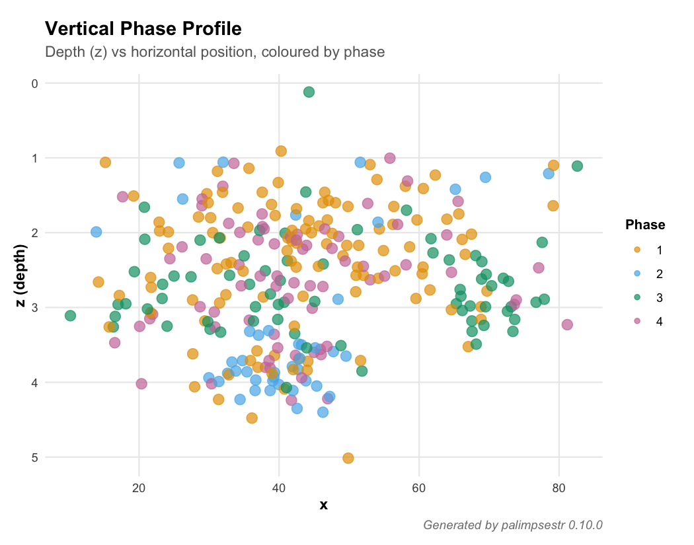{fig-alt="Vertical Phase Profile Plot"}

### Biology

[bsocialv2](https://cran.r-project.org/package=bsocialv2) v0.2.1: Provides an S4 class and methods for analyzing microbial social behavior in bacterial consortia. Includes growth parameter extraction, social behavior classification (cooperators/cheaters/neutrals), diversity effect analysis, consortium assembly path finding, and stability analysis via coefficient of variation. Methods are described in [Purswani et al. (2017)](https://www.frontiersin.org/journals/microbiology/articles/10.3389/fmicb.2017.00919/full). See the [vignette](https://cran.r-project.org/web/packages/bsocialv2/vignettes/bsocial-workflow.html).

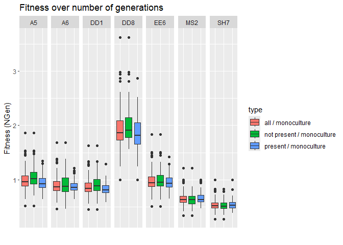{fig-alt="Plot showing fitness over number of generations"}

### Causal Inference

[CausalMixGPD](https://cran.r-project.org/package=CausalMixGPD) v0.8.0: Implements tools for Bayesian analysis of heavy-tailed outcomes by combining Dirichlet process mixture models for the body of the distribution with optional generalized Pareto tails. The method allows for unconditional and covariate-modulated mixtures, implements MCMC estimation using `nimble`, and extends to mixtures of different arms' outcomes with application to causal inference in the [Rubin (1974)](https://psycnet.apa.org/doiLanding?doi=10.1037%2Fh0037350) framework. There are three vignettes including an [Introduction](https://cran.r-project.org/web/packages/CausalMixGPD/vignettes/cmgpd_causal.html) and [One-Arm Regression Modeling](https://cran.r-project.org/web/packages/CausalMixGPD/vignettes/cmgpd_one_arm.html).

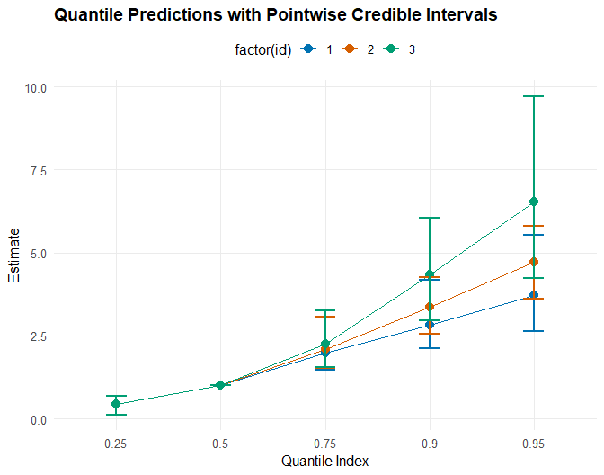{fig-alt="Quantile predictions with pointwise credible intervals"}

### Computational Methods

[nmfkc](https://cran.r-project.org/package=nmfkc) v0.7.3: Provides functopns to perform non-negative matrix factorization with kernel covariates. Given an observation matrix and kernel covariates, it optimizes both a basis matrix and a parameter matrix. Also provides NMF with random effects which estimates a mixed-effects model combining covariate-driven scores with unit-specific random effects together with wild bootstrap inference, and NMF-based structural equation modeling. See  [Satoh (2025)](https://arxiv.org/abs/2403.05359) and [Satoh (2026)](https://link.springer.com/article/10.1007/s42081-025-00314-0) for background. There are six vignettes including [Introduction](https://cran.r-project.org/web/packages/nmfkc/vignettes/introduction-to-nmfkc.html) and [Topie Modeling](https://cran.r-project.org/web/packages/nmfkc/vignettes/topic-modeling-with-nmfkc.html).

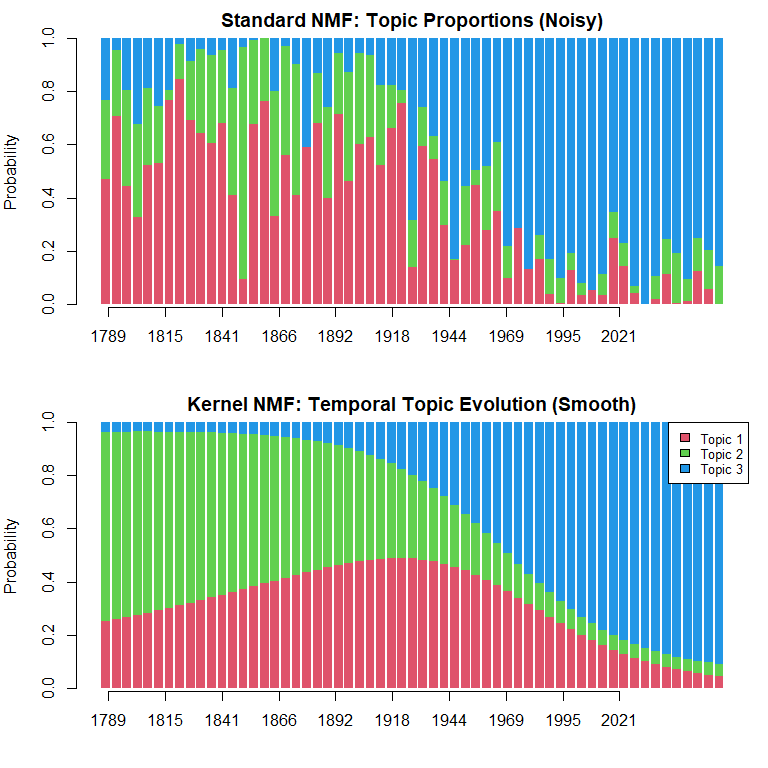{fig-alt="Plot of topic proportions"}

### Ecology

[CharAnalysis](https://cran.r-project.org/package=CharAnalysis) v2.0.3: Implements a program for reconstructing local fire histories from high-resolution, continuously sampled lake-sediment charcoal records. Functions decompose a charcoal record into low- and high-frequency components and use locally defined thresholds to separate fire signal from noise. See [Higuera et al. (2009)](https://esajournals.onlinelibrary.wiley.com/doi/10.1890/07-2019.1) and [Higuera et al. (2010)](https://connectsci.au/wf/article-abstract/19/8/996/23290/Peak-detection-in-sediment-charcoal-records?redirectedFrom=fulltext for background and the [vignette](https://cran.r-project.org/web/packages/CharAnalysis/vignettes/CharAnalysis_intro.html) to get started.

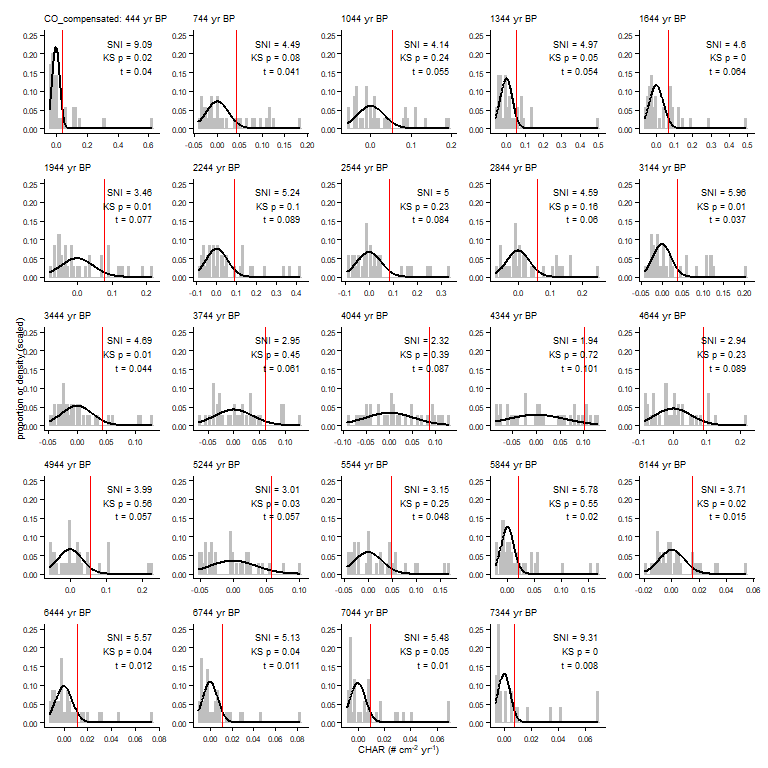{fig-alt="Each panel showing the empirical Cpeak distribution within that window, the fitted noise component (Gaussian or Gaussian mixture, per threshMethod), and the resulting threshold value at the working percentile"}
[SQIpro](https://cran.r-project.org/package=SQIpro) v0.1.0: Provides a comprehensive, modular framework for computing the Soil Quality Index (SQI) using six established methods: Linear Scoring [Doran and Parkin, (1994)](https://acsess.onlinelibrary.wiley.com/doi/10.2136/sssaspecpub35.c1).  Regression-based [Masto et al. (2008)](https://link.springer.com/article/10.1007/s10661-007-9697-z), Principal Component Analysis [Andrews et al. (2004)](https://acsess.onlinelibrary.wiley.com/doi/10.2136/sssaj2004.1945), Fuzzy Logic, Entropy Weighting, TOPSIS [Hwang and Yoon (1981)](https://link.springer.com/book/10.1007/978-3-642-48318-9). See the [vignette](https://link.springer.com/book/10.1007/978-3-642-48318-9).

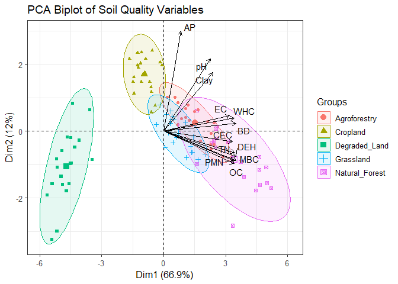{fig-alt="PCA Biplot of Soil Quality Variables"}

### Economics

[rescomp](https://CRAN.R-project.org/package=rescomp) v1.0.0: Provides functions to generate, simulate and visualize ODE models of consumer-resource interactions and competition modeling. There is an [Introduction](https://cran.r-project.org/web/packages/rescomp/vignettes/rescomp.html) and a [vignette](https://cran.r-project.org/web/packages/rescomp/vignettes/classic-results.html) reproducing classic results.

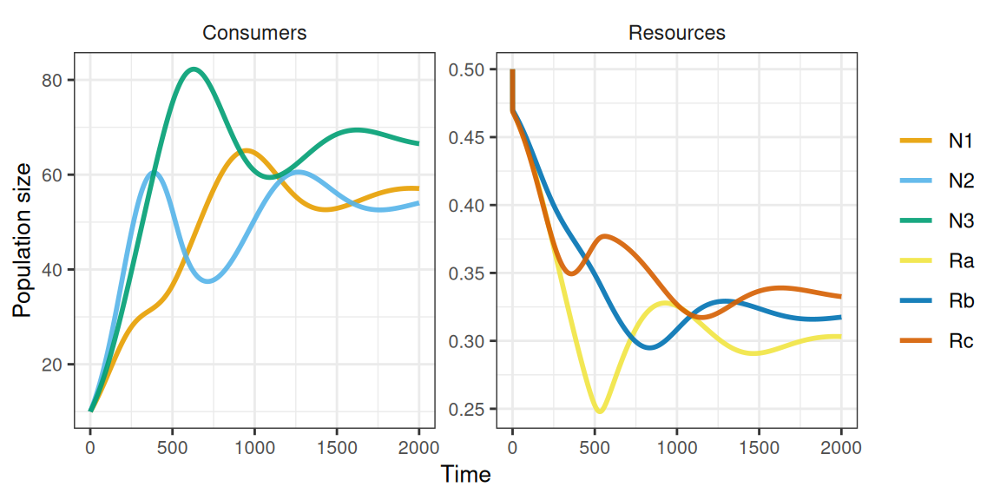{fig-alt="Plots showing behavior of three 'type 1' comusers on three essential resources over time"}

### Environmental Studies

[gleam](https://cran.r-project.org/package=gleam) v0.8.0: This official implementation of the [Global Livestock Environmental Assessment Model of the Food and Agriculture Organization of the United Nations](https://www.fao.org/gleam/en/) provides a modular, transparent framework for simulating livestock production systems and quantifying their environmental impacts. See [MacLeod et al. (2017)](https://www.sciencedirect.com/science/article/pii/S1751731117001847?via%3Dihub) for background There are four vignettes including an [Overview](https://cran.r-project.org/web/packages/gleam/vignettes/gleam-overview.html) and [Package Modules](https://cran.r-project.org/web/packages/gleam/vignettes/gleam-modules-overview.html).

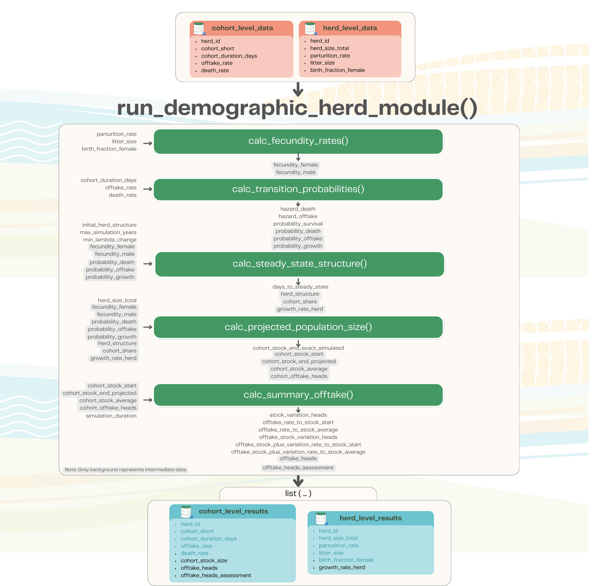{fig-alt="Plots showing behavior of three 'type 1' comusers on three essential resources over time"}

### Epidemiology

[lineagefreq](https://cran.r-project.org/package=lineagefreq) v0.2.0: Provides functions to model pathogen lineage frequency dynamics from genomic surveillance count data. Includes a unified interface for multinomial logistic regression, hierarchical partial-pooling models, the Piantham approximation for relative reproduction number estimation and features such as rolling-origin backtesting, standardized forecast scoring. See  [Abousamra, Figgins, and Bedford (2024)](https://journals.plos.org/ploscompbiol/article?id=10.1371/journal.pcbi.1012443) for background. There are four vignettes including [Getting Started](https://cran.r-project.org/web/packages/lineagefreq/vignettes/introduction.html) and [Analyzing real CDC surveillance data](https://cran.r-project.org/web/packages/lineagefreq/vignettes/real-data-analysis.html).

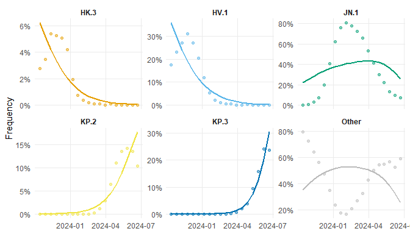{fig-alt="Trajectories of several lineages"}
[seroreconstruct](https://cran.r-project.org/package=seroreconstruct) v1.1.5: Implements a  Bayesian framework for inferring influenza infection status from serial antibody measurements. Jointly estimates season-specific infection probabilities, antibody boosting and waning after infection, and baseline hemagglutination inhibition (HAI) titer distributions. Supports multi-season analysis and subgroup comparisons via a group_by interface. See [Tsang et al. (2022)](https://www.nature.com/articles/s41467-022-29310-8) for methodological details and the two vignettes [Getting Started](https://cran.r-project.org/web/packages/seroreconstruct/vignettes/introduction.html) and [Statistical Methodology](https://cran.r-project.org/web/packages/seroreconstruct/vignettes/methodology.html).

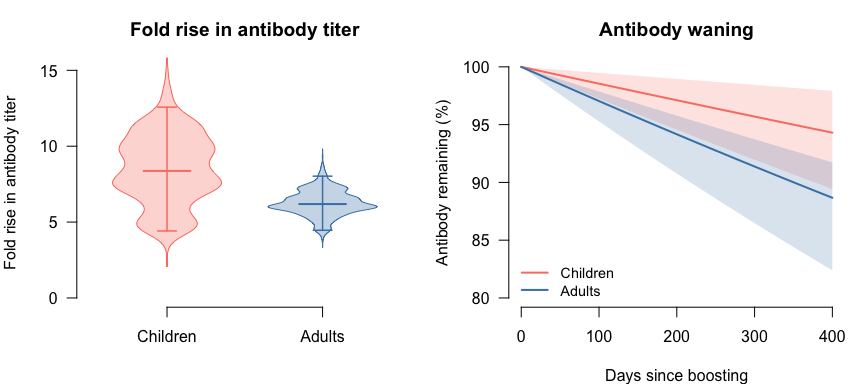{fig-alt="Plots of antibody rise and waning"}

### Meta Analysis

[drmeta](https://cran.r-project.org/package=drmeta) v0.1.0: Implements a variance-function random-effects framework in which between-study heterogeneity is modeled as a function of a study-level design robustness index, allowing heterogeneity to depend systematically on study quality or design strength rather than being treated as a single nuisance parameter. The framework nests classical fixed-effects and standard random-effects meta-analysis as special cases, making it a strict generalisation of existing approaches. See the [Getting Started Guide](https://cran.r-project.org/web/packages/drmeta/vignettes/getting-started.html).

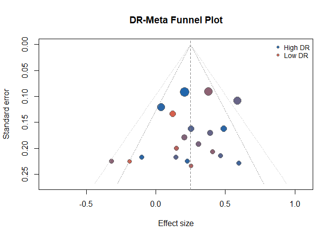{fig-alt="Funnel plot showing Standard error vs Effect Size"}
### Finance

[talib](https://cran.r-project.org/package=talib) v0.9-2: Implemants an interface nterface to the `TA-Lib` (Technical Analysis Library) `C` library, providing access to 150+ indicators (e.g. Average Directional Movement Index (ADX), Moving Average Convergence Divergence (MACD), Relative Strength Index (RSI), Stochastic Oscillator, Bollinger Bands), candlestick pattern recognition, and rolling-window utilities. Core computations are implemented in `C` for fast Open-High-Low-Close-Volume time-series feature engineering and rule-based signal generation. There are three vignettes including [Candlestick Pattern Recognition](https://cran.r-project.org/web/packages/talib/vignettes/candlestick.html) and [Financial Charts](https://cran.r-project.org/web/packages/talib/vignettes/charting.html).

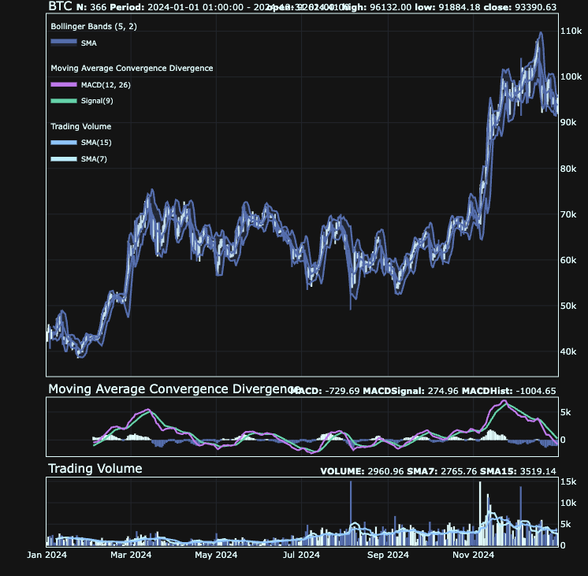{fig-alt="Stock chart with indicators"}

### Medical Statistics

:::

::: {.column width="10%"}

:::

::: {.column width="45%"}

### Probability

end