Three hundred seventy-six of the new packages submitted to CRAN in April were still there in mid-May. Here are my Top 40 picks in twenty-three categories: Actuarial Analysis, Archaeology, Biology, Causal Inference, Computational Methods, Ecology, Economics, Environmental Studies, Epidemiology, Finance, Functional Data Analysis, Health Technology Assessment, Machine Learning, Medical Statistics, Meta Analysis, Networks, Physics, Programming, Statistics, Time Series, Utilities, and Visualization.

:::: {.columns}

::: {.column width="45%"}

### Actuarial Analysis

[mqriskR](https://cran.r-project.org/package=mqriskR) v0.1.0: Provides functions for actuarial risk modeling, including survival models, life annuities, multiple-decrement models, and mortality improvement projections. The package is designed to align with standard actuarial notation and supports teaching, exam preparation, and reproducible actuarial analysis. The methods are based on standard actuarial references including [Camilli, Duncan and London (2014)](https://www.amazon.com/Models-Quantifying-Risk-Richard-London/dp/1625423470),  and [Dickson, Hardy and Waters (2020)](https://www.amazon.com/Actuarial-Mathematics-Contingent-International-Science/dp/1108478085/ref=sr_1_1?dib=eyJ2IjoiMSJ9.o7GXBw5H5JYFDcvNeOrpM58_PZqcW-2pMEeMTdCpcmxkl8sSFgx9YEBiBMmqr-wWFWZPgpoWKfjvwnvE7ASss2GsLU84aE3P7YsnfFYbBbBBtlfbK0fTcwWnH23XKnJwV6JkxJMocNt2MQdIyCmdDsqWBHNyRILKd17PUpOZyPnMWkBsXn9kXX2qedo98iumU6HQiObaIzG8nmpm3U-RYVgnomDlUWq61OnCS37EDMc.Lb6GlPsG2422vJHe1j-GwV_1RSSDvznlhHe7cbX-g2I&dib_tag=se&keywords=Actuarial+Mathematics+for+Life+Contingent+Risks&qid=1779844083&s=books&sr=1-1). See the [vignette](https://cran.r-project.org/web/packages/mqriskR/vignettes/getting-started.html).

### Archaeology

[palimpsestr](https://cran.r-project.org/package=palimpsestr) v0.10.0: Implements a probabilistic framework for the analysis of archaeological palimpsests based on the Stratigraphic Entanglement Field which integrates spatial proximity, stratigraphic depth, chronological overlap, and cultural similarity to estimate latent depositional phases via diagonal Gaussian mixture Expectation-Maximisation.  Includes simulation, diagnostics, phase-count selection, publication-quality plots, and Geographic Information System export via `sf`. Methods are described in [Cocca (2026)](https://github.com/enzococca/palimpsestr). See the [vignette](https://cran.r-project.org/web/packages/palimpsestr/vignettes/introduction.html).

{fig-alt="Vertical Phase Profile Plot"}

### Biology

[bsocialv2](https://cran.r-project.org/package=bsocialv2) v0.2.1: Provides an S4 class and methods for analyzing microbial social behavior in bacterial consortia. Includes growth parameter extraction, social behavior classification (cooperators/cheaters/neutrals), diversity effect analysis, consortium assembly path finding, and stability analysis via coefficient of variation. Methods are described in [Purswani et al. (2017)](https://www.frontiersin.org/journals/microbiology/articles/10.3389/fmicb.2017.00919/full). See the [vignette](https://cran.r-project.org/web/packages/bsocialv2/vignettes/bsocial-workflow.html).

{fig-alt="Plot showing fitness over number of generations"}

### Causal Inference

[CausalMixGPD](https://cran.r-project.org/package=CausalMixGPD) v0.8.0: Implements tools for Bayesian analysis of heavy-tailed outcomes by combining Dirichlet process mixture models for the body of the distribution with optional generalized Pareto tails. The method allows for unconditional and covariate-modulated mixtures, implements MCMC estimation using `nimble`, and extends to mixtures of different arms' outcomes with application to causal inference in the [Rubin (1974)](https://psycnet.apa.org/doiLanding?doi=10.1037%2Fh0037350) framework. There are three vignettes including an [Introduction](https://cran.r-project.org/web/packages/CausalMixGPD/vignettes/cmgpd_causal.html) and [One-Arm Regression Modeling](https://cran.r-project.org/web/packages/CausalMixGPD/vignettes/cmgpd_one_arm.html).

{fig-alt="Quantile predictions with pointwise credible intervals"}

### Computational Methods

[nmfkc](https://cran.r-project.org/package=nmfkc) v0.7.3: Provides functions to perform non-negative matrix factorization with kernel covariates. Given an observation matrix and kernel covariates, it optimizes both a basis matrix and a parameter matrix. Also provides NMF with random effects which estimates a mixed-effects model combining covariate-driven scores with unit-specific random effects together with wild bootstrap inference, and NMF-based structural equation modeling. See  [Satoh (2025)](https://arxiv.org/abs/2403.05359) and [Satoh (2026)](https://link.springer.com/article/10.1007/s42081-025-00314-0) for background. There are six vignettes including [Introduction](https://cran.r-project.org/web/packages/nmfkc/vignettes/introduction-to-nmfkc.html) and [Topic Modeling](https://cran.r-project.org/web/packages/nmfkc/vignettes/topic-modeling-with-nmfkc.html).

{fig-alt="Plot of topic proportions"}

[symbolicr](https://cran.r-project.org/package=symbolicr) v1.0.0: Provides functions to find non-linear formulas that fit input data. Users can systematically explore and memorize the possible formulas and it's cross-validation performance, in an incremental fashion. Three main interoperable search functions are available: 1) `random.search()` performs a random exploration, 2) `genetic.search()` employs a genetic optimization algorithm, 3) `comb.search()` combines best results of the first two. For more details see [Tomasoni et al. (2026)](https://link.springer.com/article/10.1208/s12248-026-01232-z). There are three vignettes including [get-started](https://cran.r-project.org/web/packages/symbolicr/vignettes/get-started.html) and [formula-analysis](https://cran.r-project.org/web/packages/symbolicr/vignettes/formula-analysis.html).

### Ecology

[CharAnalysis](https://cran.r-project.org/package=CharAnalysis) v2.0.3: Implements a program for reconstructing local fire histories from high-resolution, continuously sampled lake-sediment charcoal records. Functions decompose a charcoal record into low- and high-frequency components and use locally defined thresholds to separate fire signal from noise. See [Higuera et al. (2009)](https://esajournals.onlinelibrary.wiley.com/doi/10.1890/07-2019.1) and [Higuera et al. (2010)](https://connectsci.au/wf/article-abstract/19/8/996/23290/Peak-detection-in-sediment-charcoal-records?redirectedFrom=fulltext) for background and the [vignette](https://cran.r-project.org/web/packages/CharAnalysis/vignettes/CharAnalysis_intro.html) to get started.

{fig-alt="Each panel showing the empirical Cpeak distribution within that window, the fitted noise component (Gaussian or Gaussian mixture, per threshMethod), and the resulting threshold value at the working percentile"}
[SQIpro](https://cran.r-project.org/package=SQIpro) v0.1.0: Provides a comprehensive, modular framework for computing the Soil Quality Index (SQI) using six established methods: Linear Scoring [Doran and Parkin, (1994)](https://acsess.onlinelibrary.wiley.com/doi/10.2136/sssaspecpub35.c1).  Regression-based [Masto et al. (2008)](https://link.springer.com/article/10.1007/s10661-007-9697-z), Principal Component Analysis [Andrews et al. (2004)](https://acsess.onlinelibrary.wiley.com/doi/10.2136/sssaj2004.1945), Fuzzy Logic, Entropy Weighting, TOPSIS [Hwang and Yoon (1981)](https://link.springer.com/book/10.1007/978-3-642-48318-9). See the [vignette](https://link.springer.com/book/10.1007/978-3-642-48318-9).

{fig-alt="PCA Biplot of Soil Quality Variables"}

### Economics

[rescomp](https://CRAN.R-project.org/package=rescomp) v1.0.0: Provides functions to generate, simulate and visualize ODE models of consumer-resource interactions and competition modeling. There is an [Introduction](https://cran.r-project.org/web/packages/rescomp/vignettes/rescomp.html) and a [vignette](https://cran.r-project.org/web/packages/rescomp/vignettes/classic-results.html) reproducing classic results.

{fig-alt="Plots showing behavior of three 'type 1' comusers on three essential resources over time"}

### Environmental Studies

[gleam](https://cran.r-project.org/package=gleam) v0.8.0: This official implementation of the Global Livestock Environmental Assessment Model of the Food and Agriculture Organization of the United Nations, ([GLEAM](https://www.fao.org/gleam/en/)) provides a modular, transparent framework for simulating livestock production systems and quantifying their environmental impacts. See [MacLeod et al. (2017)](https://www.sciencedirect.com/science/article/pii/S1751731117001847?via%3Dihub) for background There are four vignettes including an [Overview](https://cran.r-project.org/web/packages/gleam/vignettes/gleam-overview.html) and [Package Modules](https://cran.r-project.org/web/packages/gleam/vignettes/gleam-modules-overview.html).

{fig-alt="Plots showing behavior of three 'type 1' comusers on three essential resources over time"}

### Epidemiology

[lineagefreq](https://cran.r-project.org/package=lineagefreq) v0.2.0: Provides functions to model pathogen lineage frequency dynamics from genomic surveillance count data. Includes a unified interface for multinomial logistic regression, hierarchical partial-pooling models, the Piantham approximation for relative reproduction number estimation and features such as rolling-origin backtesting, standardized forecast scoring. See  [Abousamra, Figgins, and Bedford (2024)](https://journals.plos.org/ploscompbiol/article?id=10.1371/journal.pcbi.1012443) for background. There are four vignettes including [Getting Started](https://cran.r-project.org/web/packages/lineagefreq/vignettes/introduction.html) and [Analyzing real CDC surveillance data](https://cran.r-project.org/web/packages/lineagefreq/vignettes/real-data-analysis.html).

{fig-alt="Trajectories of several lineages"}

[seroreconstruct](https://cran.r-project.org/package=seroreconstruct) v1.1.5: Implements a  Bayesian framework for inferring influenza infection status from serial antibody measurements. Jointly estimates season-specific infection probabilities, antibody boosting and waning after infection, and baseline hemagglutination inhibition titer distributions. Supports multi-season analysis and subgroup comparisons via a group_by interface. See [Tsang et al. (2022)](https://www.nature.com/articles/s41467-022-29310-8) for methodological details and the two vignettes [Getting Started](https://cran.r-project.org/web/packages/seroreconstruct/vignettes/introduction.html) and [Statistical Methodology](https://cran.r-project.org/web/packages/seroreconstruct/vignettes/methodology.html).

{fig-alt="Plots of antibody rise and waning"}

### Finance

[finlabR](https://cran.r-project.org/package=finlabR) v1.0.0: Provides tools for portfolio construction and risk analytics, including mean-variance optimization, conditional value at risk minimization, risk parity, regime clustering, correlation analysis, Monte Carlo simulation, and option pricing. Includes utilities for portfolio evaluation, clustering, and risk reporting. Methods are based in part on [Markowitz (1952)](https://onlinelibrary.wiley.com/doi/10.1111/j.1540-6261.1952.tb01525.x), [Rockafellar and Uryasev (2000)](https://www.risk.net/journal-risk/2161159/optimization-conditional-value-risk), [Maillard et al. (2010)](https://www.pm-research.com/content/iijpormgmt/36/4/60), [Black and Scholes (1973)](https://www.journals.uchicago.edu/doi/10.1086/260062), and [Cox et al. (1979)](https://www.sciencedirect.com/science/article/abs/pii/0304405X79900151?via%3Dihub). See the vignettes [Portfolio Analytics and Simulation](https://cran.r-project.org/web/packages/finlabR/vignettes/finlabR-intro.html) and [End-to-End Workflow](https://cran.r-project.org/web/packages/finlabR/vignettes/finlabR-workflow.html)

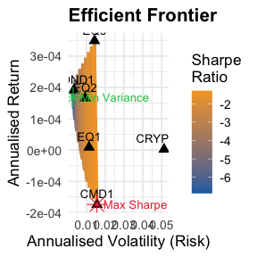{fig-alt="Plot of Efficient Frontier"}

[talib](https://cran.r-project.org/package=talib) v0.9-2: Implements an interface to the `TA-Lib` (Technical Analysis Library) `C` library, providing access to 150+ indicators (e.g. Average Directional Movement Index (ADX), Moving Average Convergence Divergence (MACD), Relative Strength Index (RSI), Stochastic Oscillator, Bollinger Bands), candlestick pattern recognition, and rolling-window utilities. Core computations are implemented in `C` for fast Open-High-Low-Close-Volume time-series feature engineering and rule-based signal generation. There are three vignettes including [Candlestick Pattern Recognition](https://cran.r-project.org/web/packages/talib/vignettes/candlestick.html) and [Financial Charts](https://cran.r-project.org/web/packages/talib/vignettes/charting.html).

{fig-alt="Stock chart with indicators"}

### Functional Data Analysis

[refundBayes](https://cran.r-project.org/package=refundBayes) v0.6.0: Provides tools to perform Bayesian regression with functional data, including regression with scalar, survival, or functional outcomes. The package allows regression with scalar and functional predictors. Methods are described in [Jiang et al. (2025)](https://onlinelibrary.wiley.com/doi/10.1002/sim.70265) *Tutorial on Bayesian Functional Regression Using Stan*. There are six vignettes including [Bayesian Function-on-Function Regression](https://cran.r-project.org/web/packages/refundBayes/vignettes/fofr_bayes_vignette.html) and [Bayesian Functional Principal Component Analysis (FPCA)](https://cran.r-project.org/web/packages/refundBayes/vignettes/fpca_bayes_vignette.html).

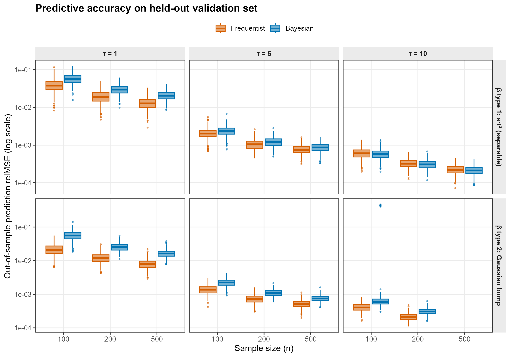{fig-alt="Plot of predictive accuracy on held-out validation set"}

[tidyfun](https://cran.r-project.org/package=tidyfun) v0.1.2: Builds on the `tf` package to provide functions to represent, visualize, describe and wrangle functional data in tidy data frames as well as data types for functional observations that work as columns in data frames, enabling manipulation with `dplyr` verbs and visualization with `ggplot2` geoms designed for functional data. There are six vignettes including [tf Vectors and Operations](https://cran.r-project.org/web/packages/tidyfun/vignettes/x01_tf_Vectors.html) and [Visualization](https://cran.r-project.org/web/packages/tidyfun/vignettes/x04_Visualization.html).

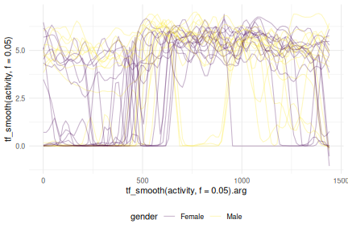{fig-alt="Plot of functional variables"}

### Genomics

[AbSolution](https://cran.r-project.org/package=AbSolution) v1.0.1: Implements an interactive framework as a `Shiny` Application for the exploration and analysis of adaptive immune receptor repertoire sequencing data in a manner that facilitates reproducible research. It enables large-scale computation and integrated analysis of sequence-derived features, including physicochemical properties, amino acid descriptor sets, sequence motifs, compositional patterns, and somatic hypermutation metrics. See the [GitHub Repository](https://github.com/EDS-Bioinformatics-Laboratory/AbSolution) and the [vignette](https://cran.r-project.org/web/packages/AbSolution/vignettes/AbSolution.html) for more details.

{fig-alt="Snapshot of Shiny page for Exploratory Analysis"}

[IOBR](https://cran.r-project.org/package=IOBR) v2.2.2: Provides six modules for tumor microenvironment (TME) analysis based on multi-omics data. These modules cover data preprocessing, TME estimation, TME infiltrating patterns, cellular interactions, genome and TME interaction, and visualization for TME relevant features, as well as modelling based on key features. In addition to providing a way to construct gene signatures from single-cell RNA-seq data, it also provides a way to construct a reference matrix for TME deconvolution from single-cell RNA-seq data. See [Zeng et al. (2024)](https://www.cell.com/cell-reports-methods/fulltext/S2667-2375(24)00300-X?_returnURL=https%3A%2F%2Flinkinghub.elsevier.com%2Fretrieve%2Fpii%2FS266723752400300X%3Fshowall%3Dtrue) and [Fang et al. (2025)](https://onlinelibrary.wiley.com/doi/10.1002/mdr2.70001) for background and the [vignette](https://cran.r-project.org/web/packages/IOBR/vignettes/IOBR-user-manual.html) for a detailed tutorial.

{fig-alt="Diagram of Workflow"}

### Health Technology Assessment

[htaBIM](https://cran.r-project.org/package=htaBIM) v0.1.0: Implements a structured, reproducible framework, a Shiny Application, for budget impact modelling in health technology assessment (HTA), following the ISPOR Task Force guidelines [(Sullivan et al. (2014)](https://www.valueinhealthjournal.com/article/S1098-3015(13)04235-6/fulltext?_returnURL=https%3A%2F%2Flinkinghub.elsevier.com%2Fretrieve%2Fpii%2FS1098301513042356%3Fshowall%3Dtrue) and [Mauskopf et al. (2007)](https://www.valueinhealthjournal.com/article/S1098-3015(10)60471-8/pdf?_returnURL=https%3A%2F%2Flinkinghub.elsevier.com%2Fretrieve%2Fpii%2FS1098301510604718%3Fshowall%3Dtrue) that provides functions for epidemiology-driven population estimation, market share modelling with flexible uptake dynamics, per-patient cost calculation across multiple cost categories, multi-year budget projections, payer perspective analysis, deterministic sensitivity analysis, and probabilistic sensitivity analysis. Produces submission-quality outputs including ISPOR-aligned summary tables, scenario comparison tables, per-patient cost breakdowns, tornado diagrams, PSA histograms, and text and HTML reports compatible with NICE, CADTH, and EU-HTA dossier formats. See the vignettes [Introduction](https://cran.r-project.org/web/packages/htaBIM/vignettes/htaBIM-introduction.html) and [Interactive Shiny Dashboard](https://cran.r-project.org/web/packages/htaBIM/vignettes/shiny-app.html).

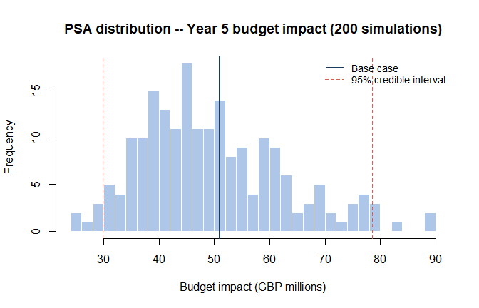{fig-alt="Plot of Probabilistic Sensitivity Analysis"}

:::

::: {.column width="10%"}

:::

::: {.column width="45%"}

### Machine Learning

[AntsNet](https://cran.r-project.org/package=AntsNet) v1.0.0: Implements the full suite of simulation, visualization, and analysis tools for exploring the mathematical isomorphisms between ant colony decision-making and three major paradigms of machine learning: random forests (Part I: variance reduction through decorrelation), boosting (Part II: bias reduction through adaptive recruitment), and neural networks (Part III: gradient-based generational learning). See Fokoué, Babbitt, and Levental, (2026) [Part I](https://arxiv.org/abs/2603.20328) and [Part II](https://arxiv.org/abs/2604.00038) for background and [README](https://cran.r-project.org/web/packages/AntsNet/readme/README.html) to get started.

[bigKNN](https://cran.r-project.org/package=bigKNN) v0.3.0: Implements exact nearest-neighbour and radius-search routines that operate directly on `bigmemory::big.matrix` objects. Functions stream row blocks through `BLAS` kernels, support self-search and external-query search, expose prepared references for repeated queries, and can build exact k-nearest-neighbour, radius, mutual k-nearest-neighbour, and shared-nearest-neighbour graphs. There are seven vignettes including: [Quick Start](https://cran.r-project.org/web/packages/bigKNN/vignettes/bigknn-quickstart.html) and [Using bigKNN as Exact Ground Truth](https://cran.r-project.org/web/packages/bigKNN/vignettes/bigknn-evaluating-approximate-search.html).

### Medical Statistics

[BayesianQDM](https://gosukehommaex.github.io/BayesianQDM/) v0.1.0: Provides comprehensive methods to calculate posterior probabilities, posterior predictive probabilities, and Go/NoGo/Gray decision probabilities for quantitative decision-making under a Bayesian paradigm in clinical trials. Supports both single and two-endpoint analyses for binary and continuous outcomes, with controlled, uncontrolled, and external designs. External designs incorporate historical data through power priors using exact conjugate representations to significantly reduces computational burden while preserving complete Bayesian rigor. See [Kang, Yamaguchi, and Han (2026)](https://www.tandfonline.com/doi/full/10.1080/10543406.2026.2655410) for the methodological framework. There are five vignettes including [Overview](https://cran.r-project.org/web/packages/BayesianQDM/vignettes/overview.html) and [Two Continuous Endpoints](https://cran.r-project.org/web/packages/BayesianQDM/vignettes/two-continuous.html).

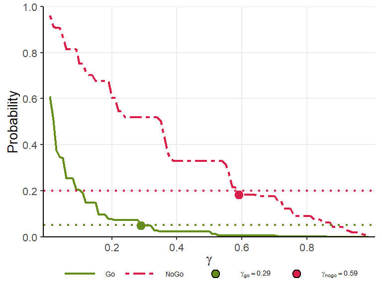{fig-alt="An Optimal Threshold Plot"}

[raretrans](https://cran.r-project.org/package=raretrans) v1.0.5: Provides functions to correct biased transition and fertility estimates in population projection matrices caused by small sample sizes, never observed biologically possible transmissions, or transitions estimated at 100% survival, stasis, or mortality that are biologically implausible. Implements a multinomial-Dirichlet Bayesian prior for transition probabilities and a Gamma-Poisson prior for reproduction, allowing analysts to incorporate prior biological knowledge and regularise estimates from rare or unobserved events. Methods are described in [Tremblay et al. (2021)](https://www.sciencedirect.com/science/article/abs/pii/S0304380021000971?via%3Dihub). There are six vignettes including both a [Quick start](https://cran.r-project.org/web/packages/raretrans/vignettes/quick_start.html) and an [Introduction](https://cran.r-project.org/web/packages/raretrans/vignettes/introduction.html).

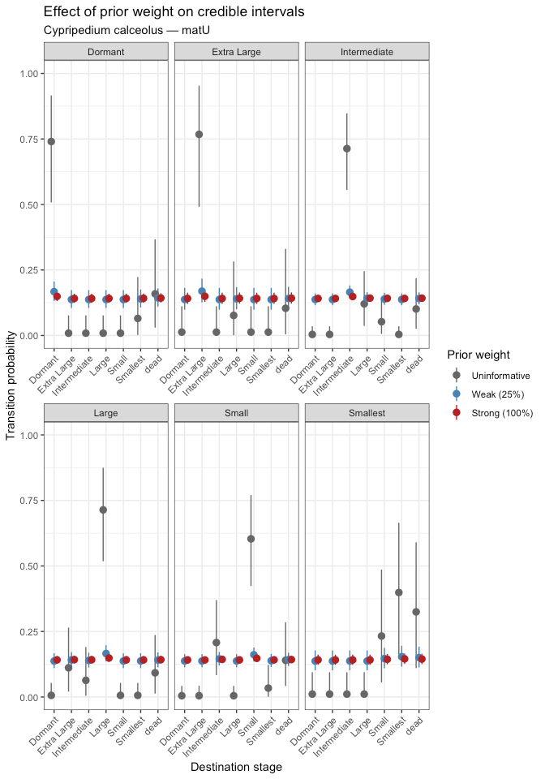{fig-alt="Plot showing effect of prior weight oncredible intervals"}

### Meta Analysis

[confMeta](https://cran.r-project.org/package=confMeta) v0.1.0: Provides tools for the combination of individual study results in meta-analyses using *p-value* functions. Implements various combination methods including those by Fisher, Stouffer, Tippett, Edgington along with weighted generalizations. Contains functionality for the visualization and calculation of confidence curves and drapery plots to summarize evidence across studies. See the [vignette](https://cran.r-project.org/web/packages/confMeta/vignettes/confMeta-usage.html).

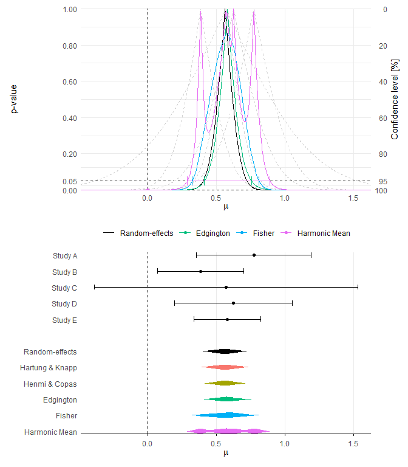{fig-alt="Combined p=value and effects plots"}

[drmeta](https://cran.r-project.org/package=drmeta) v0.1.0: Implements a variance-function random-effects framework in which between-study heterogeneity is modeled as a function of a study-level design robustness index, allowing heterogeneity to depend systematically on study quality or design strength rather than being treated as a single nuisance parameter. The framework nests classical fixed-effects and standard random-effects meta-analysis as special cases, making it a strict generalization of existing approaches. See the [Getting Started Guide](https://cran.r-project.org/web/packages/drmeta/vignettes/getting-started.html).

{fig-alt="Funnel plot showing Standard error vs Effect Size"}

### Networks

[sparsecommunity](https://cran.r-project.org/package=sparsecommunity) v0.1.1: Implements spectral clustering algorithms for community detection in sparse networks under the stochastic block model and degree-corrected stochastic block model  following the methods of [Lei and Rinaldo (2015)](https://projecteuclid.org/journals/annals-of-statistics/volume-43/issue-1/Consistency-of-spectral-clustering-in-stochastic-block-models/10.1214/14-AOS1274.full). Provides a regularized normalized Laplacian embedding, spherical k-median clustering, simulation utilities, and a misclustering rate evaluation metric along with the NCAA college football network of [Girvan and Newman (2002)](https://www.pnas.org/doi/full/10.1073/pnas.122653799) as a benchmark dataset, and the Bethe-Hessian community number estimator of [Hwang (2023)](https://www.tandfonline.com/doi/full/10.1080/01621459.2023.2223793). See the [vignette]().

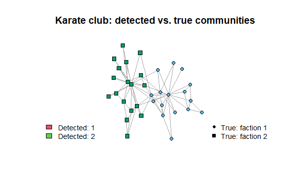{fig-alt="Plot of detetcted vs. true communities"}

### Physics

[orbitr](https://cran.r-project.org/package=orbitr) v0.3.0: Provides a  lightweight, fully vectorized N-body physics engine built for the R ecosystem. Simulate and visualize complex orbital mechanics, celestial trajectories, and gravitational interactions using tidy data principles. Features multiple numerical integration methods, including the energy-conserving velocity Verlet algorithm [Verlet (1967)](https://journals.aps.org/pr/abstract/10.1103/PhysRev.159.98) to ensure highly stable orbital propagation. Gravitational N-body methods follow [Aarseth (2003)](https://www.cambridge.org/us/universitypress/subjects/physics/astrophysics/gravitational-n-body-simulations-tools-and-algorithms?format=PB&isbn=9780521121538). There are twelve vignettes including [Quick Start Guide](https://cran.r-project.org/web/packages/orbitr/vignettes/keplerian-elements.html) and [The Physics](https://cran.r-project.org/web/packages/orbitr/vignettes/the-physics.html).

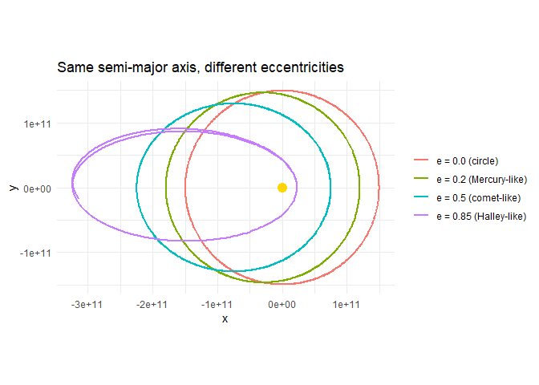{fig-alt="Plot of planetary orbits"}

### Programming

[mori](https://cran.r-project.org/package=mori) v0.2.0: Enables users to share `R` objects across processes on the same machine via a single copy in `POSIX` shared memory (`Linux`, `macOS`) or a `Win32` file mapping (`Windows`). Every process reads from the same physical pages through the `R` Alternative Representation (`ALTREP`) framework, giving lazy, zero-copy access. Shared objects serialize compactly as their shared memory name rather than their full contents. See [README](https://cran.r-project.org/web/packages/mori/readme/README.html) to get started.

[progressify](https://cran.r-project.org/package=progressify) v0.1.0: The ``progressify()` function rewrites (transpiles) calls to sequential and parallel map-reduce functions such as `base::lapply()`, `purrr::map()`, `foreach::foreach()`, and `plyr::llply()` to signal progress updates. By combining this function with R's native pipe operator, you have a straightforward way to report progress on iterative computations with minimal refactoring, e.g. `lapply(x, fcn) |> progressify()` and `purrr::map(x, fcn) |> progressify()`. It is compatible with the `futurize` package for parallelization, e.g. `lapply(x, fcn) |> progressify() |> futurize()` and `purrr::map(x, fcn) |> futurize() |> progressify()`. There are nine brief vignettes including [Progress updates for base-R apply functions](https://cran.r-project.org/web/packages/progressify/vignettes/progressify-11-base.html) and [Progress updates for 'purrr' functions](https://cran.r-project.org/web/packages/progressify/vignettes/progressify-21-purrr.html).

[shard](https://cran.r-project.org/package=shard) v0.1.1: Provides  a parallel execution runtime for R that emphasizes deterministic memory behavior and efficient handling of large shared inputs which enables zero-copy parallel reads via shared, memory-mapped segments, encourages explicit output buffers to avoid large result aggregation, and supervises worker processes to mitigate memory drift via controlled recycling. Diagnostics report peak memory usage, end-of-run memory return, and hidden copy/materialization events to support reproducible performance benchmarking. See the [vignette](https://cran.r-project.org/web/packages/shard/vignettes/shard.html) to get started.

### Statistics 

[balnet](https://cran.r-project.org/package=balnet) v0.0.3: Provides pathwise estimation of regularized logistic propensity score models using covariate balancing loss functions rather than maximum likelihood. Regularization paths are fit via the `adelie` elastic-net solver with a `glmnet`-like interface, yielding balancing weights that target covariate balance for the ATE and ATT. Under lasso penalization, lambda bounds the maximum covariate imbalance, so the regularization path traces a sequence of decreasing imbalance tolerances. See [Sverdrup & Hastie (2026)](https://arxiv.org/abs/2602.18577) for details and the [vignette](https://cran.r-project.org/web/packages/balnet/vignettes/balnet.html) for an introduction.

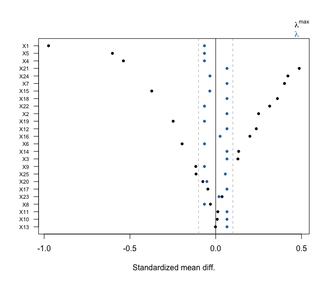{fig-alt="Plot showing model fit that aims to balance control covariate means toward those of the treated group"}

[ngme2](https://cran.r-project.org/package=ngme2) v0.9.8: Functions to fit and analyze linear latent non-Gaussian models for temporal, spatial, and space-time data including autoregressive and Ornstein-Uhlenbeck processes, random walks, Matern fields based on stochastic partial differential equations, separable and non-separable space-time models, graph-based Matern models, bivariate type-G fields, and user-defined sparse operators. Latent fields and observation models can use Gaussian and non-Gaussian noise distributions. The modeling framework is described in [Bolin et al. (2026)](https://arxiv.org/abs/2602.23987). See the [vignette](https://davidbolin.github.io/ngme2/articles/tensor-product.html) for exceptionally well done documentation.

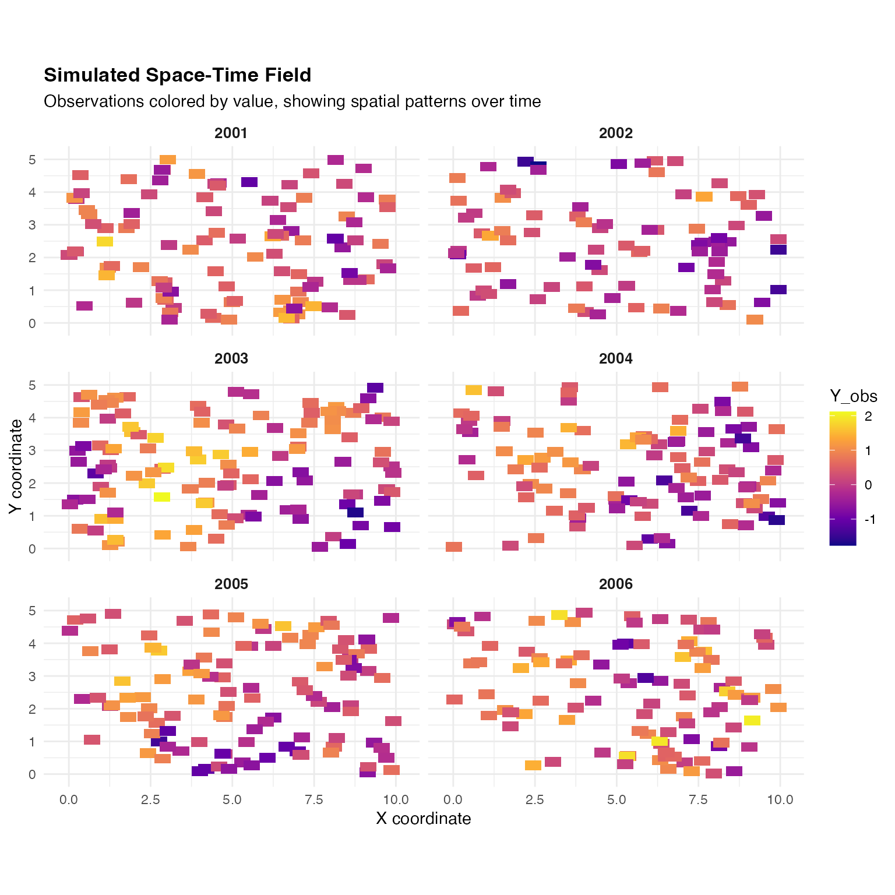{fig-alt="Simulated Space-Time Field"}

[nowcastr](https://cran.r-project.org/package=nowcastr) v0.2.0: Implements tools for  performing nowcasting using the [Chain-Ladder method](https://en.wikipedia.org/wiki/Chain-ladder_method), and supports both non-cumulative delay-based estimation and model-based completeness fitting (e.g., using logistic or Gompertz curves) to predict final counts from partially reported data. See the vignettes [Getting Started]() and [Evaluate Past Nowcasts Accuracy](https://cran.r-project.org/web/packages/nowcastr/vignettes/eval.html).

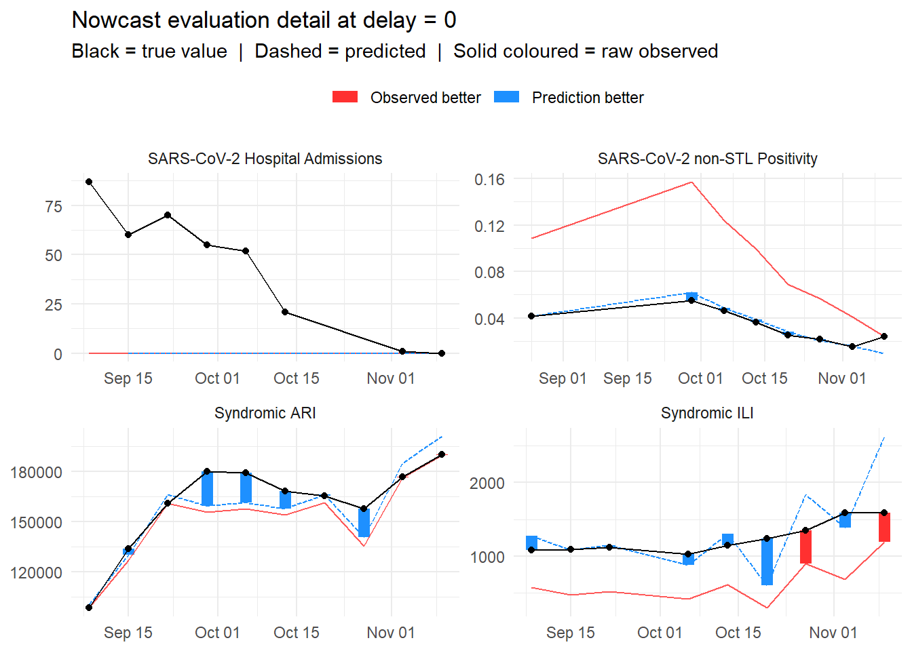{fig-alt="Nowcast Evaluation Plots"}

[TwoStepSDFM](https://cran.r-project.org/package=TwoStepSDFM) v0.2.2: Provides functions to estimate a sparse Gaussian state-space model with mixed frequency data via sparse principal components analysis and the Kalman filter and smoother. For more details see [Franjic and Schweikert (2024)](https://papers.ssrn.com/sol3/papers.cfm?abstract_id=4733872). The [vignette](https://cran.r-project.org/web/packages/TwoStepSDFM/vignettes/IntroTwoStepSDFM.html) provides an introduction

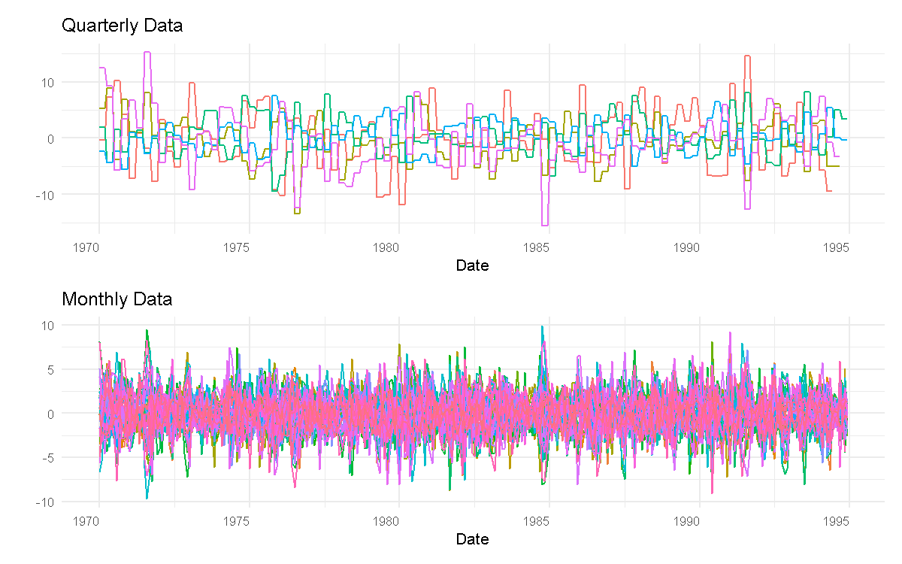{fig-alt="Plot of Quarterly and Monthly Data"}

### Time Series

[MatchingPursuit](https://cran.r-project.org/package=MatchingPursuit) v1.0.1: Provides tools for analyzing and decomposing time series data using the Matching Pursuit algorithm, a greedy signal decomposition technique that represents complex signals as a linear combination of simpler functions (called atoms) selected from a redundant dictionary. For more details see [Mallat and Zhang (1993)](https://ieeexplore.ieee.org/document/258082), [Pati et al. (1993)](https://ieeexplore.ieee.org/document/342465), [Elad (2010)](https://link.springer.com/book/10.1007/978-1-4419-7011-4), and [Różański (2024)](https://dl.acm.org/doi/10.1145/3674832). See the [vignette](https://cran.r-project.org/web/packages/MatchingPursuit/vignettes/MatchingPursuit.html).

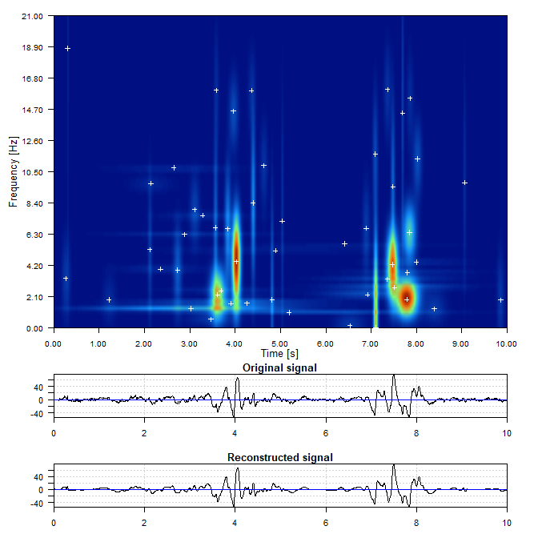{fig-alt="Frequency plot of a time series"}

[xiacf](https://cran.r-project.org/package=xiacf) v0.5.0: Computes Chatterjee's non-parametric correlation coefficient for time series data. It extends the original metric to time series analysis by providing the Xi-Autocorrelation Function and Xi-Cross-Correlation Function. Allows users to test for non-linear dependence using Iterative Amplitude Adjusted Fourier Transform  surrogate data with strict Family-Wise Error Rate control via Max-statistic approaches. Methodologies are based on [Chatterjee (2021)](https://www.tandfonline.com/doi/full/10.1080/01621459.2020.1758115) and surrogate data testing methods by [Schreiber and Schmitz (1996)](https://journals.aps.org/prl/abstract/10.1103/PhysRevLett.77.635). See [README](https://cran.r-project.org/web/packages/xiacf/readme/README.html) for examples.

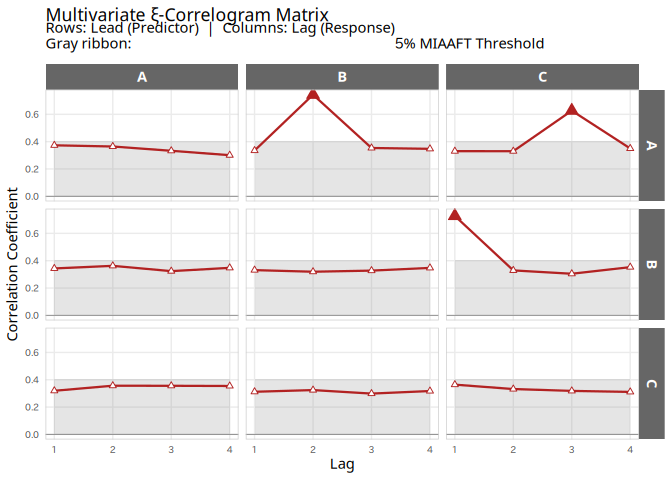{fig-alt="Plot of mltivariate Xi correlation matrix"}

### Utilities

[abba](https://cran.r-project.org/package=abba) v0.2.0: Enables users to submit and monitor batch execution of R programs across distributed computing backends including `Kubernetes`, `SLURM`, and `Posit Workbench`. Provides end-user job submission functions, cluster interface functions using `kubectl` and `SLURM` commands, and a `plumber` API template for secure identity segregation. Supports parallel and sequential batch execution, file-based caching to skip unchanged programs, and `logrx` integration for execution logging. There are seven vignettes including [Kubernetes Batch Jobs](https://cran.r-project.org/web/packages/abba/vignettes/k8s_batch_job.html) and [SLURM Job Submission](https://cran.r-project.org/web/packages/abba/vignettes/slurm_job_submission.html).

[vectra](https://cran.r-project.org/package=vectra) v0.6.2: Implements a minimal columnar query engine with lazy execution on datasets larger than RAM. Provides `dplyr`-like verbs (`filter()`, `select()`, `mutate()`, `group_by()`, `summarise()`, joins, window functions) and common aggregations (`n()`, `sum()`, `mean()`, `min()`, `max()`, `sd(`), `first()`,`last()`) backed by a pure `C11` pull-based execution engine and a custom on-disk format (`.vtr`). Reads and writes `GeoTIFF` (including tiled and `BigTIFF` layouts) and a tiled raster format (`.vec`) with overview pyramids and time cubes for larger-than-RAM raster data. There are eight vignettes including [Getting Started](https://cran.r-project.org/web/packages/vectra/vignettes/quickstart.html) and [String Operations and Fuzzy Matching](https://cran.r-project.org/web/packages/vectra/vignettes/string-ops.html).

### Visualization

[janusplot](https://cran.r-project.org/package=janusplot) v0.1.0: Provides functions to render a pairwise, asymmetric smoothed-association matrix of continuous variables. Each cell shows the fitted spline from an `mgcv` generalized additive model, with the upper triangle displaying `gam(x_j ~ s(x_i))` and the lower triangle `gam(x_i ~ s(x_j))`. Unlike Pearson's correlation matrix, the visualization is intentionally asymmetric, revealing heteroscedasticity, leverage, and directional non-linearity that a single scalar correlation hides. An asymmetry index and a 24-category shape taxonomy quantify the directional difference and qualitative form of each fitted smooth. There are two vignettes, [Asymmetric Smoothed-Association Matrices](https://cran.r-project.org/web/packages/janusplot/vignettes/janusplot.html) and [Shape-recognition sensitivity study](https://cran.r-project.org/web/packages/janusplot/vignettes/shape-recognition-sensitivity.html).

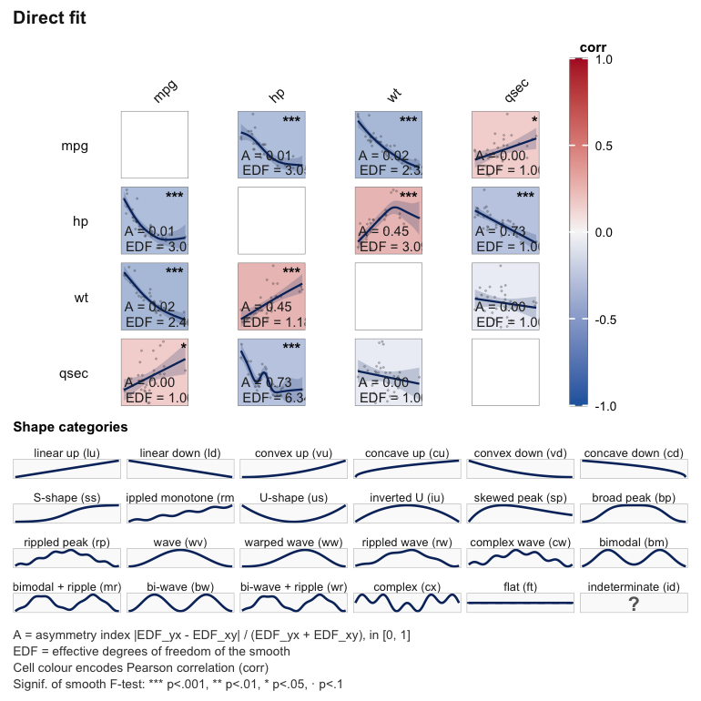{fig-alt="Example of a janusplot"}

:::

::::