---
title: "December 2025 Top 40 New CRAN Packages"
author: "Joseph Rickert"
date: 2026-01-27
description: "An attempt to capture the depth and breadth of what's new on CRAN."
image: ""
image-alt: ""
categories: "Top 40"
editor: source
---

In December, NNnnn new packages made it to CRAN. Here are my Top 40 picks in eighteen categories: Agriculture, Biology, Computational Methods, Data, Ecology, Epidemiology, Genomics, Healthcare, Health Technology Assessment, Machine Learning, Medicine, Networks, Statistics, Time Series, Utilities, and Visualization.

{fig-alt=""}

:::: {.columns}

::: {.column width="45%"}

### AI

[gooseR](https://cran.r-project.org/package=gooseR) v0.1.1: Integrates [Goose AI](https://github.com/block/goose) capabilities including memory management, visualization enhancements, and workflow automation. Save `R` objects to `Goose` memory, apply Block branding to visualizations, and manage data science project workflows. There are six vignettes including [Getting Started](https://cran.r-project.org/web/packages/gooseR/vignettes/getting-started.html) and [Code Review and Testing](https://cran.r-project.org/web/packages/gooseR/vignettes/code-review-testing.html).

[pairwiseLLM](https://cran.r-project.org/package=pairwiseLLM) v1.1.0: Provides a unified framework for generating, submitting, and analyzing pairwise comparisons of writing quality using large language models (LLMs). The package supports live and/or batch evaluation workflows across multiple providers (OpenAI, Anthropic, Google Gemini, Together AI, and locally-hosted Ollama models).  Results can be modeled using [Bradley–Terry (1952)](https://www.jstor.org/stable/2334029?origin=crossref) or Elo rating methods as described in [Clark et al. (2018)](https://journals.plos.org/plosone/article?id=10.1371/journal.pone.0190393) to derive writing quality scores. For information on the method of pairwise comparisons, see [Thurstone (1927)](https://psycnet.apa.org/doiLanding?doi=10.1037%2Fh0070288) and [Heldsinger & Humphry (2010)](https://link.springer.com/article/10.1007/BF03216919). There are three vignettes including [Getting Started](https://cran.r-project.org/web/packages/pairwiseLLM/vignettes/getting-started.html) and [Advanced](https://cran.r-project.org/web/packages/pairwiseLLM/vignettes/advanced-batch-workflows.html).

### Causal Inference

[caugi](https://cran.r-project.org/package=caugi) v1.0.0: Implements a simple interface to build, structure, and examine causal relationships. There are five vignettes including [Getting Started](https://cran.r-project.org/web/packages/caugi/vignettes/get_started.html) and [Visualizing Causal Graphs](https://cran.r-project.org/web/packages/caugi/vignettes/visualization.html).

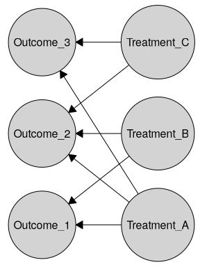{fig-alt="Causal graph"}

### Computational Methods

[bigPLSR](https://cran.r-project.org/package=bigPLSR) v0.7.2: Provides fast partial least squares (PLS) for dense and out-of-core data that is optimized for `bigmemory`-backed matrices with streamed cross-products and chunked BLAS. For details see [Bertrand and Maumy (2023)](https://hal.science/hal-05352069), [Bertrand and Maumy (2023b)](https://hal.science/hal-05352069), and [Dayal and MacGregor (1997)](https://analyticalsciencejournals.onlinelibrary.wiley.com/doi/10.1002/%28SICI%291099-128X%28199701%2911%3A1%3C73%3A%3AAID-CEM435%3E3.0.CO%3B2-%23). Features nclude kernel logistic PLS with `C++`-accelerated alternating iteratively reweighted least squares (IRLS) updates, streamed reproducing kernel Hilbert space (RKHS) solvers with reusable centering statistics, and bootstrap diagnostics with graphical summaries for coefficients, scores, and cross-validation workflows. There are fourteen vignettes including [Automatic Algorithm Selection](https://cran.r-project.org/web/packages/bigPLSR/vignettes/bigPLSR-auto-selection.html) and [Visualizing PLS FIts](https://cran.r-project.org/web/packages/bigPLSR/vignettes/plotting-guide.html).

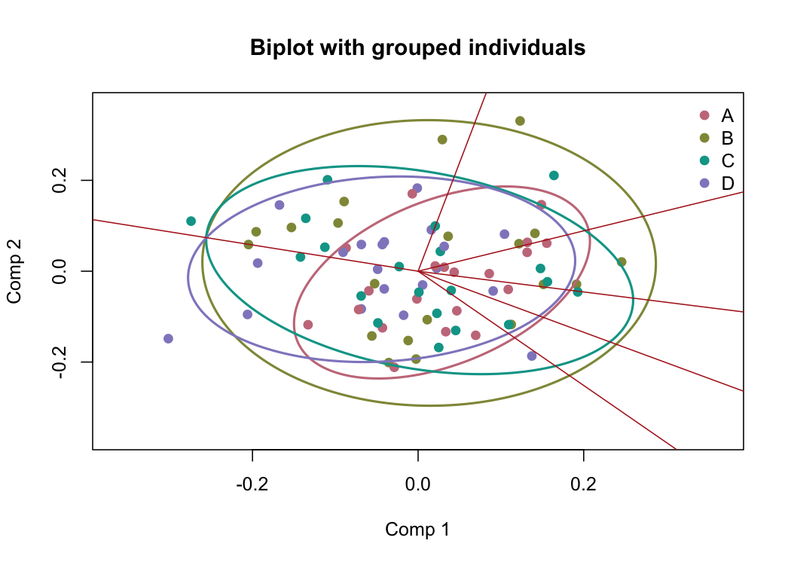{fig-alt="Bilot with groped individuals"}

### Ecology

[ambiR](https://cran.r-project.org/package=ambiR) v0.1.1: Provides functions to calculate [AZTI’s Marine Biotic Index](https://ambi.azti.es/) - AMBI of benthic fauna species according to their sensitivity to pollution. The Shannon Diversity Index H' and the Danish benthic fauna quality index DKI (Dansk Kvalitetsindeks) can also be calculated, as well as the multivariate M-AMBI index. See [Borja et al. (2000)](https://www.sciencedirect.com/science/article/abs/pii/S0025326X00000618?via%3Dihub) for background. There are four vignettes including [Get Started](https://cran.r-project.org/web/packages/ambiR/vignettes/ambiR.html) and [The AMBI index](https://cran.r-project.org/web/packages/ambiR/vignettes/background.html).

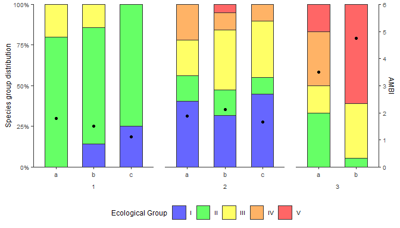{fig-alt="Plot of Species groub vs. Ecological Group"}

[SHARK4R](https://cran.r-project.org/package=SHARK4R) v1.0.3: Provides functions to retrieve, process, analyze, and quality-control marine physical, chemical, and biological data. The main focus is on Swedish monitoring data available through the [SHARK database](https://shark.smhi.se/en/), with additional API support for [Nordic Microalgae](https://nordicmicroalgae.org/), [Dyntaxa](https://artfakta.se/), World Register of Marine Species [WoRMS](https://www.marinespecies.org), [AlgaeBase](https://www.algaebase.org), OBIS [xylookup](https://iobis.github.io/xylookup/) web service, and Intergovernmental Oceanographic Commission (IOC) - UNESCO databases on [harmful algae](https://www.marinespecies.org/hab/) and [toxins](https://toxins.hais.ioc-unesco.org/). There are five vignettes including [Quality Control of SHARK4R Data](https://cran.r-project.org/web/packages/SHARK4R/vignettes/quality_control.html) and [Retrieve Data From SHARK](https://cran.r-project.org/web/packages/SHARK4R/vignettes/retrieve_shark_data.html).

### Econometrics

[gvcAnalyzer](https://cran.r-project.org/package=gvcAnalyzer) v0.1.1: Provides tools for decomposing Global Value Chain (GVC) participation and value-added trade. It implements the frameworks proposed by [Borin and Mancini (2023)](https://www.tandfonline.com/doi/abs/10.1080/09535314.2022.2153221) for source-based and sink-based decompositions, and by [Borin, Mancini, and Taglioni (2025)](https://academic.oup.com/wber/advance-article/doi/10.1093/wber/lhaf017/8237808) for tripartite and output-based GVC measures. There are three vignettes including an [Introduction](https://cran.r-project.org/web/packages/gvcAnalyzer/vignettes/gvcAnalyzer-intro.html) and [Trade vs Output Perspectives](https://cran.r-project.org/web/packages/gvcAnalyzer/vignettes/bm2023-vs-bm2025.html). 

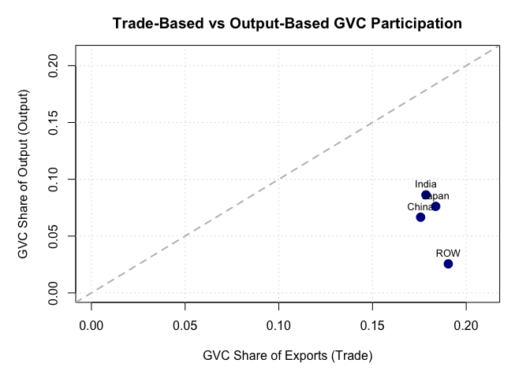{fig-alt="Plot of trade-based vs. output-based GVC participation"}

### Epidemiology

[MetaRVM](https://cran.r-project.org/package=MetaRVM) v1.0.1: Simulates respiratory virus epidemics using meta-population compartmental models. Following [Fadikar et. al. (2025)](https://www.medrxiv.org/content/10.1101/2025.05.05.25327021v1) it implements a stochastic SEIRD (Susceptible-Exposed-Infected-Recovered-Dead) framework with demographic stratification by age, race, and geographic zones that supports complex epidemiological scenarios including asymptomatic and presymptomatic transmission, hospitalization dynamics, vaccination schedules, and time-varying contact patterns via mixing matrices. There are four vignettes including [Getting Started]() and [Running a Simulation](https://cran.r-project.org/web/packages/MetaRVM/vignettes/running-a-simulation.html).

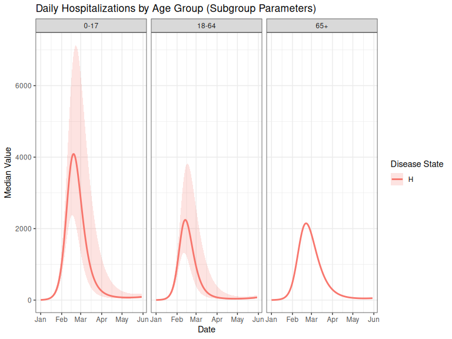{fig-alt="Plot of hospitialization days by age group"}

[sitrep](https://cran.r-project.org/package=sitrep) v0.4.0: Loads the complete sitrep ecosystem for applied epidemiology analysis. This package provides report templates and automatically loads companion packages, including `epitabulate` (for epidemiological tables), `epidict` (for data dictionaries), `epikit` (for epidemiological utilities), and `apyramid1 (for age-sex pyramids). There are seven vignettes including [Origin Story](https://cran.r-project.org/web/packages/sitrep/vignettes/Background.html) and [Guide: Measles Outbreak report](https://cran.r-project.org/web/packages/sitrep/vignettes/measles_intersectional_outbreak_guide.html).

### Genetics

[EZbakR](https://cran.r-project.org/package=EZbakR) v0.1.0: A complete rewrite and reimagining of `bakR`, [Vock et al. (2025)](https://journals.plos.org/ploscompbiol/article?id=10.1371/journal.pcbi.1013179), designed to support a wide array of analyses of nucleotide recoding RNA-seq datasets of any type, including TimeLapse-seq/SLAM-seq/TUC-seq, Start-TimeLapse-seq, TT-TimeLapse-seq, and subcellular NR-seq. It extends standard NR-seq standard NR-seq mutational modeling to support multi-label analyses, and implements an improved hierarchical model to better account for transcript-to-transcript variance in metabolic label incorporation, and also generalized dynamical systems modeling of NR-seq data to support analyses of premature mRNA processing and flow between subcellular compartments. There are seven vignettes including [Quickstart](https://cran.r-project.org/web/packages/EZbakR/vignettes/Quickstart.html) and [Linear Modeling](https://cran.r-project.org/web/packages/EZbakR/vignettes/Linear-modeling.html).

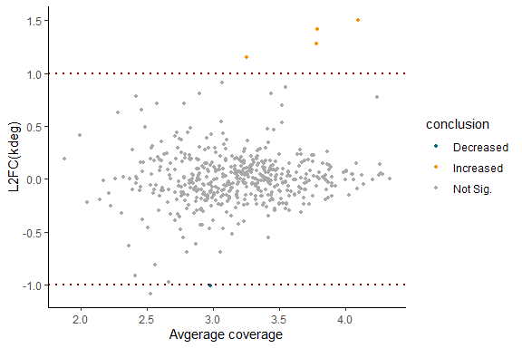{fig-alt="Volcano plot showing a comparative analysis"}

[gpyramid](https://cran.r-project.org/package=gpyramid) v0.0.1: Provides functins to identify efficient crossing schemes for gene pyramiding and calculates the cost of crossing in terms of the number of individuals and generations, which has been theoretically formulated by [Servin et al. (2004)](https://academic.oup.com/genetics/article-abstract/168/1/513/6059522?redirectedFrom=fulltext&login=false). The package has been designed for selecting appropriate parental genotypes and find the most efficient crossing scheme for gene pyramiding, especially for plant breeding. There is an [Introduction](https://cran.r-project.org/web/packages/gpyramid/vignettes/Introduction.html) and a [Tutorial](https://cran.r-project.org/web/packages/gpyramid/vignettes/Tutorial.html).

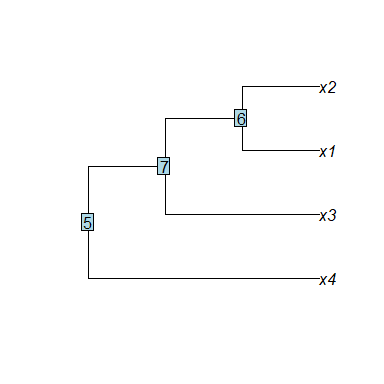{fig-alt="Example gene pyramid plot"}

[phylospatial](https://cran.r-project.org/package=phylospatial) v1.2.1: Provides functions to analyze spatial phylogenetic diversity patterns. Use your data on an evolutionary tree and geographic distributions of the terminal taxa to compute diversity and endemism metrics, test significance with null model randomization, analyze community turnover and biotic regionalization, and perform spatial conservation prioritizations. All functions support quantitative community data in addition to binary data. There are four vignettes including [phylospatial data](https://cran.r-project.org/web/packages/phylospatial/vignettes/phylospatial-data.html) and [Prioritization](https://cran.r-project.org/web/packages/phylospatial/vignettes/prioritization.html).

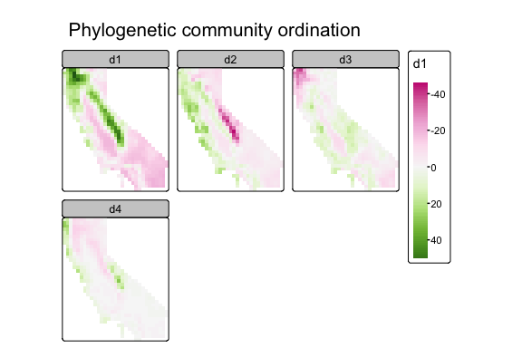{fig-alt="Plots of Phylogenetic community ordination for first four PCA values"}

### Genomics

[CimpleG](https://cran.r-project.org/package=CimpleG) v1.0.1: Provides a method for the detection of small CpG methylation signatures used for cell-type classification and deconvolution that is time efficient and performs as well as top performing methods for cell-type classification of blood cells and other somatic cells. Predictions are based on a single DNA methylation site per cell type (but users can also select more sites if they so wish). Users can train cell type classifiers and directly apply these in a deconvolution of cell mixes context. See Maié [et al. (2023)](https://link.springer.com/article/10.1186/s13059-023-03000-0) for details and the vignettes [Genetic signatures](https://cran.r-project.org/web/packages/CimpleG/vignettes/generate-signatures.html) an [Quickly save and load large objects](https://cran.r-project.org/web/packages/CimpleG/vignettes/save_load_objects.html).

### Machine Learning

[snic](https://cran.r-project.org/package=snic) v0.6.1: Implements the Simple Non-Iterative Clustering algorithm for superpixel segmentation of multi-band images, as introduced by [Achanta and Susstrunk (2017)](https://ieeexplore.ieee.org/document/8100003) and supports both standard image arrays and geospatial raster objects, with a design that can be extended to other spatial data frameworks. The algorithm groups adjacent pixels into compact, coherent regions based on spectral similarity and spatial proximity. A high-performance implementation supports images with arbitrary spectral bands. See the vignettes about [Arrays](https://cran.r-project.org/web/packages/snic/vignettes/snic-array-pipeline.html) and [SpatRaster](https://cran.r-project.org/web/packages/snic/vignettes/snic-spatraster-pipeline.html) segmentation pipelines.

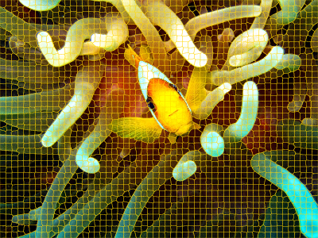{fig-alt="Clownfish image with superpixel segmentation boundaries overlaid."}

### Mathematics

[algebraic.dist](https://cran.r-project.org/package=algebraic.dist) v0.1.0: Provides an algebra over probability distributions enabling composition, sampling, and automatic simplification to closed forms. Supports normal, exponential, multivariate normal, and empirical distributions with operations like addition and subtraction that automatically simplify when mathematical identities apply (e.g., the sum of independent normal distributions is normal). 

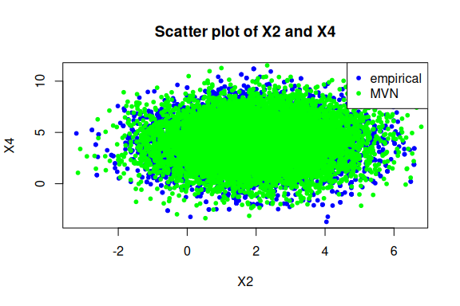{fig-alt="Scatter plot of sampled vs. computed distribution values"}

### Mediation Analysis

[wsMed](https://cran.r-project.org/package=wsMed) v1.0.2: Provides tools for within-subject mediation analysis using structural equation modeling to examine how changes in an outcome variable between two conditions are mediated through one or more variables. Supports within-subject mediation analysis using the `lavaan` package by [Rosseel (2012)](https://www.jstatsoft.org/article/view/v048i02), and extends Monte Carlo confidence interval estimation to missing data scenarios using the `semmcci` package by [Pesigan and Cheung (2023)](https://doi.org/10.3758%2Fs13428-023-02114-4). There are six vignettes including [wsMed](https://cran.r-project.org/web/packages/wsMed/vignettes/WsMed.html) and introduction, and [GenerateModelIP](https://cran.r-project.org/web/packages/wsMed/vignettes/GenerateModelP.html).

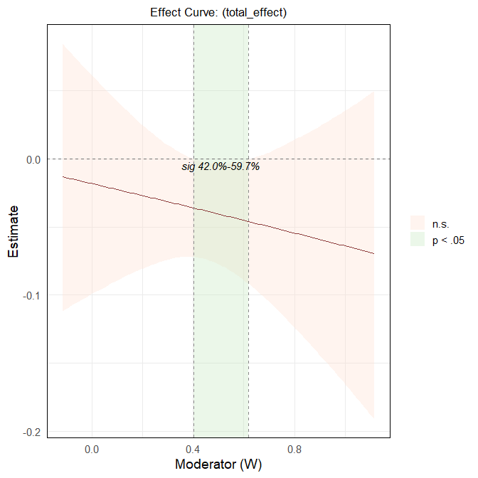{fig-alt="Plot of moderation curve"}

:::

::: {.column width="10%"}

:::

::: {.column width="45%"}

### Medical Statistics

[cifmodeling](https://cran.r-project.org/package=cifmodeling) v0.9.8: Implements a publication-ready toolkit for modern survival and competing risks analysis with a minimal, formula-based interface. Both nonparametric estimation and direct polytomous regression of cumulative incidence functions (CIFs) are supported. Functions estimate survival and CIF curves, produce high-quality graphics with risk tables, censoring and competing-risk marks, and multi-panel or inset layouts.  All core functions adopt a formula-and-data syntax and return tidy and extensible outputs. Key numerical routines are implemented in `C++`. There are seven vignettes including [Overview](https://cran.r-project.org/web/packages/cifmodeling/vignettes/v1_overview.html) and [Examples](https://cran.r-project.org/web/packages/cifmodeling/vignettes/v4_examples.html).

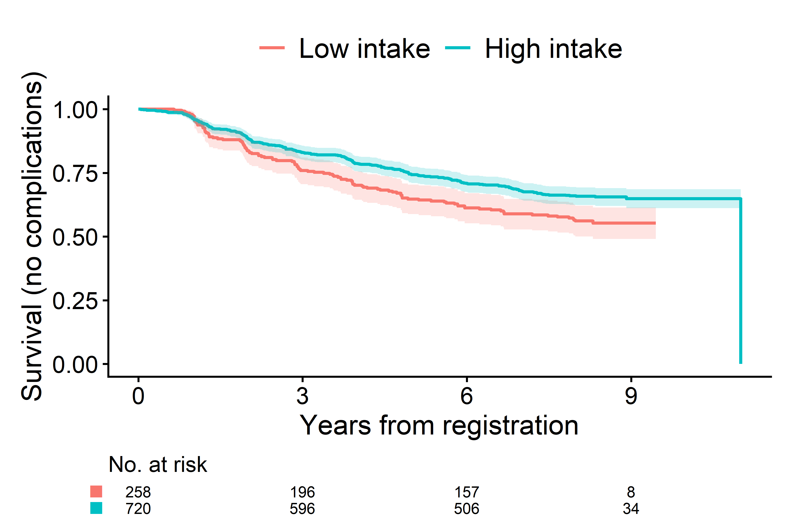{fig-alt="Example of a survivl curve"}

[eVCGsampler](https://cran.r-project.org/package=eVCGsampler) v0.9.2: Provides a principled framework for sampling Virtual Control Group (VCG) using energy distance-based covariate balancing and offers visualization tools to assess covariate balance and includes a permutation test to evaluate the statistical significance of observed deviations. See the [vignette](https://cran.r-project.org/web/packages/eVCGsampler/vignettes/eVCGsampler_user_guide.html)

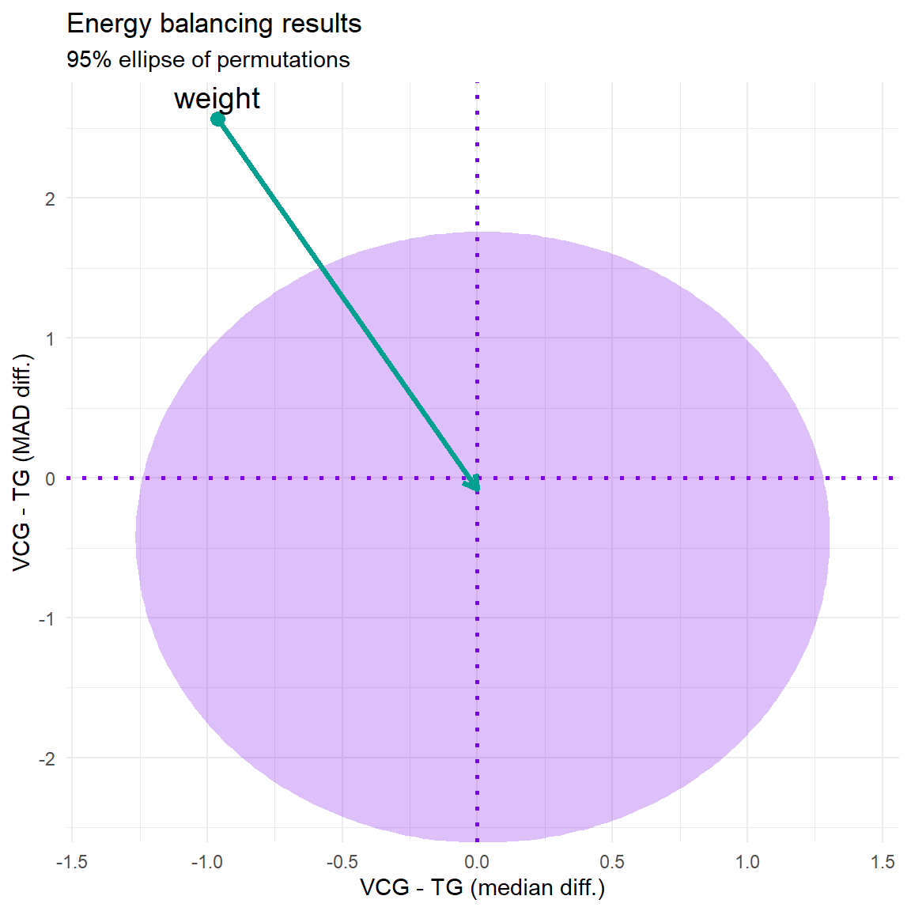{fig-alt="Plot of energy Balancing Results"}

[fgdiR](https://cran.r-project.org/package=fgdiR) v0.1.0: provides tools for computing the Functional Gait Deviation Index, a novel index for quantifying gait pathology using multivariate functional principal component analysis and supports analysis at the level of both legs combined, individual legs, and individual joints/planes. It includes functions for functional data preprocessing, multivariate functional principal component decomposition, FGDI computation, and visualisation of gait abnormality scores. See [Minhas et al. (2025)](https://www.tandfonline.com/doi/full/10.1080/02664763.2025.2514150) for background and the vignettes [Amputee Gait Analysis](https://cran.r-project.org/web/packages/fgdiR/vignettes/fgdiR-amutee.html) and [Parkinson Gait Analysis](https://cran.r-project.org/web/packages/fgdiR/vignettes/fgdiR-parkinson.html).

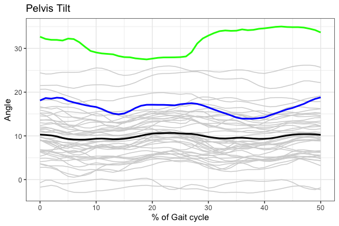{fig-alt="Plot of Pelvis Titl by % of Gait Cycle"}

### Statistics

[quantbayes](https://cran.r-project.org/package=quantbayes) v0.1.0: Implements the Quantification Evidence Standard algorithm for computing Bayesian evidence sufficiency from binary evidence matrices and provides posterior estimates, credible intervals, percentiles, and optional visual summaries. The method is universal, reproducible, and independent of any specific clinical or rule based framework. See [The Quantitative Omics Epidemiology Group et al. (2025)](https://www.medrxiv.org/content/10.64898/2025.12.02.25341503v3) for details and the [vignette](https://cran.r-project.org/web/packages/quantbayes/index.html) for examples. 

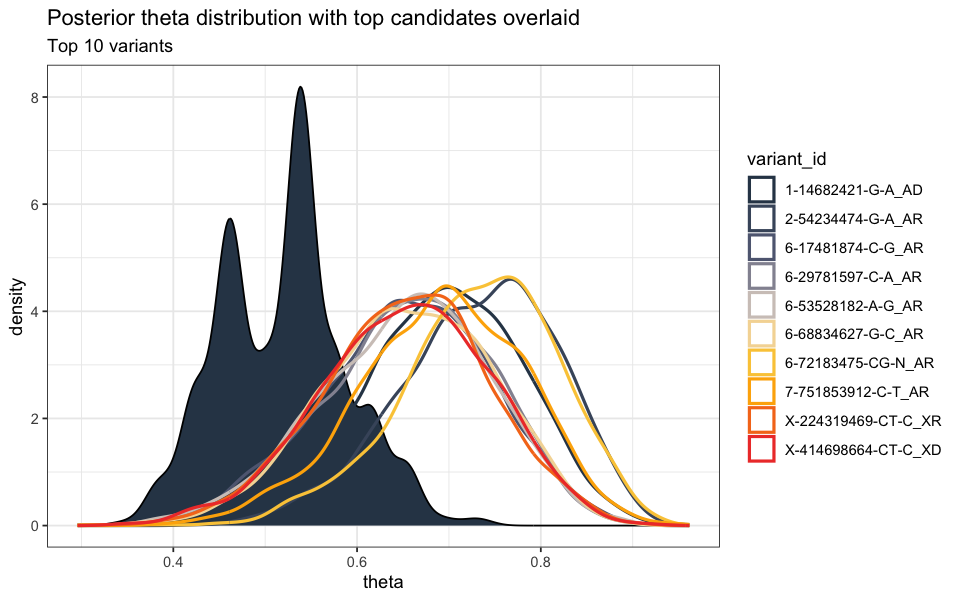{fig-alt="Plot of posterior theta distribution"}

[weightedsurv](https://cran.r-project.org/package=weightedsurv) v0.1.0: Provides survival analysis functions with support for time-dependent and subject-specific (e.g., propensity score) weighting. Implements weighted estimation for Cox models, Kaplan-Meier survival curves, and treatment differences with point-wise and simultaneous confidence bands. Includes restricted mean survival time comparisons evaluated across all potential truncation times with both point-wise and simultaneous confidence bands. See [Cole & Hernán (2004)](https://www.sciencedirect.com/science/article/abs/pii/S0169260703001378?via%3Dihub) for methodological background and the [vignette](https://cran.r-project.org/web/packages/weightedsurv/vignettes/weightedsurv_examples.html) for examples.

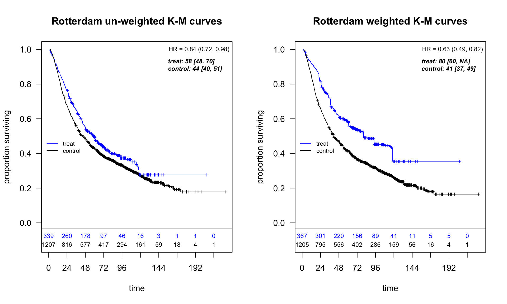{fig-alt="Plots of weighted and unweighted survival curves."}

### Time Series

[bpvars](https://cran.r-project.org/package=bpvars) v1.0: Provides Bayesian estimation and forecasting of dynamic panel data using Bayesian Panel Vector Autoregressions with hierarchical prior distributions. Models include country-specific VARs that share a global prior distribution that extend the model by [Jarociński (2010)](https://onlinelibrary.wiley.com/doi/10.1002/jae.1082). Functions provide model specification, estimation, and forecasting routines, facilitating coherent workflows and reproducibility and includes automated pseudo-out-of-sample forecasting and computation of forecasting performance measures and algorithms written in `C++`. See [README](https://cran.r-project.org/web/packages/bpvars/readme/README.html) to get started.

[gctsc](https://cran.r-project.org/package=gctsc) V0.1.3: Implements Gaussian copula models for count time series. Includes simulation utilities, likelihood approximation, maximum-likelihood estimation, residual diagnostics, and predictive inference. Implements the Time Series Minimax Exponential Tilting method, an adaptation of Minimax Exponential Tilting [Botev, 2017](https://academic.oup.com/jrsssb/article/79/1/125/7041924?login=false) and the Vecchia-based tilting framework of [Cao and Katzfuss (2025)](https://www.tandfonline.com/doi/full/10.1080/01621459.2025.2546586).  Also provides a linear-cost implementation of the Geweke–Hajivassiliou–Keane simulator inspired by [Masarotto and Varin (2012)](https://projecteuclid.org/journals/electronic-journal-of-statistics/volume-6/issue-none/Gaussian-copula-marginal-regression/10.1214/12-EJS721.full), and the Continuous Extension approximation of [Nguyen and De Oliveira (2025)](https://www.tandfonline.com/doi/full/10.1080/02664763.2025.2498502). See the [vignette](https://cran.r-project.org/web/packages/gctsc/vignettes/gctsc_vignette.html).

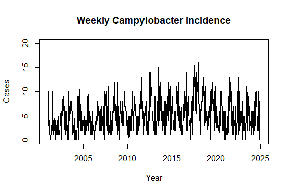{fig-alt="Plot of weeklt campylobacter incidence"}

### Visualization

[blockr.ggplot](https://cran.r-project.org/package=blockr.ggplot) v0.1.0: Extends `blockr.core` with interactive blocks for data visualization using `ggplot2`. Users can build charts through a graphical interface without writing code directly. Includes common chart types (bar charts, line charts, pie charts, scatter plots) as well as statistical plots (boxplots, histograms, density plots, violin plots) with rich customization options and intuitive user interfaces. See the [vignette](https://cran.r-project.org/web/packages/blockr.ggplot/vignettes/blockr-ggplot-showcase.html).

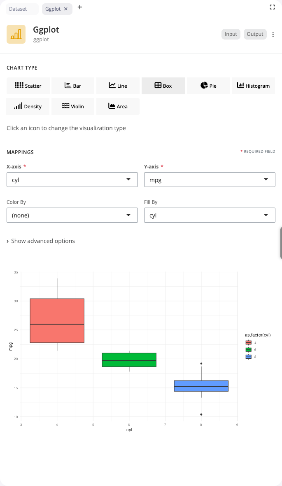{fig-alt="Example plot"}

[mapycusmaximus](https://cran.r-project.org/package=mapycusmaximus) v1.0.0: Provides focus-glue-context (FGC) fisheye transformations to two-dimensional coordinates and spatial vector geometries. Implements a smooth radial distortion that enlarges a focal region, transitions through a glue ring, and preserves outside context. Methods build on generalized fisheye views and focus+context mapping. See [Furnas (1986)](https://dl.acm.org/doi/10.1145/22339.22342), [Furnas (2006)](https://dl.acm.org/doi/10.1145/1124772.1124921), and [Yamamoto et al. (2009)](https://dl.acm.org/doi/10.1145/1653771.1653788) for details and the [vignette](https://cran.r-project.org/web/packages/mapycusmaximus/vignettes/Mapycus.html) for examples.

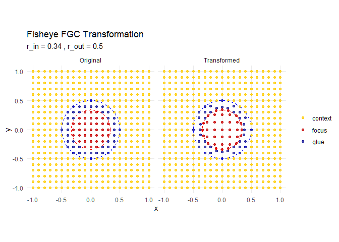{fig-alt="Plot of Fisheye transformation"}

:::

::::

