Two hundred forty-one of the new packages submitted to CRAN in January were still there in mid February. Here are my Top 40 picks in nineteen categories: Artificial Intelligence, Computational Methods, Data, Dynamical Systems, Ecology, Economics, Epidemiology, Finance, Genetics, Genomics, High Performance Computing,  Mathematics, Machine Learning, Medical Application, Networks, Statistics, Time Series, Utilities, and Visualization.

:::: {.columns}

::: {.column width="45%"}

### Artificial Intelligence

[kuzco](https://cran.r-project.org/package=kuzco) v0.1.0: Provides functions to make  computer vision tasks approachable in `R` by leveraging Large Language Models including fine-tuned prompts, boilerplate functions, and input/output helpers for common computer vision workflows, such as classifying and describing images. Functions are designed to take images as input and return structured data, helping users build practical applications with minimal code. There are four vignettes including [getting started](https://cran.r-project.org/web/packages/kuzco/vignettes/getting-started.html) and [batch image processing](https://cran.r-project.org/web/packages/kuzco/vignettes/batch-image-processing.html).

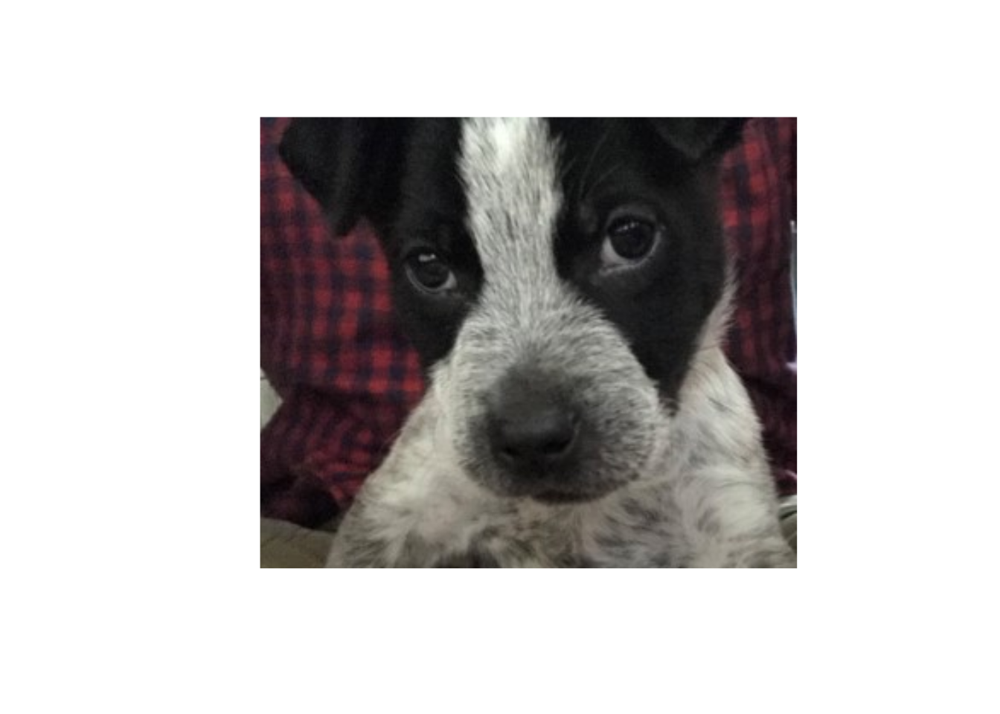{fig-alt="A sad puppy start with kuzco."}

### Computational Methods

[couplr](https://cran.r-project.org/package=couplr) v1.0.10: Functions designed for matching plots, sites, samples, or any pairwise optimization problem, solve optimal pairing and matching problems using linear assignment algorithms. Several algorithms are provided including Hungarian method [Kuhn (1955)](https://onlinelibrary.wiley.com/doi/10.1002/nav.3800020109), the Jonker-Volgenant shortest path algorithm [Jonker and Volgenant (1987)](https://link.springer.com/article/10.1007/BF02278710), and  the auction algorithm [(Bertsekas (1988)](https://link.springer.com/article/10.1007/BF02186476). There are six vignettes including [Quick Start](https://cran.r-project.org/web/packages/couplr/vignettes/getting-started.html) and [The Algorithm Collection](https://cran.r-project.org/web/packages/couplr/vignettes/algorithms.html).

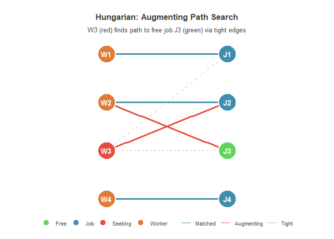{fig-alt="Illustration of Hungarian method for optimal matching of two sets of points"}

[hexify](https://cran.r-project.org/package=hexify) v0.3.10: Implements the ISEA discrete global grid system ([Sahr, White and Kimerling (2003)](https://utppublishing.com/doi/10.3138/27H7-8K88-4882-1752)). Includes a fast `C++` core for projection and aperture quantization, and `sf`/`terra`-compatible R wrappers for grid generation and coordinate assignment. Output is compatible with `dggridR` for interoperability. There are three vignettes: [Quick Start](https://cran.r-project.org/web/packages/hexify/vignettes/quickstart.html), [Visualization](https://cran.r-project.org/web/packages/hexify/vignettes/visualization.html), and [Practical Workflows](https://cran.r-project.org/web/packages/hexify/vignettes/workflows.html).

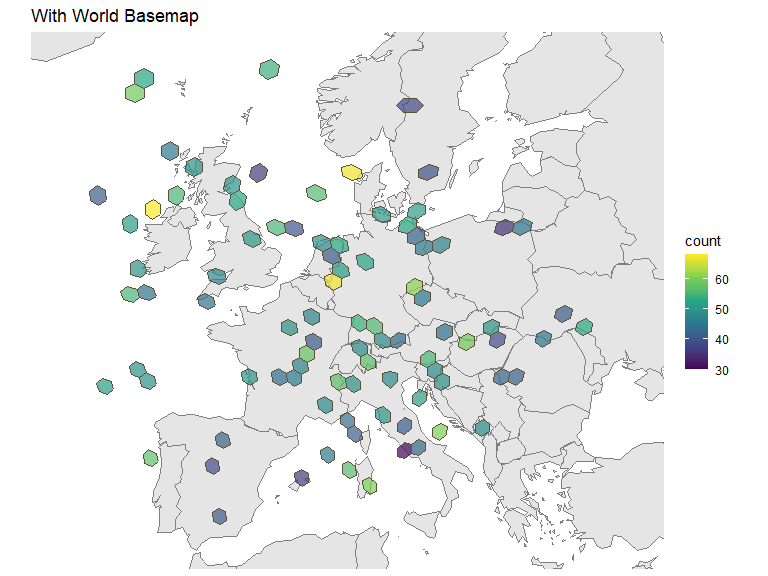{fig-alt="Map of Europe with hexagonal grid overlay"}

### Data

[dsBaseClient](https://cran.r-project.org/package=dsBaseClient) v6.3.5: Provides  client side base functions for the [DataSHIELD](https://wiki.datashield.org/en/home) software suite which allows non-disclosive federated analysis on sensitive data. Functions  have been designed to only share non disclosive summary statistics, with built in automated output checking based on statistical disclosure control with data sites setting the threshold values for the automated output checks. See [README](https://wiki.datashield.org/en/home) to get started.

[mongolstats](https://cran.r-project.org/package=mongolstats) v0.1.1: Provides a `tidyverse`-friendly client for the National Statistics Office of Mongolia [PXWeb API](https://data.1212.mn/) with helpers to discover tables, variables, and fetch statistical data. Also includes utilities to retrieve Mongolia administrative boundaries (ADM0-ADM2) as `sf` objects from open sources for mapping and spatial analysis. There are five vignettes including [Getting Started](https://cran.r-project.org/web/packages/mongolstats/vignettes/getting-started.html) and [Discovering Public Health Data](https://cran.r-project.org/web/packages/mongolstats/vignettes/discovery.html).

[read.abares](https://cran.r-project.org/package=read.abares) v2.0.0: Provides function to download and import agricultural data from the Australian Bureau of Agricultural and Resource Economics and Sciences [ABARES](https://www.agriculture.gov.au/abares) and Australian Bureau of Statistics [ABS](https://www.abs.gov.au). Data types serviced include spreadsheets, comma separated value (CSV) files, geospatial data including shape files and geotiffs covering topics including broadacre crops, livestock, soil data, commodities and more. See the vignettes [Setting Global Options](https://cran.r-project.org/web/packages/read.abares/vignettes/options.html) and [Working with spatial data](https://cran.r-project.org/web/packages/read.abares/vignettes/read.abares.html).

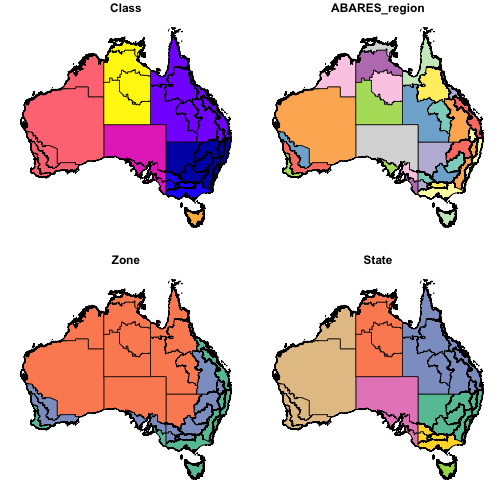{fig-alt="Maps showing ABARES regions"}

### Dynamical Systems

[blvim](https://cran.r-project.org/package=blvim) v0.1.1: Provides functions to estimate Boltzmann–Lotka–Volterra (BLV) interaction model efficiently. Enables programmatic and graphical exploration of the solution space of BLV models when parameters are varied.  See [Wilson, A. (2008)](https://royalsocietypublishing.org/rsif/article-abstract/5/25/865/65383/Boltzmann-Lotka-and-Volterra-and-spatial?redirectedFrom=fulltext) for background and the vignettes: [Systematic exploration of the BLV solution space]() and [Theoretical Background](https://cran.r-project.org/web/packages/blvim/vignettes/theory.html).

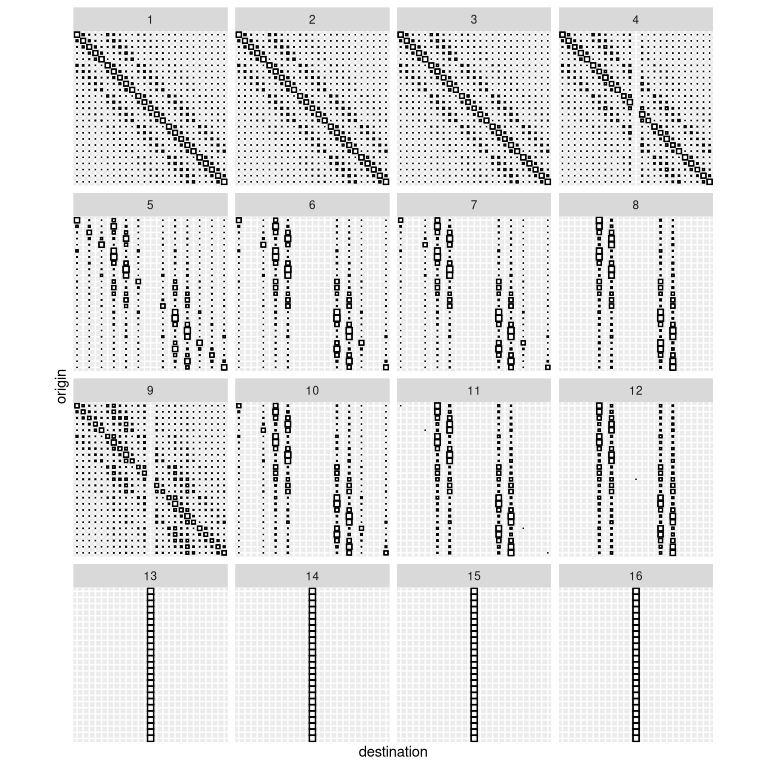{fig-alt="Plots showing cluster variability"}

### Ecology

[mrangr](https://CRAN.R-project.org/package=mrangr) v1.0.1: Implements a mechanistic, and spatially explicit simulator of metacommunities and extends the [`rangr`](https://github.com/ropensci/rangr) by adding the ability to simulate multiple species interacting through an asymmetric matrix of pairwise relationships, allowing users to model all types of biotic interactions — competitive, facilitative, or neutral — within spatially explicit virtual environments. See the [vignette](https://cran.r-project.org/web/packages/mrangr/vignettes/mrangr.html).

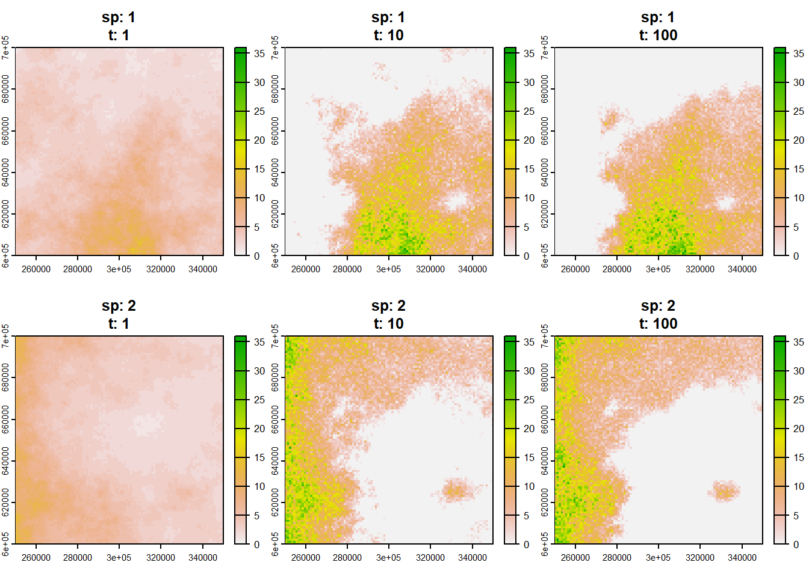{fig-alt="A sequence of plots that step through a species simulation"}

### Epidemiology

[rsurvstat](https://cran.r-project.org/package=rsurvstat) v0.1.4 Provides an interface to the [SurvStat](https://tools.rki.de/SurvStat/SurvStatWebService.svc) web service from the [Robert Koch Institute](https://www.rki.de/EN/Home/home_node.html) allowing downloads of disease time series stratified by pathogen type and subtype, age, and geography from notifiable disease reports in Germany. See the [vignette](https://cran.r-project.org/web/packages/rsurvstat/vignettes/rsurvstat.html).

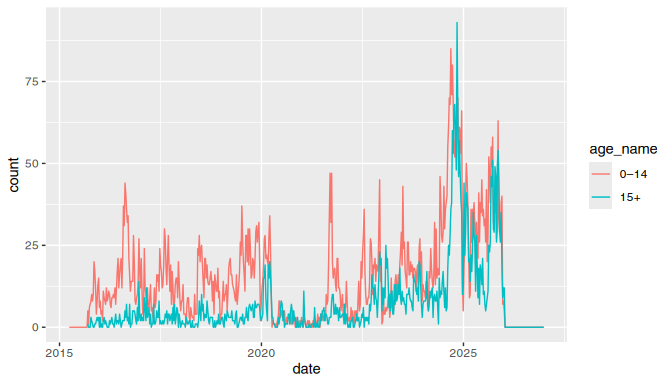{fig-alt="Plot of weekly incidence of Enterovirus"}

### Economics

[emburden](https://cran.r-project.org/package=emburden) v0.6.1: Provides functions to calculate and analyze household energy burden using the Net Energy Return aggregation methodology. Functions support weighted statistical calculations across geographic and demographic cohorts, with utilities for formatting results into publication-ready tables. Methods are based on [Scheier & Kittner (2022)](https://www.nature.com/articles/s41467-021-27673-y). There are three vignettes including [Getting Started](https://cran.r-project.org/web/packages/emburden/vignettes/getting-started.html) and [Temporal Energy Burden Analysis](https://cran.r-project.org/web/packages/emburden/vignettes/jss-emburden.html).

### Finance

[cre.dcf](https://cran.r-project.org/package=cre.dcf) v0.0.3: Provides  utilities to build unlevered and levered discounted cash flow tables for commercial real estate assets. Functions generate bullet and amortising debt schedules, compute credit metrics such as debt coverage ratios, debt service coverage ratios, interest coverage ratios, debt yield ratios, and forward loan-to-value ratios based on net operating income. The toolkit evaluates refinancing feasibility under alternative market scenarios and supports end-to-end scenario execution. There are nine vignettes including [Getting Started](https://cran.r-project.org/web/packages/cre.dcf/vignettes/getting-started.html) and [Investment styles panorama](https://cran.r-project.org/web/packages/cre.dcf/vignettes/investment-styles-panorama.html).

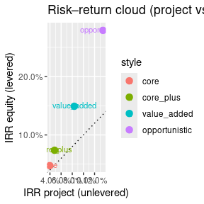{fig-alt="Plot of risk return by investment style"}

[OptimalBinningWoE](https://cran.r-project.org/package=OptimalBinningWoE) v1.0.8 Implements 36 high-performance binning algorithms for Weight of Evidence transformation in credit scoring and risk modeling including advanced methods such as Mixed Integer Linear Programming, Genetic Algorithms, Simulated Annealing, and Monotonic Regression. Features automatic method selection based on information value  maximization, strict monotonicity enforcement, and efficient handling of large datasets. Fully integrated with the `tidymodels` ecosystem for building robust machine learning pipelines. Based on methods described in [Siddiqi (2006)](https://onlinelibrary.wiley.com/doi/book/10.1002/9781119201731) and [Navas-Palencia (2020)](https://arxiv.org/abs/2001.08025). The [vignette](https://cran.r-project.org/web/packages/OptimalBinningWoE/vignettes/introduction.html) demonstrates practical applications using real-world credit data.

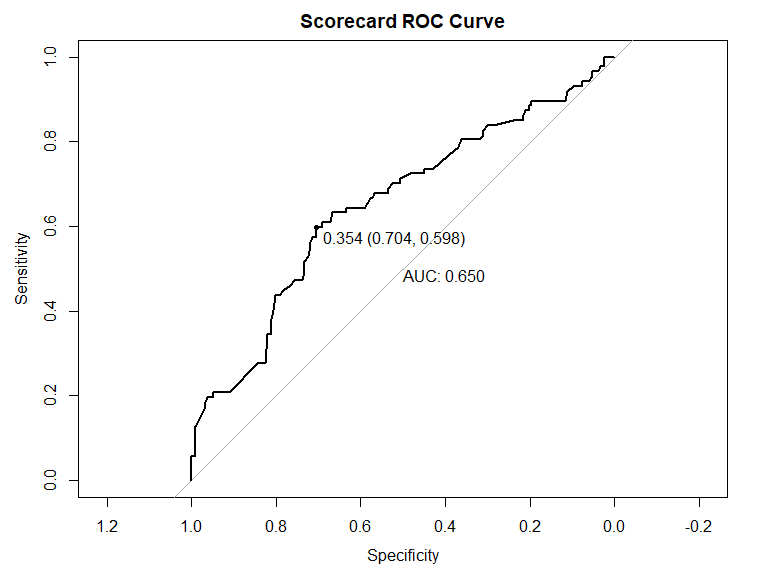{fig-alt="Plot of Scorecard ROC curve with optimal binning"}
"}

### Genetics

[bifrost](https://cran.r-project.org/package=bifrost) v0.1.3: Implements methods for detecting and visualizing cladogenic shifts in multivariate trait data on phylogenies. Implements penalized-likelihood multivariate generalized least squares models, enabling analyses of high-dimensional trait datasets and large trees. Includes a greedy step-wise shift-search algorithm following approaches developed in [Smith et al. (2023)](https://nph.onlinelibrary.wiley.com/doi/10.1111/nph.19099), [Berv et al. (2024)](https://www.science.org/doi/10.1126/sciadv.adp0114), and methods described in [Clavel et al. (2019)](https://academic.oup.com/sysbio/article-abstract/68/1/93/5040209?redirectedFrom=fulltext&login=false). See the [vignette](https://cran.r-project.org/web/packages/bifrost/vignettes/jaw-shape-vignette.html).

{fig-alt="Plot sgowing phylogenetic traitgram of the first principal component (PC1) of lower jaw shape in early osteichthyans (bony fishes)"}

[visPedigree](https://cran.r-project.org/package=visPedigree) v1.0.1: Provides tools for tidying, analyzing, and visualizing animal pedigrees by modeling pedigrees as directed acyclic graphs. This ensures robust loop detection, efficient generation assignment, and optimal sub-population splitting. Key features include standardizing pedigree formats, flexible ancestry tracing, and generating legible vector-based PDF graphs. A unique compaction algorithm enables the visualization of massive pedigrees by grouping full-sib families. There are three vignettes including [How to draw a pedigree](https://cran.r-project.org/web/packages/visPedigree/vignettes/draw-pedigree.html) and [Calculation and visualization of relationship matrix](https://cran.r-project.org/web/packages/visPedigree/vignettes/relationship-matrix.html).

{fig-alt="Pedigree plot"}

### Genomics

[OmicNetR](https://cran.r-project.org/package=OmicNetR) v0.1.1: Provides an end-to-end workflow for integrative analysis of two omics layers using sparse canonical correlation analysis, including sample alignment, feature selection, network edge construction, and visualization of gene-metabolite relationships. The underlying methods are based on penalized matrix decomposition and sparse CCA [Witten, Tibshirani and Hastie (2009)](https://academic.oup.com/biostatistics/article-abstract/10/3/515/293026?redirectedFrom=fulltext&login=false) with design principles inspired by multivariate integrative frameworks such as mixOmics [Rohart et al. (2017)](https://journals.plos.org/ploscompbiol/article?id=10.1371/journal.pcbi.1005752). See the [vignette](https://cran.r-project.org/web/packages/OmicNetR/vignettes/OmicNetR-intro.html).

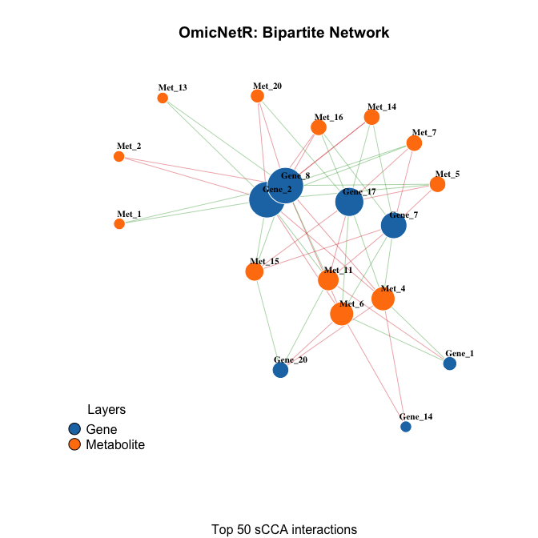{fig-alt="Example plot of bipartite omic data"}

### High Performance Computing

[futurize](https://cran.r-project.org/package=futurize) v0.1.0: Provides a straightforward path to scalable parallel computing via the [`future` ecosystem](https://journal.r-project.org/articles/RJ-2021-048/index.html). The `futurize()` function which transpiles calls to sequential map-reduce functions is combined with R's native pipe operator to provide a way for speeding up iterative computations with minimal refactoring, e.g. `lapply(xs, fcn) |> futurize()`, `purrr::map(xs, fcn) |> futurize()`, and `foreach::foreach(x = xs) %do% { fcn(x) } |> futurize()`. Other map-reduce packages that can be "futurized" are `BiocParallel`, `plyr`, and `crossmap`. There is also support for growing set of domain-specific packages, including `boot`, `glmnet`, `mgcv`, `lme4`, and `tm`. See [README]() to get started. There are twelve vignettes including [Parallelize base-R apply functions](https://cran.r-project.org/web/packages/futurize/vignettes/futurize-11-apply.html) and [Parallelize `purrr` functions](https://cran.r-project.org/web/packages/futurize/vignettes/futurize-21-purrr.html).

### Mathematics

[codyna](https://cran.r-project.org/package=codyna) v0.1.0: Perform analysis of complex dynamic systems with a focus on the temporal unfolding of patterns, changes, and state transitions in behavioral data. Supports both time series and sequence data and provides tools for the analysis and visualization of complexity, pattern identification, trends, regimes, sequence typology as well as early warning signals. See the [vignette](https://cran.r-project.org/web/packages/codyna/vignettes/codyna.html).

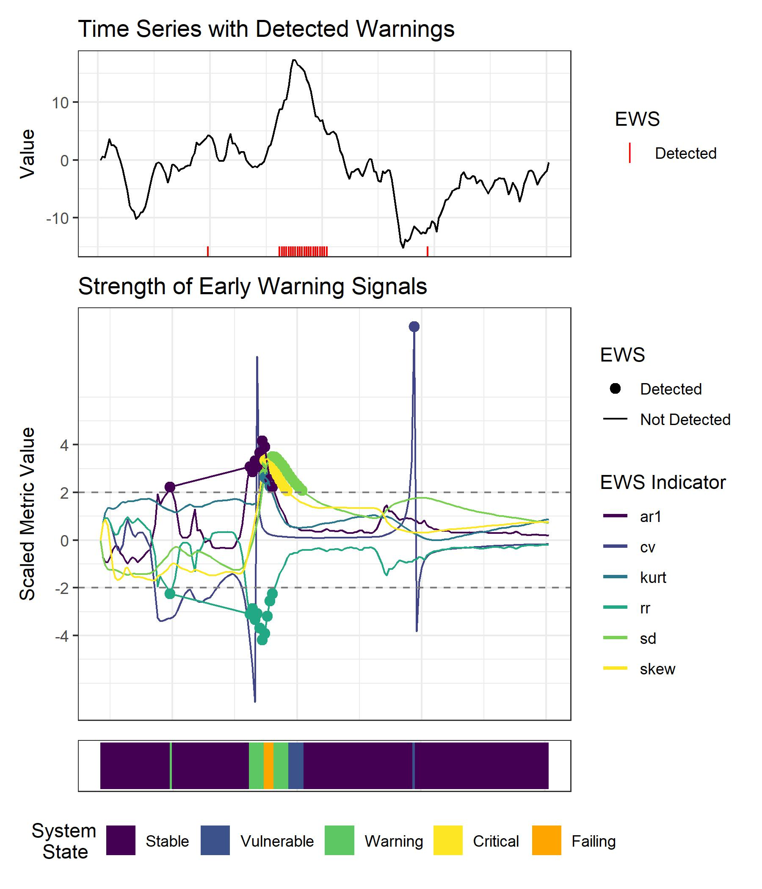{fig-alt="Plot of time series with detected warnings"}

[EmpiricalDynamics](https://cran.r-project.org/package=EmpiricalDynamics) v0.1.2: Implements a comprehensive toolkit for discovering differential and difference equations from empirical time series data using symbolic regression. The package implements a complete workflow from data preprocessing including Total Variation Regularized differentiation for noisy economic data, visual exploration of dynamical structure, and symbolic equation discovery via genetic algorithms. Functions leverage a high-performance `Julia` backend, `SymbolicRegression.jl` to provide industrial-grade robustness, physics-informed constraints, and rigorous out-of-sample validation. Designed for economists, physicists, and researchers studying dynamical systems from observational data. See the [vignette](https://cran.r-project.org/web/packages/EmpiricalDynamics/vignettes/getting-started.html).

:::

::: {.column width="10%"}

:::

::: {.column width="45%"}

### Machine Learning

[multiRL](https://cran.r-project.org/package=multiRL) v0.2.3: Provides general-purpose toolbox for implementing Rescorla-Wagner models in multi-armed bandit tasks. As the successor and functional extension of the `binaryRL` package, `multiRL` modularizes the Markov Decision Process (MDP) into six core components that enable constructing custom models via intuitive if-else syntax and define latent learning rules for agents. See [Wilson & Collins (2019)](https://elifesciences.org/articles/49547) and look [here](https://yuki-961004.github.io/multiRL/) for an overview.

[rCISSVAE](https://cran.r-project.org/package=rCISSVAE) v0.0.4: Implements the clustering-Informed Shared-Structure Variational Autoencoder, a deep learning framework for missing data imputation introduced in [Khadem Charvadeh et al. (2025](https://onlinelibrary.wiley.com/doi/10.1002/sim.70335). The model accommodates all three types of missing data mechanisms: Missing Completely At Random, Missing At Random, and Missing Not At Random. There are seven vignettes including a [quick start guide](https://cran.r-project.org/web/packages/rCISSVAE/vignettes/vignette.html) and [Handling Binary and Categorical Variables](https://cran.r-project.org/web/packages/rCISSVAE/vignettes/binary_variables_tutorial.html).

[slideimp](https://cran.r-project.org/package=slideimp) v0.5.4: Provides fast k-nearest neighbors (K-NN) and principal component analysis (PCA) imputation algorithms for missing values in high-dimensional numeric matrices, i.e., epigenetic data. For extremely high-dimensional data with ordered features, a sliding window approach for K-NN or PCA imputation is provided. Additional features include group-wise imputation (e.g., by chromosome), hyperparameter tuning with repeated cross-validation, multi-core parallelization, and optional subset imputation. See [Josse and Husson (2016)](https://www.jstatsoft.org/article/view/v070i01) for background and the [vignette](https://cran.r-project.org/web/packages/slideimp/vignettes/slideimp.html) for an example.

[SportMiner](https://cran.r-project.org/package=SportMiner) v0.1.0: Provides a toolkit for mining, analyzing, and visualizing scientific literature in sport science and includes functions for retrieving abstracts from [Scopus](https://www.elsevier.com/products/scopus), preprocessing text data, performing advanced topic modeling using Latent Dirichlet Allocation, Structural Topic Models, and Correlated Topic Models, and for creating publication-ready visualizations including keyword co-occurrence networks and topic trends. See [Blei et al. (2003)](https://www.jmlr.org/papers/volume3/blei03a/blei03a.pdf), [Roberts et al. (2014)](https://onlinelibrary.wiley.com/doi/10.1111/ajps.12103), and [Blei and Lafferty (2007)](https://projecteuclid.org/journals/annals-of-applied-statistics/volume-1/issue-1/A-correlated-topic-model-of-Science/10.1214/07-AOAS114.full) for background. There are two vignettes: [Getting Started](https://cran.r-project.org/web/packages/SportMiner/vignettes/getting-started.html) and [Text Mining and Topic Modeling for Sport Science Literature](https://cran.r-project.org/web/packages/SportMiner/vignettes/SportMiner-JSS.html).

[xplainfi](https://cran.r-project.org/package=xplainfi) v1.0.0: Provides a consistent interface for common feature importance methods as described in [Ewald et al. (2024)](https://link.springer.com/chapter/10.1007/978-3-031-63797-1_22) including permutation feature importance, conditional and relative feature importance, leave one covariate out, and Shapley additive global importance as well as feature sampling mechanisms to support conditional importance methods. See the vignettes [Getting Started](https://cran.r-project.org/web/packages/xplainfi/vignettes/xplainfi.html), [Feature Samplers](https://cran.r-project.org/web/packages/xplainfi/vignettes/feature-samplers.html), and [Simulation Settings](https://cran.r-project.org/web/packages/xplainfi/vignettes/simulation-settings.html).

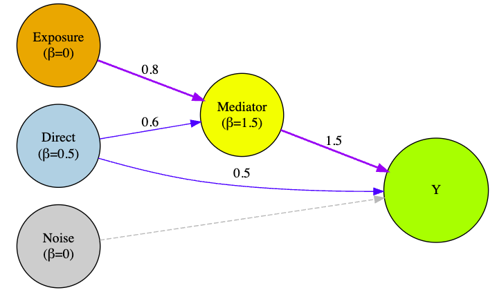{fig-alt="DAG for mediated effects DGP"}

### Medical Applications

[autoFlagR](https://cran.r-project.org/package=autoFlagR) v1.0.0: Provides automated data quality auditing using unsupervised machine learning and AI-driven anomaly detection for data quality assessment. Primarily designed for Electronic Health Records (EHR) data, with benchmarking capabilities for validation and publication. Methods based on: [Liu et al. (2008)](https://ieeexplore.ieee.org/document/4781136) and  [Breunig et al. (2000)](https://dl.acm.org/doi/10.1145/342009.335388). There are three vignettes including [Getting Started](https://cran.r-project.org/web/packages/autoFlagR/vignettes/getting-started.html) and [Healthcare Data Quality Example](https://cran.r-project.org/web/packages/autoFlagR/vignettes/healthcare-example.html).

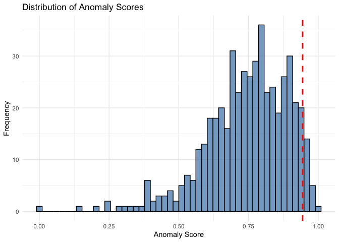{fig-alt="Distribution of Anomaly Scores"}

[repfun](https://cran.r-project.org/package=repfun) v0.1.2: Provides functions to mimic the style of traditional reporting macros for clinical trials. The purpose is to generate tables, listings and figures that support clinical research. This package is well suited for firms or individuals who wish to incorporate `R` without changing their ways of working as it follows a traditional clinical research workflow. Invoke functions (instead of macros) to summarize data and produce formatted reports. This package differs from others in that it includes tools (wrappers) for both analyzing and reporting data. There are twenty-seven vignettes including [Global Reporting Setup](https://cran.r-project.org/web/packages/repfun/vignettes/Global-Reporting-Setup.html) and [SAS Type Variable Expansion](https://cran.r-project.org/web/packages/repfun/vignettes/SAS-Type-Variable-Expansion.html).

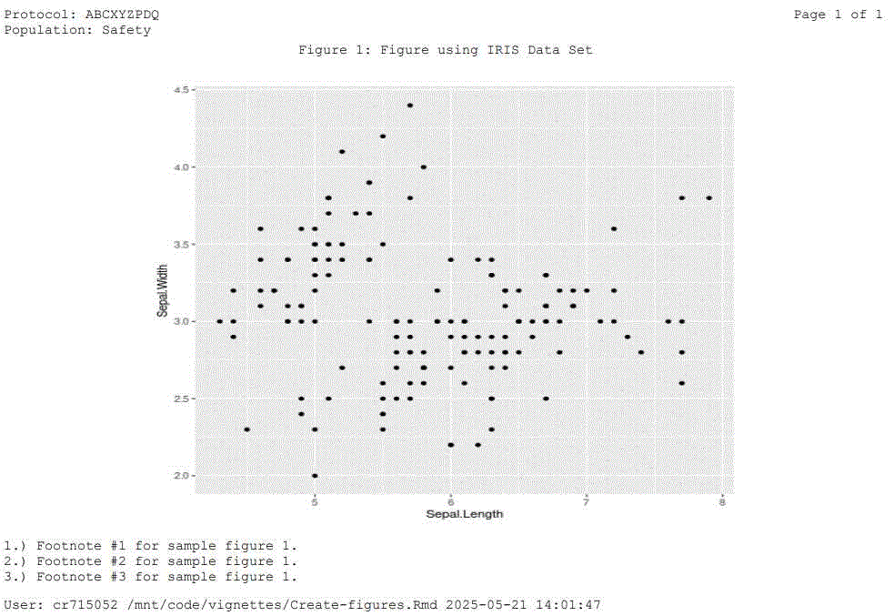{fig-alt="R plot with clinical trial style footnotes and formatting"}

### Networks

[flownet](https://cran.r-project.org/package=flownet) v0.1.2: Provides high-performance tools for transport modeling: network processing, route enumeration, and traffic assignment. The package implements the Path-Sized Logit model for traffic assignment [Ben-Akiva and Bierlaire (1999)](https://link.springer.com/chapter/10.1007/978-1-4615-5203-1_2), an efficient route enumeration algorithm, and provides powerful utility functions for (multimodal) network generation, consolidation/contraction, and/or simplification. See the [vignette](https://cran.r-project.org/web/packages/flownet/vignettes/introduction.html).

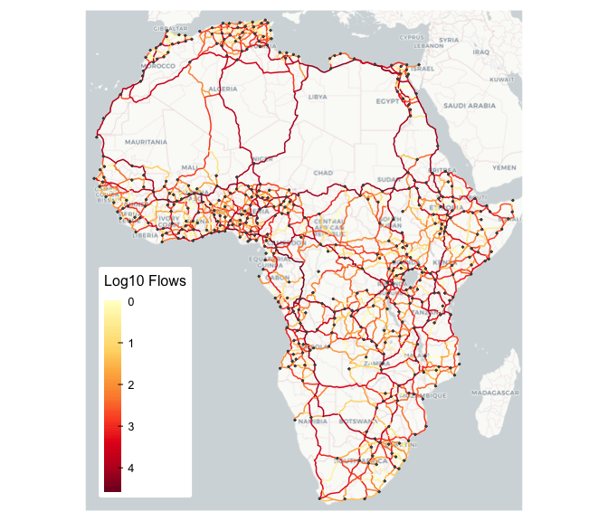{fig-alt="Visualization of assigned flows in a network"}

### Statistics

[bayesDiagnostics](https://cran.r-project.org/package=bayesDiagnostics) v0.1.0: Provides comprehensive tools for Bayesian model diagnostics and comparison including prior sensitivity analysis, posterior predictive checks [Gelman et al. (2013)](https://www.taylorfrancis.com/books/mono/10.1201/b16018/bayesian-data-analysis-david-dunson-donald-rubin-john-carlin-andrew-gelman-hal-stern-aki-vehtari), advanced model comparison using Pareto-smoothed importance sampling leave-one-out cross-validation [Vehtari et al. (2017)](https://link.springer.com/article/10.1007/s11222-016-9696-4), convergence diagnostics, and prior elicitation tools. Integrates with `brms`, `rstan`, and `rstanarm` packages. See [README](https://cran.r-project.org/web/packages/bayesDiagnostics/readme/README.html) to get started and the [vignette](https://cran.r-project.org/web/packages/bayesDiagnostics/vignettes/introduction-to-bayesDiagnostics.html) for an introduction.

[gradLasso](https://cran.r-project.org/package=gradLasso) v0.1.1: Implements LASSO regression using gradient descent with support for Gaussian, Binomial, Negative Binomial, and Zero-Inflated Negative Binomial (ZINB) families. Features cross-validation for determining lambda, stability selection, and bootstrapping for confidence intervals. Methods described in [Tibshirani (1996)](https://academic.oup.com/jrsssb/article/58/1/267/7027929?login=false) and [Meinshausen and Buhlmann (2010)](https://academic.oup.com/jrsssb/article-abstract/72/4/417/7076513?redirectedFrom=fulltext&login=false). Look [here](https://github.com/ddefranza/gradLasso) for a quickstart and see the [vignette](https://cran.r-project.org/web/packages/gradLasso/vignettes/intro.html) for an introduction.

{fig-alt="Stabiity selection Plot"}

[mfcurve](https://cran.r-project.org/package=mfcurve) v1.0.2: Implements multi-factor curve analysis for grouped data replicating and extending the functionality of the the `Stata mfcurve`. See [Krähmer (2023)](https://ideas.repec.org/c/boc/bocode/s459224.html) and [Simonsohn, Simmons, and Nelson (2020)](https://www.nature.com/articles/s41562-020-0912-z) for background. Functions for preprocessing, statistical testing, and visualization of results with confidence intervals are included. There is an [Introduction](https://cran.r-project.org/web/packages/mfcurve/vignettes/mfcurve-intro.html).

{fig-alt="Multi-factor curve analysis plot with confidence intervals"}

[NMAR](https://cran.r-project.org/package=NMAR) v0.1.2: Implements methods to estimate finite-population parameters under nonresponse that are not missing at random. Incorporates auxiliary information and user-specified response models, and supports independent samples and complex survey designs via objects from the `survey` package. See [Qin, Leung and Shao (2002)](https://www.tandfonline.com/doi/abs/10.1198/016214502753479338) and [Riddles, Kim and Im (2016)](https://academic.oup.com/jssam/article-abstract/4/2/215/2580514?redirectedFrom=fulltext&login=false) for background. There are five vignettes including [exptilt nonparam theory](https://cran.r-project.org/web/packages/NMAR/vignettes/exptilt_nonparam_theory.html) and [Empirical Likelihood](https://cran.r-project.org/web/packages/NMAR/vignettes/tutorial_empirical_likelihood.html).

[pmrm](https://cran.r-project.org/package=pmrm) v0.0.2: A progression model for repeated measures is a continuous-time nonlinear mixed-effects model for longitudinal clinical trials in progressive diseases. Unlike mixed models for repeated measures which estimate treatment effects as linear combinations of additive effects on the outcome scale, PMRMs characterize treatment effects in terms of the underlying disease trajectory yielding clinically interpretable quantities. See [Raket (2022)](https://onlinelibrary.wiley.com/doi/10.1002/sim.9581) and [Kristensen (2016)](https://www.jstatsoft.org/article/view/v070i05) for background. There are three vignettes: [Models](https://cran.r-project.org/web/packages/pmrm/vignettes/models.html), [Usage](https://cran.r-project.org/web/packages/pmrm/vignettes/usage.html) and [Validation](https://cran.r-project.org/web/packages/pmrm/vignettes/validation.html).

{fig-alt="Predictions by trial arm"}

[RSTr](https://cran.r-project.org/package=RSTr) v1.1.4: Implements a Gibbs Sampler for Poisson or Binomial discrete spatial data for a variety of Spatiotemporal Conditional Autoregressive (CAR) models. Includes measures to prevent estimate over-smoothing through a restriction of model informativeness for select models. Also provides tools to load output and get median estimates. Methods are from [Besag, York, and Mollié (1991)](https://link.springer.com/article/10.1007/BF00116466), [Gelfand and Vounatsou (2003)](https://academic.oup.com/biostatistics/article-abstract/4/1/11/246085?redirectedFrom=fulltext&login=false), [Quick et al. (2017)](https://projecteuclid.org/journals/annals-of-applied-statistics/volume-11/issue-4/Multivariate-spatiotemporal-modeling-of-age-specific-stroke-mortality/10.1214/17-AOAS1068.full), and [Quick et al. (2021)](https://www.sciencedirect.com/science/article/abs/pii/S1877584521000198?via%3Dihub). There are twelve vignettes including an [Introduction](https://cran.r-project.org/web/packages/RSTr/vignettes/RSTr.html) and the [CAR Models](https://cran.r-project.org/web/packages/RSTr/vignettes/RSTr-car.html).

[uniLasso](https://cran.r-project.org/package=uniLasso) v2.11: Fits a univariate-guided sparse regression (lasso), by a two-stage procedure. The first stage fits p separate univariate models to the response. The second stage gives more weight to the more important univariate features, and preserves their signs. It returns an objects that inherit from class `glmnet`. See [Chatterjee, Hastie and Tibshirani (2025)](https://hdsr.mitpress.mit.edu/pub/3i97j340/release/4) for details.

### Time Series

[rjd3toolkit](https://cran.r-project.org/package=rjd3toolkit) v3.6.0: Implements an `R` interface to [`JDemetra+ 3.x`](https://github.com/jdemetra) `R` ecosystem of time series analysis software which provides functions to create outlier regressors, define calendar regressors, fit Unobserved Components AutoRegressive Integrated Moving Average (UCARIMA) models, to test the presence of trading days or seasonal effects and also to set specifications in pre-adjustment and benchmarking when using `rjd3x13` or `rjd3tramoseats`. See the `JDemetra` link above for details.

### Utilities

[automerge](https://cran.r-project.org/package=automerge) v0.3.1: Provides `R` bindings to the [Automerge](https://automerge.org/docs/hello/) Conflict-free Replicated Data Type (CRDT) library which enables automatic merging of concurrent changes without conflicts, making it ideal for distributed systems, collaborative applications, and offline-first architectures. See [Kleppmann et al. (2019)](https://dl.acm.org/doi/10.1145/3359591.3359737) for background. There are five vignettes including [Getting Started](https://cran.r-project.org/web/packages/automerge/vignettes/automerge.html) and [Understanding CRDTs in Automerge](https://cran.r-project.org/web/packages/automerge/vignettes/crdt-concepts.html).

[h5lite](https://cran.r-project.org/package=h5lite) v2.0.0.2: Implements an interface for the Hierarchical Data Format 5 [HDF5](ttps://www.hdfgroup.org/) library that bundles the necessary system libraries to ensure easy installation on all platforms. Features smart defaults that automatically map `R` objects (vectors, matrices, data frames) to efficient `HDF5` types, removing the need to manage low-level details like data spaces or property lists. There are nine vignettes including [Getting Started](https://cran.r-project.org/web/packages/h5lite/vignettes/h5lite.html) and [Parallel Processing](https://cran.r-project.org/web/packages/h5lite/vignettes/parallel-io.html).

[softwareRisk](https://cran.r-project.org/package=softwareRisk) v0.1.0: Provides functions that leverage the network-like architecture of scientific models together with software quality metrics to identify chains of function calls that are more prone to generating and propagating errors. Functions operate on tbl_graph objects representing call dependencies between functions (callers and callees) and computes risk scores for individual functions and for paths (sequences of function calls) based on cyclomatic complexity, in-degree and betweenness centrality. Supports variance-based uncertainty and sensitivity analyses after [Puy et al. (2022)](https://www.jstatsoft.org/article/view/v102i05) to assess how risk scores change under alternative risk definitions. See the [vignette](https://cran.r-project.org/web/packages/softwareRisk/vignettes/softwareRisk.html).

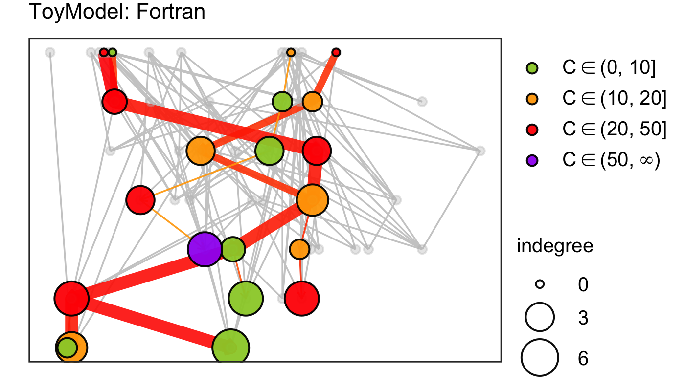{fig-alt="Risk network for a Fortran model"}

### Visualization

[ggguides](https://cran.r-project.org/package=ggguides) v1.1.4: Extends `ggplot2` by providing one-liner functions for common legend and guide operations in `ggplot2`. Simplifies legend positioning, styling, wrapping, and collection across multi-panel plots created with `patchwork` or `cowplot`. There are five vignettes including [Getting Started](https://cran.r-project.org/web/packages/ggguides/vignettes/getting-started.html) and [Styling & Customization](https://cran.r-project.org/web/packages/ggguides/vignettes/styling.html).

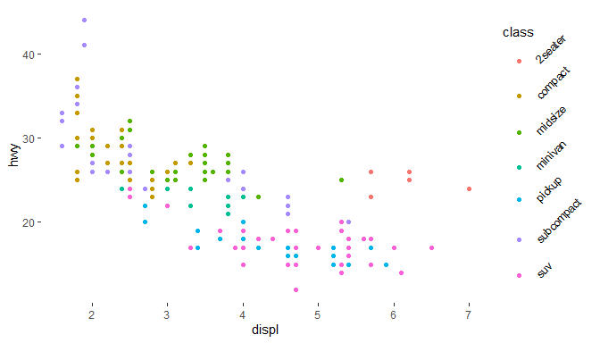{fig-alt="Plot with rotated legend labels"}

[gglycan](https://cran.r-project.org/package=gglycan) v0.0.3: Extends `ggplot2` to plot [glycans](https://www.ncbi.nlm.nih.gov/glycans/) following the symbol [nomenclature for glycans](https://www.ncbi.nlm.nih.gov/glycans/snfg.html) using standardized visual representation of glycan structures. See the [vignette](https://cran.r-project.org/web/packages/gglycan/vignettes/gglycan.html).

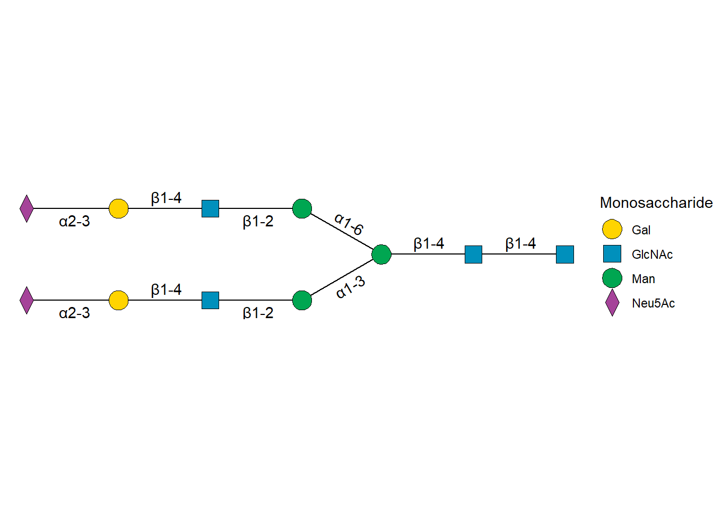{fig-alt="Sample glycal plot"}

[ggsced](https://cran.r-project.org/package=ggsced) v0.1.6: Extends `ggplot2` to create publication-ready graphics with professional phase change lines, support for multiple baseline designs, and styling functions that follow Single-Case Experimental Design (SCED) visualization conventions. Key functions include adding phase change demarcation lines to existing plots and formatting axes with broken axis appearance commonly used in single-case research. See the [vignette](https://cran.r-project.org/web/packages/ggsced/vignettes/ggsced-vignette.html).

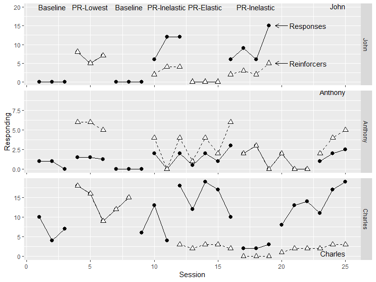{fig-alt="Plot of Responding by Session faceted by for multiple conditions faceted by participant"}

[ggskewboxplots](https://cran.r-project.org/package=ggskewboxplots) V1.0.0: Extends `ggplot2` for creating skewed boxplots using several statistical methods including those of [Kimber (1990)](https://www.jstor.org/stable/2347808?origin=crossref), [Hubert and Vandervieren (2008)](https://www.sciencedirect.com/science/article/abs/pii/S0167947307004434?via%3Dihub), [Adil et al. (2015)](https://www.pjsor.com/index.php/pjsor/article/view/500), [Babura et al., (2017)](https://pubs.aip.org/aip/acp/article-abstract/1842/1/030034/931355/Modified-boxplot-for-extreme-data?redirectedFrom=fulltext), and [Walker et al. (2018)](https://www.tandfonline.com/doi/full/10.1080/00031305.2018.1448891). See the [vignette](https://cran.r-project.org/web/packages/ggskewboxplots/vignettes/introduction.html).

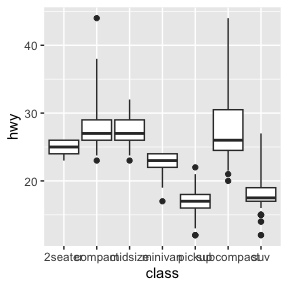{fig-alt="Boxplot using the Walker method"}

[vbracket](https://cran.r-project.org/package=vbracket) v1.1.0: Extends `ggplot2` by adding publication-quality custom legends with vertical brackets. Designed for displaying statistical comparisons between groups, commonly used in scientific publications for showing significance levels. Features include adaptive positioning, automatic bracket spacing for overlapping comparisons, font family inheritance, and support for asterisks, p-values, or custom labels. Look [here](https://github.com/h20gg702/vbracket)
for examples.

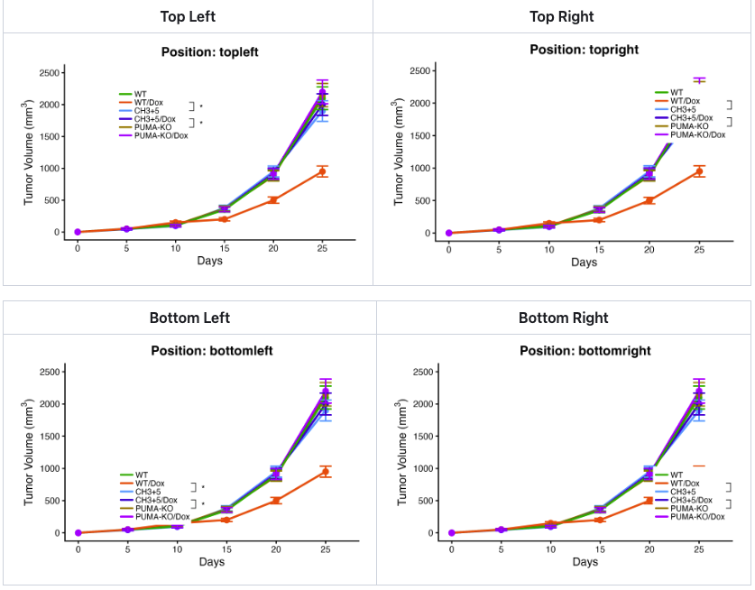{fig-alt="Plots with brackets and statistical annotations"}

:::

v

::::

