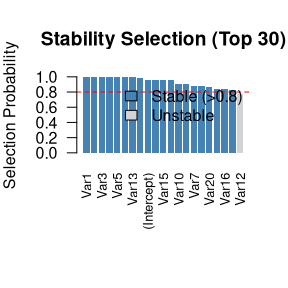
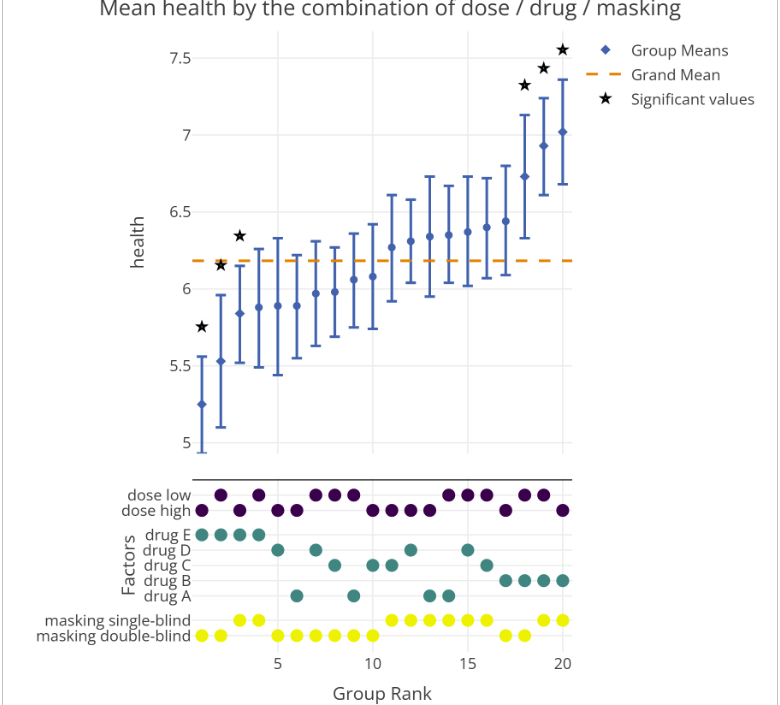
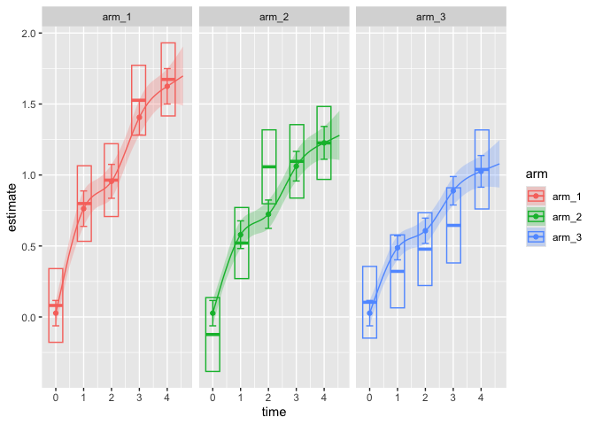

In January, two hundred forty-three new packages made it to CRAN. Here are my Top 40 picks in nineteen categories: Agriculture, Artificial Intelligence, Audio Analysis, Causal Inference, Computational Methods, Ecology, Econometrics, Epidemiology, Genetics, Genomics, Machine Learning, Medicine, Mathematics, Mediation Analysis, Medical Statistics, Pharma, Statistics, Time Series, Utilities, and Visualization.

:::: {.columns}

::: {.column width="45%"}

### Agriculture

{fig-alt=""}

### Computational Methods

### High Performance Computing

[futurize](https://cran.r-project.org/package=futurize) v0.1.0: Provides a straightforward path to scalable parallel computing via the [`future` ecosystem](https://journal.r-project.org/articles/RJ-2021-048/index.html). The `futurize()` function which transpiles calls to sequential map-reduce functions is combined with R's native pipe operator to provide a way for speeding up iterative computations with minimal refactoring, e.g. `lapply(xs, fcn) |> futurize()`, `purrr::map(xs, fcn) |> futurize()`, and `foreach::foreach(x = xs) %do% { fcn(x) } |> futurize()`. Other map-reduce packages that can be "futurized" are `BiocParallel`, `plyr`, and `crossmap`. There is also support for growing set of domain-specific packages, including `boot`, `glmnet`, `mgcv`, `lme4`, and `tm`. See [README]() to get started. There are twelve vignettes including [Parallelize base-R apply functions](https://cran.r-project.org/web/packages/futurize/vignettes/futurize-11-apply.html) and [Parallelize `purrr` functions](https://cran.r-project.org/web/packages/futurize/vignettes/futurize-21-purrr.html).

:::

::: {.column width="10%"}

:::

::: {.column width="45%"}

### Medical Statistics Continued

### Statistics

[bayesDiagnostics](https://cran.r-project.org/package=bayesDiagnostics) v0.1.0: Provides comprehensive tools for Bayesian model diagnostics and comparison including prior sensitivity analysis, posterior predictive checks [Gelman et al. (2013)](https://www.taylorfrancis.com/books/mono/10.1201/b16018/bayesian-data-analysis-david-dunson-donald-rubin-john-carlin-andrew-gelman-hal-stern-aki-vehtari), advanced model comparison using Pareto-smoothed importance sampling leave-one-out cross-validation [Vehtari et al. (2017)](https://link.springer.com/article/10.1007/s11222-016-9696-4), convergence diagnostics, and prior elicitation tools. Integrates with `brms`, `rstan`, and `rstanarm` packages. See [README](https://cran.r-project.org/web/packages/bayesDiagnostics/readme/README.html) to get started and the [vignette](https://cran.r-project.org/web/packages/bayesDiagnostics/vignettes/introduction-to-bayesDiagnostics.html) for an introduction.

[gradLasso](https://cran.r-project.org/package=gradLasso) v0.1.1: Implements LASSO regression using gradient descent with support for Gaussian, Binomial, Negative Binomial, and Zero-Inflated Negative Binomial (ZINB) families. Features cross-validation for determining lambda, stability selection, and bootstrapping for confidence intervals. Methods described in [Tibshirani (1996)](https://academic.oup.com/jrsssb/article/58/1/267/7027929?login=false) and [Meinshausen and Buhlmann (2010)](https://academic.oup.com/jrsssb/article-abstract/72/4/417/7076513?redirectedFrom=fulltext&login=false). Look [here](https://github.com/ddefranza/gradLasso) for a quickstart and see the [vignette](https://cran.r-project.org/web/packages/gradLasso/vignettes/intro.html) for an introduction.

{fig-alt="Stabiity selection Plot"}

[mfcurve](https://cran.r-project.org/package=mfcurve) v1.0.2: Implements multi-factor curve analysis for grouped data replicating and extending the functionality of the the `Stata mfcurve`. See [Krähmer (2023)](https://ideas.repec.org/c/boc/bocode/s459224.html) and [Simonsohn, Simmons, and Nelson (2020)](https://www.nature.com/articles/s41562-020-0912-z) for background. Functions for preprocessing, statistical testing, and visualization of results with confidence intervals are included. There is an [Introduction](https://cran.r-project.org/web/packages/mfcurve/vignettes/mfcurve-intro.html).

{fig-alt="Multi-factor curve analysis plot with confidence intervals"}

[NMAR](https://cran.r-project.org/package=NMAR) v0.1.2: Implements methods to estimate finite-population parameters under nonresponse that are not missing at random. Incorporates auxiliary information and user-specified response models, and supports independent samples and complex survey designs via objects from the `survey` package. See [Qin, Leung and Shao (2002)](https://www.tandfonline.com/doi/abs/10.1198/016214502753479338) and [Riddles, Kim and Im (2016)](https://academic.oup.com/jssam/article-abstract/4/2/215/2580514?redirectedFrom=fulltext&login=false) for background. There are five vignettes including [exptilt nonparam theory](https://cran.r-project.org/web/packages/NMAR/vignettes/exptilt_nonparam_theory.html) and [Empirical Likelihood](https://cran.r-project.org/web/packages/NMAR/vignettes/tutorial_empirical_likelihood.html).

[pmrm](https://cran.r-project.org/package=pmrm) v0.0.2: A progression model for repeated measures is a continuous-time nonlinear mixed-effects model for longitudinal clinical trials in progressive diseases. Unlike mixed models for repeated measures which estimate treatment effects as linear combinations of additive effects on the outcome scale, PMRMs characterize treatment effects in terms of the underlying disease trajectory yielding clinically interpretable quantities. See [Raket (2022)](https://onlinelibrary.wiley.com/doi/10.1002/sim.9581) and [Kristensen (2016)](https://www.jstatsoft.org/article/view/v070i05) for background. There are three vighettes: [Models](https://cran.r-project.org/web/packages/pmrm/vignettes/models.html), [Usage](https://cran.r-project.org/web/packages/pmrm/vignettes/usage.html) and [Validation](https://cran.r-project.org/web/packages/pmrm/vignettes/validation.html).

{fig-alt="Predictions by trial arm"}

[uniLasso](https://cran.r-project.org/package=uniLasso) v2.11: Fits a univariate-guided sparse regression (lasso), by a two-stage procedure. The first stage fits p separate univariate models to the response. The second stage gives more weight to the more important univariate features, and preserves their signs. It returns an objects that inherit from class `glmnet`. See [Chatterjee, Hastie and Tibshirani (2025)](https://hdsr.mitpress.mit.edu/pub/3i97j340/release/4) for details.

end

:::

::::

