Three hundred fifty-three new packages were submitted to CRAN in July. Here are my Top 40 picks in nineteen categories: Causal Inference, Chemistry, Climate Studies, Computational Methods, Ecology, Economics, Econometrics, Genomics, Geomorphometry, Mathematics, Machine Learning, Medical Statistics, Meta-Analysis, Networks, Statistics, Surveys, Time Series, Utilities, and Visualization.

:::: {.columns}

::: {.column width="45%"}

### Causal Inference

[ivreg2r](https://cran.r-project.org/package=ivreg2r) v0.1.0: Provides comprehensive instrumental variables and GMM estimation with automatic diagnostics, inspired by the `Stata` command `ivreg2` of [Baum, Schaffer, and Stillman (2003)](https://journals.sagepub.com/doi/10.1177/1536867X0300300101) and [Baum, Schaffer, and Stillman (2007)](https://journals.sagepub.com/doi/10.1177/1536867X0800700402). Supports 2SLS, LIML, Fuller, k-class, two-step efficient GMM, and continuously-updated CUE estimators. Provides classical, robust, cluster-robust, HAC, and Driscoll-Kraay standard errors. Reports weak identification, underidentification, overidentification, and endogeneity tests at estimation time. All outputs are verified against `Stata` within tight numerical tolerances. There are three vignettes, including [Instrumental Variable Estimation](https://cran.r-project.org/web/packages/ivreg2r/vignettes/introduction.html) and [Advanced IV Estimation](https://cran.r-project.org/web/packages/ivreg2r/vignettes/advanced-iv.html).

[lingamr](https://cran.r-project.org/package=lingamr) v0.1.2: Implements `LiNGAM` (Linear Non-Gaussian Acyclic Model) algorithms for causal discovery, following [Shimizu et al. (2011)](https://www.jmlr.org/papers/v12/shimizu11a.html). Based on the `Python` implementation by [Ikeuchi et al. (2023)](https://github.com/cdt15/lingam). The `VAR-LiNGAM` residual diagnostics are inspired by the `VARLiNGAM` `R` code of [Moneta et al.](https://sites.google.com/site/dorisentner/publications/VARLiNGAM). See the [vignette](https://cran.r-project.org/web/packages/lingamr/vignettes/lingamr.html).

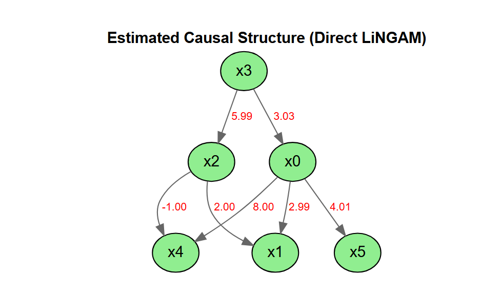{fig-alt="Estimated Causal DAG"}

### Chemistry

[isoreader2](https://cran.r-project.org/package=isoreader2) v0.6.1: Implements an interface to the raw data and metadata stored in file formats commonly encountered in scientific disciplines that use stable isotopes. Supports Isodat (.dxf, .cf, .did, .caf, .scn), IonOS (.iarc), LyticOS (.larc), Callisto (.bch), and Qtegra (.imexp) file formats. Provides a consistent data structure together with tools to aggregate, convert signal units, filter, and visualize the extracted data. The approach is described in [Kopf et al. (2021)](https://joss.theoj.org/papers/10.21105/joss.02878). See the [vignette](https://cran.r-project.org/web/packages/isoreader2/vignettes/functionality_guide.html).

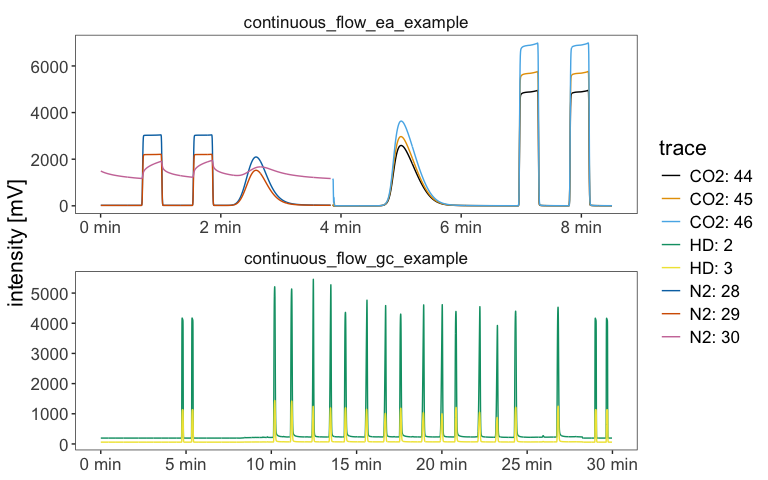{fig-alt="Plot of intensity over time"}

### Climate Studies

[CDSimX](https://cran.r-project.org/package=CDSimX) v1.1.2: Provides advanced climate simulation, forecasting, visualization, export, and machine learning tools. Generates synthetic climate datasets for single or multiple weather stations using stochastic weather generation techniques by simulating daily climate variables, including minimum and maximum temperature, rainfall, relative humidity, solar radiation, wind speed, wind direction, dew point temperature, and potential evapotranspiration. Methods are based on established stochastic weather generation approaches described in [Richardson (1981)](https://agupubs.onlinelibrary.wiley.com/doi/10.1029/WR017i001p00182), [Wilks (1999)](https://www.sciencedirect.com/science/article/pii/S0168192399000374?via%3Dihub), and [Osei et al. (2026)](https://openresearchsoftware.metajnl.com/articles/10.5334/jors.666). See the [vignette](https://cran.r-project.org/web/packages/CDSimX/vignettes/CDSimX-introduction.html).

{fig-alt="Time series for individual station"}

### Computational Methods

[CMCMC](https://cran.r-project.org/package=CMCMC) v0.1.1: Implements contemporaneous Markov chain Monte Carlo and interchain adaptive Markov chain Monte Carlo samplers of [Craiu, Rosenthal and Yang (2009)](https://www.tandfonline.com/doi/abs/10.1198/jasa.2009.tm08393) for targets known up to a normalizing constant. The samplers run multiple Metropolis chains in parallel and update proposal covariance estimates using contemporaneous particle groups. Built-in target kernels include multivariate normal, logistic regression, Poisson, Gaussian, Gamma, and hierarchical models, with support for user-provided target kernels. The formula interface `glm_cmcmc()` fits supported generalized linear models using the built-in kernels. `CUDA` is used when available, and an `OpenMP`-enabled CPU backend is available on systems without a `CUDA` compiler. See the vignettes, [Example Workflows](https://cran.r-project.org/web/packages/CMCMC/vignettes/cmcmc-examples.html) and [GLM CMCMC](https://cran.r-project.org/web/packages/CMCMC/vignettes/glm-cmcmc.html).

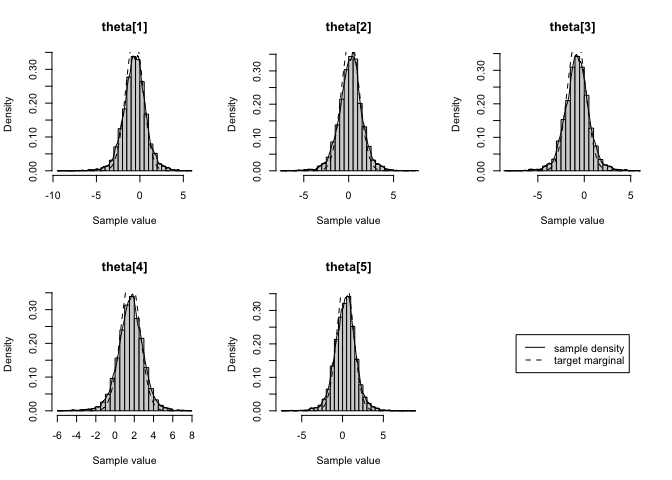{fig-alt="Plots of parameter densities"}

[pycnophylactic](https://cran.r-project.org/package=pycnogrid) v0.2.0: Provides tools for pycnophylactic interpolation of polygon totals to discrete global and local grid systems. The method follows [Tobler (1979)](https://www.tandfonline.com/doi/abs/10.1080/01621459.1979.10481647), preserving source-zone totals while smoothing values across neighboring target cells. See the [vignette](https://cran.r-project.org/web/packages/pycnogrid/vignettes/getting_started.html).

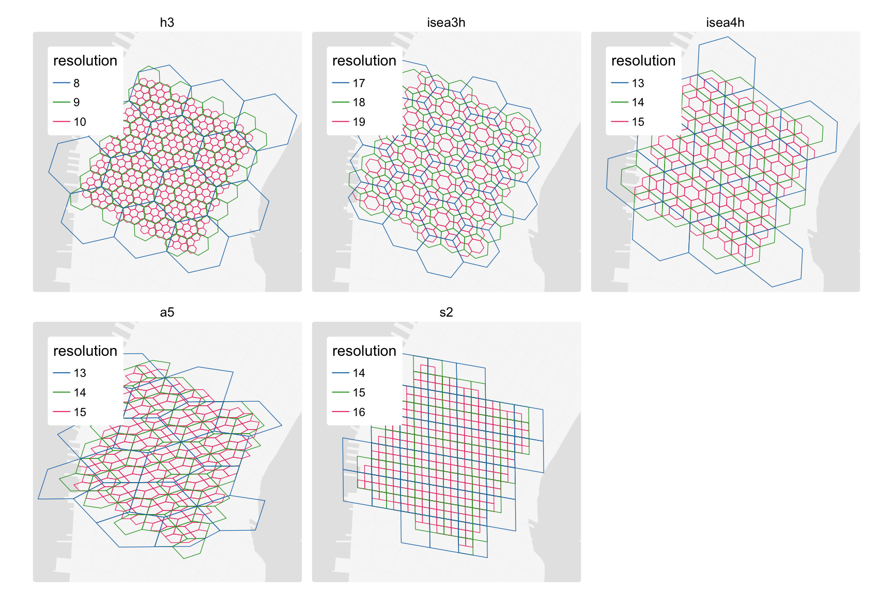{fig-alt="Plots of sample DGGS hierarchies at different resolutions"}

[simtte](https://cran.r-project.org/package=simtte) v1.0.2: Simulates time-to-event datasets for clinical trial design and analysis using ordinary differential equation (ODE) models solved via the `mrgsolve` backend. Built-in Weibull and flexible M-spline baseline hazard models are provided out of the box, and fully bespoke hazard models can be implemented as custom `mrgsolve` ODE systems. Event times are generated by inverse transform sampling from the resulting cumulative hazard functions. See [Bender et al. (2005)](https://onlinelibrary.wiley.com/doi/10.1002/sim.2059) for the inverse transform sampling methodology and [Royston and Parmar (2002)](https://onlinelibrary.wiley.com/doi/10.1002/sim.1203)  for flexible parametric survival models. See the vignettes, [Getting Started](https://cran.r-project.org/web/packages/simtte/vignettes/introduction.html) and [Advanced Simulation](https://cran.r-project.org/web/packages/simtte/vignettes/advanced-usage.html).

### Ecology

[ascent](https://cran.r-project.org/package=ascent) v0.1.1: Implements the ASC-CFD (Assemblage Shift Characterization - Community Functional Dynamics) framework for decomposing functional community restructuring into positional (centroid displacement), dispersive (functional dispersion), and boundary (convex hull volume) components. Provides hierarchical null models (structural, quantitative, identity) to evaluate statistical significance and species-level leverage analysis to identify taxa driving functional shifts. Supports both temporal paired and spatial pairwise comparisons. See the [vignette](https://cran.r-project.org/web/packages/ascent/vignettes/ascent_tutorial.html).

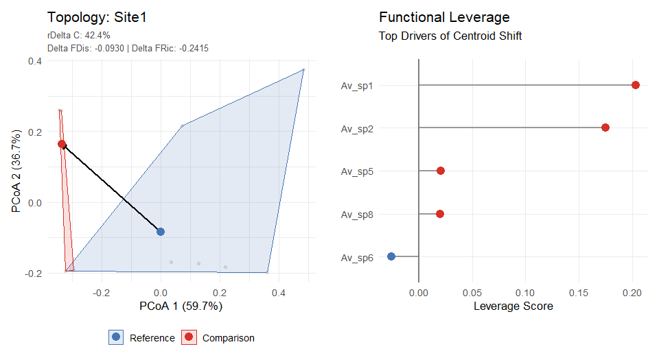{fig-alt="Plots showing topology and functional leverage"}

[leafareaR](https://cran.r-project.org/package=leafareaR) v0.0.1: Provides tools for leaf area estimation based on leaf length, leaf width, and observed leaf area. The package supports data validation, predictor generation, descriptive statistics, exploratory graphics, scatterplot matrices, linear models, nonlinear models, mixed models, model evaluation, ranking, equation generation, prediction, export of results and plots, and an interactive `shiny` application. Methods are aligned with non-destructive allometric workflows described by [Ribeiro et al. (2024)](https://www.sciencedirect.com/science/article/abs/pii/S0254629924004083?via%3Dihub), [Ribeiro et al. (2023)](https://www.scielo.br/j/rbeaa/a/8nwBcS6pHjrQmSRRYp8KCpD/?lang=en), and [Ribeiro et al. (2025)](https://www.scielo.br/j/cr/a/dGcqcZRGxpDzrM9Fq85pdCS/?lang=en). See the [vignette](https://cran.r-project.org/web/packages/leafareaR/vignettes/leafareaR-introduction.html) to get started.

### Econometrics

[didintrjl](https://cran.r-project.org/package=didintrjl) v0.2.6: Implements a  wrapper for the `Julia` package [`DiDInt.jl`](https://ebjamieson97.github.io/DiDInt.jl/stable/), which implements intersection difference-in-differences, a method developed by [Karim & Webb (2025)](https://arxiv.org/abs/2412.14447). Allows for unbiased estimation of the average effect of treatment on the treated (ATT) in cases when the common causal covariates assumption is violated. Also computes p-values for the ATT via the randomization inference procedure described in [MacKinnon and Webb (2020)](https://doi.org/10.1016%2Fj.jeconom.2020.04.024). See the [vignette](https://cran.r-project.org/web/packages/didintrjl/vignettes/didintrjl.html).

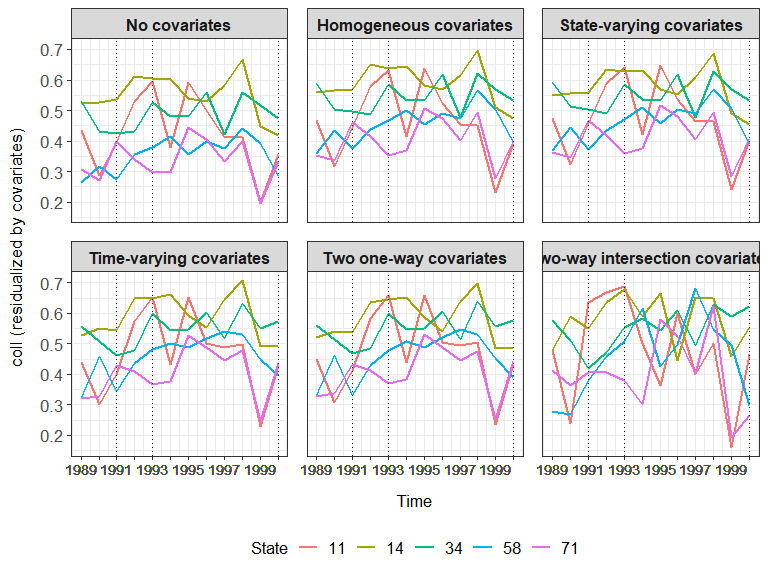{fig-alt="Plots of residuals by covariates over time"}

### Genomics

[MosaiClusteR](https://cran.r-project.org/package=MosaiClusteR) v0.1.1: Provides an umbrella framework (MoSaIC: Multi-Omics Similarity Aggregation and Integrative Clustering in R) that unifies a large collection of multi-source / multi-omics clustering methodologies behind a single, consistent list-of-matrices interface. It spans five integration paradigms: direct, similarity-based, graph-based, voting-based consensus, and hierarchy-based, and bundles a complete downstream workflow for method comparison and evaluation. Enables the comparison of multiple algorithms on the same footing. a data-nugget based feature-weighting scheme as a robust, big-data-friendly. See [README](https://cran.r-project.org/web/packages/MosaiClusteR/readme/README.html) and the [vignette](https://cran.r-project.org/web/packages/MosaiClusteR/vignettes/MosaiClusteR.html) for more information.

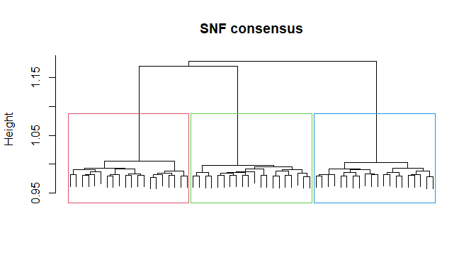{fig-alt="Plot for comparing clusters"}

[rchime](https://cran.r-project.org/package=rchime) v0.1.2: Provides functions to detect and remove chimeras from an amplicon sequence analysis using reference-based or de novo approaches that implement the *VSEARCH* algorithms described in [Rognes et al. (2016)](https://peerj.com/articles/2584/), which build on the work of [Edgar et al. (2011)](https://academic.oup.com/bioinformatics/article/27/16/2194/255262?login=false). There are four vignettes, including [Getting Started](https://cran.r-project.org/web/packages/rchime/vignettes/rchime.html) and [chimera report](https://cran.r-project.org/web/packages/rchime/vignettes/chimera_report.html).

### Geomorphometry

[blueterra](https://cran.r-project.org/package=blueterra) v0.1.0: Derives, organizes, summarizes, and visualizes terrain metrics from bathymetric and elevation rasters for submerged-landscape geomorphometry. Tools support terra-based raster preparation, slope and aspect decomposition, terrain position, rugosity, curvature, depth-band summaries, transect extraction, isobath-corridor analysis, and model-ready summaries for seafloor classification, habitat mapping, shelf-margin analysis, and spatial modeling. Methodological context for geomorphometric terrain analysis is provided by [Lindsay (2016)](https://www.sciencedirect.com/science/article/abs/pii/S0098300416301820?via%3Dihub). There are eight vignettes, including [Getting started](https://cran.r-project.org/web/packages/blueterra/vignettes/blueterra.html) and [Visual proof](https://cran.r-project.org/web/packages/blueterra/vignettes/visual-proof.html).

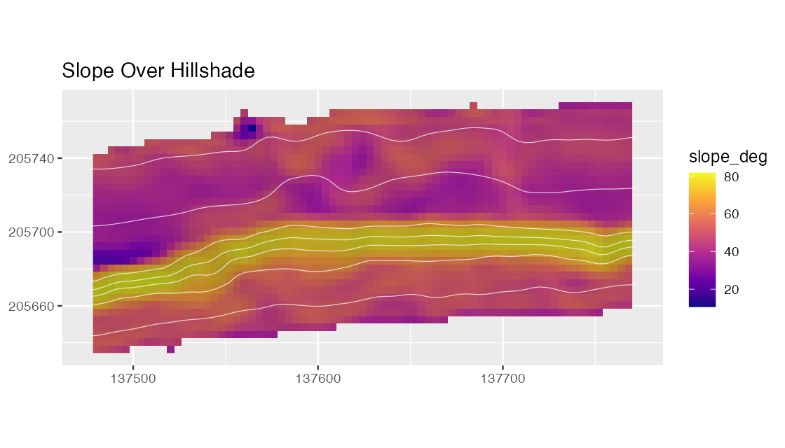{fig-alt="Plot of slop over hillside"}

### Mathematics

[riemannianStats](https://cran.r-project.org/package=riemannianStats) v0.2.0: Provides tools for statistical analysis on Riemannian manifolds using local geometry derived from Uniform Manifold Approximation and Projection (UMAP), Isometric Mapping (Isomap), and Density-Based Spatial Clustering of Applications with Noise (DBSCAN). Supports dimensionality reduction, visualization, Riemannian principal component analysis, and Riemannian linear regression for multivariate data analysis. Methods based on Uniform Manifold Approximation and Projection follow [McInnes et al. (2018)](https://joss.theoj.org/papers/10.21105/joss.00861). There are four vignettes, including [Riemannian PCA](https://cran.r-project.org/web/packages/riemannianStats/vignettes/data10d250-pca-umap-step-by-step.html) and [Riemannian Linear Regression](https://cran.r-project.org/web/packages/riemannianStats/vignettes/riemannian-regression-umap-dbscan-isomap.html).

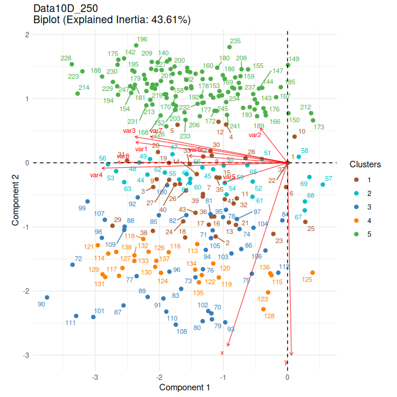{fig-alt="PCA Biplot"}

### Machine Learning

[modelimportance](https://cran.r-project.org/package=modelimportance) v0.1.0: Provides metrics for quantifying the contribution of individual component models to the predictive accuracy of ensemble forecasts. The package implements the Leave-One-Model-Out and Leave-All-Subset-of-One-Model-Out model importance metrics, enabling users to assess the relative importance of component models and better understand the performance of ensemble forecasting systems. Methods are described in [Kim et al. (2026)](https://doi.org/10.1016%2Fj.ijforecast.2025.12.006). See the vignettes, [modelimportance](https://cran.r-project.org/web/packages/modelimportance/vignettes/modelimportance-article.html) and [Simple working examples](https://cran.r-project.org/web/packages/modelimportance/vignettes/get-started.html).

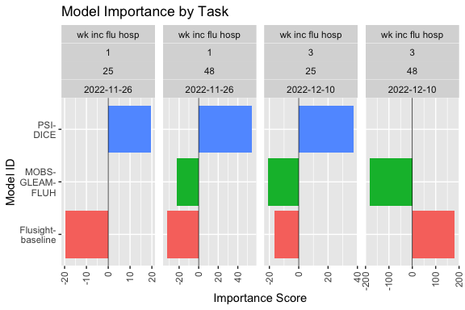{fig-alt="Plots showig model importance by task"}

[ppforest2](https://cran.r-project.org/package=ppforest2) v0.1.2: Builds decision trees by splitting on linear combinations of randomly chosen variables and using projection pursuit to choose a projection of the variables that best separates the groups. Outperform traditional decision trees when the separation between groups occurs in combinations of variables. Single trees can be assembled into random forests. See [Lee et al. (2013)](https://projecteuclid.org/journals/electronic-journal-of-statistics/volume-7/issue-none/PPtree-Projection-pursuit-classification-tree/10.1214/13-EJS810.full) and [da Silva et al. (2021)](https://www.tandfonline.com/doi/full/10.1080/10618600.2020.1870480) for background. There are two vignettes: [Introduction](https://cran.r-project.org/web/packages/ppforest2/vignettes/introduction.html) and [Custom strategies](https://cran.r-project.org/web/packages/ppforest2/vignettes/custom-strategies.html).

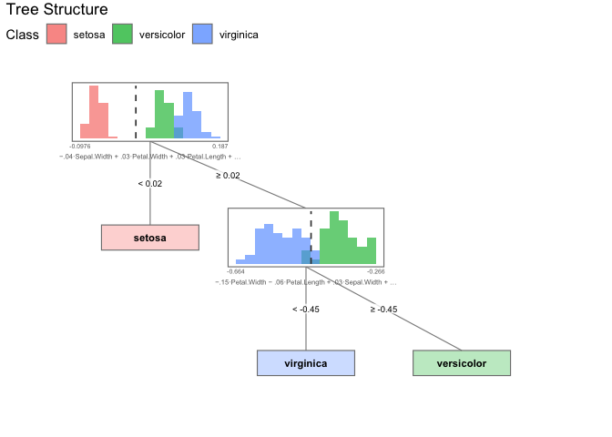{fig-alt="Plot of tree structure."}

[sdim](https://cran.r-project.org/package=sdim) v0.1.0: Implements five factor extraction methods for asset pricing and macroeconomic forecasting: principal component analysis (PCA), partial least squares (PLS), scaled PCA (sPCA) of [Huang et al. (2022)](https://pubsonline.informs.org/doi/10.1287/mnsc.2021.4020), the reduced-rank approach (RRA) of [He et al. (2023)](https://pubsonline.informs.org/doi/10.1287/mnsc.2022.4563), and Instrumented PCA (IPCA) of [Kelly et al. (2019)](https://doi.org/10.1016%2Fj.jfineco.2019.05.001). There are four vignettes, including [Getting started](https://cran.r-project.org/web/packages/sdim/vignettes/sdim.html) and [Replicating He et al. (2023)](https://cran.r-project.org/web/packages/sdim/vignettes/he2023-table3.html).

### Medical Statistics

[SDALGCP2](https://cran.r-project.org/package=SDALGCP2) v0.1.1: Fits a spatially discrete approximation to a log-Gaussian Cox process model for spatially aggregated disease count data, estimated by Monte Carlo Maximum Likelihood as in [Christensen (2004)](https://www.tandfonline.com/doi/abs/10.1198/106186004X2525) and [Johnson, Diggle and Giorgi (2019)](https://onlinelibrary.wiley.com/doi/10.1002/sim.8339). Performance-critical steps are implemented in `C++` via `RcppArmadillo`. Provides a one-line, `glm`-like interface and statistical extensions including a nugget term, general *Matern* smoothness, raster and misaligned covariates, restricted spatial regression, importance-sampling diagnostics and re-anchored Monte Carlo maximum likelihood. There are six vignettes, including [Spatial Disease Mapping](https://cran.r-project.org/web/packages/SDALGCP2/vignettes/SDALGCP2-intro.html) and [Spatially continuous (raster) predictors](https://cran.r-project.org/web/packages/SDALGCP2/vignettes/raster-covariates.html).

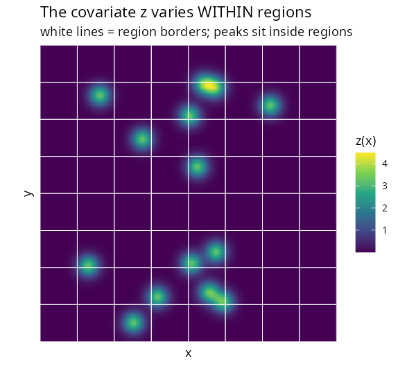{fig-alt="Plot of covariates within regions"}

[tooth](https://cran.r-project.org/package=tooth) v0.5.0: Computes dental caries indices (DMFT, DMFS, dmft, dmfs) from surface-level clinical examination data and produces odontogram heatmap visualizations of per-tooth-surface outcomes. Supports primary and permanent dentition with configurable teeth per quadrant (5 to 8), separate root and coronal caries tallying, long and wide input formats, stratified output, and FDI/Universal/quadrant tooth numbering conversion. See the [vignette](https://cran.r-project.org/web/packages/tooth/vignettes/introduction.html).

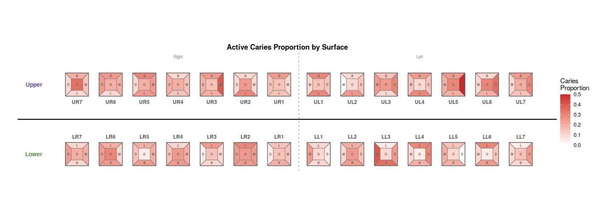{fig-alt="Plot of polygon geometry for multiple teeth"}

### Meta-Analysis

[dtametaTMB](https://cran.r-project.org/package=dtametaTMB) v0.1.1: Fits the hierarchical summary receiver operating characteristic (HSROC) model of [Rutter & Gatsonis (2001)](https://onlinelibrary.wiley.com/doi/10.1002/sim.942), the bivariate binomial-normal model of [Reitsma et al. (2005)](https://www.jclinepi.com/article/S0895-4356(05)00162-9/abstract), the threshold-based bivariate time-to-event model of [Hoyer et al. (2018)](https://onlinelibrary.wiley.com/doi/10.1002/jrsm.1273), and the latent class extensions of [Liu et al. (2015)](https://academic.oup.com/biometrics/article-abstract/71/2/538/7511452?redirectedFrom=fulltext&login=false) for diagnostic studies without a perfect reference standard. Provides subgroup analyses, HSROC meta-regression, likelihood-ratio tests, summary ROC plots, and coupled forest plots. There are three vignettes, including [Introduction](https://cran.r-project.org/web/packages/dtametaTMB/vignettes/dtametaTMB.pdf) and [Meta-Regeression](https://cran.r-project.org/web/packages/dtametaTMB/vignettes/Meta-Regression.pdf).

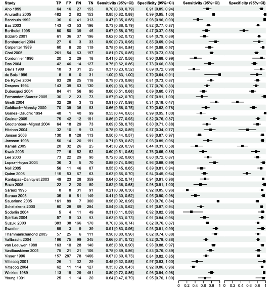{fig-alt="Forest Plot"}

:::

::: {.column width="10%"}

:::

::: {.column width="45%"}

### Networks

[htna](https://cran.r-project.org/package=htna) v0.3.1: Implements the Heterogeneous Transition Network Analysis method described by [López-Pernas et al. (2026)](https://onlinelibrary.wiley.com/doi/10.1002/jcal.70285), which is an extension of transition network analysis where actions or events belong to two or more distinct actor types (e.g., Human and AI), preserving the actor type partition on the resulting network. Provides a thin, focused API on top of the `Nestimate` estimation engine and the `cograph` rendering engine, so downstream bootstrap, permutation, reliability, centrality, and plotting functions treat each actor's codes as a distinct node group. See the vignettes, [Getting Started](https://cran.r-project.org/web/packages/htna/vignettes/htna.html) and [Input formats](https://cran.r-project.org/web/packages/htna/vignettes/input-formats.html).

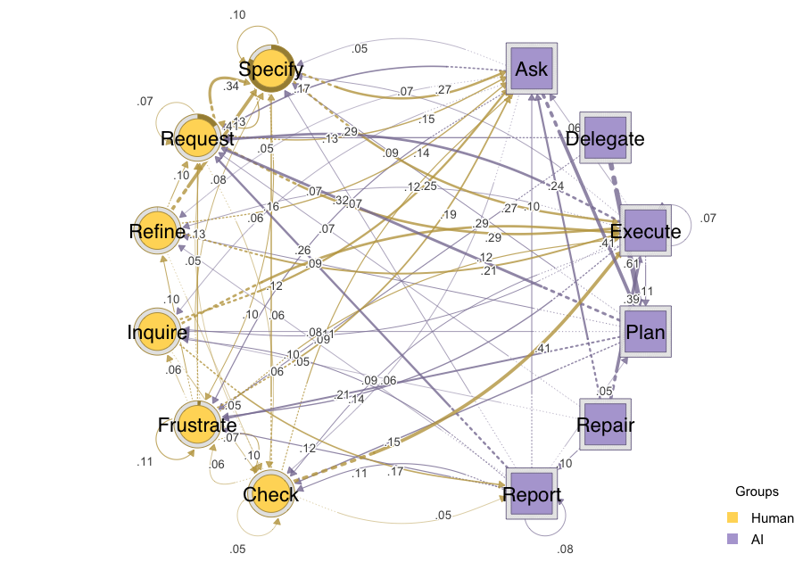{fig-alt="Network plot showing human and AI nodes"}

[osmnxr](https://cran.r-project.org/package=osmnxr) v0.1.1: Provides a `tidyverse`-friendly toolkit to download, model, simplify, analyze and visualize street networks and other geospatial features from `OpenStreetMap`. Build routable graphs from a place name, address, point or bounding box; simplify topology; compute shortest paths, isochrones and urban metrics (intersection density, circuity, street-orientation entropy, centrality); and export to `sf`, `sfnetworks` and `MapLibr`'. Heavy graph computation is performed by a bundled `Rust` core. There are eight vignettes, including [Getting started](https://cran.r-project.org/web/packages/osmnxr/vignettes/getting-started.html) and [Urban Metrics](https://cran.r-project.org/web/packages/osmnxr/vignettes/urban-metrics.html).

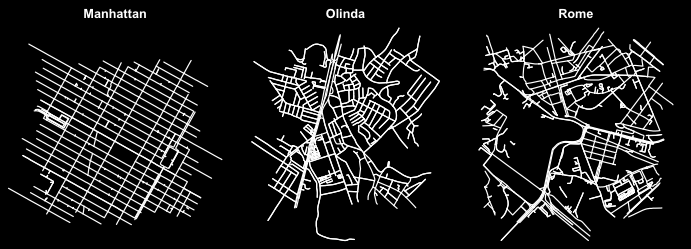{fig-alt="Examples of figure-ground diagrams"}

### Statistics

[ackwards](https://cran.r-project.org/package=ackwards) v0.2.0: Implements [Goldberg's (2006)](https://doi.org/10.1016%2Fj.jrp.2006.01.001) bass-ackwards method and modern descendants for hierarchical structural analysis. Extracts solutions from 1 to k factors using principal component analysis, exploratory factor analysis, or exploratory structural equation modeling  engines, then characterizes the hierarchy via between-level factor-score correlations computed via exact linear algebra [Waller (2007)](https://doi.org/10.1016%2Fj.jrp.2006.08.005) or materialized scores. Includes the [Forbes (2023)](https://psycnet.apa.org/doiLanding?doi=10.1037%2Fmet0000546) extension for redundancy pruning and all-levels cross-correlations. There are nine vignettes, including [Introduction](https://cran.r-project.org/web/packages/ackwards/vignettes/ackwards-intro.html) and [Interpreting and Labeling Factors](https://cran.r-project.org/web/packages/ackwards/vignettes/ackwards-interpret.html).

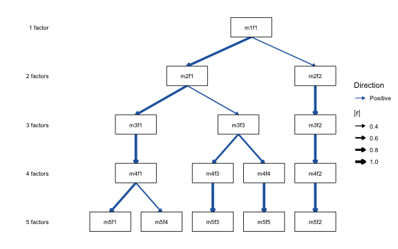{fig-alt="Hierarchy Diagram"}

[gdpar](https://cran.r-project.org/package=gdpar) v0.1.0: Implements a unified predictive framework in which individual parameters are decomposed as $\theta_i = \theta_ref +  \Delta(x_i, \theta_{ref})$, with $\theta_{ref}$a population reference and $\Delta$ an explicit deviation function. The decomposition follows the Additive-Multiplicative-Modulated canonical form and is estimated through three complementary paths: hierarchical Bayesian inference via `Stan`, varying-coefficient models via penalized splines, and amortized inference via hypernetworks in `torch`. Provides identifiability diagnostics, validity tests for the population reference, and benchmarks against canonical zero-inflated count datasets and avian abundance data from the eBird Status and Trends project. The framework and its estimation paths are described in [Julian (2026)](https://zenodo.org/records/21046269). There are twenty-five vignettes, including [Predictive Models with Dynamic Individual Parameters](https://cran.r-project.org/web/packages/gdpar/vignettes/v00_framework_overview.html) and [Theoretical Addendum](https://cran.r-project.org/web/packages/gdpar/vignettes/v08c_meta_learner_comparison.html).

[lagdynamics](https://cran.r-project.org/package=lagdynamics) v0.32: Implements a modern, tidy toolkit for lag sequential analysis and lag transition networks of categorical event and sequence data that provides an accessible, unified workflow for fitting, inspecting, visualizing, and comparing lagged transition patterns. Includes confirmatory tools for uncertainty, robustness, and group differences such as bootstrap intervals, analytic certainty, split-half reliability, case-drop stability, permutation tests, and Bayesian group comparisons. Supports long-format event-log import, import from common sequence and state-sequence objects, multi-lag analysis, structural-zero constraints, transition and initial probabilities, plotting of transition structures, and a directed transfer-entropy measure. The lag sequential analysis framework follows [Sackett and others (1979)](https://link.springer.com/article/10.3758/BF03205679). There are seven vignettes, including [Introduction]() and [Plotting lag-sequential models](https://cran.r-project.org/web/packages/lagdynamics/vignettes/plotting.html).

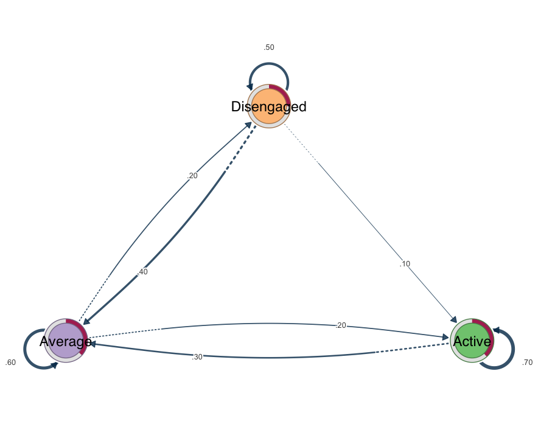{fig-alt="Transition diagram"}

[probcal](https://cran.r-project.org/package=probcal) v0.2.0: Provides S3 calibrators, metrics, and diagnostics for binary and multiclass probability calibration. Binary methods include Platt scaling, temperature scaling, beta calibration, histogram binning, and isotonic regression. Multiclass methods include temperature scaling, vector scaling, Dirichlet calibration, and a one-vs-rest wrapper for the binary calibrators. See [Zadrozny and Elkan (2002)](https://dl.acm.org/doi/10.1145/775047.775151) and [Guo et al. (2017)](https://proceedings.mlr.press/v70/guo17a.html) for background. There are five vignettes, including [Multiclass Calibration](https://cran.r-project.org/web/packages/probcal/vignettes/multiclass.html) and [Calibrating Binary Probabilities](https://cran.r-project.org/web/packages/probcal/vignettes/probcal.html).

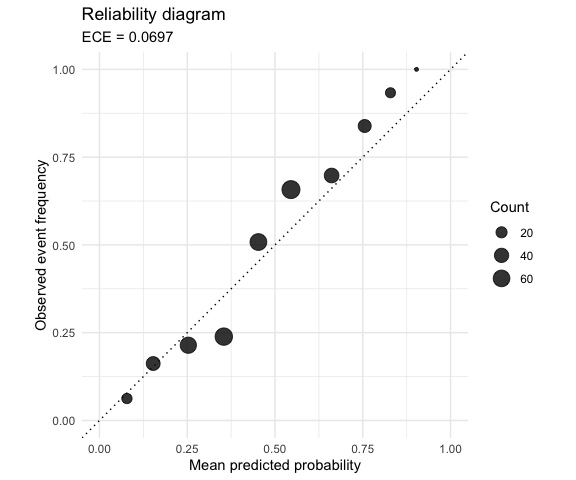{fig-alt="Reliability diagram"}

[prova](https://cran.r-project.org/package=prova) v1.0.0: Provides functions Bayesian methods to calculate  posterior joint and conditional probabilities, probability distributions, and information-theoretic measures. Data imputation and Markov-chain Monte Carlo calculations are automatically handled. Applications range from statistical estimation and probabilistic hypothesis testing to evidence-based inference and decision making, in a wide range of disciplines from astrophysics to medicine. For more details and examples, see, for instance, [Mana et al. (2026)](https://osf.io/preprints/osf/8nr56_v3) and [Dunson & Bhattacharya (2011)](https://academic.oup.com/book/1879/chapter-abstract/141635741?login=false&redirectedFrom=fulltext). See the vignettes, [Introduction](https://cran.r-project.org/web/packages/prova/vignettes/intro.html) and [Associations among variates](https://cran.r-project.org/web/packages/prova/vignettes/mutualinfo.html).

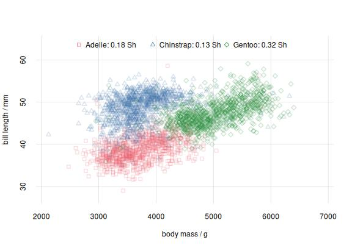{fig-alt="Scatterplot showing mutual information"}

[psAve](https://cran.r-project.org/package=psAve) v1.0.1: Constructs a model-averaged propensity score as a convex combination of candidate propensity score models, with mixing weights selected on a simplex grid to optimize covariate or prognostic-score balance, implementing the method of [Kabata, Stuart and Shintani (2024)](https://link.springer.com/article/10.1186/s12874-024-02350-y). Prognostic scores follow [Hansen (2008)](https://academic.oup.com/biomet/article-abstract/95/2/481/230183?redirectedFrom=fulltext&login=false): outcome models are fit on untreated units only. There are three vignettes, including [Getting Started](https://cran.r-project.org/web/packages/psAve/vignettes/psAve.html) and [Method details](https://cran.r-project.org/web/packages/psAve/vignettes/method-details.html).

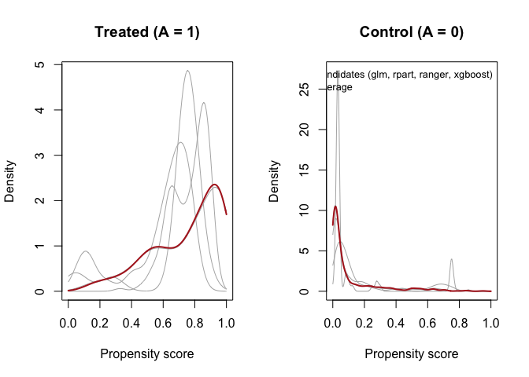{fig-alt="Propensity score distributions for treated and control groups"}

[stLMM](https://cran.r-project.org/package=stLMM) v0.0.3: Fits Bayesian linear mixed models for spatial and space-time data with fixed effects, independent and identically distributed grouped random effects, and structured latent processes. The formula interface supports first-order autoregressive effects, dense Gaussian processes, nearest-neighbor Gaussian processes, proper and Leroux conditional autoregressive effects, and more. The sampler supports sparse precision matrix calculations and includes latent process recovery, fitted values, prediction, pointwise log likelihoods, and posterior sample extraction. See [Datta et al. (2016)](https://www.tandfonline.com/doi/full/10.1080/01621459.2015.1044091) and  [Finley et al. (2019)](https://www.tandfonline.com/doi/full/10.1080/10618600.2018.1537924) for details. There are two vignettes [Getting started](https://cran.r-project.org/web/packages/stLMM/vignettes/v01-getting-started.html) and [Spatial NNGP models](https://cran.r-project.org/web/packages/stLMM/vignettes/v02-spatial-nngp.html).

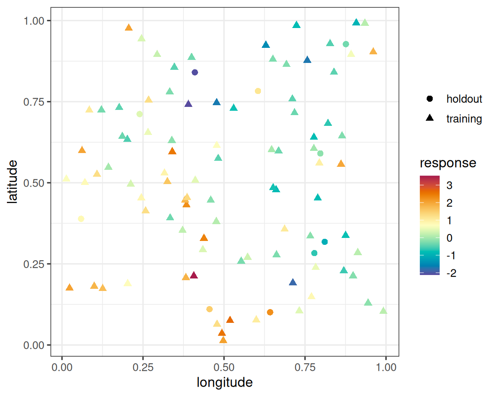{fig-alt="Plot of response as a function of longitude and latitude"}

[TestREnlme](https://cran.r-project.org/package=TestREnlme) v0.1.0: Provides nonparametric permutation tests for testing all or any subset of random effects in linear and nonlinear mixed-effects models, without requiring normality or other distributional assumptions on random effects or errors. Implements three distribution-free variance-component estimators: Variance Least Squares, Method of Moments, and Method of Moments with First-Order Approximation. Methods are described in [Uwimpuhwe, Drikvandi, and Blozis (2026)](https://onlinelibrary.wiley.com/doi/10.1002/sim.70605). See the [vignette](https://cran.r-project.org/web/packages/TestREnlme/vignettes/TestREnlme.html).

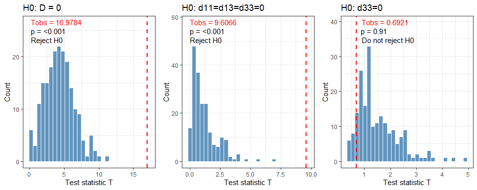{fig-alt="Plots of permutation null distributions for three tests"}

### Surveys

[nonprobsampling](https://cran.r-project.org/package=nonprobsampling) v0.1.0: Provides pseudo-weighted estimates of means and prevalences for finite population inference from nonprobability samples using auxiliary information to be combined when no single survey contains all variables relevant to participation. Optional cumulative precalibration can be applied to align weighted totals of shared variables across surveys. For methods and background, see [Landsman et al. (2026)](https://onlinelibrary.wiley.com/doi/10.1002/sim.70403), [Wang, Valliant, and Li (2021)](https://onlinelibrary.wiley.com/doi/10.1002/sim.9122), and [Chen, Li, and Wu (2020)](https://www.tandfonline.com/doi/full/10.1080/01621459.2019.1677241). See the [vignette](https://cran.r-project.org/web/packages/nonprobsampling/vignettes/nonprobsampling.html) to get started.

 

### Time Series

[forecastdom](https://cran.r-project.org/package=forecastdom) v0.1.0: Implements a unified toolkit for out-of-sample forecast dominance testing. Covers unconditional and conditional equal and superior predictive ability, encompassing, and nested-model comparison. Implements the Diebold-Mariano test with the [Harvey, Leybourne, and Newbold (1997)](https://doi.org/10.1016%2FS0169-2070%2896%2900719-4) small-sample correction; the Clark-West MSFE-adjusted statistic [Clark and West (2007)](https://doi.org/10.1016%2FS0304-4076%2801%2900071-9), and multiple other statistics. There are eleven vignettes, including [Get Started](https://cran.r-project.org/web/packages/forecastdom/vignettes/forecastdom.html) and [Replicating Clark & McCraken](https://cran.r-project.org/web/packages/forecastdom/vignettes/cm2001-enc-new.html).

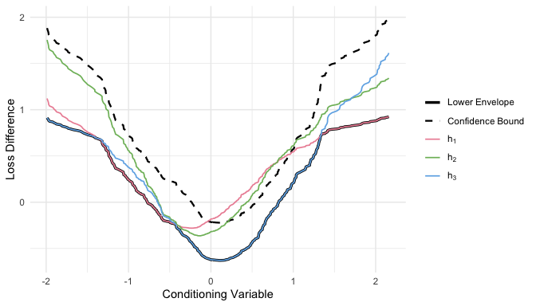{fig-alt="Plot of loss difference vs. conditioning variable"}

### Utilities

[crawlee](https://cran.r-project.org/package=crawlee) v0.1.0: Implements a tidy, pipe-friendly toolkit for reproducible web crawling and structured data collection, inspired by the architecture of the `Crawlee` library. Provides a unified crawler with a deduplicating, resumable request queue, content-type aware handlers, structured storage backends and rich console logging via `cli`. Supports crawling `HTML` pages, sitemaps, `RSS` and `Atom` feeds and `PDF` documents, with optional headless-browser rendering and helpers for retrieval-augmented generation. There are five vignettes, including [Getting started](https://cran.r-project.org/web/packages/crawlee/vignettes/crawlee.html) and [Crawling a website](https://cran.r-project.org/web/packages/crawlee/vignettes/crawling-a-website.html).

[livelink](https://cran.r-project.org/package=livelink) v0.1.1: Creates shareable links for `R` code in `WebAssembly` (WASM) Read-Eval-Print Loop (REPL) environments like [`webR`](https://webr.r-wasm.org/) and for `Shiny` applications using [`Shinylive`](https://shinylive.io/). Supports single scripts, multi-file projects, exercise and solution pairs, and batch processing. Includes encoding, decoding, and previewing of links for both `R` and `Python` environments. There are five vignettes, including [Getting Started](https://cran.r-project.org/web/packages/livelink/vignettes/getting-started.html) and [Teaching with livelink](https://cran.r-project.org/web/packages/livelink/vignettes/teaching.html).

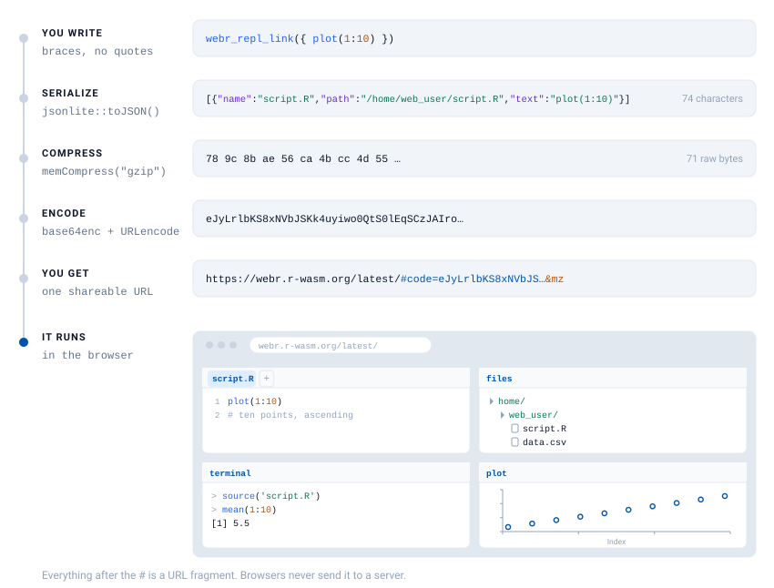{fig-alt="Example"}

[rtransparency](https://cran.r-project.org/package=rtransparency) v1.0.0; Use this package to identify indicators of transparency within the published literature. It can identify and extract text related to indicators of transparency from specifically formatted `TXT` files and from PMC `XML` files (i.e., `XML` files downloaded from the PubMed Central). It builds on the original rtransparent tool of [Serghiou et al. (2021)](https://journals.plos.org/plosbiology/article?id=10.1371/journal.pbio.3001107). There are four vignettes, including [Introduction](https://cran.r-project.org/web/packages/rtransparency/vignettes/rtransparency.html) and [Scope and Limitations](https://cran.r-project.org/web/packages/rtransparency/vignettes/scope-and-limitations.html).

### Visualization

[circlecorR](https://cran.r-project.org/package=circlecorR) v0.1.0: Draws circular *correlation wheel* plots straight from a data frame of one row per observation. Variables are arranged around a circle, grouped and colour-tiled by category, and connected by curved links whose colour maps to the correlation coefficient. Categories, colours, and labels are all user-configurable. See the [vignette](https://cran.r-project.org/web/packages/circlecorR/vignettes/circlecorR.html
).

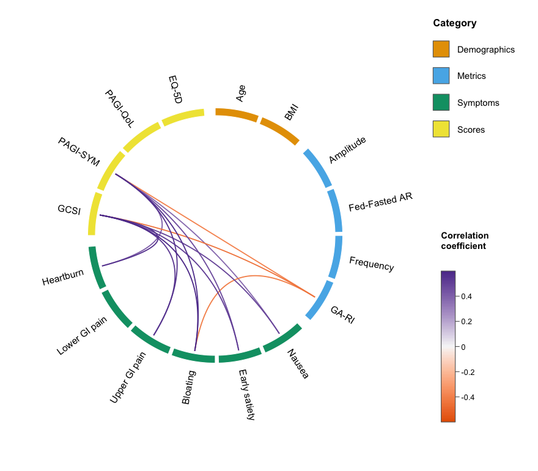{fig-alt="Correlation wheel plot"}

[deaviz](https://cran.r-project.org/package=deaviz) v0.1.0: Implements high-dimensional visualization methods for data envelopment analysis, providing techniques that have appeared in the literature but remain scattered and largely unimplemented, including: cross-efficiency matrix unfolding, the Porembski network with lambda edges, principal component analysis biplots, multidimensional-scaling colour-plots, self-organizing maps, the Costa bi-dimensional efficient frontier, parallel coordinates, radar charts, panel-data trajectory biplots, peer and reference networks, and a set of descriptive plots. For background, see [Doyle and Green (1994)](https://www.tandfonline.com/doi/abs/10.1057/jors.1994.84), [Porembski et al. (2005)](https://www.tandfonline.com/doi/abs/10.1057/jors.1994.84), and [Bana e Costa et al. (2016)](https://doi.org/10.1016%2Fj.ejor.2016.05.012). See the [vignette](https://cran.r-project.org/web/packages/deaviz/vignettes/deaviz.html) to get started.

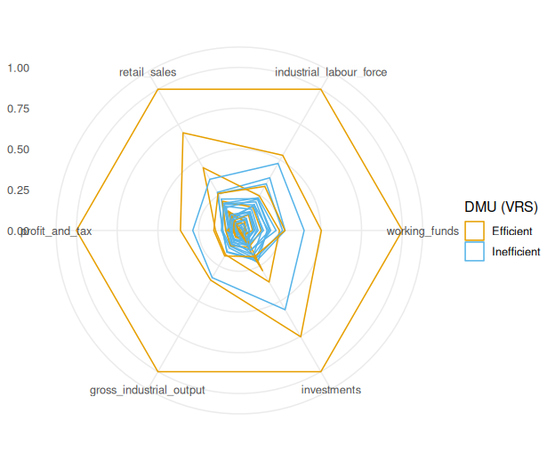{fig-alt="Example of a radar plot"}

[deckglgeoarrow](https://cran.r-project.org/package=deckglgeoarrow) v0.0.2: Leverages the high-performance `GeoArrow` memory layout to render potentially very large `Deck.gl` data layers on a `maplibregl`/`mapboxgl` map created `mapgl`. The heavy lifting is done on the `JavaScript` side in the browser using [`deck.gl-geoarrow`](https://github.com/geoarrow/deck.gl-geoarrow/). Currently provides functions for adding Scatterplot (points), Path (lines) and Polygon (polygons) layers. Has support for data classes from packages `wk` and `sf`. Remotely hosted `GeoParquet` and `GeoArrow` files can be visualized directly in the browser, without the need to first read them into `R` memory. See the [vignette](https://cran.r-project.org/web/packages/deckglgeoarrow/vignettes/getting_started.htmldeck).

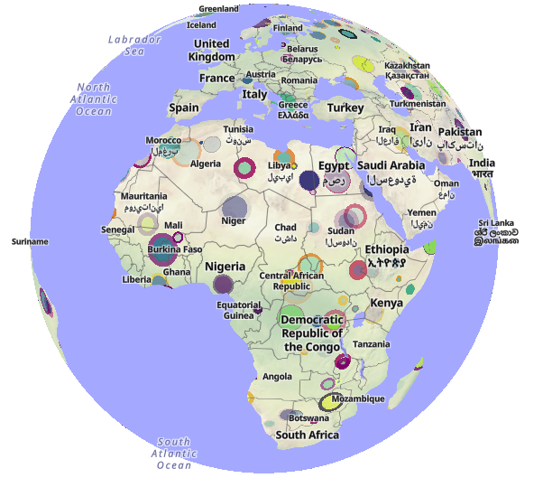{fig-alt="Flat image of 3D active plot"}

[glydraw](https://cran.r-project.org/package=glydraw) v0.8.0: A `ggplot2`-native plotting engine for drawing reproducible, beautiful Symbol Nomenclature for Glycans (SNFG) glycan cartoons from glycan structure objects or text notations, with support for batch export, structural highlighting, and deep appearance customization. It follows the [SNFG specification](https://www.ncbi.nlm.nih.gov/glycans/snfg.html). There are three vignettes, including [Get Started](https://cran.r-project.org/web/packages/glydraw/vignettes/glydraw.html) and [gldraw with ComplexHeatmap](https://cran.r-project.org/web/packages/glydraw/vignettes/complex-heatmap.html).

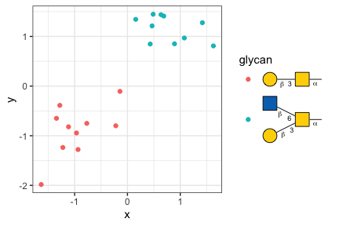{fig-alt="ggplot2 with glyphs"}
[R6Nomogram](https://cran.r-project.org/package=R6Nomogram) v1.0: Nomograms are a type of plot for displaying linear models. A scale is plotted for each predictor in the model that translates values of the variable into "points", the sum of the "points" is then looked up on another scale to find the final prediction from the model. This package provides an `R6` object constructor that does the computations for you to create an object representing the nomogram for the model. See [Harrell (2015)](https://link.springer.com/book/10.1007/978-3-319-19425-7) for background and the [vignette](https://cran.r-project.org/web/packages/R6Nomogram/vignettes/Basics.html) for examples.

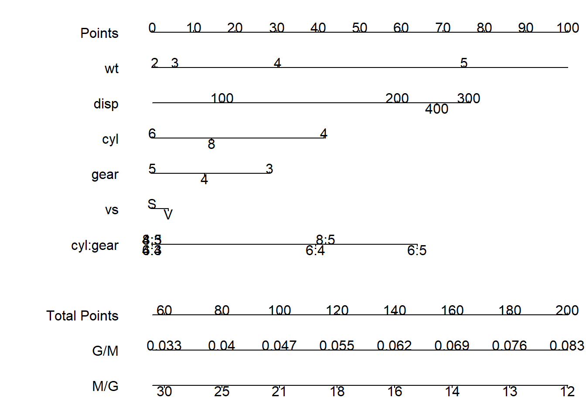{fig-alt="Example of a Nomogram"}

:::

::::

