Four hundred twelve new packages were submitted to CRAN in June. Here are my Top 40 picks in nineteen categories: Bioarchaeology, Biology, Climate Studies, Computational Methods, Ecology, Epidemiology, Finance, Functional Data Analysis, Machine Learning, Medical Statistics, Networks, Pharmacokinetics, Probability, Programming, Psychometrics, Risk Analysis, Statistics, Time Series, and Utilities.

:::: {.columns}

::: {.column width="45%"}

### Bioarchaeology

[baytaAAR](https://cran.r-project.org/package=baytaAAR) v1.0.3: Provides Bayesian age estimation for bioarchaeological skeletal data using ordinal probit regression models implemented in `JAGS` and `NIMBLE`. The package is designed to handle multiple ordinal traits of adult individuals and incorporates a Gompertz prior on age to reflect population-level mortality. It accounts for estimation uncertainties and supports full customization of model parameters and Markov Chain Monte Carlo settings. For more details, see [Müller-Scheeßel et al. (2026)](https://onlinelibrary.wiley.com/doi/10.1002/ajpa.70289). There are five vignettes including [Introduction](https://cran.r-project.org/web/packages/baytaAAR/vignettes/baytaAAR.html) and [Mathematical background](https://cran.r-project.org/web/packages/baytaAAR/vignettes/mathematical_background.html).

{fig-alt="Plot of distribution of age to death"}

### Biology

[power.nb](https://cran.r-project.org/package=power.nb) v0.1.0: Provides functions for estimating statistical power and required sample sizes in differential abundance microbiome studies using negative binomial models and includes tools for simulation-based power analysis and sample size estimation using generalized additive models (GAMs), and visualization utilities for exploring the relationship between power, effect size, abundance, and sample size. The methods are based on [Agronah and Bolker (2025)](https://journals.plos.org/plosone/article?id=10.1371/journal.pone.0318820). See the [vignette](https://cran.r-project.org/web/packages/power.nb/vignettes/stub.html).

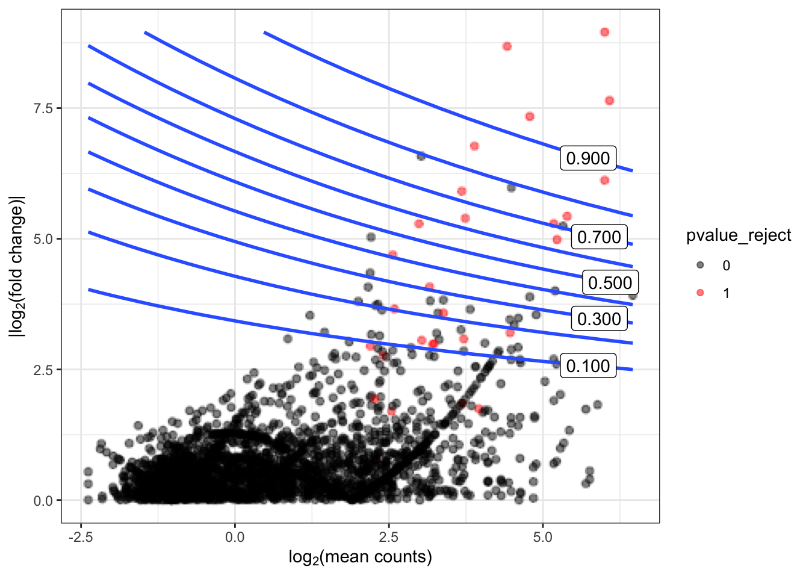{fig-alt="Contour plot showing power for various combinations of mean abundance and fold change"}

### Climate Studies

[clim4health](https://cran.r-project.org/package=clim4health) v0.1.0: Provides functions to obtain, transform and export climate data, including reanalyses, seasonal forecasts and hindcasts, and weather stations for their use in epidemiological analyses. Features include downscaling, verification, spatiotemporal aggregation and threshold-based indicators. See [Duzenli et al. (2026)](https://www.nature.com/articles/s41598-026-45067-2) for downscaling methods and [Manubens et al. (2018)](https://www.sciencedirect.com/science/article/abs/pii/S1364815217302219) for verification methods. There are six vignettes, including [Introduction](https://cran.r-project.org/web/packages/clim4health/vignettes/clim4health_s2dv_cubes.html) and [Overview](https://cran.r-project.org/web/packages/clim4health/vignettes/clim4health_overview.html).

### Computational Methods

[momst](https://cran.r-project.org/package=momst) v0.1.1: Provides functions to solve the Multi-Criteria Minimum Spanning Tree problem on complete weighted graphs by combining the Non-dominated Sorting Genetic Algorithm II with optional Pareto local search operators. Chromosomes are represented as Prufer sequences so that every random individual decodes to a valid spanning tree (Cayley's theorem), avoiding repair operators. Four solver variants are provided: NSGA-II, Path Relinking, Pareto Local Search, and Tabu Search. See [Parraga-Alava et al. (2017)](https://ieeexplore.ieee.org/document/7969432) for background. There are two vignettes: [Getting Started](https://cran.r-project.org/web/packages/momst/vignettes/getting-started.html) and [Comparing the Four MO-MST Variants](https://cran.r-project.org/web/packages/momst/vignettes/momst-variants.html).

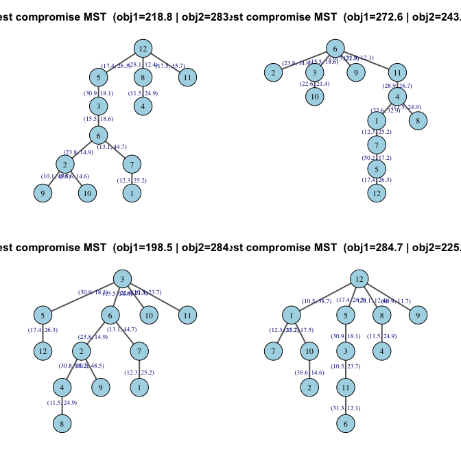{fig-alt="Graphs of spanning tree variants"}

[nmathopencl](https://cran.r-project.org/package=nmathopencl) v0.8.3: Ships statistical and mathematical routines from the `R` internal [`nmath`](https://github.com/SurajGupta/r-source/blob/master/src/nmath/nmath.h)  (`Mathlib`) as [`OpenCL`](https://en.wikipedia.org/wiki/OpenCL) `C` sources under directory `inst/cl/`, with `R` wrappers. Uses the GPU when `OpenCL` is available at compile time and falls back to `stats` equivalents otherwise. Aimed at package developers building custom kernels (for example Bayesian GLMs via suggested package `glmbayes`) using `opencltools` kernel loaders and related helpers. There are thirteen vignettes, including [Package Overview](https://cran.r-project.org/web/packages/nmathopencl/vignettes/Chapter-00.html) and [Case study](https://cran.r-project.org/web/packages/nmathopencl/vignettes/Chapter-10.html).

[sparsediff](https://cran.r-project.org/package=sparsediff) v0.4.0: Implements bindings for the `SparseDiffEngine` `C` library, the sparse Jacobian and Hessian differentiation backend used by `CVXPY` for its Disciplined Nonlinear Programming  extension. Provides low-level routines for building nonlinear expression graphs and evaluating sparse derivatives, intended as a backend for higher-level modeling layers such as `CVXR`. This is the `R` analog of the `sparsediffpy` `Python` package and wraps the same `C` library. See the [vignette](https://cran.r-project.org/web/packages/sparsediff/vignettes/sparsediff.html).

[StochSimR](https://cran.r-project.org/package=StochSimR) v1.1.0: Implements a modular simulation engine for a wide range of stochastic processes. Provides exact and approximate simulation methods for Poisson processes, Brownian motion, discrete- and continuous-time Markov chains, birth-death processes, the Yule pure-birth process, infinitesimal generator matrix utilities, Markovian queuing systems with exact steady-state statistics, Levy processes, Merton jump-diffusion models, Hawkes self-exciting processes, geometric Brownian motion, and Ornstein-Uhlenbeck mean-reverting diffusions. See [Glasserman (2003)](https://link.springer.com/book/10.1007/978-0-387-21617-1) and [Asmussen & Glynn (2007)](https://link.springer.com/book/10.1007/978-0-387-69033-9) for background and the [vignette](https://cran.r-project.org/web/packages/StochSimR/vignettes/introduction.html) for an introduction.

{fig-alt="Plot of simulated Brownian Motion"}

[Uno](https://cran.r-project.org/web/packages/Uno/vignettes/Uno.html) v2.7.4: Provides bindings to [Uno](https://unosolver.readthedocs.io/en/latest/) (Unifying Nonlinear Optimization), a `C++` solver for smooth nonlinearly constrained optimization that unifies Lagrange-Newton methods, including sequential quadratic programming and interior-point methods, by decomposing them into interacting building blocks (constraint-relaxation, inequality-handling, Hessian, and globalization strategies). The framework is described in [Vanaret and Leyffer (2024)](https://arxiv.org/abs/2406.13454). See the [vignette](https://cran.r-project.org/web/packages/Uno/vignettes/Uno.html) for an example.

### Ecology

[BayesFR](https://cran.r-project.org/package=BayesFR) v1.0.1: Enables fitting various functional response models for single- and multi-prey experiments by providing nonlinear prediction functions for `brms` and provides a framework for easily testing hypotheses on trophic interactions. Models can incorporate covariates such as temperature gradients, experimental treatment variables, or random effects that account for grouping in experimental units. See [Rosenbaum and Rall (2018)](https://besjournals.onlinelibrary.wiley.com/doi/10.1111/2041-210X.14372) and [Rosenbaum et al. (2024)](https://besjournals.onlinelibrary.wiley.com/doi/10.1111/2041-210X.13039) for background and the [vignette](https://cran.r-project.org/web/packages/BayesFR/vignettes/bayesfr-intro.html) to get started.

{fig-alt="Plot of number of eaten prey against prey abundance "}

[nicheR](https://cran.r-project.org/package=nicheR) v0.1.0: Provides tools to construct and define virtual ecological niches using ellipsoid geometries. It enables the identification and extraction of suitable environmental areas, simulation of species occurrence points with various sampling strategies, and visualization of niche boundaries and simulated occurrences in both environmental and geographic space. See [Etherington et al. (2009)](https://onlinelibrary.wiley.com/doi/10.1111/j.1365-2699.2008.02041.x) and [Qiao et al. (2015)](https://nsojournals.onlinelibrary.wiley.com/doi/10.1111/ecog.01961) for background. There are six vignettes, including [Visualizing ellipsoids in environmental space](https://cran.r-project.org/web/packages/nicheR/vignettes/plotting_vignette.html) and [Virtual community simulation](https://cran.r-project.org/web/packages/nicheR/vignettes/virtual_communities.html).

{fig-alt="Stability Plot"}

[spacc](https://cran.r-project.org/package=spacc) v0.8.3: Implements `kNN` and `kNCN` sampling methods with a `C++` backend to compute spatial species accumulation curves. Supports Hill numbers, beta diversity partitioning, coverage-based rarefaction and extrapolation, phylogenetic diversity (Faith's PD, mean pairwise distance, mean nearest taxon distance), functional diversity accumulation, diversity-area relationships, endemism-area curves, sampling-effort correction and fragmentation analysis, and species-area relationship models based on extreme value theory. See [Chao et al. (2014)](https://esajournals.onlinelibrary.wiley.com/doi/10.1890/13-0133.1) and [Baselga (2010)](https://onlinelibrary.wiley.com/doi/10.1111/j.1466-8238.2009.00490.x) for background. There are seven vignettes, including [Getting Started](https://cran.r-project.org/web/packages/spacc/vignettes/quickstart.html) and [Diversity Accumulation](https://cran.r-project.org/web/packages/spacc/vignettes/diversity.html).

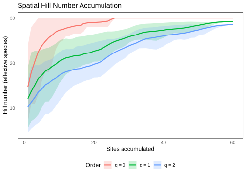{fig-alt="Plot of saptial Hill number accumulation"}

[TemporalModelR](https://cran.r-project.org/package=TemporalModelR) v0.3.0: Provides functions to assist with three major steps for building temporally-explicit ecological niche and species distribution models: (i) preprocessing species and environmental data, (ii) building a niche model and generating temporally-explicit predictions, and (iii) model postprocessing to explore spatiotemporal trends. See [Ingenloff and Peterson (2021](https://besjournals.onlinelibrary.wiley.com/doi/10.1111/2041-210X.13564) and [Blonder (2018)](https://nsojournals.onlinelibrary.wiley.com/doi/10.1111/ecog.03187) for the methodological and theoretical foundations. Modeling with a [GLM](https://cran.r-project.org/web/packages/TemporalModelR/vignettes/V3a_GLM.html) and [Modeling with a Random Forest](https://cran.r-project.org/web/packages/TemporalModelR/vignettes/V3c_RF.html).

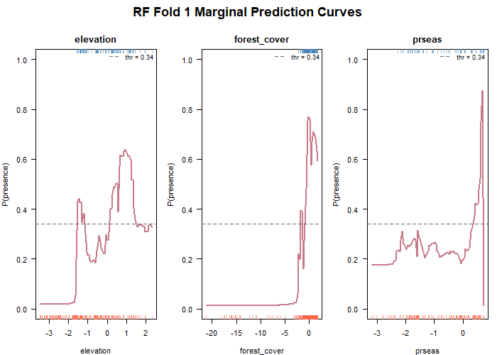{fig-alt="Random Forest Marginal Prediction Curves"}

### Epidemiology

[SmokingHistoryGenerator](https://cran.r-project.org/package=SmokingHistoryGenerator) v7.0.0: Implements an interface to the Cancer Intervention and Surveillance Modeling Network ([CISNET](https://cisnet.cancer.gov/resources/model-registry/lung-models/)) Smoking History Generator microsimulation engine, which synthesizes individual smoking histories (initiation, cessation, intensity) and ages at death from calibrated initiation, cessation, cigarettes-per-day, and mortality tables. See [Jeon et al. (2012)](https://onlinelibrary.wiley.com/doi/10.1111/j.1539-6924.2011.01775.x) for background and look [here](https://github.com/NCI-CISNET/shg-r) to get started.

### Finance

[CamelRatiosIndex](https://cran.r-project.org/package=CamelRatiosIndex) v1.0.0: Computes a composite year-on-year index for bank performance assessment using the CAMEL framework (Capital Adequacy, Asset Quality, Management Efficiency, Earnings, Liquidity). The multivariate weighting scheme employs factor analysis with robust covariance estimation to derive communality-based weights from the correlation matrix of CAMEL ratios. Provides functions for index computation, visualization, and comparison across banks and time periods. The methodology is described in [Ayimah et al. (2023a)](https://stm.bookpi.org/CMWCPIAAMR/article/view/10917) and [Ayimah et al. (2023b)](https://stm.bookpi.org/CMWCPIAAMR/issue/view/1083). See the [vignette](https://cran.r-project.org/web/packages/CamelRatiosIndex/vignettes/introduction.html) for an introduction.

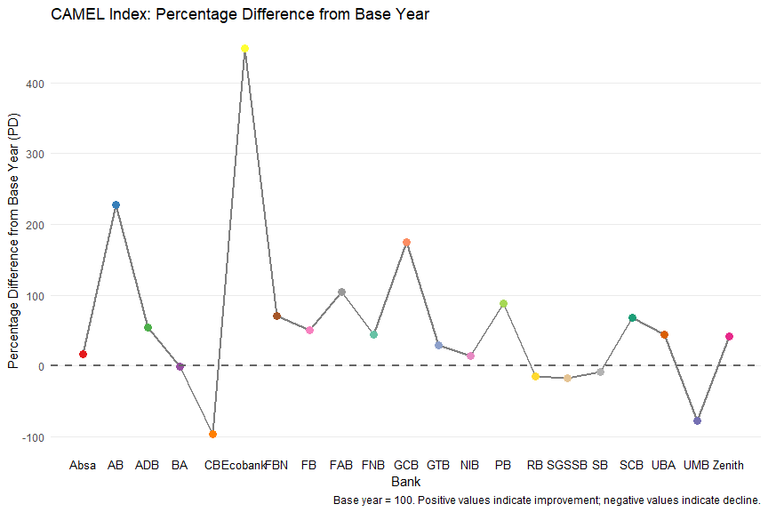{fig-alt="Plot of CAMEL index"}

[JumpDiffSim](https://cran.r-project.org/package=JumpDiffSim) v0.1.0: Implements the [Merton (1976)](https://www.sciencedirect.com/science/article/abs/pii/0304405X76900222) and [Kou (2002)](https://pubsonline.informs.org/doi/10.1287/mnsc.48.8.1086.166) jump-diffusion models through a unified S4 object-oriented interface. Provides exact compound-Poisson asset price simulation, maximum likelihood parameter estimation with Hessian-based standard errors, Wald-type confidence intervals, European option pricing via the Merton analytic series expansion, and publication-quality diagnostic plots. All functionality operates entirely offline without market data dependencies. See the [vignette](https://cran.r-project.org/web/packages/JumpDiffSim/vignettes/JumpDiffSim-intro.html).

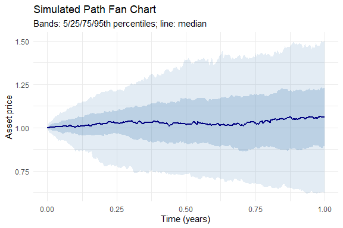{fig-alt="Plot of simulated asset price"}

### Functional Data Analysis

[fda.vi](https://cran.r-project.org/package=fda.vi) v1.0.0: Implements a variational Expectation-Maximization algorithm for smoothing one or multiple functional observations via basis function selection. The algorithm estimates all model parameters simultaneously and automatically, while accounting for within-curve correlation to provide a flexible and computationally efficient framework for smoothing correlated functional data. See [da Cruz et al. (2024)](https://arxiv.org/abs/2405.20758) for a description of the algorithm and the [vignette](https://cran.r-project.org/web/packages/fda.vi/vignettes/introduction.html) for examples. 

{fig-alt="Plot of VEM curve"}

### Machine Learning

[svmodt](https://cran.r-project.org/package=svmodt) v0.1.0: Implements Support Vector Machine Oblique Decision Trees. Recursively builds classification trees using linear Support Vector Machine hyperplanes at each node instead of axis-parallel splits, creating oblique decision boundaries. Features include multiple feature selection methods, dynamic feature subset strategies, class weight support for imbalanced datasets, pruning, and feature penalization. See the [vignette](https://cran.r-project.org/web/packages/svmodt/vignettes/introduction.html).

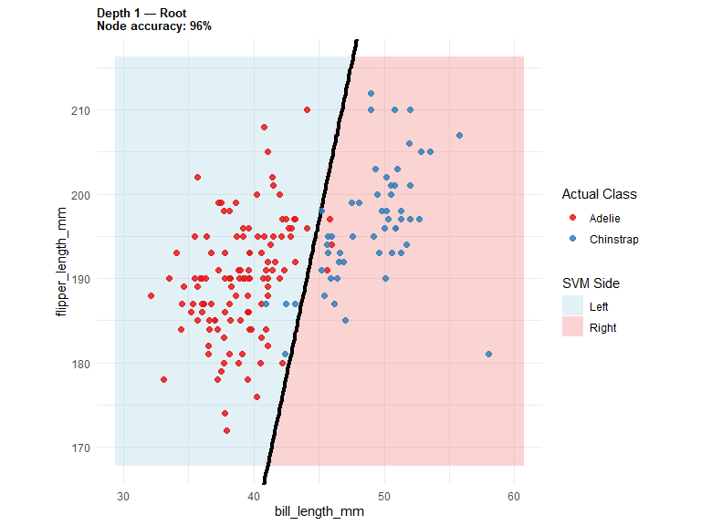{fig-alt="Scatterplot showing SVM decision boundary"}

[yaap](https://cran.r-project.org/package=yaap) v1.0.0: Fits archetypal analysis models, including Euclidean, probabilistic, kernel, and directional variants. Methods include classical archetypal analysis from [Cutler and Breiman (1994)](https://www.tandfonline.com/doi/abs/10.1080/00401706.1994.10485840), PCHA and kernel variants from [Mørup and Hansen (2012)](https://www.sciencedirect.com/science/article/abs/pii/S0925231211006060), probabilistic archetypal analysis from [Seth and Eugster (2016](https://link.springer.com/article/10.1007/s10994-015-5498-8), directional archetypal analysis from [Olsen et al. (2022)](https://www.frontiersin.org/journals/neuroscience/articles/10.3389/fnins.2022.911034/full), AA++ initialization from [Mair and Sjölund (2023)](https://proceedings.neurips.cc/paper_files/paper/2019/file/7f278ad602c7f47aa76d1bfc90f20263-Paper.pdf), coreset-style initialization from [Mair and Brefeld (2019)](https://proceedings.neurips.cc/paper_files/paper/2019/file/7f278ad602c7f47aa76d1bfc90f20263-Paper.pdf), and adapted AIC from [Suleman (2017)](https://ieeexplore.ieee.org/document/8015385). There are four vignettes including an [Introduction](https://cran.r-project.org/web/packages/yaap/vignettes/introduction.html) and [Tidymodels Workflows](https://cran.r-project.org/web/packages/yaap/vignettes/tidymodels.html).

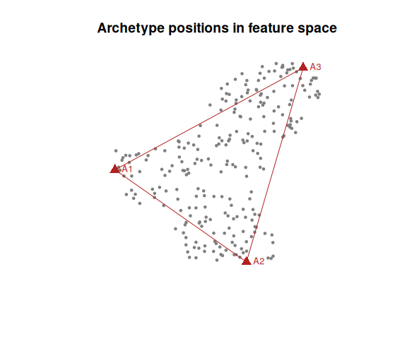{fig-alt="Plot of archetype positions in feature space"}

### Medical Statistics

[BayesTSM](https://cran.r-project.org/package=BayesTSM) v1.0.1: In screening programs, individuals are usually followed up and tested (screened) for the development of a disease. The target disease often develops progressively in stages; for example, healthy (state 1), pre-state disease (state 2), and the disease state (state 3). When the pre-state disease is found during screening, an intervention may prevent disease progression.`BayesTSM` functions estimate a progressive three-state model with censoring due to intervention using Bayesian estimation methods, as described in [Klausch et al. (2023)](https://projecteuclid.org/journals/annals-of-applied-statistics/volume-17/issue-2/A-Bayesian-accelerated-failure-time-model-for-interval-censored-three/10.1214/22-AOAS1669.full). See the [vignette](https://cran.r-project.org/web/packages/BayesTSM/vignettes/bayestsm-userguide.html).

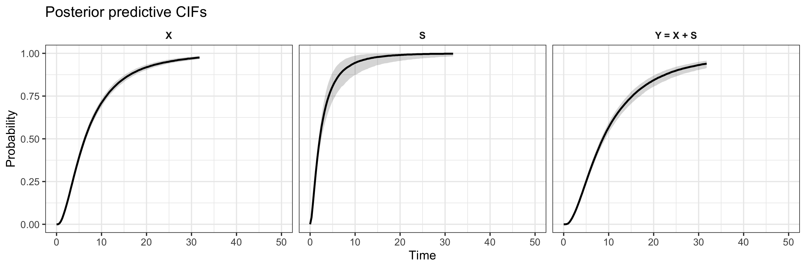{fig-alt="Plot of posterior predictive priors"}

[bayprior](https://cran.r-project.org/package=bayprior) v0.2.12: Provides a toolkit for constructing, validating, and justifying Bayesian priors in clinical trial settings. Implements expert elicitation via quantile matching, the roulette method, and moment matching, linear and logarithmic expert pooling, and prior-data conflict diagnostics. Includes a fully modular `Shiny` application for interactive use. See [Box (1980)](https://www.jstor.org/stable/2982063?origin=crossref) and [Oakley and O'Hagan (2010)](https://shelf.sites.sheffield.ac.uk/) for background. There are six vignettes, including [Introduction](https://cran.r-project.org/web/packages/bayprior/vignettes/bayprior-introduction.html) and [Robust, Sceptical, and Power Priors](https://cran.r-project.org/web/packages/bayprior/vignettes/robust-priors.html).

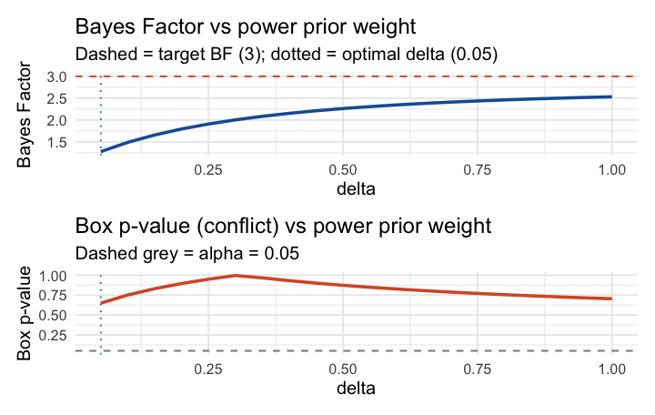{fig-alt="Plot of Bayes factor vs power prior weight"}

:::

::: {.column width="10%"}

:::

::: {.column width="45%"}

### Networks

[netify](https://cran.r-project.org/package=netify) v1.5.3: Provides functions to build, validate, analyze, and visualize network data from dyadic, event, matrix, `igraph`, and `network` inputs. Supports cross-sectional, longitudinal, bipartite, and multi-layer networks, with conversion helpers for common modeling workflows and plotting utilities for exploratory analysis. Network methods are described in [Wasserman and Faust (1994)](https://www.amazon.com/Social-Network-Analysis-Applications-Structural/dp/0521387078), [Cranmer et al. (2021)](https://www.cambridge.org/highereducation/books/inferential-network-analysis/A7797D36A24647AA1F900CE7EF694C7E#overview), and [Minhas et al. (2022)](https://www.cambridge.org/core/journals/political-science-research-and-methods/article/abs/taking-dyads-seriously/823804FA29B988156A574C3F44280317). There are four vignettes, including [Quickstart](https://cran.r-project.org/web/packages/netify/vignettes/quickstart_inference.html) and [Internals](https://cran.r-project.org/web/packages/netify/vignettes/internals.html).

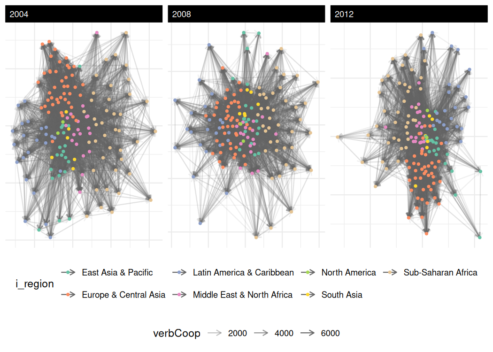{fig-alt="Plots of network over time"}

### Pharmacokinetics

[admixr2](https://cran.r-project.org/package=admixr2) v0.2.0: Provides functions to fit pharmacokinetic/pharmacodynamic (PK/PD) models to aggregate-level data (mean vector and covariance matrix per study) rather than individual-level data. Integrates with the `nlmixr2`/`rxode2` ecosystem via four estimation methods: a First-Order  analytical estimator, a Monte Carlo estimator, a Gauss-Hermite quadrature estimator, and an Iterative Reweighting Monte Carlo estimator. Methods are based on [Välitalo (2021)](https://link.springer.com/article/10.1007/s10928-021-09760-1)  software described in van de [Beek et al. (2025)](https://link.springer.com/article/10.1007/s10928-025-10011-w). See the [vignette](https://cran.r-project.org/web/packages/admixr2/vignettes/admixr2.html) to get started.

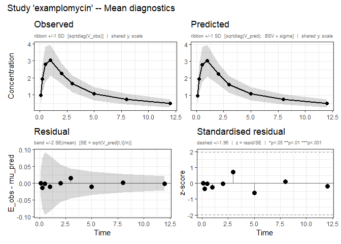{fig-alt="Study diagnostic plots"}

### Probability

[GLBFP](https://cran.r-project.org/package=GLBFP) v0.5.2: Implements nonparametric density estimation with Averaged Shifted Histogram, Linear Blend Frequency Polygon, and General Linear Blend Frequency Polygon estimators and provides pointwise and grid-based estimation workflows, sparse-prefix grid-count computation, plotting helpers, and plug-in bandwidth selection. Methodological background follows [Scott (1992)](https://onlinelibrary.wiley.com/doi/book/10.1002/9780470316849), [Terrell and Scott (1985)](https://www.tandfonline.com/doi/abs/10.1080/01621459.1985.10477163), and [Carbon and Duchesne (2024)](https://link.springer.com/article/10.1007/s10463-023-00883-5). There are nine vignettes, including [Getting started](https://cran.r-project.org/web/packages/GLBFP/vignettes/getting-started.html) and [Package overview](https://cran.r-project.org/web/packages/GLBFP/vignettes/GLBFP_introduction.html).

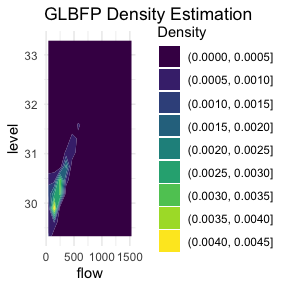{fig-alt="Density plot"}

### Programming

[rsgl](https://cran.r-project.org/package=rsgl) v0.1.0: Generates plots from a database connection and an `SGL` statement. `SGL` is a graphics language designed to look and feel like `SQL` and is especially useful for those familiar with `SQL` who want to specify plots in a similar manner. The `SGL` language is described in [Chapman (2025)](https://arxiv.org/abs/2505.14690). See the vignettes [Get started](https://cran.r-project.org/web/packages/rsgl/vignettes/rsgl.html) and [Example gallery](https://cran.r-project.org/web/packages/rsgl/vignettes/example-gallery.html).

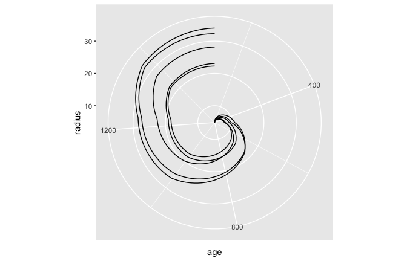{fig-alt="Visualization of age as an angle "}

### Psychometrics

[easyRasch2](https://cran.r-project.org/package=easyRasch2) v1.1.0: Streamlines reproducible Rasch measurement theory analyses for ordinal item-response data, combining estimation routines from `eRm`, `psychotool`, `mirt`, `iarm`, and `lavaan` with consistent diagnostic, plotting, and reporting layers. Covers the four basic psychometric criteria summarized by [Christensen et al. (2021)](https://onlinelibrary.wiley.com/doi/10.1111/sms.13908): unidimensionality, local independence, ordered response category thresholds, and invariance across subgroups, together with item fit, targeting, reliability, category functioning, and descriptive item-response plots. A distinguishing feature is the use of simulation-based critical values to replace rule-of-thumb cutoffs. See the [vignette](https://cran.r-project.org/web/packages/easyRasch2/vignettes/easyRasch2.html).

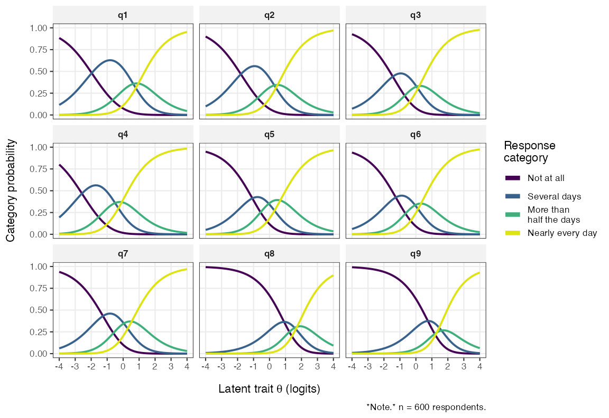{fig-alt="Plot of latent trait probabilities"}

### Risk Analysis

[riskutility](https://cran.r-project.org/package=riskutility) v0.1.0: Provides comprehensive methods to measure disclosure risk and data utility for anonymized and synthetic data. Implements attribution-based risk metrics including Correct Attribution Probability, Targeted CAP, Within Equivalence Class Attribution Probability, and Risk of Attribute Prediction-Induced Disclosure. Also provides distance-based privacy metrics such as Distance to Closest Record, Nearest Neighbor Distance Ratio, and Identical Match Share. Utility assessment includes propensity score analysis, distribution comparisons, and various statistical tests. Methods are based on [Taub et al. (2018)](https://link.springer.com/chapter/10.1007/978-3-319-99771-1_9). See the [vignette](https://cran.r-project.org/web/packages/riskutility/vignettes/riskutility.html).

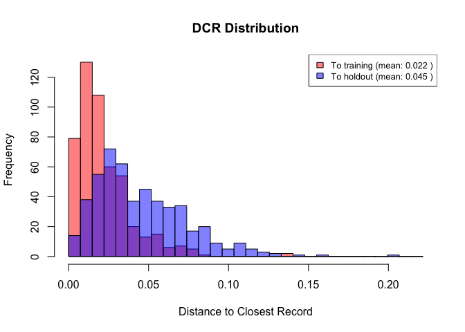{fig-alt="histogram of distance to cloest record"}

### Statistics

[bayesqm](https://cran.r-project.org/package=bayesqm) v0.1.0: Provides a Bayesian factor-analytic framework for Q methodology. Fits a low-rank factor model to Q-sort data with a Student-t likelihood and a hierarchical normal prior on loadings, samples the posterior with `Stan`, resolves rotational ambiguity via the MatchAlign post-processing of [Poworoznek et al. (2025)](https://projecteuclid.org/journals/bayesian-analysis/volume--1/issue--1/Efficiently-Resolving-Rotational-Ambiguity-in-Bayesian-Matrix-Sampling-with-Matching/10.1214/25-BA1544.full) and returns posterior summaries including credible intervals for loadings and factor scores, probabilistic dominant-factor membership, distinguishing and consensus statements, and PSIS-LOO-based factor enumeration following [Vehtari et al. (2017)](https://link.springer.com/article/10.1007/s11222-016-9696-4) with the [Sivula et al. (2025)](https://projecteuclid.org/journals/bayesian-analysis/volume--1/issue--1/Uncertainty-in-Bayesian-Leave-One-Out-Cross-Validation-Based-Model/10.1214/25-BA1569.full) parsimony rule. See the [vignette](https://cran.r-project.org/web/packages/bayesqm/vignettes/bayesqm-intro.html) to get started.

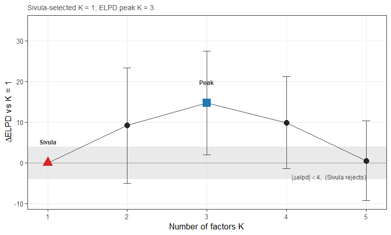{fig-alt="Plot of ELPD peak vs. K"}

[depthR](https://cran.r-project.org/package=depthR) v0.1.8: Provides efficient implementations of multivariate statistical depth functions in arbitrary dimension. Implements Mahalanobis depth, Tukey halfspace depth, Liu simplicial depth, projection depth, spatial depth, depth-based medians, central regions, outlier detection, and depth-depth plots. `C++` backends via `Rcpp` and `RcppEigen` ensure performance at large n and d. See [Liu (1990)](https://projecteuclid.org/journals/annals-of-statistics/volume-18/issue-1/On-a-Notion-of-Data-Depth-Based-on-Random-Simplices/10.1214/aos/1176347507.full), [Serfling and Zuo (2000)](https://projecteuclid.org/journals/annals-of-statistics/volume-28/issue-2/General-notions-of-statistical-depth-function/10.1214/aos/1016218226.full), and [Vardi and Zhang (2000)](https://www.pnas.org/doi/abs/10.1073/pnas.97.4.1423) for background, and the [vignette](https://cran.r-project.org/web/packages/depthR/vignettes/depthR.html) for an introduction.

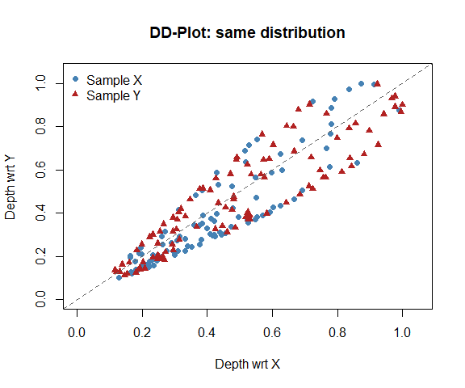{fig-alt="The depth-depth plot is the multivariate analog of the QQ-plot"}

[dppca](https://cran.r-project.org/package=dppca) v0.1.0: Provides tools for differentially private principal component analysis visualization and includes functions for estimating private principal component directions, constructing private scree and proportion of variance explained summaries, and visualizing two-dimensional PCA score summaries using additive and sparse histogram mechanisms. Group-wise score visualizations and an interactive `shiny` app are also provided. See [Kim and Jung (2025)](https://onlinelibrary.wiley.com/doi/10.1002/sam.70053),  [Dwork and Roth (2014)](https://www.emerald.com/fttcs/article-abstract/9/3-4/211/1332491/The-Algorithmic-Foundations-of-Differential?redirectedFrom=fulltext) and [Ramsay and Spicker (2025)](https://arxiv.org/abs/2501.14095) for background. There are four vignettes, including [Algorithms](https://cran.r-project.org/web/packages/dppca/vignettes/algorithms.html) and [PC Directions in dppca](https://cran.r-project.org/web/packages/dppca/vignettes/pc_direction.html).

[ernest](https://cran.r-project.org/package=ernest) v1.2.5: Bayesian evidence estimation and posterior inference with the nested sampling algorithm, described in [Skilling (2006)](https://projecteuclid.org/journals/bayesian-analysis/volume-1/issue-4/Nested-sampling-for-general-Bayesian-computation/10.1214/06-BA127.full) and [Buchner (2023)](https://projecteuclid.org/journals/statistics-surveys/volume-17/issue-none/Nested-sampling-methods/10.1214/23-SS144.full), along with S3 methods for simulating uncertainty and creating visualizations. See the vignettes [Nested Sampling](https://cran.r-project.org/web/packages/ernest/vignettes/nested-sampling-with-ernest.html) and [More Examples](https://cran.r-project.org/web/packages/ernest/vignettes/more-ernest-runs.html).

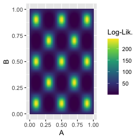{fig-alt="Plot showing ability to properly integrate across multimodal likelihood surfaces. "}

[gkrreg](https://cran.r-project.org/package=gkrreg) v0.4.0: Implements the Gaussian Kernel Robust Regression method proposed by [De Carvalho, Lima Neto and Ferreira (2017)](https://www.sciencedirect.com/science/article/abs/pii/S0925231216315508), which re-weights observations iteratively using the Gaussian kernel so that poorly-fitted observations receive small weights, yielding resistance to Y-space outliers, X-space outliers and leverage points. Provides three estimators for the kernel width hyper-parameter: Caputo, pairwise median, and residual variance. Inference is accomplished via an analytic sandwich variance estimator or via bootstrap. Six real datasets from the robust regression literature are included to facilitate reproducible comparisons. See the [vignette](https://cran.r-project.org/web/packages/gkrreg/vignettes/introduction.html).

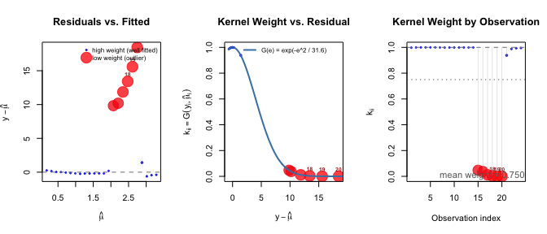{fig-alt="Three residual plots "}

[picreg](https://cran.r-project.org/package=picreg) v0.1.4 Implements the Pivotal Information Criterion  developed by [Sardy, van Cutsem, and van de Geer](https://arxiv.org/abs/2603.04172). PIC is a general framework to improve on BIC and LASSO for fitting sparse regression linear models in which the regularization parameter 𝜆 is selected automatically from a pivotal statistic. Functions fit the resulting estimators across six response distributions, Gaussian, binomial, Poisson, exponential, Gumbel, and Cox, and three sparsity-inducing penalties; (LASSO), the Smoothly Clipped Absolute Deviation (SCAD), and Minimax Concave Penalty (MCP). See the [vignette](https://cran.r-project.org/web/packages/picreg/vignettes/vignette.html) for an introduction.

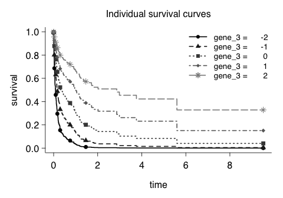{fig-alt="Plot showing individual survival curves"}

[SimplexRegression](https://cran.r-project.org/package=SimplexRegression) v0.1.5: Fits and analyzes simplex regression models with either fixed or parametric mean link functions. Implements the simplex probability density function, cumulative distribution function, quantile function, random number generation, and variance evaluation. Offers several fixed and parametric link functions for the mean submodel, tools for residual analysis and diagnostic plotting, hypothesis testing procedures, and influence measures such as Cook's distance and leverage. Includes the Scout Score criterion for model selection, enabling comprehensive inference and diagnostic analysis within the simplex regression framework. See [Barndorff-Nielsen and Jorgensen (1991)](https://www.sciencedirect.com/science/article/pii/0047259X9190008P) and [Justino and Cribari-Neto (2026)](https://www.sciencedirect.com/science/article/abs/pii/S0307904X25007863) for more details and the [vignette](https://cran.r-project.org/web/packages/SimplexRegression/vignettes/relative-humidity.html) for examples.

[vbm](https://cran.r-project.org/package=vbm) v0.1.0: Provides methods for variance-based sensitivity analysis and weighting estimators in observational studies based on the methodology by [Huang & Pimentel (2025)](https://academic.oup.com/biomet/article-abstract/112/1/asae040/7731116?redirectedFrom=fulltext&login=false) Includes bootstrap inference, bias bounds estimation, and visualization tools for sensitivity parameters. See the [vignette](https://cran.r-project.org/web/packages/vbm/vignettes/vbm.html).

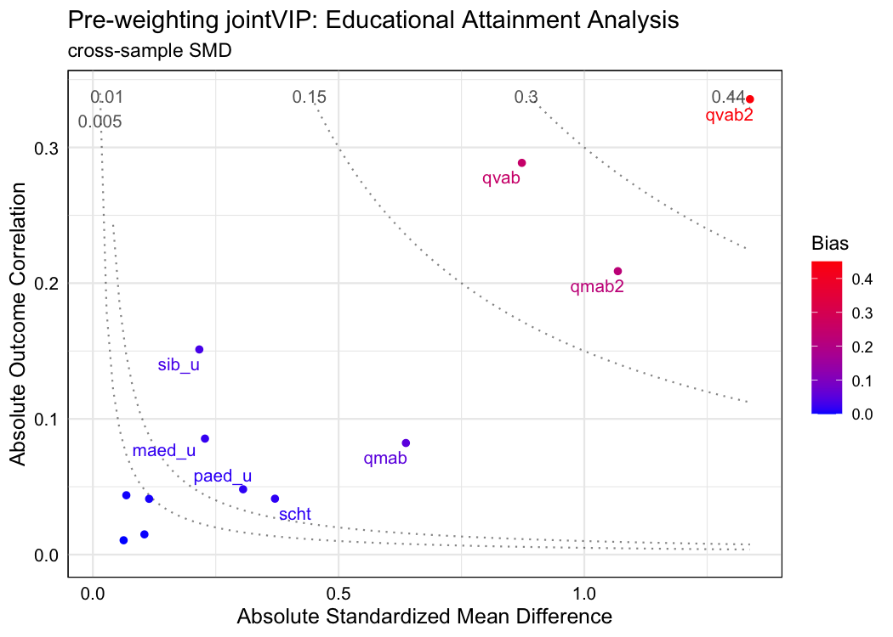{fig-alt="Plot showing variables that should be prioritized for adjustment based on both treatment and outcome, while traditional love plot only considers treatment imbalance"}

### Time Series

[bvars](https://cran.r-project.org/package=bvars) v1.0: Provides fast and efficient procedures for Bayesian estimation and forecasting using state-of-the-art vector autoregressions. Includes the model proposed by [Chan (2020)](https://www.tandfonline.com/doi/full/10.1080/07350015.2018.1451336), a Bayesian vector autoregression with Minnesota priors and a flexible structure of the error term that permits conditional multivariate normal or Student’s t distributions, as well as homoskedastic or heteroskedastic specifications with a common volatility modelled by centred or non-centred Stochastic Volatility. Additional features include predictive analyses using density forecasting and forecast-error variance decompositions. See [README](https://cran.r-project.org/web/packages/bvars/readme/README.html) for an example.

[fable.intermittent](https://cran.r-project.org/package=fable.intermittent) v0.1.1: Extends the `fable` framework to support forecasting methods specifically designed for intermittent time series data, where demand occurs sporadically with many zero values. All methods produce probabilistic forecasts returned as 'distributional' objects. The returned forecasts can be used to evaluate accuracy, plot and print the results. Methods include: [Harvey, Fernandes (1989)](https://www.tandfonline.com/doi/abs/10.1080/07350015.1989.10509750), [Willemain, Smart, Schwarz (2004)](https://www.sciencedirect.com/science/article/abs/pii/S016920700300013X) and several others. See the [vignette](https://cran.r-project.org/web/packages/fable.intermittent/vignettes/fable.intermittent.html).

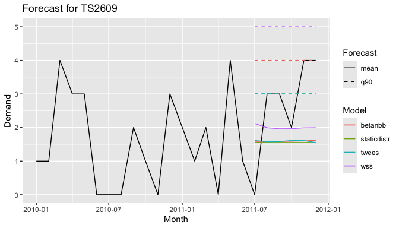{fig-alt="Time series with multiple forecasts"}

[muse](https://cran.r-project.org/package=muse) v0.1.0: Implements the Power / Trend / Seasonal (PTS) model, a unified state-space framework based on the Multiple Source of Error model. It brings the trend, seasonal and irregular component models of [Harvey (1989)](https://www.cambridge.org/core/books/forecasting-structural-time-series-models-and-the-kalman-filter/CE5E112570A56960601760E786A5E631), [Durbin and Koopman (2012)](https://academic.oup.com/book/16563?login=false) and others together under a single estimation, selection and forecasting interface, with an optional Box-Cox power transformation. Models are estimated by maximum likelihood through the Kalman filter and smoother, with automatic component selection by information criteria. See the [vignette](https://cran.r-project.org/web/packages/muse/vignettes/pts.html).

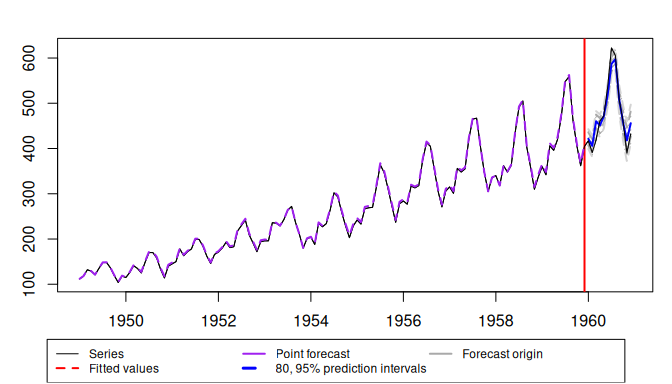{fig-alt="Time series with forecst"}

### Utilities

[ahocorasick](https://cran.r-project.org/package=ahocorasick) v0.2.0: Provides fast multi-pattern string matching using the '`Aho-Corasick` algorithm, powered by the `Rust` `aho-corasick` crate. It builds reusable automatons for detecting matches, counting matches, locating characters, extracting matched text, and replacing matches in character vectors. See [Aho and Corasick (1975)](https://dl.acm.org/doi/10.1145/360825.360855) for more information on the  `Aho-Corasick` algorithm and the [vignette](https://cran.r-project.org/web/packages/ahocorasick/vignettes/benchmarks.html) for an example.

[mx.crypto](https://cran.r-project.org/package=mx.crypto) v0.2.0: Provides `Olm` and `Megolm` encryption ratchet primitives for the [Matrix messaging protocol](https://matrix.org/), wrapping the `vodozemac` `Rust` crate. Provides device-key generation, one-time-key management, 1:1 `Olm` sessions, and `Megolm` group sessions. Pairs with the `mx.api` package, which handles `Matrix HTTP` transport. See the [vignette](https://cran.r-project.org/web/packages/mx.crypto/vignettes/security-audit.html).

[pkgmatch](https://cran.r-project.org/package=pkgmatch) v0.5.4: Provides functions to find `R` packages from `CRAN`, `rOpenSci`, or `Bioconductor` corpora. Packages can be matched to general text descriptions, to names of installed packages, or to local paths to entire source repositories. The package is used to list the most similar packages for each new submission to the `rOpenSci` software [peer-review program](https://zenodo.org/records/18885936). There are three vignettes, including an [introduction](https://cran.r-project.org/web/packages/pkgmatch/vignettes/pkgmatch.html) and [Example applications](https://cran.r-project.org/web/packages/pkgmatch/vignettes/A_extended-use-case.html).

:::

::::