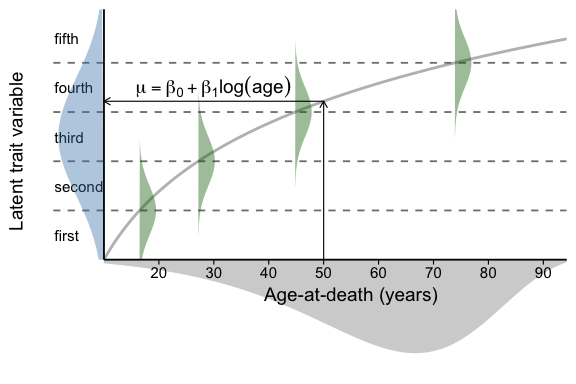
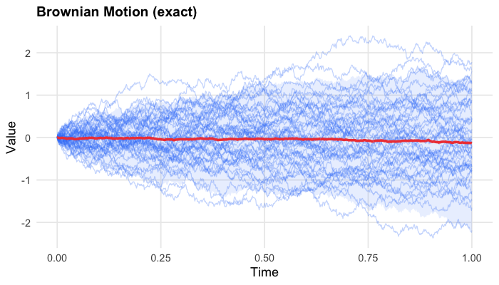
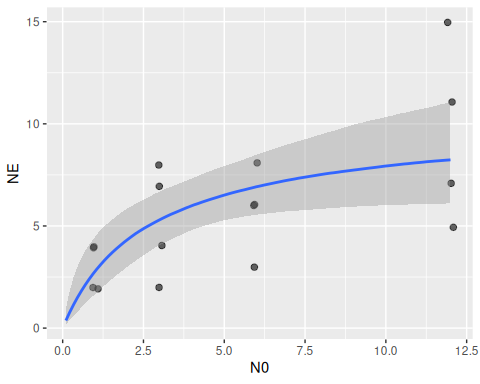
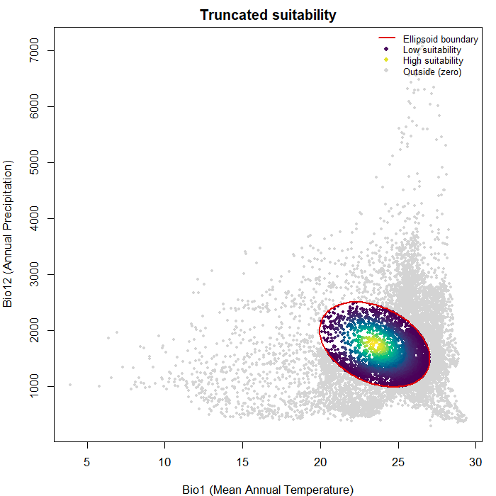
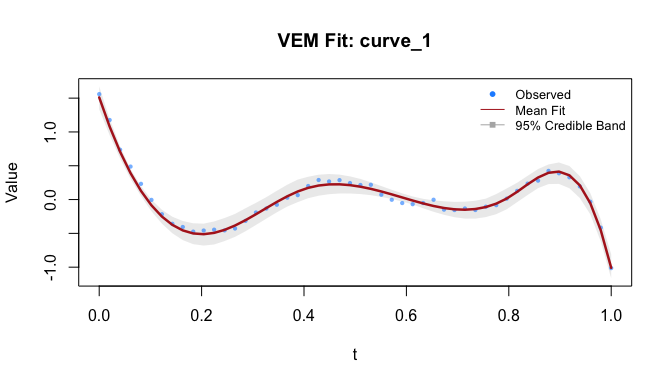

Four hundred twelve new packages were submitted to CRAN in June. Here are my Top 40 picks in xxxx categories: Artificial Intelligence, Computational Methods, Ecology, Education, Finance, Functional Data Analysis, Genomics, Machine Learning, Medical Statistics, Meta Analysis, Probability, Process Control, Psychometrics, Statistics, Surveys, Time Series, Utilities, and Visualization.

:::: {.columns}

::: {.column width="45%"}

{fig-alt=""}

### Bioarchaeology

[baytaAAR](https://cran.r-project.org/package=baytaAAR) v1.0.3: Provides Bayesian age estimation for bioarchaeological skeletal data using ordinal probit regression models implemented in `JAGS` and `NIMBLE`. The package is designed to handle multiple ordinal traits of adult individuals and incorporates a Gompertz prior on age to reflect population-level mortality. It accounts for estimation uncertainties and supports full customization of model parameters and Markov Chain Monte Carlo settings. For more details see [Müller-Scheeßel et al. (2026)](https://onlinelibrary.wiley.com/doi/10.1002/ajpa.70289). There are five vignetes including [Introduction](https://cran.r-project.org/web/packages/baytaAAR/vignettes/baytaAAR.html) and [Mathematical background](https://cran.r-project.org/web/packages/baytaAAR/vignettes/mathematical_background.html).

{fig-alt="Plot of distribution of age to death"}

### Computational Methods

[momst](https://cran.r-project.org/package=momst) v0.1.1: Provides functions to solve the Multi-Criteria Minimum Spanning Tree problem on complete weighted graphs by combining the Non-dominated Sorting Genetic Algorithm II with optional Pareto local search operators. Chromosomes are represented as Prufer sequences so that every random individual decodes to a valid spanning tree (Cayley's theorem), avoiding repair operators. Four solver variants are provided: pure NSGA-II, Path Relinking, Pareto Local Search, and Tabu Search. See Parraga-Alava et al. (2017)](https://ieeexplore.ieee.org/document/7969432) for background. There are two vignettes: [Getting Started](https://cran.r-project.org/web/packages/momst/vignettes/getting-started.html) and [Comparing the Four MO-MST Variants](https://cran.r-project.org/web/packages/momst/vignettes/momst-variants.html).

{fig-alt="Graphs of spanning tree variants"}

[nmathopencl](https://cran.r-project.org/package=nmathopencl) v0.8.3: Ships statistical and mathematical routines from the `R` internal [`nmath`](https://github.com/SurajGupta/r-source/blob/master/src/nmath/nmath.h)  (`Mathlib`) as [`OpenCL`](https://en.wikipedia.org/wiki/OpenCL) C sources under directory `inst/cl/`, with `R` wrappers that use the GPU when `OpenCL` is available at compile time and fall back to `stats` equivalents otherwise. Aimed at package developers building custom kernels (for example Bayesian GLMs via suggested package `glmbayes`) using `opencltools` kernel loaders and related helpers. There are thirteen vignetttes including [Package Overview](https://cran.r-project.org/web/packages/nmathopencl/vignettes/Chapter-00.html) and [Case study](https://cran.r-project.org/web/packages/nmathopencl/vignettes/Chapter-10.html).

[StochSimR](https://cran.r-project.org/package=StochSimR) v1.1.0: Implements a modular simulation engine for a wide range of stochastic processes. Provides exact and approximate simulation methods for Poisson processes (homogeneous and inhomogeneous), Brownian motion (standard, drifted, and bridge), discrete- and continuous-time Markov chains, birth-death processes, the Yule pure-birth process, infinitesimal generator matrix utilities, Markovian queuing systems (M/M/1, M/M/c, M/M/c/K) with exact steady-state statistics, Levy processes (gamma, normal inverse Gaussian, variance-gamma, alpha-stable), Merton jump-diffusion models, Hawkes self-exciting processes, geometric Brownian motion, and Ornstein-Uhlenbeck mean-reverting diffusions. See [Glasserman (2003)](https://link.springer.com/book/10.1007/978-0-387-21617-1) and [Asmussen & Glynn (2007)](https://link.springer.com/book/10.1007/978-0-387-69033-9) for background and the [vignette](https://cran.r-project.org/web/packages/StochSimR/vignettes/introduction.html) for an introduction.

{fig-alt="Plot of simulated Brownian Motion"}

[Uno](https://cran.r-project.org/web/packages/Uno/vignettes/Uno.html) v2.7.4: Provides bindings to [Uno](https://unosolver.readthedocs.io/en/latest/) (Unifying Nonlinear Optimization), a C++ solver for smooth nonlinearly constrained optimization. 'Uno' unifies Lagrange-Newton methods, including sequential quadratic programming and interior-point methods, by decomposing them into interacting building blocks (constraint-relaxation, inequality-handling, Hessian, and globalization strategies) that can be freely combined. The framework is described in [Vanaret and Leyffer (2024)](https://arxiv.org/abs/2406.13454). See the [vignette](https://cran.r-project.org/web/packages/Uno/vignettes/Uno.html) for an example.

### Ecology

[BayesFR](https://cran.r-project.org/package=BayesFR) v1.0.1: Enables fitting various functional response models for single- and multi-prey experiments by providing nonlinear prediction functions for `brms` and provides a framework for easily testing hypotheses on trophic interactions. Models can incorporate covariates such as temperature gradients, experimental treatment variables, or random effects that account for grouping in experimental units. See [Rosenbaum and Rall (2018)](https://besjournals.onlinelibrary.wiley.com/doi/10.1111/2041-210X.14372) and [Rosenbaum et al. (2024)](https://besjournals.onlinelibrary.wiley.com/doi/10.1111/2041-210X.13039) for background and the [vignette](https://cran.r-project.org/web/packages/BayesFR/vignettes/bayesfr-intro.html) to get started.

{fig-alt="Plot of number of eaten prey against prey abundance "}

[nicheR](https://cran.r-project.org/package=nicheR) v0.1.0: Provides tools for researchers and modelers to construct and define virtual ecological niches using ellipsoid geometries. It enables the identification and extraction of suitable environmental areas, simulation of species occurrence points with various sampling strategies, and visualization of niche boundaries and simulated occurrences in both environmental and geographic space. See [Etherington et al. (2009)](https://onlinelibrary.wiley.com/doi/10.1111/j.1365-2699.2008.02041.x) and [Qiao et al. (2015)](https://nsojournals.onlinelibrary.wiley.com/doi/10.1111/ecog.01961) for background. There are six vignettes including [Visualizing ellipsoids in environmental space](https://cran.r-project.org/web/packages/nicheR/vignettes/plotting_vignette.html) and [Virtual community simulation](https://cran.r-project.org/web/packages/nicheR/vignettes/virtual_communities.html).

{fig-alt="Stability Plot"}

[spacc](https://cran.r-project.org/package=spacc) v0.8.3: Implements `kNN` and `kNCN` sampling methods with a `C++` backend to compute spatial species accumulation curves. Supports Hill numbers, beta diversity partitioning, coverage-based rarefaction and extrapolation, phylogenetic diversity (Faith's PD, mean pairwise distance, mean nearest taxon distance), functional diversity accumulation, diversity-area relationships, endemism-area curves, sampling-effort correction and fragmentation analysis, and species-area relationship models based on extreme value theory. See [Chao et al. (2014)](https://esajournals.onlinelibrary.wiley.com/doi/10.1890/13-0133.1) and [Baselga (2010)](https://onlinelibrary.wiley.com/doi/10.1111/j.1466-8238.2009.00490.x) for background. There are seven vignettes including [Getting Started](https://cran.r-project.org/web/packages/spacc/vignettes/quickstart.html) and [Diversity Accumulation](https://cran.r-project.org/web/packages/spacc/vignettes/diversity.html).

{fig-alt="Plot of saptial Hill number accumulation"}

[TemporalModelR](https://cran.r-project.org/package=TemporalModelR) v0.3.0: Provides functions to assist with three major steps for building temporally-explicit ecological niche and species distribution models: (i) preprocessing species and environmental data, (ii) building a niche model and generating temporally-explicit predictions, and (iii) model postprocessing to explore spatiotemporal trends. See [Ingenloff and Peterson (2021](https://besjournals.onlinelibrary.wiley.com/doi/10.1111/2041-210X.13564) and [Blonder (2018)](https://nsojournals.onlinelibrary.wiley.com/doi/10.1111/ecog.03187) for the methodological and theoretical foundations. Modeling with a [GLM](https://cran.r-project.org/web/packages/TemporalModelR/vignettes/V3a_GLM.html) and [Modeling with a Random Forest](https://cran.r-project.org/web/packages/TemporalModelR/vignettes/V3c_RF.html).

{fig-alt="Random Forest Marginal Prediction Curves"}

### Epidemiology

[SmokingHistoryGenerator](https://cran.r-project.org/package=SmokingHistoryGenerator) v7.00: Implements an interface to the Cancer Intervention and Surveillance Modeling Network ([CISNET](https://cisnet.cancer.gov/resources/model-registry/lung-models/)) Smoking History Generator microsimulation engine, which synthesizes individual smoking histories (initiation, cessation, intensity) and ages at death from calibrated initiation, cessation, cigarettes-per-day, and mortality tables. See [Jeon et al. (2012)](https://onlinelibrary.wiley.com/doi/10.1111/j.1539-6924.2011.01775.x) for background and look [here](https://github.com/NCI-CISNET/shg-r) to get started.

### Functional Data Analysis

[fda.vi](https://cran.r-project.org/package=fda.vi) v1.0.0: Implements a variational Expectation-Maximization algorithm for smoothing one or multiple functional observations via basis function selection. The algorithm estimates all model parameters simultaneously and automatically, while accounting for within-curve correlation to provide a flexible and computationally efficient framework for smoothing correlated functional data. See [da Cruz et al. (2024)](https://arxiv.org/abs/2405.20758) for a description of the algorithm and the [vignette]() for examples. 

{fig-alt="Plot of VEM curve"}

### Finance

:::

::: {.column width="10%"}

:::

::: {.column width="45%"}

### Statistics

END

:::

::::