X
 of the new packages submitted to CRAN in March were still there in mid-March. Here are my Top 40 picks in seventeen categories: Artificial Intelligence, Biology, Buddhism, Climate Science, Computational Methods, Data, Ecology, Epidemiology, Genomics, Machine Learning, Medical Applications, Physics, Statistics, Surveys, Time Series, Utilities, and Visualization.

:::: {.columns}

::: {.column width="45%"}

{fig-alt=""}

### Causal Inference

[causaldef](https://cran.r-project.org/package=causaldef) v0.2.0: Implements Le Cam deficiency theory for causal inference, as described in [Akdemir (2026)](https://zenodo.org/records/18367347). Provides theorem-backed bounds together with computable proxy diagnostics for information loss from confounding, selection bias, and distributional shift. Supports continuous, binary, count, survival, and competing risks outcomes. Key features include propensity-score total-variation deficiency proxies, negative control diagnostics, policy regret bounds, and sensitivity analysis via confounding frontiers. There are eleven vignettes including [Introduction](https://cran.r-project.org/web/packages/causaldef/index.html)
and [Survival Analysis](https://cran.r-project.org/web/packages/causaldef/vignettes/survival_analysis.html).

[CausalSpline](https://cran.r-project.org/package=CausalSpline) v0.1.0: Estimates nonlinear causal dose-response functions for continuous treatments using spline-based methods under standard causal assumptions (unconfoundedness / ignorability). Implements three identification strategies: Inverse Probability Weighting via the generalised propensity score, G-computation (outcome regression), and a doubly-robust combination.  Pointwise confidence bands andfragility diaanostics are provided. See [Hirano and Imbens (2004)](https://onlinelibrary.wiley.com/doi/10.1111/j.1468-0262.2004.00481.x) for background and the [vignette](https://cran.r-project.org/web/packages/CausalSpline/vignettes/introduction.html) for examples.

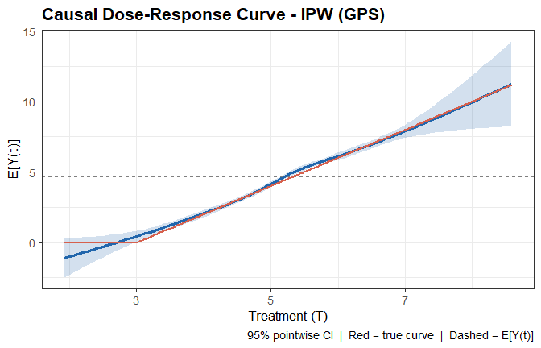{fig-alt="Example of causal dose response curve"}

[flexCausal](https://cran.r-project.org/package=flexCausal) v0.1.0: Provides doubly robust one-step and targeted maximum likelihood estimators for average causal effects in acyclic directed mixed graphs with unmeasured variables. Automatically determines whether the treatment effect is identified via backdoor adjustment or the extended front-door functional, and dispatches to the appropriate estimator. Supports incorporation of machine learning algorithms via `SuperLearner` and cross-fitting for nuisance estimation. Methods are described in [Guo and Nabi (2024)](https://arxiv.org/abs/2409.03962). See the [vignette](https://cran.r-project.org/web/packages/flexCausal/vignettes/introduction.html).

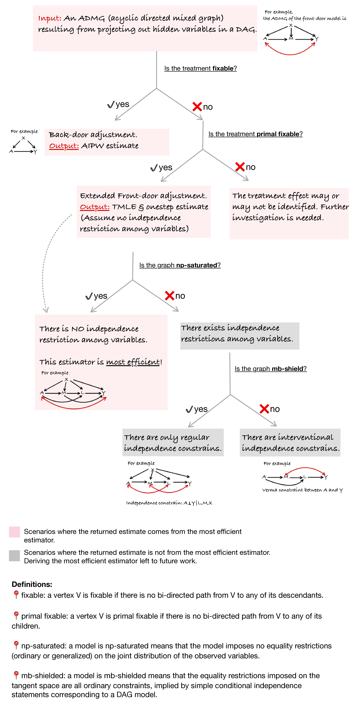{fig-alt="Schematic of workflow"}

### Computational Methods

[ROOT](https://cran.r-project.org/package=ROOT)nv0.1.1: Implements a general framework for globally optimizing user-specified objective functionals over interpretable binary weight functions represented as sparse decision trees, called ROOT (Rashomon Set of Optimal Trees). It searches over candidate trees to construct a Rashomon set of near-optimal solutions and derives a summary tree highlighting stable patterns in the optimized weights. ROOT includes a built-in generalizability mode for identifying subgroups in trial settings for transportability analyses [Parikh et al. (2025)](https://www.tandfonline.com/doi/full/10.1080/01621459.2025.2495319). There are three vignettes including [Quickstart Guide](https://cran.r-project.org/web/packages/ROOT/vignettes/quickstart.html) and [Optimization Path Example](https://cran.r-project.org/web/packages/ROOT/vignettes/optimization_path_example.html).

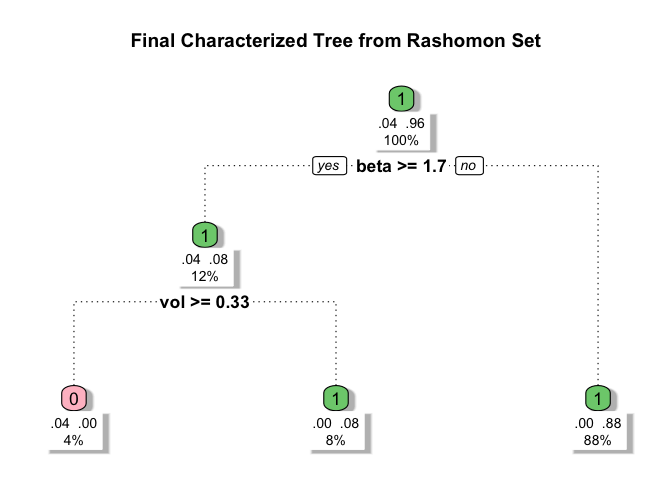{fig-alt="Plot of tree from the Rashomon set"}

### Data

[fred](https://cran.r-project.org/package=fred) v0.2.0: Provides tidy access to economic data from the [Federal Reserve Economic Data' (FRED) API](https://fred.stlouisfed.org/docs/api/fred/) which is maintained by the Federal Reserve Bank of St. Louis and contains over 800,000 time series from 118 sources covering GDP, employment, inflation, interest rates, trade, and more. Functions include fetch series observations, search for series, browse categories, releases, and tags, and retrieve series metadata. Real-time and vintage helpers built on [ALFRED](https://alfred.stlouisfed.org/) return a series as it appeared on a given date, the first-release version, every revision, or a panel of selected vintages. Look [here](https://github.com/charlescoverdale/fred) for an introduction. 

[readmoaa](https://cran.r-project.org/package=readnoaa) v0.1.1: Provides tidy access to climate and weather data from the National Oceanic and Atmospheric Administration (**NOAA**) via the [National Centers for Environmental Information' (NCEI) Data Service API](https://www.ncei.noaa.gov/access/services/data/v1). Covers daily weather observations, monthly and annual summaries, and 30-year climate normals from over 100,000 stations across 180 countries. No API key is required. Dedicated functions handle the most common datasets, while a generic fetcher provides access to all NCEI datasets. See [README](https://cran.r-project.org/web/packages/readnoaa/readme/README.html) to get started.

### Ecology

[FuelDeep3D](https://cran.r-project.org/package=FuelDeep3D) v0.1.1: Provides tools for preprocessing, feature extraction, and segmentation of three-dimensional forest point clouds derived from terrestrial laser scanning. Functions support creating height-above-ground (HAG) metrics, tiling, and sampling point clouds, generating training datasets, applying trained models to new point clouds, and producing per-point fuel classes such as stems, branches, foliage, and surface fuels. Deep learning segmentation relies on the PointNeXt architecture described by [Qian et al. (2022)](https://arxiv.org/abs/2206.04670) while ground classification utilizes the Cloth Simulation Filter algorithm by [Zhang et al. (2016)](https://www.mdpi.com/2072-4292/8/6/501). See [README](https://cran.r-project.org/web/packages/FuelDeep3D/readme/README.html) for examples.

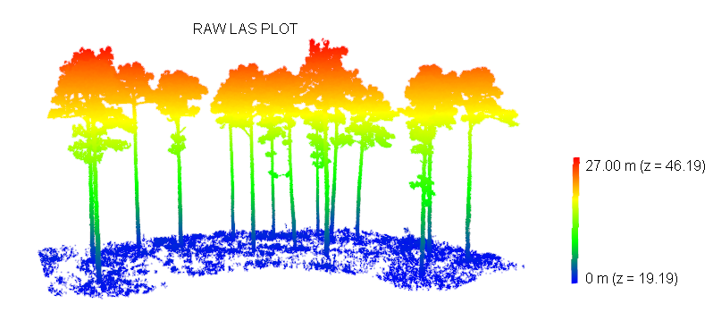{fig-alt="Example of Ras Las plot"}

[pep725](https://cran.r-project.org/package=pep725) v1.0.2: Provides a framework for quality-aware analysis of ground-based phenological data from the PEP725 Pan-European Phenology Database [Templ et al. (2018)](https://link.springer.com/article/10.1007/s00484-018-1512-8) and [Templ et al. (2026)](https://nph.onlinelibrary.wiley.com/doi/10.1111/nph.70869) and similar observation networks. Implements station-level data quality grading, outlier detection, phenological normals (climate baselines), anomaly detection, elevation and latitude gradient estimation with robust regression, spatial synchrony quantification, partial least squares regression for identifying temperature-sensitive periods, and sequential Mann-Kendall trend analysis. There are four vignettes including [Getting Started](https://cran.r-project.org/web/packages/pep725/vignettes/getting-started.html) and [Phenological Analysis](https://cran.r-project.org/web/packages/pep725/vignettes/phenological-analysis.html).

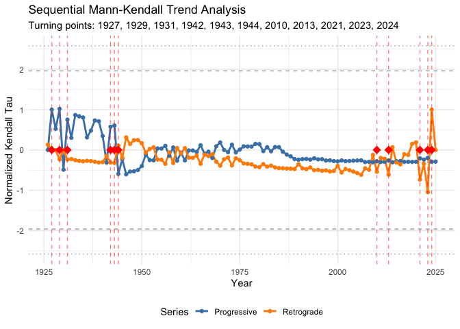{fig-alt="Plot of Sequential Mann-Kendall Trend Analysis"}

[simpowa](https://cran.r-project.org/package=simpowa) v1.0.3: Uses simulations from generalized linear mixed-effects models to incorporate random effects across multiple sources and levels of variation, and a dispersion parameter to account for overdispersion and capture unexplained variability. Covers design scenarios for both short-term and long-term trials evaluating the impact of single or combined vector control interventions. Methods build on [Kipingu et al. (2025)](https://link.springer.com/article/10.1186/s12936-025-05454-y) and [Johnson et al. (2015)](https://besjournals.onlinelibrary.wiley.com/doi/10.1111/2041-210X.12306). See [REDME](https://cran.r-project.org/web/packages/simpowa/readme/README.html) tp get started.

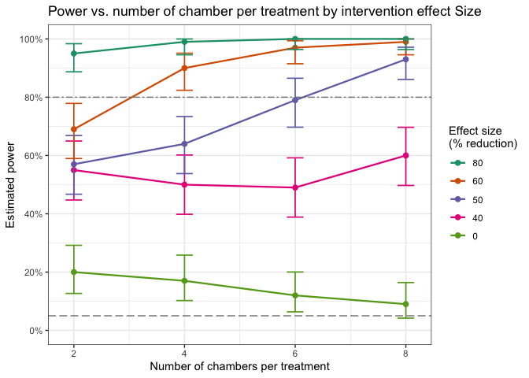{fig-alt="Plot of power vs number of chambers per treatment"}

[soilFlux](https://cran.r-project.org/package=soilFlux) v0.1.5: Implements a physics-informed one-dimensional convolutional neural network (CNN1D-PINN) for estimating the complete soil water retention curve (SWRC) as a continuous function of matric potential, from soil texture, organic carbon, bulk density, and depth. The network architecture ensures strict monotonic decrease of volumetric water content with increasing suction by construction, through cumulative integration of non-negative slope outputs (monotone integral architecture). Four physics-based residual constraints adapted from [Norouzi et al. (2025)](https://agupubs.onlinelibrary.wiley.com/doi/10.1029/2024WR038149). See [README](https://cran.r-project.org/web/packages/soilFlux/readme/README.html) and the [vignette](https://cran.r-project.org/web/packages/soilFlux/vignettes/introduction.html).

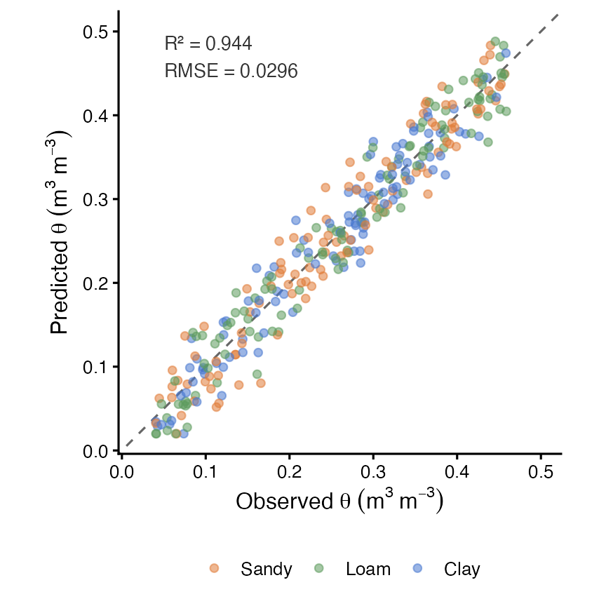{fig-alt="Plot of predicted versus observed values"}

### Health Technology Assessment

[drMAIC](https://cran.r-project.org/package=drMAIC) v0.1.0: Implements Doubly Robust Matching-Adjusted Indirect Comparison for population-adjusted indirect treatment comparisons in health technology appraisal. Features include standard MAIC via entropy balancing, augmented/doubly robust MAIC combining inverse probability weighting with outcome regression, comprehensive covariate balance diagnostics, Love plots, sensitivity analyses, bootstrap confidence intervals and submission-ready outputs aligned with NICE Decision Support Unit Technical Support Document 18, Cochrane Handbook guidance on indirect comparisons, and ISPOR best practice guidelines. See the [vignette](https://cran.r-project.org/web/packages/drMAIC/vignettes/drMAIC_intro.html).

### Medical Statistics

[bmco](https://cran.r-project.org/package=bmco) v0.1.0: Provides Bayesian methods for comparing groups on multiple binary outcomes. Includes basic tests using multivariate Bernoulli distributions, subgroup analysis via generalized linear models, and multilevel models for clustered data. For statistical underpinnings, see [Kavelaars, Mulder, and Kaptein (2020)](https://journals.sagepub.com/doi/10.1177/0962280220922256), [Kavelaars, Mulder, and Kaptein (2024)](https://www.tandfonline.com/doi/full/10.1080/00273171.2024.2337340) and [Kavelaars, Mulder, and Kaptein (2023)](https://link.springer.com/article/10.1186/s12874-023-02034-z). See the [Shiny app](https://xynthia-kavelaars.shinyapps.io/bmco-pwr/) for performing sample size computations is available. There are three vignettes including [Introduction](https://cran.r-project.org/web/packages/bmco/vignettes/introduction.html) and [Subgroup Analysis with Multivariate Binary Outcomes](https://cran.r-project.org/web/packages/bmco/vignettes/subgroup-analysis.html).

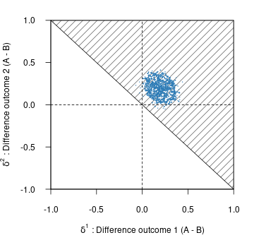{fig-alt="Plot of posterior density"}

[CohortMethod](https://cran.r-project.org/package=CohortMethod) v6.0.1: Provides functions for performing comparative cohort studies in an observational database in the [Observational Medical Outcomes Partnership (OMOP) Common Data Model](https://ohdsi.github.io/CommonDataModel/) which implements large-scale propensity scores (LSPS) as described in [Tian et al. (2018)](https://academic.oup.com/ije/article/47/6/2005/5043131?login=false). Functions are included for trimming, stratifying, matching and weighting by propensity scores, and diagnostics. See [Suchard et al. (2013)](https://dl.acm.org/doi/10.1145/2414416.2414791) for methods of using large scale regularized regression for fitting propensity models. There are three vignettes including [Single Studies](https://cran.r-project.org/web/packages/CohortMethod/vignettes/SingleStudies.pdf) and [Multiple Analyses](https://cran.r-project.org/web/packages/CohortMethod/vignettes/MultipleAnalyses.pdf).

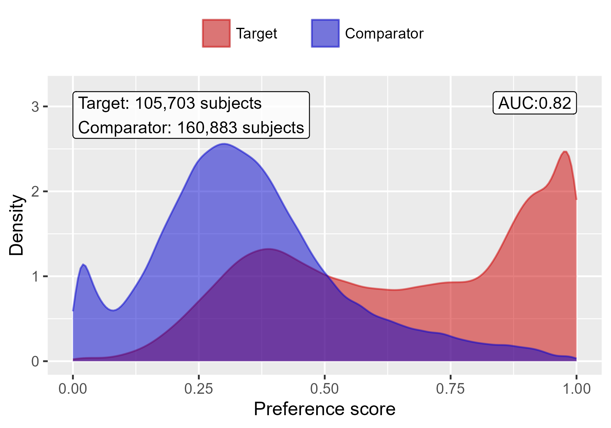{fig-alt="Plot of propensity score densities"}

[epicR](https://cran.r-project.org/package=epicR) v1.0.1: Implements a Discrete Event Simulation model that simulates health outcomes of patients with Chronic Obstructive Pulmonary Disease (COPD) based on demographics and individual-level risk factors, based on the model published in [Sadatsafavi et al. (2019)](https://journals.sagepub.com/doi/10.1177/0272989X18824098). There are four vignettes including [Getting Started](https://cran.r-project.org/web/packages/epicR/vignettes/GettingStarted.html) and [Background](https://cran.r-project.org/web/packages/epicR/vignettes/BackgroundEPIC.html).

[forestsearch](https://cran.r-project.org/package=forestsearch) v0.1.0: Designed for clinical researchers conducting exploratory subgroup analyses in randomized controlled trials, particularly for multi-regional clinical trials requiring regional consistency evaluation the package implements statistical methods for exploratory subgroup identification in clinical trials with survival endpoints. Features include machine learning tools for identifying patient subgroups with differential treatment effects and bootstrap bias correction methods using the infinitesimal jackknife methods to address selection bias in post-hoc analyses. See [León et al. (2024)](https://onlinelibrary.wiley.com/doi/10.1002/sim.10163) for backgound and the [vignette](https://cran.r-project.org/web/packages/forestsearch/vignettes/forestsearch.html).

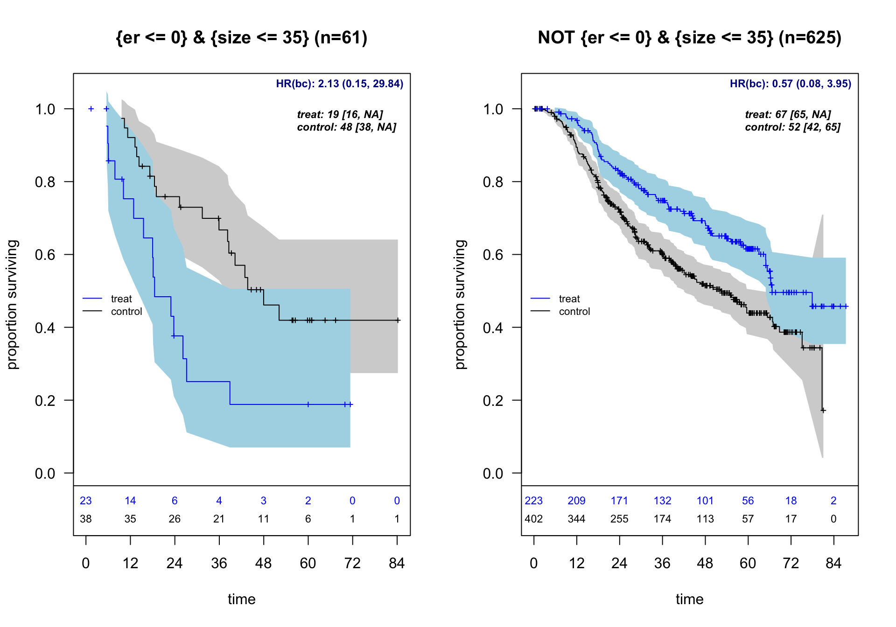{fig-alt="Kaplan-Meier curves by subgroups"}

[mrddGlobal](https://cran.r-project.org/package=mrddGlobal) v0.1.0: Provides functions for global testing for regression discontinuity designs with more than one running variable including functions for testing whether there exist non-zero treatment effects along the boundary of the treated region, and testing whether there exist discontinuities in the joint density of the running variables along the boundary of the treated region. See [Samiahulin (2026)](https://arxiv.org/abs/2602.03819) for background and the [vignette](https://cran.r-project.org/web/packages/mrddGlobal/vignettes/mrddGlobal_vignette.html) for examples.

{fig-alt="3D Boundary Plot"}

:::

::: {.column width="10%"}

:::

::: {.column width="45%"}

### Machine Learning

### Programming

[arl](https://CRAN.R-project.org/package=arl) v0.1.4: Provides a Scheme-inspired Lisp dialect embedded in R, with macros, tail-call optimization, and seamless interoperability with R functions and data structures. (The name 'arl' is short for 'An R Lisp.') Implemented in pure R with no compiled code. Note that the twenty-two vignettes only contain links to the source code. Look [here](https://github.com/wwbrannon/arl) to get started, and [here](https://zenodo.org/records/19013720) for the layout of the source code.

[restrictR](https://cran.r-project.org/package=restrictR) v0.1.0: Provides functions to build reusable validators from small building blocks using the base pipe operator. Define runtime contracts once with `restrict()` and enforce them anywhere in code. Validators compose naturally, support dependent rules via formulas, and produce clear, path-aware error messages. No DSL, no operator overloading, just idiomatic R. See the [vignette](https://cran.r-project.org/web/packages/restrictR/vignettes/restrictR.html).

### Public Health

[episomer](https://cran.r-project.org/package=episomer) v3.0.34: Provides functions to automatically monitor trends of social media messages by time, place and topic aiming at detecting public health threats early through the detection of signals (i.e., an unusual increase in the number of messages per time, topic and location). It was designed to focus on infectious diseases, and it can be extended to all hazards or other fields of study by modifying the topics and keywords. More information on the original package `epitweetr` is available in the peer-review publication [Espinosa et al. (2022)](https://www.eurosurveillance.org/content/10.2807/1560-7917.ES.2022.27.39.2200177). There are two vignettes: vignettes [user documentation](https://cran.r-project.org/web/packages/episomer/vignettes/episomer-vignette.html) and [add new social media](https://cran.r-project.org/web/packages/episomer/vignettes/add_new_social_media.html). Look [here](https://github.com/EU-ECDC/episomer/discussions/7) for additional documentation including information about the associated `Shiny` app.

### Risk Analysis

[bayespmtools](https://cran.r-project.org/package=bayespmtools) v0.0.1: Provides functions to perform Bayesian sample size, precision, and value-of-information analysis for external validation of existing multi-variable prediction models using the approach proposed by [Sadatsafavi et al. (2025)](https://onlinelibrary.wiley.com/doi/10.1002/sim.70389). There is a [Getting Started Guide](https://cran.r-project.org/web/packages/bayespmtools/vignettes/getting_started.html) and a [tutorial](https://cran.r-project.org/web/packages/bayespmtools/vignettes/bayespmtools_tutorial.html).

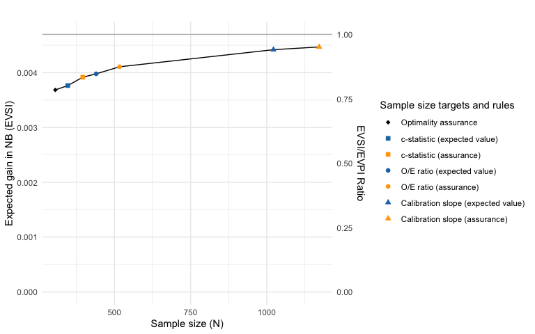{fig-alt="Plot of expected gain vs sample size "}

### Statistics

[badp](https://cran.r-project.org/package=badp) v0.4.0.1: Implements Bayesian model averaging for dynamic panels with weakly exogenous regressors as described in the paper by [Moral-Benito (2013)](https://www.tandfonline.com/doi/abs/10.1080/07350015.2013.818003) and provides functions to estimate dynamic panel data models and analyze the results of the estimation. See the [vignette](https://cran.r-project.org/web/packages/badp/vignettes/badp_vignette.html).

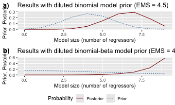{fig-alt="Plot contrasting of different priors"}

[BORG](https://cran.r-project.org/package=BORG) v0.3.1: Provides tools for valid spatial, temporal, and grouped model evaluation. Automatically detects data dependencies (spatial autocorrelation, temporal structure, clustered observations), generates appropriate cross-validation schemes (spatial blocking, checkerboard, hexagonal, KNNDM, environmental blocking, leave-location-out, purged CV), and validates evaluation pipelines for leakage. Includes area of applicability assessment following [Meyer & Pebesma (2021)](https://besjournals.onlinelibrary.wiley.com/doi/10.1111/2041-210X.13650). [Roberts et al. (2017)](https://nsojournals.onlinelibrary.wiley.com/doi/10.1111/ecog.02881) and [Linnenbrink et al. (2024)](https://gmd.copernicus.org/articles/17/5897/2024/). There are three vignettes including [Quick Start](https://cran.r-project.org/web/packages/BORG/vignettes/quickstart.html) and [Risk Taxonomy](https://cran.r-project.org/web/packages/BORG/vignettes/risk-taxonomy.html).

[flexhaz](https://cran.r-project.org/package=flexhaz) v0.5.1: Implements a framework for specifying survival distributions through their hazard (failure rate) functions. Functions enable defining arbitrary time-varying hazard functions to model complex failure patterns including bathtub curves, proportional hazards with covariates, automatically compute survival, CDF, PDF, and quantile estimates, and implement the likelihood model interface for maximum likelihood estimation with right-censored and left-censored survival data. There are five vignetes including [flexhaz: Hazard-First Survival Modeling](https://cran.r-project.org/web/packages/flexhaz/vignettes/flexhaz-package.html) and [https://cran.r-project.org/web/packages/flexhaz/vignettes/flexhaz-package.html](https://cran.r-project.org/web/packages/flexhaz/vignettes/failure_rate.html).

[maskedcauses](https://cran.r-project.org/package=maskedcauses) v0.9.3: Implements maximum likelihood estimation for series systems where the component cause of failure is masked. Includes analytical log-likelihood, score, and Hessian functions for exponential, homogeneous Weibull, and heterogeneous Weibull component lifetimes under masked cause conditions. Supports exact, right-censored, left-censored, and interval-censored observations via composable observation functors. Also provides random data generation, model fitting, and Fisher information for asymptotic inference. See [Lin, Loh, and Bai (1993)](https://ieeexplore.ieee.org/document/257799) and [Craiu and Reiser (2006)](https://academic.oup.com/biometrics/article-abstract/62/2/526/7321802?redirectedFrom=fulltext&login=false) for background. There are seven vignettes including [Censoring Types in Series System Masked Data](https://cran.r-project.org/web/packages/maskedcauses/vignettes/censoring_comparison.html) and [Model Selection for Masked Series Systems via Likelihood Ratio Tests](https://cran.r-project.org/web/packages/maskedcauses/index.html).

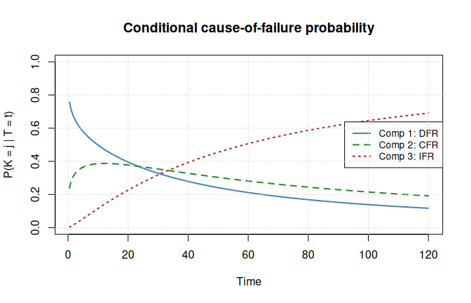{fig-alt="Plot of conditional cause of failure probability"}

[osktnorm](https://cran.r-project.org/package=osktnorm) v1.1.2: Implements a moment-targeting normality transformation based on the simultaneous optimization of Tukey g-h distribution parameters designed to minimize both asymmetry (skewness) and excess peakedness (kurtosis) in non-normal data by mapping it to a standard normal distribution as described by [Cebeci et al (2026)](https://www.mdpi.com/2073-8994/18/3/458). Optimization is performed by minimizing an objective function derived from the Anderson-Darling goodness-of-fit statistic with Stephens's correction factor, utilizing the L-BFGS-B algorithm for robust parameter estimation. This approach provides an effective alternative to power transformations like Box-Cox and Yeo-Johnson, particularly for data requiring precise tail-behavior adjustment. See the vignettes [OSKT: Normality Transformation via Optimized Skewness and Kurtosis](https://cran.r-project.org/web/packages/osktnorm/vignettes/osktnorm1.html) and [A Practical Example for Working with Datasets](https://cran.r-project.org/web/packages/osktnorm/vignettes/osktnorm2.html).

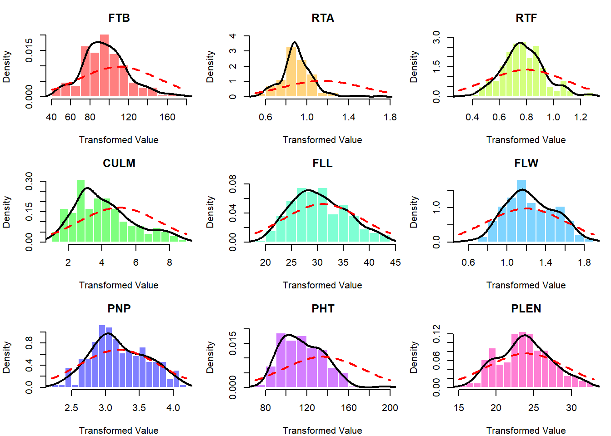{fig-alt="Plots comparing actual densities with theoretical normal densities "}

[RFmstate](https://cran.r-project.org/package=RFmstate) v0.1.2: Provides functions to fit cause-specific random survival forests for flexible multistate survival analysis with covariate-adjusted transition probabilities computed via product-integral. State transitions are modeled by random forests. Subject-specific transition probability matrices are assembled from predicted cumulative hazards using the product-integral formula. Also provides a standalone Aalen-Johansen nonparametric estimator as a covariate-free baseline, per-transition feature importance, bias-variance diagnostics, and comprehensive visualizations. Handles right censoring and competing transitions. Methods are described in [Ishwaran et al. (2008)](https://projecteuclid.org/journals/annals-of-applied-statistics/volume-2/issue-3/Random-survival-forests/10.1214/08-AOAS169.full) for random survival forests, [Putter et al. (2007)](https://onlinelibrary.wiley.com/doi/10.1002/sim.2712) for multistate competing risks decomposition, and [Aalen and Johansen (1978)](https://www.jstor.org/stable/4615704) for the nonparametric estimator. See the [vignette](https://cran.r-project.org/web/packages/RFmstate/vignettes/introduction.html) for an introducton.

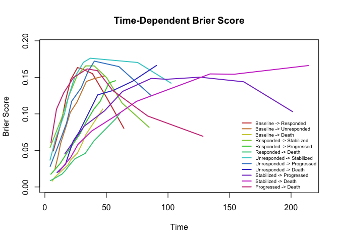{fig-alt="Plot of time-dependent Brier scores "}

[SuperSurv](https://cran.r-project.org/package=SuperSurv) v0.1.1: Implements a Super Learner framework for right-censored survival data. The package fits convex combinations of parametric, semiparametric, and machine learning survival learners by minimizing cross-validated risk using inverse probability of censoring weighting. It provides tools for automated hyperparameter grid search, high-dimensional variable screening, and evaluation of prediction performance using metrics such as the Brier score, Uno's C-index, and time-dependent area under the curve. See [Westling et al. (2024)](https://www.tandfonline.com/doi/full/10.1080/01621459.2023.2205060) and [Lyu et al. (2026)](https://www.biorxiv.org/content/10.64898/2026.03.11.711010v2) for background. There are eleven vignettes including [Machine Learning](https://cran.r-project.org/web/packages/SuperSurv/vignettes/base-learner-rfsrc.html) and [8. Interpreting the Black Box with SHAP & survex](https://cran.r-project.org/web/packages/SuperSurv/vignettes/shap-explanations.html).

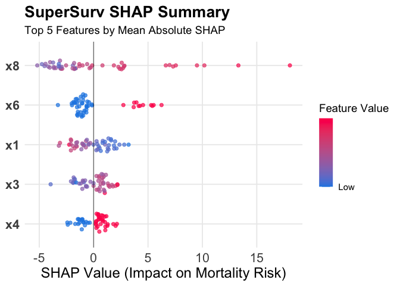{fig-alt="Plot of SHAP summary of top five features"}

### Time Series

[betaARMA](https://cran.r-project.org/package=betaARMA) v1.1.0: Provides functions to fit  Beta Autoregressive Moving Average (BARMA) models for time series data distributed in the standard unit interval (0, 1). The estimation is performed via the conditional maximum likelihood method using the Broyden-Fletcher-Goldfarb-Shanno (BFGS) quasi-Newton algorithm. The package includes tools for model fitting, diagnostic checking, and forecasting. Based on the work of [Rocha and Cribari-Neto (2009)](https://link.springer.com/article/10.1007/s11749-008-0112-z) and the associated erratum [Rocha and Cribari-Neto (2017)](https://link.springer.com/article/10.1007/s11749-017-0528-4). Look [here](https://github.com/Everton-da-Costa/betaARMA) to get started.

[boundedur](https://cran.r-project.org/package=boundedur) v1.0.1: Implements unit root tests for bounded time series following [Cavaliere and Xu (2014)](https://www.sciencedirect.com/science/article/abs/pii/S0304407613001620?via%3Dihub). Standard unit root tests (ADF, Phillips-Perron) have non-standard limiting distributions when the time series is bounded. This package provides modified ADF and M-type tests (MZ-alpha, MZ-t, MSB) with p-values computed via Monte Carlo simulation of bounded Brownian motion. Supports one-sided (lower bound only) and two-sided bounds, with automatic lag selection using the MAIC criterion of [Ng and Perron (2001)](https://onlinelibrary.wiley.com/doi/10.1111/1468-0262.00256). See [README](https://cran.r-project.org/web/packages/boundedur/readme/README.html) to get started.
 
[reviser](https://cran.r-project.org/package=reviser) v0.1.1: Analyzes revisions in real-time time series vintages. Functions convert between wide revision triangles and tidy long vintages, extract selected releases, compute revision series, visualize vintage paths, and summarize revision properties such as bias, dispersion, autocorrelation, and news-noise diagnostics. There are also functions to identify efficient releases and estimates state-space models for revision nowcasting. Methods are based on [Howrey (1978)](https://www.jstor.org/stable/1924972?origin=crossref), [Jacobs and Van Norden (2011)](https://www.sciencedirect.com/science/article/abs/pii/S0304407610002526?via%3Dihub), and [Kishor and Koenig (2012)](https://www.tandfonline.com/doi/full/10.1198/jbes.2010.08169). There are seven vignettes including [Introduction](https://cran.r-project.org/web/packages/reviser/vignettes/reviser.html) and [revision analysis](https://cran.r-project.org/web/packages/reviser/vignettes/revision-analysis.html).

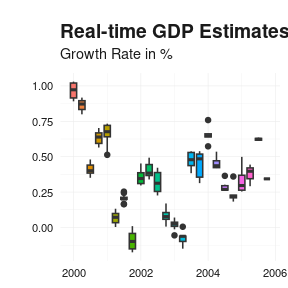{fig-alt="Line plot showing GDP vintages over the publication date dimension"}

end

:::

::::

