Three hundred twenty-three of the new packages submitted to CRAN in April were still there in mid-May. Here are my Top 40 picks in eighteen categories: Artificial Intelligence, Computational Methods, Ecology, Education, Finance, Functional Data Analysis, Genomics, Machine Learning, Medical Statistics, Meta Analysis, Probability, Process Control, Psychometrics, Statistics, Surveys, Time Series, Utilities, and Visualization.

{fig-alt=""}

:::: {.columns}

::: {.column width="45%"}

### Artifical Intelligence

[corteza](https://cran.r-project.org/package=corteza) v0.6.9: Implements an agent runtime that gives Large Language Models (LLMs) from [Anthropic](https://www.anthropic.com/), [OpenAI](https://openai.com/), [Moonshot](https://www.moonshot.ai/), and [Ollama](https://ollama.com/) direct access to a live R session with managed workspace state. Tools execute as R function calls with provenance tracking, and a deterministic retrieval system keeps relevant objects in context across turns. There are three entry points: a shell command-line interface, a console read-eval-print-loop via `chat()`, and a Model Context Protocol (MCP) server via `serve()` for external clients. There are four vignettes [Package as Skill](https://cran.r-project.org/web/packages/corteza/vignettes/package-as-skill.html) and [Skills](https://cran.r-project.org/web/packages/corteza/vignettes/skills.html).

[ElicitationWizard](https://cran.r-project.org/package=ElicitationWizard) v0.1.0: Implements a `Shiny` application for eliciting Bayesian prior distributions using large language models (LLMs). Supports multiple LLM experts, linear opinion pooling, and the Delphi method for iterative consensus. For more details see [Falconer et al. (2022)](https://pubsonline.informs.org/doi/10.1287/deca.2022.0451) and [Selby et al. (2025)](https://onlinelibrary.wiley.com/doi/10.1002/sta4.70054). There is a [Getting Started](https://cran.r-project.org/web/packages/ElicitationWizard/vignettes/getting-started.html) vignette and a [Tutorial](https://cran.r-project.org/web/packages/ElicitationWizard/vignettes/tutorial.html).

### Computational Methods

[boids4R](https://cran.r-project.org/package=boids4R) v0.3.1: Provides deterministic two- and three-dimensional boids and swarm simulations implementing Reynolds-style separation, alignment, and cohesion rules with optional obstacles, attractors, predators, species parameters, and reproducible frame export. Simulation state is renderer-neutral; optional adapters can hand frame data to visualization packages such as `ggWebGL`. The model follows [Reynolds (1987)](https://dl.acm.org/doi/10.1145/37402.37406). There are five vignettes including [Getting Started]() and [Scenario Gallery](https://cran.r-project.org/web/packages/boids4R/vignettes/scenario-gallery.html).

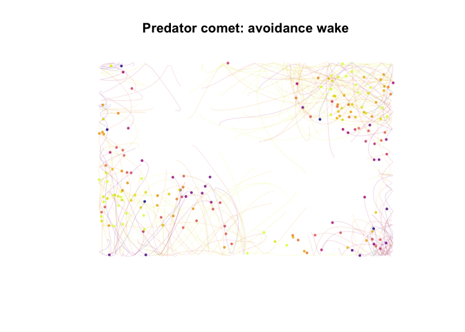{fig-alt="Example of Swarm Art"}

[combss](https://cran.r-project.org/package=combss) v0.1.0: Reformulates the NP-hard discrete subset selection problem as a continuous optimisation over the hypercube $[0,1]^p$, to besolved via a Frank-Wolfe homotopy algorithm with closed-form ridge inner solves. Supports linear (Gaussian), binary logistic, and multinomial regression. See [Moka et al. (2024)](https://link.springer.com/article/10.1007/s11222-024-10387-8) and [Mather et al. (2026)](https://arxiv.org/abs/2603.21952) for methodological details and the [vignette](https://cran.r-project.org/web/packages/combss/vignettes/combss.html) for an example.

[diffcp](https://cran.r-project.org/package=diffcp) v0.1.1: Provides a port of the python `diffcp` package. Functions compute the derivative of the optimal solution map of a convex cone program, treating the program as an implicit function of its data (constraint matrix, offset, objective coefficients, and optionally a quadratic), mirroring [Agrawal et al. (2019)](https://arxiv.org/abs/1904.09043). See the [vignette](https://cran.r-project.org/web/packages/diffcp/vignettes/diffcp.html).

[LangevinFlow](https://cran.r-project.org/package=LangevinFlow) v0.1.0: Provides lightweight, minimal dependency implementations of Langevin diffusion based Markov chain Monte Carlo samplers, including the Unadjusted Langevin Algorithm and the Metropolis-Adjusted Langevin Algorithm. The core sampling loops are written in `C++` via `Rcpp` and `RcppArmadillo`  Intended as a building block for Bayesian inference and stochastic optimization rather than a full probabilistic programming framework. Methods follow [Roberts and Tweedie (1996)](https://www.jstor.org/stable/3318418?origin=crossref) and [Roberts and Rosenthal (1998)](https://academic.oup.com/jrsssb/article-abstract/60/1/255/7083121?redirectedFrom=fulltext&login=false). See the [vignette](https://cran.r-project.org/web/packages/LangevinFlow/vignettes/introduction.html).

### Ecology

[BRCore](https://cran.r-project.org/package=BRCore) v2.0.7: Implements a unified framework for identification and ecological interpretation of core microbiomes across time and space, enhancing robustness and reproducibility in microbiome data analysis. See [Shade A, Stopnisek N (2019)](https://www.sciencedirect.com/science/article/pii/S1369527419300426?via%3Dihub) for details on abundance-occupancy distributions, [Sloan et al. (2006)](https://enviromicro-journals.onlinelibrary.wiley.com/doi/10.1111/j.1462-2920.2005.00956.x) and [Burns et al. (2015)](https://academic.oup.com/ismej/article/10/3/655/7538159?login=false) for neutral models, and the [vignette](https://cran.r-project.org/web/packages/BRCore/vignettes/BRCore-vignette.html) for an introduction.

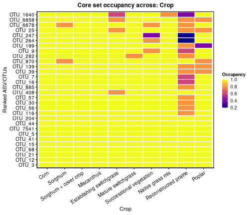{fig-alt="Core set occupancy heat map"}

[ELAplus](https://cran.r-project.org/package=ELAplus) v1.0.2: Provides tools for Energy landscape analysis, a systematic method for analyzing an energy landscape represented as a weighted network. Functions are especially designed to analyze ecological dynamics, i.e., transitions in community compositions. See [Suzuki et al. (2021)](https://esajournals.onlinelibrary.wiley.com/doi/10.1002/ecm.1469) for details about the analysis framework and the [vignette](https://cran.r-project.org/web/packages/ELAplus/vignettes/ELAplus-intro.html).

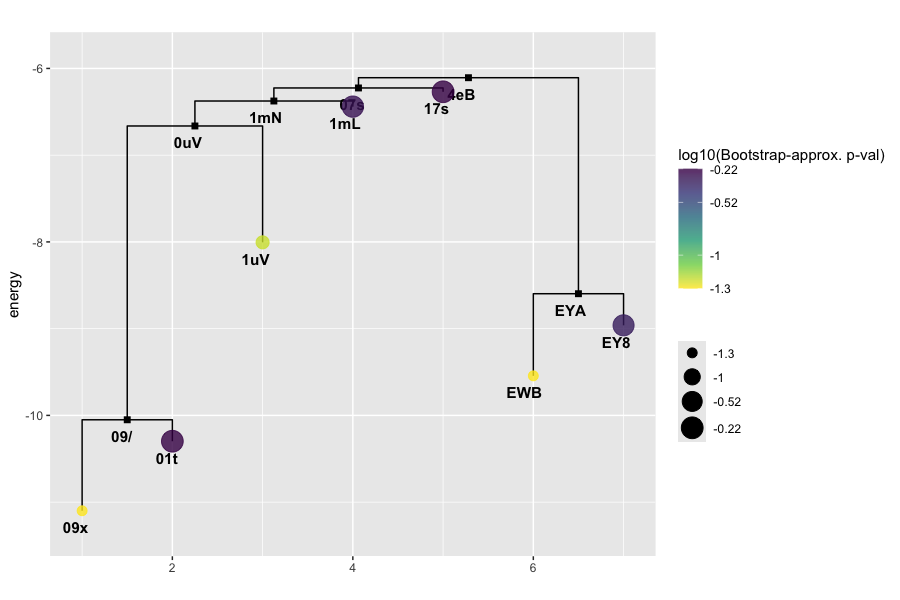{fig-alt="A disconnectivity graph is a compact visualization of the global structure of an energy landscape"}

[fb4package](https://cran.r-project.org/package=fb4package) v2.1.0: Implements the 'Fish Bioenergetics 4.0' framework described in [Deslauriers et al. (2017)](https://academic.oup.com/fisheries/article-abstract/42/11/586/7833943?redirectedFrom=fulltext&login=false) and provides automated parameter optimization, multi-prey diet modeling, and comprehensive energy. Includes species-specific parameter databases and tools for modeling fish growth, consumption, and metabolism under varying environmental conditions. There are six vignettes including [Introduction](https://cran.r-project.org/web/packages/fb4package/vignettes/fb4-introduction.html) and [Temperature Sensitivity and Climate Change Scenarios](https://cran.r-project.org/web/packages/fb4package/vignettes/fb4-temperature-climate.html).

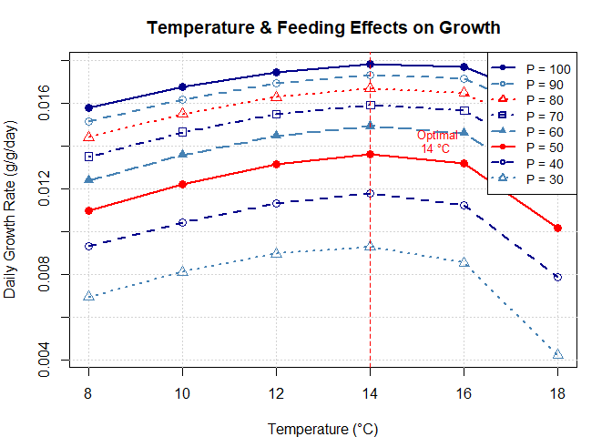{fig-alt="Plot of temperature and feeding effects on growth"}

### Education

[bibnets](https://cran.r-project.org/package=bibnets) v0.6.0: Provides functionsto imports, construct, and export bibliometric networks from scholarly metadata. Reads *Scopus*, *Web of Science*, *BibTeX*, *RIS*, *OpenAlex*, *Lens.org*, *Dimensions*, and *Crossref* exports. Goes beyond standard co-networks with attention-weighted networks, position-aware counting, similarity and dissimilarity normalisations, temporal networks and local citation scoring. See [López-Pernas, Saqr & Apiola (2023)](https://link.springer.com/chapter/10.1007/978-3-031-25336-2_5) for the methode involved. Thee are four vignettes including [Getting Started](https://cran.r-project.org/web/packages/bibnets/vignettes/bibnets.html) and [Reading bibliometric data](https://cran.r-project.org/web/packages/bibnets/vignettes/reading-data.html).

### Finance

[contagionchannels](https://cran.r-project.org/package=contagionchnnels) v0.1.3: Implements a two-stage framework for the joint detection-and-attribution of cross-border financial contagion. Stage one detects directional information flows between equity markets. Stage two attributes each significant directional link to one of five mutually exclusive transmission channels: trade, financial, Ggopolitical, behavioural, or monetary policy). The package also bundles datasets and scripts to reproduce the headline findings of [Bhandari, Parida and Sahu (2026)](https://arxiv.org/abs/2604.26546). There are three vignettes including [Using Custom Datasets](https://cran.r-project.org/web/packages/contagionchannels/vignettes/custom_data.html) and [Methodology Guide](https://cran.r-project.org/web/packages/contagionchannels/vignettes/methodology.html).

### Functional Data Analysis

[SmoothPLS](https://cran.r-project.org/package=SmoothPLS) v0.1.5: Implements the the Partial Least-Squares algorithm for functional data through the concept of active area integration building upon the basis expansion methods described in [Aguilera et al. (2010)](https://www.sciencedirect.com/science/article/abs/pii/S0169743910001747?via%3Dihub). Functions handle both scalar and categorical functional Data and interpretable regression curves even for discrete state changes. There are six vignettes including [smoothPLS ScalarFD](https://cran.r-project.org/web/packages/SmoothPLS/vignettes/s02_SFD.html) and [SmoothPLS multi state](https://cran.r-project.org/web/packages/SmoothPLS/vignettes/s03_CFD_multistates.html),

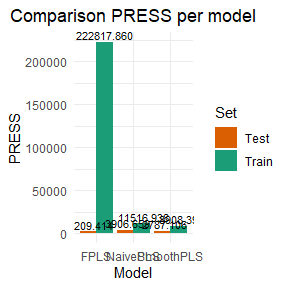{fig-alt="Model comparison plots"}

### Genomics

[cclustr](https://cran.r-project.org/web/packages/cclustr/vignettes/cclustr-introduction.html) v0.1.1: Provides tools for performing consensus clustering on multiple imputed datasets that support arange of clustering algorithms across imputations, including hierarchical methods, partition-based approaches such as k-means, and methods for mixed or categorical data. Consensus solutions are derived via hierarchical clustering applied a dissimilarity matrix. The consensus clustering framework is based on [Monti et al. (2003)](https://link.springer.com/article/10.1023/A:1023949509487), rank aggregation methods follow [Pihur et al. (2007)](https://academic.oup.com/bioinformatics/article/23/13/1607/223480?login=false), and the proportion of ambiguous clustering metric is based on [Senbabaoglu et al. (2014)](https://www.nature.com/articles/srep06207). See the [vignette](https://cran.r-project.org/web/packages/cclustr/vignettes/cclustr-introduction.html).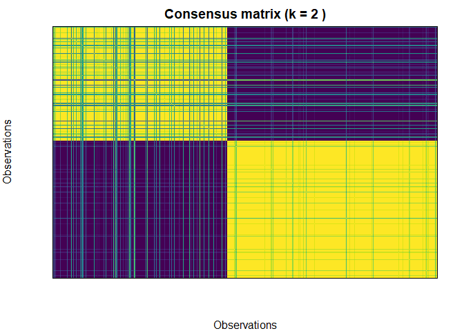{fig-alt="Example of consenus matrix"}

### Machine Learning

[tmfast](https://cran.r-project.org/package=tmfast) 0.1.1: Provides functions to fit topic models using varimax-rotated principal component analysis, following the "vintage factor analysis" approach of [Rohe & Zheng (2020)](https://arxiv.org/abs/2004.05387) . Leverages truncated PCA via `irlba` for sparse matrices, enabling fast model fitting on large corpora. Includes an information-theoretic approach to vocabulary selection, `broom`-compatible tidiers for extracting word-topic and topic-document matrices into a tidy data workflow, and samplers for constructing simulated corpora for benchmarking and method evaluation. There are two vignettes [Fast topic modeling with real books](https://cran.r-project.org/web/packages/tmfast/vignettes/realbooks.html) and [Fitting topic models with tmfast](https://cran.r-project.org/web/packages/tmfast/vignettes/simulated.html).

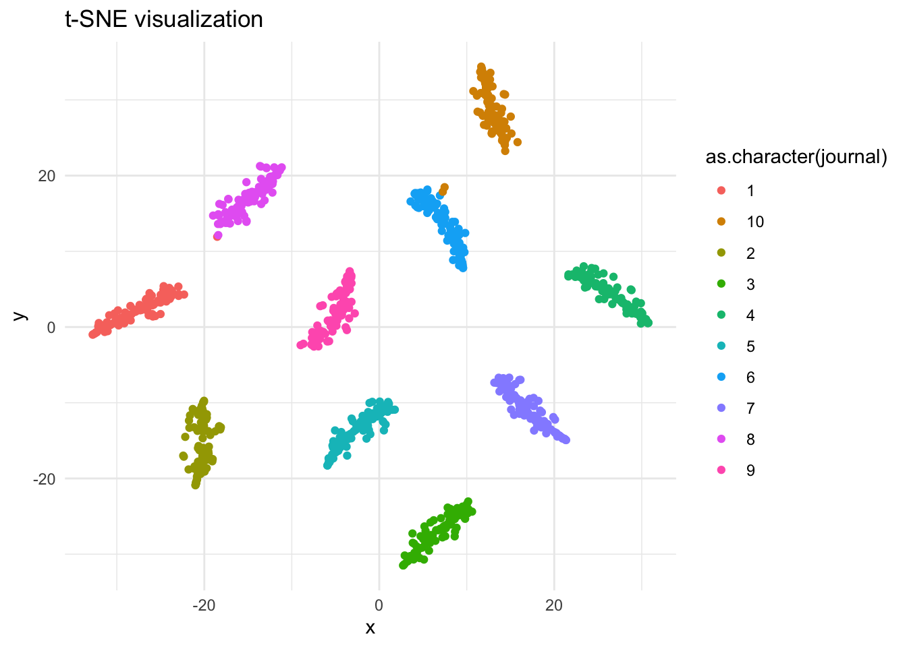{fig-alt="t-SNE visualization of a topic model"}

### Medicine
 
[BSET](https://cran.r-project.org/package=BSET) v1.0: Implements the validity of surrogate markers in clinical trials and provides hypothesis testing tools to evaluate whether a surrogate can reliably estimate the causal effect of a treatment on a primary outcome.  Addresses key limitations of the frequentist method, including the lack of causal interpretability and the inability to adjust for covariates in the estimation process.See [Carlotti and Parast (2026)](https://arxiv.org/abs/2603.14381), [Parast et al. (2024)](https://academic.oup.com/biometrics/article/80/1/ujad035/7612597?login=false) for background and the [vignette](https://cran.r-project.org/web/packages/BSET/vignettes/BSET_tutorial.html) for a tutorial.

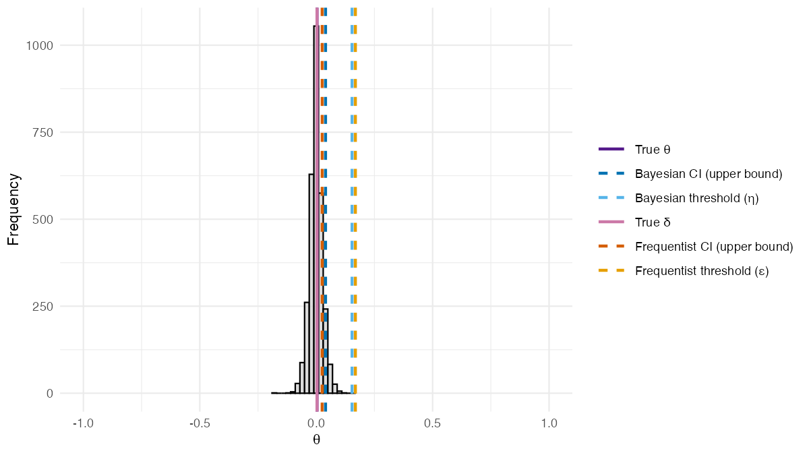{fig-alt="The posterior distribution of 𝜃from the BSET procedure without adjusting for covariates"}
 

[DICErClust](https://cran.r-project.org/package=DICErClust) v0.1.2: Implements the Deep Significance Clustering (DICE), a self-supervised learning framework designed to identify clinically meaningful and risk-stratified patient subgroups from electronic health record data. DICE jointly optimizes deep representation learning, clustering, and outcome prediction while enforcing statistical significance between predicted outcomes and cluster membership and produces subgroups that are both clinically coherent and predictive. [See Huang et al. (2021)](https://academic.oup.com/jamia/article-abstract/28/12/2641/6377084?redirectedFrom=fulltext&login=false) and the vignettes [Introduction](https://cran.r-project.org/web/packages/DICErClust/vignettes/DICEr-introduction.html) and [Heart Failure Risk Stratification](https://cran.r-project.org/web/packages/DICErClust/vignettes/heart-failure-example.html).

### Meta Analysis

[MetaHunt](https://cran.r-project.org/package=MetaHunt) v0.1.0: Provides tools for privacy-preserving meta-analysis of function-valued quantities across heterogeneous studies. Implements a pipeline that includes the denoised functional Successive Projection Algorithm for basis hunting, constrained weight estimation, Dirichlet regression of weights on study-level covariates, target prediction, and split/cross conformal prediction intervals. The methodology described in [Shi, Imai, and Zhang (2026)](https://arxiv.org/abs/2604.23847). There are eight vignettes including [Get started](https://cran.r-project.org/web/packages/MetaHunt/vignettes/get-started.html) and [An Introduction](https://cran.r-project.org/web/packages/MetaHunt/vignettes/metahunt-intro.html).

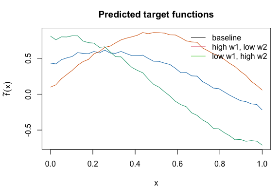{fig-alt="Plot of predicted target functions"}

### Probability

[BetaDanish](https://cran.r-project.org/package=BetaDanish) v0.2.0: Implements the four-parameter Beta-Danish distribution and its three-parameter submodel for survival and reliability analysis, based on Ahmad and [Danish (2025)](https://reference-global.com/article/10.2478/jamsi-2025-0010), and provides functions for density, distribution, quantile, hazard, and random generation. There are five vignetes including [Introduction](https://cran.r-project.org/web/packages/BetaDanish/vignettes/BetaDanish_Introduction.html) and [Bayesian Estimation](https://cran.r-project.org/web/packages/BetaDanish/vignettes/bd-bayesian.html). 

[mhn](https://cran.r-project.org/package=mhn) v0.1.0: Provides density, distribution, quantile, and random generation functions for the Modified Half-Normal (MHN) distribution, along with moments, mode, and the Fox-Wright Psi function used as the normalizing constant. The MHN distribution arises as a conditional posterior in Bayesian MCMC and generalizes the half-normal, truncated normal, and square-root gamma distributions. Implements efficient sampling via the [Sun, Kong & Pal (2023)](https://www.tandfonline.com/doi/full/10.1080/03610926.2021.1934700) algorithms and the [Gao & Wang (2025)](https://www.tandfonline.com/doi/full/10.1080/03610918.2025.2524551) RTDR method. See the vignettes [Introduction](https://cran.r-project.org/web/packages/mhn/vignettes/introduction.html) and [Theoretical Background](https://cran.r-project.org/web/packages/mhn/vignettes/theory.html).

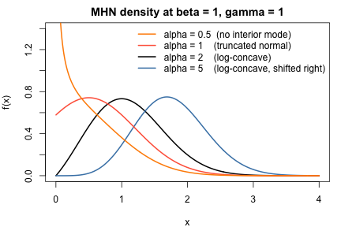{fig-alt="MHN density curves for various parameter values"}

### Process Control

[shewhartr](https://cran.r-project.org/package=shewhartr) v1.3.0: Provides  comprehensive toolkit for Statistical Process Control that combines the rigor of classical Shewhart methodology with modern tidyverse-native interfaces that includes classical control charts, regression-based control charts for processes with trend, Nelson runs tests, average run length simulation, process capability indices, and Box-Cox transformation guidance. See [Montgomery (2019)](https://www.tandfonline.com/doi/abs/10.1080/00224065.1984.11978921), [Nelson (1984)](https://www.tandfonline.com/doi/abs/10.1080/00224065.1984.11978921), and  [Woodall (2000)](https://www.tandfonline.com/doi/abs/10.1080/00224065.2000.11980013) for background. There are eleven vignettes including [Getting started](https://cran.r-project.org/web/packages/shewhartr/vignettes/getting-started.html) and [Regression-based control charts](https://cran.r-project.org/web/packages/shewhartr/vignettes/regression-charts.html).

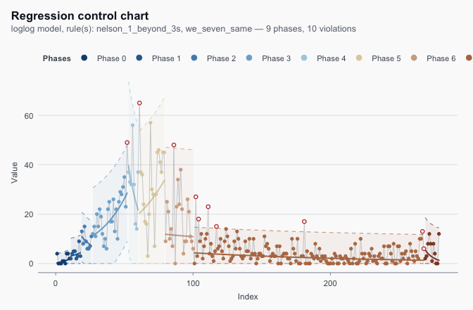{fig-alt="Regression Control Chart"}

### Psychometrics

[personnelSelectionUtility](https://cran.r-project.org/package=personnelSelectionUtility) v1.0.2: Implements classical and contemporary utility-analysis methods for personnel selection, organised by criterion scale (classification or continuous/monetary) and selection structure (compensatory or multiple-hurdle). Multiple ethods including Taylor-Russell classification [Taylor and Russell (1939)](https://psycnet.apa.org/doiLanding?doi=10.1037%2Fh0057079), and Brogden-Cronbach-Gleser monetary utility [Brogden (1949)](https://onlinelibrary.wiley.com/doi/10.1111/j.1744-6570.1949.tb01397.x) are provided. There are five vignettes including [Reproducing canonical examples from the literature](https://cran.r-project.org/web/packages/personnelSelectionUtility/vignettes/reproductions.html) and [Utility-analysis taxonomy for personnel selection](https://cran.r-project.org/web/packages/personnelSelectionUtility/vignettes/utility-analysis-taxonomy.html).

:::

::: {.column width="10%"}

:::

::: {.column width="45%"}

### Statistics

[bvarnet](https://cran.r-project.org/package=bvarnet) v1.0.1: Provides functions for the Bayesian estimation of multilevel Vector Autoregression (VAR) models using Stan. Supports Gaussian, Binary, and Ordinal (adjacent category) outcome variables with random effects and customizable priors. There are six vignettes including an [introduction](https://cran.r-project.org/web/packages/bvarnet/vignettes/bvarnet.html) and [Mixed Model](https://cran.r-project.org/web/packages/bvarnet/vignettes/Mixed-Model.html)

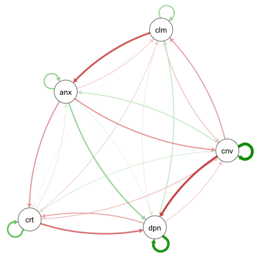{fig-alt="Network visualization of a model"}

[glmbayes](https://cran.r-project.org/package=glmbaye) v0.9.5: Provides Bayesian linear and generalized linear model fitting with independent and identically distributed posterior samples. Features include functions that mirror `lm()` and `glm()` interfaces, prior family specifications for Gaussian, Poisson, binomial, and Gamma models with log-concave likelihoods, accept-reject sampling for non-conjugate priors, and optional `OpenCL` acceleration for larger models. See [Nygren and Nygren (2006)](https://www.tandfonline.com/doi/abs/10.1198/016214506000000357) accept-reject methods. There are thenty-seven vignettes including [Getting started](https://cran.r-project.org/web/packages/glmbayes/vignettes/Chapter-01.html) and [Foundations of GLMs](https://cran.r-project.org/web/packages/glmbayes/vignettes/Chapter-05.html).

[griddy](https://cran.r-project.org/package=griddy) v0.1.0: Provides tools including pooled and time-specific classification of longitudinal spatial values, classic discrete Markov transition matrices, spatial Markov matrices conditioned on spatial-lag classes, endpoint and adjacent rank mobility summaries, and `ggplot2` visualizations for exploratory geospatial distribution dynamics with `sf` objects. Methods follow [Rey (2001)](https://link.springer.com/article/10.1007/s10109-016-0234-x) and [Rey et al. (2016)](https://link.springer.com/article/10.1007/s10109-016-0234-x). See the [vignette](https://cran.r-project.org/web/packages/griddy/vignettes/griddy.html) to get started.

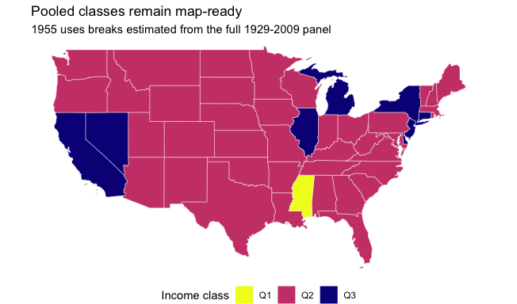{fig-alt="Map of US showing pooled classes"}

[RMeDPower2](https://cran.r-project.org/package=RMeDPower2) v1.0.2: Provides functions to analyse data from repeated measures experiments with hierarchical or crossed experimental designs and supports testing modeling assumptions, identifying outlier observations and experimental units, estimating statistical power, and performing sample size calculations. For details see [Shin et al. (2022)](https://www.biorxiv.org/content/10.1101/2022.07.18.500490v1) and [Bates et al. (2015)](https://www.jstatsoft.org/article/view/v067i01). See the [vignette](https://cran.r-project.org/web/packages/RMeDPower2/vignettes/ShortTutorial.html) for a tutorial.

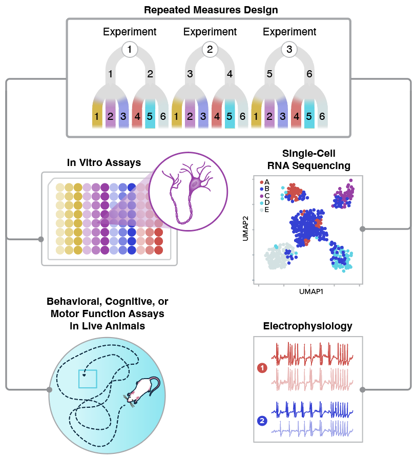{fig-alt="Flowchart illustrating Package capabilities"}

[ROCsurvcomp](https://cran.r-project.org/package=ROCsurvcomp) v0.1.2: Implements nonparametric and semiparametric methods for comparing two survival distributions under non-proportional hazards. The methods are based on the Receiver Operating Characteristic (ROC) curve length described in [Bantis et al. (2021)](https://onlinelibrary.wiley.com/doi/10.1002/sim.8869) and the overlap coefficient method of [Franco-Pereira et al. (2021)](https://journals.sagepub.com/doi/10.1177/09622802211046386), as well as a joint ROC length-OVL-based approach. See the [vignette](https://cran.r-project.org/web/packages/ROCsurvcomp/vignettes/ROCsurvcomp.html).

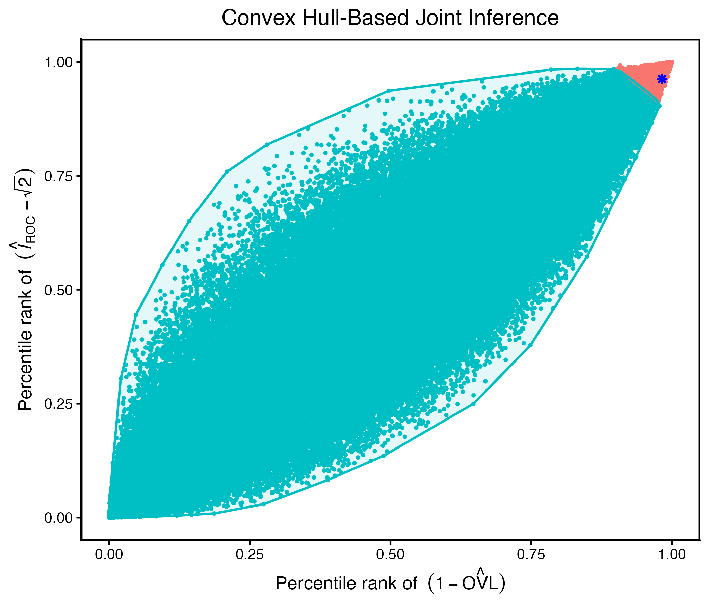{fig-alt="Plot illustrating vonvex hull Joint inference"}

[sssvcqr](https://cran.r-project.org/package=sssvcqr) v0.0.4: Implements sparse-smooth spatially varying coefficient quantile regression combining the quantile regression of [Koenker and Bassett (1978)](https://www.jstor.org/stable/1913643?origin=crossref) with grouped variable selection of [Yuan and Lin (2006)](https://academic.oup.com/jrsssb/article/68/1/49/7110631?login=false), graph regularization, and the alternating direction method of multipliers of [Boyd et al. (2011)](https://www.emerald.com/ftmal/article-abstract/3/1/1/1331527/Distributed-Optimization-and-Statistical-Learning?redirectedFrom=fulltext). Functions provide graph-regularized estimation, spatially blocked cross-validation, prediction, diagnostics, and simulation helpers for global-local spatial quantile regression. See the vignettes [Getting Started](https://cran.r-project.org/web/packages/sssvcqr/vignettes/sssvcqr-introduction.html) and [Lucas County Housing Example](https://cran.r-project.org/web/packages/sssvcqr/vignettes/lucas-county-example.html).

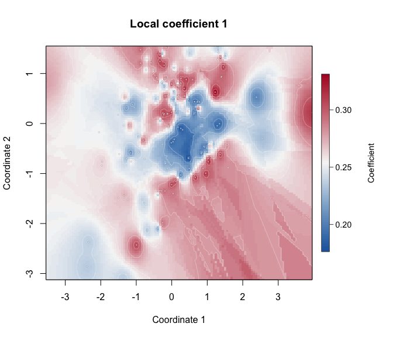{fig-alt="Visualization of codfficients"}

[TemporalHazard](https://cran.r-project.org/package=TemporalHazard) v1.1.0:Provides native R implementations of the multiphase parametric hazard model of [Blackstone, Naftel, and Turner (1986)](https://www.tandfonline.com/doi/abs/10.1080/01621459.1986.10478314) with a focus on behavioral parity, transparent numerics, and reproducible validation against reference outputs from the original `C`/`SAS` HAZARD program, originally developed at the University of Alabama at Birmingham. The generalized temporal decomposition family extends to longitudinal mixed-effects settings [Rajeswaran et al. (2018)](https://journals.sagepub.com/doi/10.1177/0962280215623583). There are eight vignettes including [Mathematical Foundations](https://cran.r-project.org/web/packages/TemporalHazard/vignettes/mf-mathematical-foundations.html) and [Prediction & Visualization](https://cran.r-project.org/web/packages/TemporalHazard/vignettes/prediction-visualization.html).

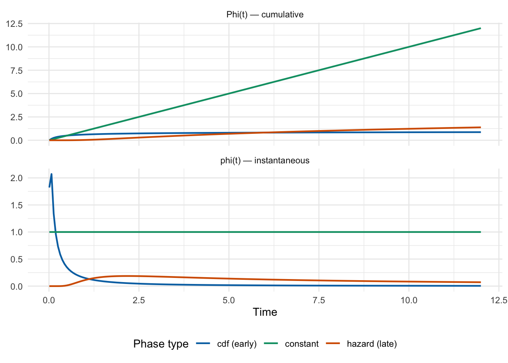{fig-alt="Plot of cumulative and instantaneous hazard functions"}

### Surveys

[stepssurvey](https://cran.r-project.org/package=stepssurvey) v0.1.0: Provides a complete analysis pipeline for the WHO STEPwise Approach to NCD Risk Factor Surveillance (STEPS) as described in [Riley et al. (2016)](https://ajph.aphapublications.org/doi/full/10.2105/AJPH.2015.302962). Imports raw survey data (`CSV`, `Excel`, `Stata`, `SPSS`), applies WHO-standard cleaning and re-coding, sets up complex survey designs, computes all standard NCD indicators, and generates publication-ready tables, visualizations, and reports. There are four vignettes including [Preparing STEPS Data for Analysis](https://cran.r-project.org/web/packages/stepssurvey/vignettes/data-preparation.html) and [Interactive Analysis with the Shiny App](https://cran.r-project.org/web/packages/stepssurvey/vignettes/shiny-walkthrough.html).

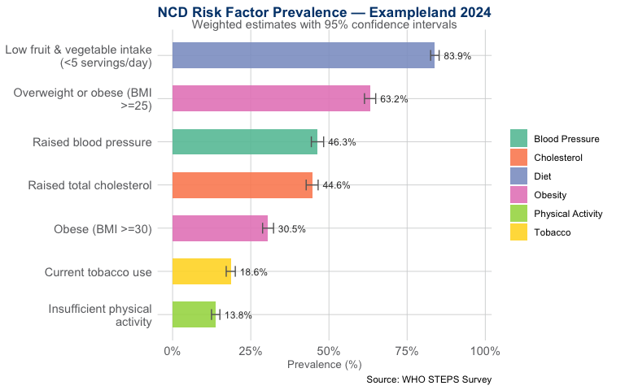{fig-alt="Plot of NCD Risk Factor Analysis"}

[surveycore](https://cran.r-project.org/package=surveycore) v1.0.0: Implements a modern, `S7`-based foundation for survey analysis spanning both probability and non-probability samples. Probability sample designs include Taylor series linearization, replicate weights (BRR, Fay, jackknife, bootstrap), and two-phase estimation, following [Lumley (2004)](https://www.jstatsoft.org/article/view/v009i08) <doi:10.18637/jss.v009.i08>. Non-probability sample designs support bootstrap and jackknife variance estimation for opt-in panels and convenience samples. There are three vignettes including [Getting Started](https://cran.r-project.org/web/packages/surveycore/vignettes/getting-started.html) and [surveycore vs. survey and srvyr](https://cran.r-project.org/web/packages/surveycore/vignettes/surveycore-vs-survey.html).

[surveyframe](https://cran.r-project.org/package=surveyframe) v0.3.2: Supports survey research workflows built around a typed instrument object, *the sframe*. Features include visual instrument design via a browser-based builder or `Shiny` studio, export to a self-contained static HTML survey, an embeddable `Shiny`module, SHA-256 integrity-checked serialisation, multi-page survey rendering, branching logic, response quality checking, scale scoring, psychometric diagnostics and more. There are seven vignettes including [analyzing survey responses](https://cran.r-project.org/web/packages/surveyframe/vignettes/analysing-survey-responses.html) and [Building a survey instrument](https://cran.r-project.org/web/packages/surveyframe/vignettes/building-survey-instrument.html).

### Time Series

[icomb](https://cran.r-project.org/package=icomb) v0.2.0: Implements the Information Combination (IComb) approach proposed by [Nguyen, Vahid and Wickramasuriya (2025)](https://www.monash.edu/business/ebs/research/publications/ebs/2025/wp11-2025.pdf) for hierarchical forecast reconciliation. The method combines information from base forecasts constructed using different information sets while ensuring coherence. See the [vignette](https://cran.r-project.org/web/packages/icomb/vignettes/icomb.html).

[fable.bayesRecon](https://cran.r-project.org/package=fable.bayesRecon) v0.1.0: Implements probabilistic reconciliation methods within the `fable` framework for hierarchical time series forecasting following `fable` conventions. See the [vignett](https://cran.r-project.org/web/packages/fable.bayesRecon/vignettes/fable.bayesRecon.html) for examples and the following for methodological background: [Corani et al. (2021)](https://link.springer.com/chapter/10.1007/978-3-030-67664-3_13), [Zambon et al. (2024a)](https://link.springer.com/article/10.1007/s11222-023-10343-y), [Zambon et al. (2024b)](https://proceedings.mlr.press/v244/zambon24a.html), and [Carrara et al. (2025)](https://arxiv.org/abs/2506.19554). 

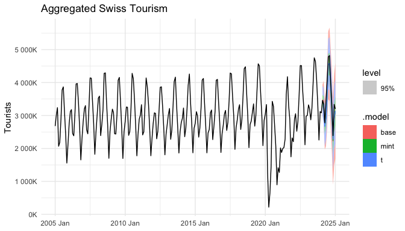{fig-alt="Aggregated time series with base and reconciled forecasts"}

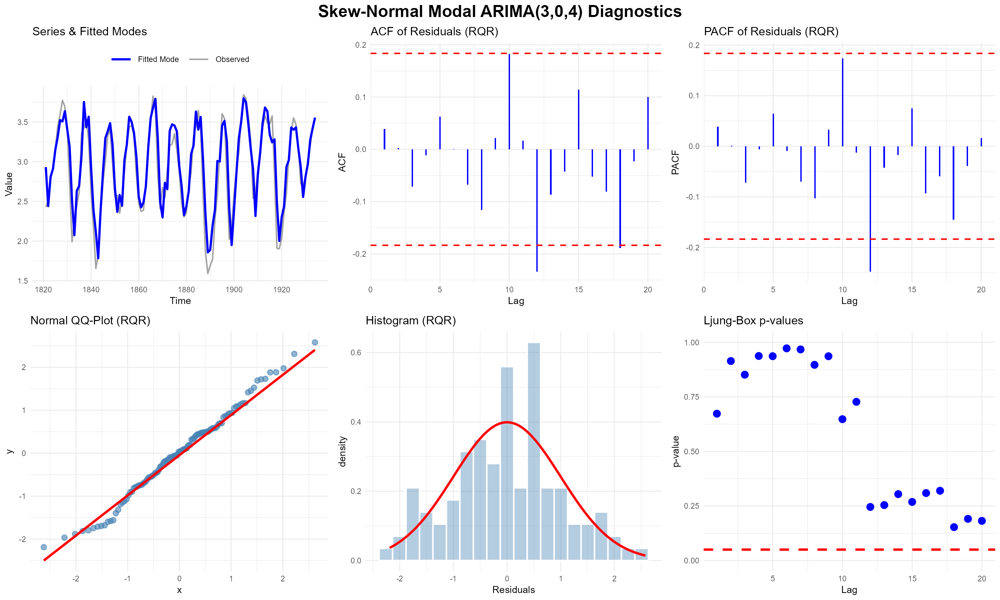{fig-alt="Skew normal Modal (ARIMA (3,0,4) diagnostics"}

[mixtime](https://cran.r-project.org/package=mixtime) v0.1.0: Provides flexible time classes for time series analysis and forecasting with mixed temporal granularities. Supports linear and cyclical time representations in discrete and continuous forms, with timezone support, across multiple calendar systems including Gregorian and ISO week date calendars. Calendrical arithmetic enables conversion between time granules (e.g. days to months) and calendar systems. Multi-unit arithmetic allows for temporal analysis with other granules of common calendars. Time vectors of different granularities (e.g. monthly and quarterly) can be combined in a single vector. See the vignettes [Extending mixtime](https://cran.r-project.org/web/packages/mixtime/vignettes/extending-mixtime.html) and [Time format strings](https://cran.r-project.org/web/packages/mixtime/vignettes/time-format-strings.html).

[ModalForecast](https://cran.r-project.org/package=ModalForecast) v0.1.0: Implements parametric modal Autoregressive Integrated Moving Average (ARIMA) models utilizing the Skewed Distribution family. Supported distributions include the Skew-Normal, Skewed Student-t, and Skewed Laplace. Features includes comprehensive residual diagnostics, robustness options (heavy tails, asymmetry), robust parametric bootstrap prediction intervals, and classical asymptotic inference via the Fisher Information matrix. Methods are described in [Galarza et al. (2017)](https://onlinelibrary.wiley.com/doi/10.1002/sta4.140). Look [here](https://github.com/chedgala/ModalForecast) for an example.

[VARcheck](https://cran.r-project.org/package=VARcheck) v0.1.0: Provides model-agnostic visual diagnostics for vector autoregressive models. Given empirical data, model predictions, residuals, and optionally simulated data, the package assembles a multi-panel diagnostic grid: empirical vs. predicted time series, residual inspection, residuals vs. predictions scatter, and posterior predictive style checks via simulated trajectories. See [Haslbeck et al. (2026)](https://osf.io/preprints/psyarxiv/k6uz4_v3) for the approach followed and the vignettes [Example analyses](https://cran.r-project.org/web/packages/VARcheck/vignettes/example-analyses.html) and [Getting Started](https://cran.r-project.org/web/packages/VARcheck/vignettes/getting-started.html). 

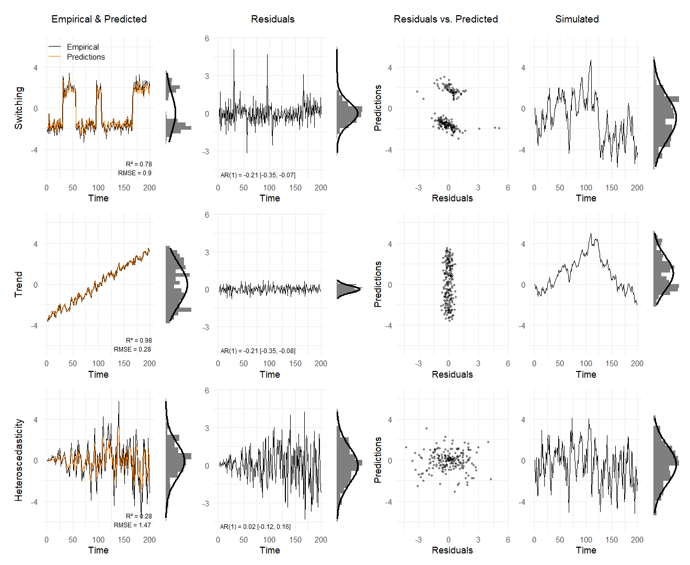{fig-alt="Diagnostic plots on grid"}

### Utilities

[DT2](https://CRAN.R-project.org/package=DT2) v0.1.2: Implements a modern R binding for `DataTables` V2 with modular extension loading, `Bootstrap 5` styling, `Shiny` integration (proxy, events, inline inputs), server-side processing helpers, and standalone (non-Shiny) support. Configure `DataTables` options directly via R lists, a 1:1 mapping to the `JavaScript` API. There are five vignettes including [Getting Started](https://cran.r-project.org/web/packages/DT2/vignettes/getting-started.html) and [Shiny Integration](https://cran.r-project.org/web/packages/DT2/vignettes/shiny-integration.html).

[gridmicrotex](https://cran.r-project.org/package=gridmicrotex) v0.0.4: Provides functions to render `LaTeX` math equations as native `R` grid graphics objects (grobs) using the `MicroTeX` `C++` library as the layout engine. Produces resolution-independent vector output that works on any `R` graphics device, with no external `LaTeX` installation required. See the vignettes [Introduction](https://cran.r-project.org/web/packages/gridmicrotex/vignettes/getting-started.html) and [Using LaTeX Math in ggplot2](https://cran.r-project.org/web/packages/gridmicrotex/vignettes/ggplot2-integration.html).

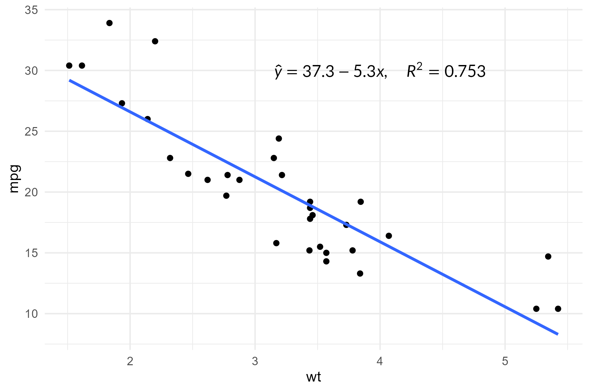{fig-alt="Regression plot with equation"}

### Visualization

[ggsql](https://cran.r-project.org/package=ggsql) v0.3.3: Provides functions to write queries that combine `SQL` (Structured Query Language) data retrieval with visualization specifications in a single, composable syntax, binds directly with the `ggsql` `Rust` library and offers `knitr` and `Shiny` integration. See the vignettes [Getting started](https://cran.r-project.org/web/packages/ggsql/vignettes/ggsql.html) [The ggsql knitr engine](https://cran.r-project.org/web/packages/ggsql/vignettes/engine.html).

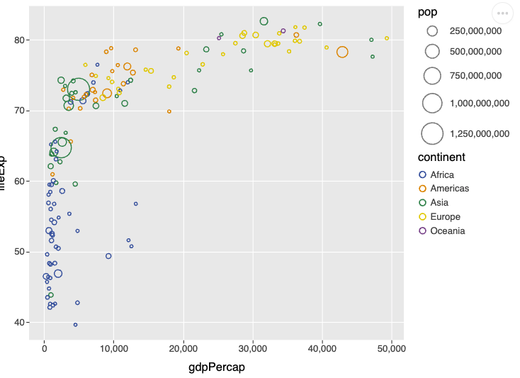{fig-alt="ggplot2 rendering of a SQL query"}

[mSigPlot](https://cran.r-project.org/package=mSigPlot) v2.0.38: Provides plotting functions for mutational signatures and mutational spectra, including single base substitutions, doublet base substitutions, and small insertions and deletions. Generates plots similar to those used previously in [Alexandrov et al. (2020)](https://www.nature.com/articles/s41586-020-1943-3) and [Rozen et al. (2026)](https://zenodo.org/records/20147372). See the [vignette](https://cran.r-project.org/web/packages/mSigPlot/vignettes/mSigPlot.html) for an example.

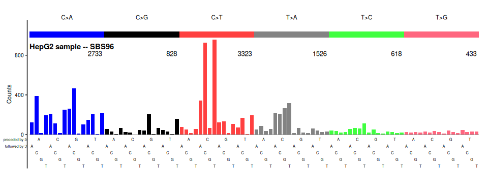{fig-alt="Plot of mutation classes"}

:::

::::

