:::: {.columns}

::: {.column width="45%"}

{fig-alt=""}
### AI

[btw](https://cran.r-project.org/package=btw) v1.1.0: Implements a toolkit for connecting `R` environments with Large Language Models (LLMs). Provides utilities for describing `R` objects, package documentation, and workspace state in plain text formats optimized for LLM consumption. Supports multiple workflows: interactive copy-paste to external chat interfaces, programmatic tool registration with `ellmer` chat clients, batteries-included chat applications via `shinychat`, and exposure to external coding agents through the Model Context Protocol. Project configuration files enable stable, repeatable conversations with project-specific context and preferred LLM settings. See [README](https://cran.r-project.org/web/packages/btw/readme/README.html).

### Astronomy

[marsrad](https://CRAN.R-project.org/package=marsrad) v1.0.0: A set of functions to calculate solar irradiance and insolation on Mars horizontal and inclined surfaces. Based on NASA Technical Memoranda 102299, 103623, 105216, 106321, and 106700, i.e. the canonical Mars solar radiation papers. (JBR: Should be useful for all of you going with Elon). See [README](https://cran.r-project.org/web/packages/marsrad/readme/README.html) for examples.

### Causal Inference

[infocausality](https://cran.r-project.org/package=infocausality) v1.0: Provides methods for quantifying temporal and spatial causality through information flow, and decomposing it into unique, redundant, and synergistic components, following the framework described in [Martinez-Sanchez et al. (2024)](https://www.nature.com/articles/s41467-024-53373-4). See the [vignette](https://cran.r-project.org/web/packages/infocausality/vignettes/surd.html).

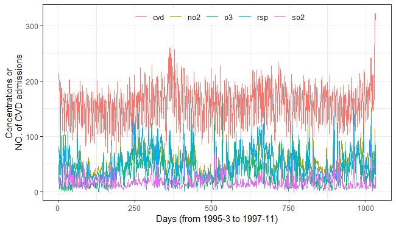{fig-alt="Time series of air pollutants and confirmed CVD cases in Hong Kong from March 1995 to November 1997."}

### Data

[MaddisonData](https://cran.r-project.org/package=MaddisonData) v1.0.2: Provides access to to Maddison project data, which collates all the credible data on population and GDP for 169 countries, with some dating back to the year 1. `MaddisonLeaders` makes it easy to find the leaders for each year, allowing users to delete countries like OPEC with narrow economies to focus on the technology leaders. 'ggplotPath' makes it easy to plot data for only selected countries or years. See the vignettes [Industrial Revolution](https://cran.r-project.org/web/packages/MaddisonData/vignettes/IndustrialRevolution.html) and [Update Madison Data](https://cran.r-project.org/web/packages/MaddisonData/vignettes/UpdateMaddisonData.html).

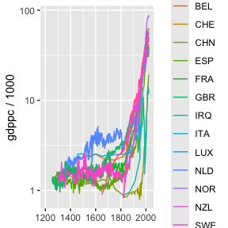{fig-alt="Plot of sources for leader countries."}

[traktok](https://cran.r-project.org/package=traktok) v0.1.1: Provides functions for getting [TikTok](https://www.tiktok.com/) through the official and unofficial APIs—in other words, you can track TikTok. See the vignettes [research api](https://cran.r-project.org/web/packages/traktok/vignettes/research-api.html) and [unofficial api](https://cran.r-project.org/web/packages/traktok/vignettes/unofficial-api.html).

### Ecology

[estar](https://cran.r-project.org/package=estar) v1.0-1: Standardises established stability properties used to assess systems’ responses to press or pulse disturbances at different ecological levels (e.g. population, community). There are two sets of functions. The first set corresponds to functions that measure stability at any level of organisation. The second set of functions when applied to Jacobian matrices measure the stability of a community at short and long time scales. See [Figueiredo et al. (2025)](https://ecoevorxiv.org/repository/view/8592/) for the theory. There are two vignettes: [Functional stability properties]() and [Jacobian stability properties](https://cran.r-project.org/web/packages/estar/vignettes/jacobian_stability_properties.html)  .

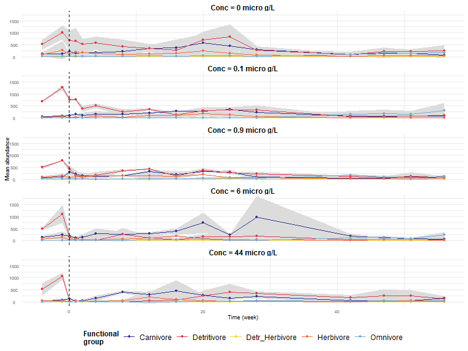{fig-alt="Organism count (mean +- sd in grey) of the five functional groups over the course of ecotoxicological experiment. ."}

### Epidemiology

[healthiar](https://cran.r-project.org/package=healthiar) v0.2.1: Provides functions to quantify and monetize the health impacts of environmental stressors (air pollution & noise). See the document [WHO (2003a)](https://www.who.int/publications/i/item/9241546204): "Assessing the environmental burden of disease at national and local levels" for background and the [vignette](https://cran.r-project.org/web/packages/healthiar/vignettes/intro_to_healthiar.html) for examples.

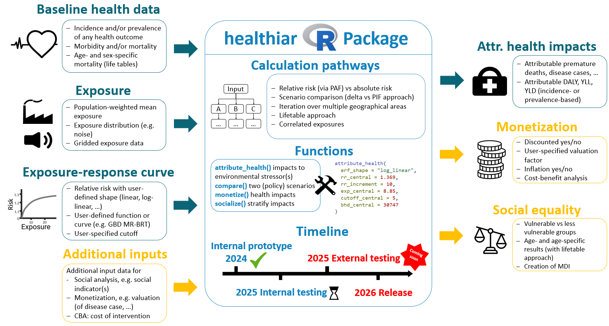{fig-alt="Package Overview"}

[vaccinationimpact](https://cran.r-project.org/package=vaccinationimpact) v0.1.0: Provides tools to estimate the impact of vaccination campaigns at population level (number of events averted, number of avertable events, number needed to vaccinate). Inspired by the methodology proposed by [Foppa et al. (2015)](https://www.sciencedirect.com/science/article/pii/S0264410X15002315?via%3Dihub) and [Machado et al. (2019)](https://www.eurosurveillance.org/content/10.2807/1560-7917.ES.2019.24.45.1900268) for influenza vaccination impact. See the [vignette](https://cran.r-project.org/web/packages/vaccinationimpact/vignettes/vaccination_impact_estimates.html) for examples.

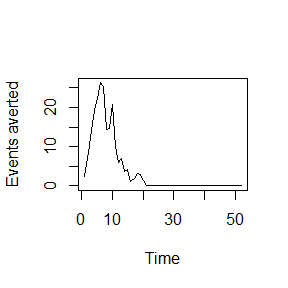{fig-alt="Plot of vacciation impact over time"}

### Genomics

[XYomics](https://cran.r-project.org/package=XYomics) v0.1.2: Provides tools to analyze sex differences in omics data for complex diseases. It includes functions for differential expression analysis using the limma method as described in [Ritchie et al. (2015)](https://academic.oup.com/nar/article/43/7/e47/2414268), interaction testing between sex and disease, pathway enrichment with `clusterProfiler` [Yu et al. (2012)](https://journals.sagepub.com/doi/10.1089/omi.2011.0118) <doi:10.1089/omi.2011.0118>, and gene regulatory network construction and analysis using `igraph`. See the vignettes [Bulk RNA-Seq Example](https://cran.r-project.org/web/packages/XYomics/vignettes/XYomics_bulk_example.html) and [Single Cell Example](https://cran.r-project.org/web/packages/XYomics/vignettes/XYomics_sc_example.html)

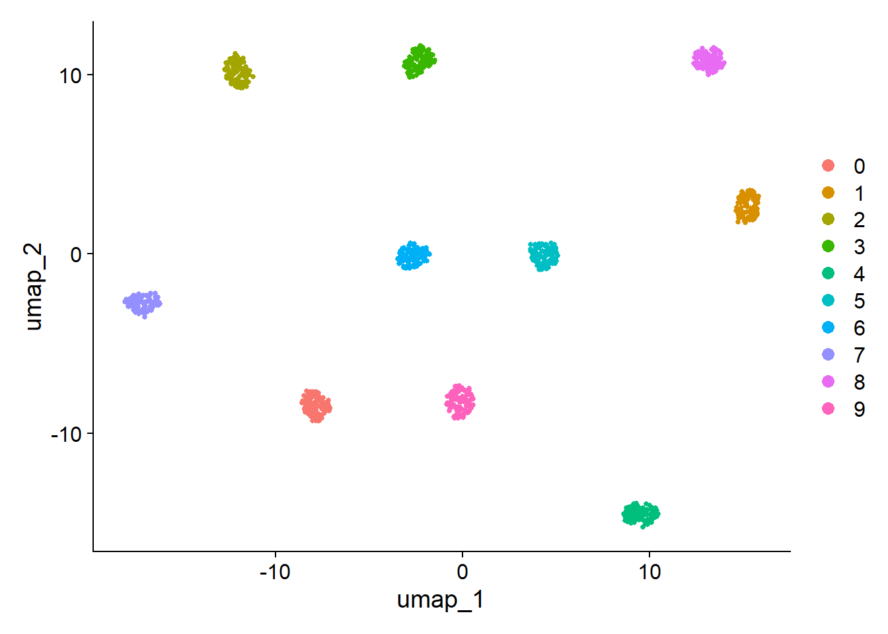{fig-alt="Plot of cell clusters"}

### Machine Learning

[autotab](https://cran.r-project.org/package=autotab) v0.1.1: Provides tools to build and train a variational autoencoder (VAE) for mixed-type tabular data (continuous, binary, categorical). Models are implemented using `TensorFlow` and `Keras` via the `reticulate` interface, enabling reproducible VAE training for heterogeneous tabular datasets. See [README](https://cran.r-project.org/web/packages/autotab/readme/README.html) to get started.

[fairGATE](https://cran.r-project.org/package=fairGATE) v0.1.1: Provides tools for training and analysing fairness-aware gated neural networks for subgroup-aware prediction and interpretation in clinical datasets. Methods draw on prior work in mixture-of-experts neural networks by [Jordan and Jacobs (1994)](https://link.springer.com/chapter/10.1007/978-1-4471-2097-1_113), fairness-aware learning by [Hardt, Price, and Srebro (2016)](https://arxiv.org/abs/1610.02413), and personalised treatment prediction for depression by [Iniesta, Stahl, and McGuffin (2016)](https://www.sciencedirect.com/science/article/pii/S0022395616300541?via%3Dihub). See the [vignette](https://cran.r-project.org/web/packages/fairGATE/vignettes/introduction-to-fairGATE.html).

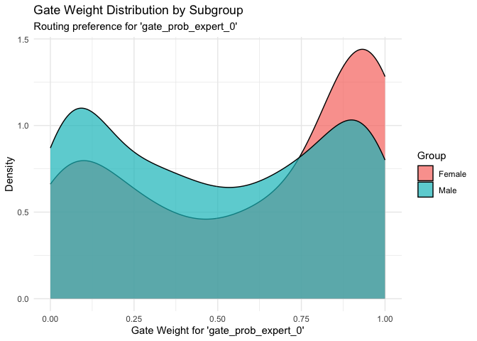{fig-alt="Plot of gate weight distribution by subgroup"}

### Marketing

[rbranding](https://cran.r-project.org/package=rbranding) v0.1.1: Implements a  tool for building projects that are visually consistent, accessible, and easy to maintain. It provides functions for managing branding assets, applying organization-wide themes using [`brand.yml`](https://posit-dev.github.io/brand-yml/), and setting up new projects with accessibility features and correct branding. It supports `quarto`, `shiny`, and `rmarkdown` projects, and integrates with `ggplot2`. The accessibility features are based on the [Web Content Accessibility Guidelines](https://www.w3.org/WAI/WCAG22/quickref/?versions=2.1) and [Accessible Rich Internet Applications specifications](https://www.w3.org/WAI/ARIA/apg/). There are three vignettes including [rebranding](https://cran.r-project.org/web/packages/rbranding/vignettes/rbranding.html) and [Templates](https://cran.r-project.org/web/packages/rbranding/vignettes/templates.html).

### Medical Statistics

[carts](https://cran.r-project.org/package=carts) v0.1.0: Implements a Monte Carlo simulation framework for different randomized clinical trial designs with a special emphasis on estimators based on covariate adjustment. Functions include a regression-based covariate adjustment based on [Rosenblum & van der Laan (2010)](https://www.degruyterbrill.com/document/doi/10.2202/1557-4679.1138/html) a one-step estimator based on [Van Lancker et al (2024)](https://arxiv.org/abs/2404.11150) for trials with continuous, binary and count outcomes and functions to estimate the minimum sample-size required to reach a specified statistical power for a given estimator, [Robbins-Monro (1951)](https://projecteuclid.org/journals/annals-of-mathematical-statistics/volume-22/issue-3/A-Stochastic-Approximation-Method/10.1214/aoms/1177729586.full). There are two vignettes [Getting Started](https://cran.r-project.org/web/packages/carts/vignettes/gettingstarted.html) and [Parametrization of the negative binomial and gamma distributions](https://cran.r-project.org/web/packages/carts/vignettes/param.html).

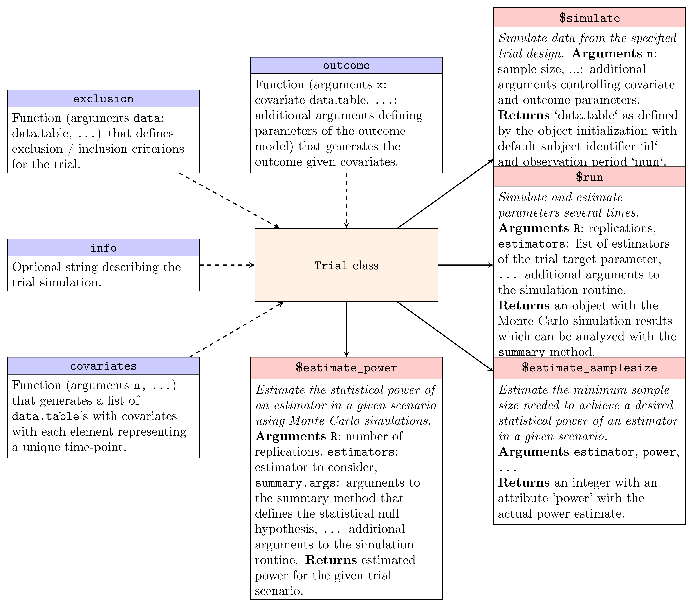{fig-alt="Workflow diagram"}

[cgmguru](https://cran.r-project.org/package=cgmguru) v0.1.0: Provides tools for advanced analysis of continuous glucose monitoring (CGM) time-series, implementing GRID (Glucose Rate Increase Detector) and GRID-based algorithms for postprandial peak detection, and detection of hypoglycemic and hyperglycemic episodes (Levels 1/2/Extended) aligned with international consensus CGM metrics. There are ninteen vignetttes including [Complete CGM Analysis Workflow](https://cran.r-project.org/web/packages/cgmguru/vignettes/intro.html) and [detect all events](https://cran.r-project.org/web/packages/cgmguru/vignettes/detect_all_events.html).

[twoCoprimary](https://cran.r-project.org/package=twoCoprimary) v1.0.0: Provides functions to calculate sample size and power for clinical trials with two co-primary endpoints that support five endpoint combinations: two continuous endpoints ([Sozu et al. (2011)](https://www.tandfonline.com/doi/full/10.1080/10543406.2011.551329), two binary endpoints using asymptotic methods ([Sozu et al. (2010)](https://onlinelibrary.wiley.com/doi/10.1002/sim.3972) exact methods ([Homma and Yoshida (2025)](https://journals.sagepub.com/doi/10.1177/09622802251368697), mixed continuous and binary endpoints ([Sozu et al. (2012)](https://onlinelibrary.wiley.com/doi/10.1002/bimj.201100221), and mixed count and continuous endpoints ([Homma and Yoshida (2024)](https://onlinelibrary.wiley.com/doi/10.1002/pst.2337). There are six vignettes including an [Overview](https://cran.r-project.org/web/packages/twoCoprimary/vignettes/overview.html) and [Mixed and COntinuous Co-Primary Endpoints](https://cran.r-project.org/web/packages/twoCoprimary/vignettes/mixed-count-continuous.html).

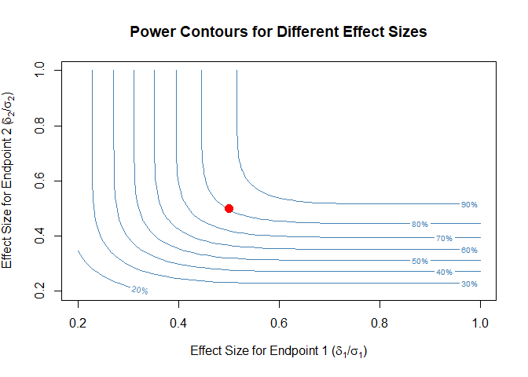{fig-alt="Power contours for different effect sizes"}

[whatifbandit](https://cran.r-project.org/package=whatifbandit) v0.3.0: Provides functions to simulate the results of completed randomized controlled trials, as if they had been conducted as adaptive Multi-Arm Bandit (MAB) trials instead. Uses augmented inverse probability weighted estimation (AIPW), outlined by [Hadad et al. (2021)](https://www.pnas.org/doi/full/10.1073/pnas.2014602118) to estimate the probability of success for each treatment arm under the adaptive design. See [Offer-Westort et al. (2021)](https://onlinelibrary.wiley.com/doi/10.1111/ajps.12597) for background and the [vignette](https://cran.r-project.org/web/packages/whatifbandit/vignettes/whatifbandit.html) for examples.

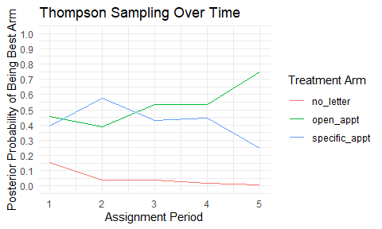{fig-alt="Plot of Thompson sampling over time"}

:::

::: {.column width="10%"}

:::

::: {.column width="45%"}

### Statistics

[aramappings](https://cran.r-project.org/package=aramappings) v0.1.2: Computes low-dimensional point representations of high-dimensional numerical data according to the data visualization method Adaptable Radial Axes described in: Rubio-Sánchez et al. (2017)](https://onlinelibrary.wiley.com/doi/10.1111/cgf.13196). See the [vignette](https://cran.r-project.org/web/packages/aramappings/vignettes/intro_to_aramappings.html).

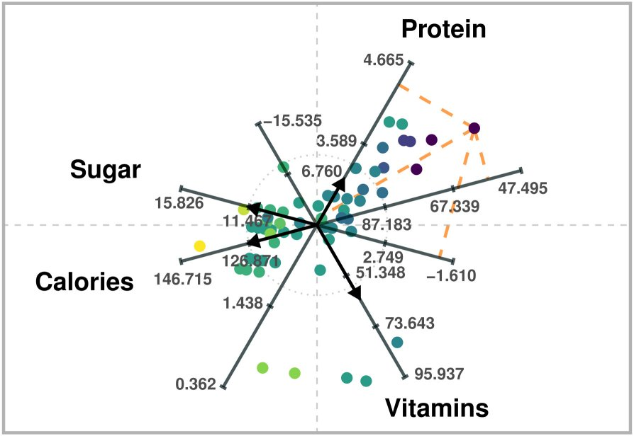{fig-alt="Example of ARA Plot"}

[deepspat](https://cran.r-project.org/package=deepspat) v0.3.1: Deep compositional spatial models are standard spatial covariance models coupled with an injective warping function of the spatial domain. The warping function is constructed through a composition of multiple elemental injective functions in a deep-learning framework. The package implements two cases for the univariate setting; first, when these warping functions are known up to some weights that need to be estimated, and, second, when the weights in each layer are random. Estimation and inference is done using `tensorflow`, which makes use of graphics processing units. For more details see [Zammit-Mangion et al. (2022)](https://www.tandfonline.com/doi/full/10.1080/01621459.2021.1887741), [Vu et al. (2022)](https://www3.stat.sinica.edu.tw/statistica/oldpdf/A32n415.pdf) and [Shao et al. (2025)](https://arxiv.org/abs/2505.12548). See [README]( for an example.)

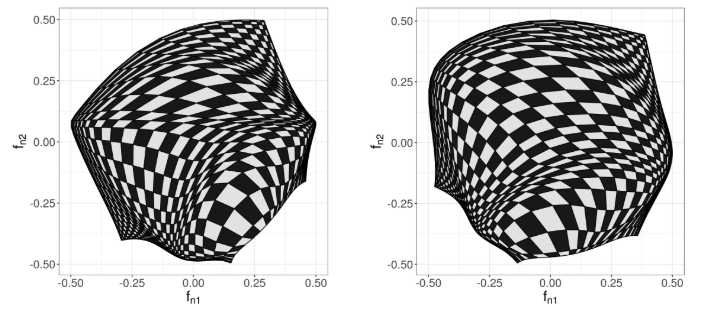{fig-alt="Deepspat images"}

[fmi](https://cran.r-project.org/package=fmi) v0.1.7: Provides functions to test for Functional Measurement Invariance between two groups. Implements hierarchical permutation tests for configural, metric, and scalar invariance, adapting concepts from Multi-Group Confirmatory Factor Analysis to functional data. Methods are based on concepts from: [Meredith, W. (1993)](https://www.cambridge.org/core/journals/psychometrika/article/abs/measurement-invariance-factor-analysis-and-factorial-invariance/914A4C29515ACA7E0554B9E79F20D36C), [Yao et al. (2005)](https://www.tandfonline.com/doi/abs/10.1198/016214504000001745) and [Lee  &  Li (2022)](https://www.tandfonline.com/doi/abs/10.1198/016214504000001745). See the [vignette](https://cran.r-project.org/web/packages/fmi/vignettes/introduction-to-fmi.html).

[gkwdist](https://cran.r-project.org/package=gkwdist) v1.1.1: Implements the five-parameter Generalized Kumaraswamy distribution proposed by [Carrasco, Ferrari and Cordeiro (2010)](https://arxiv.org/abs/1004.0911) and its seven nested sub-families for modeling bounded continuous data on the unit interval (0,1).  Provides density, distribution, quantile, and random generation functions, along with analytical log-likelihood, gradient, and Hessian functions. See the [Introduction](https://cran.r-project.org/web/packages/gkwdist/vignettes/into-gkwdist.html) and the vignette on [Statistical Properties](https://cran.r-project.org/web/packages/gkwdist/vignettes/into-gkwdist.html).

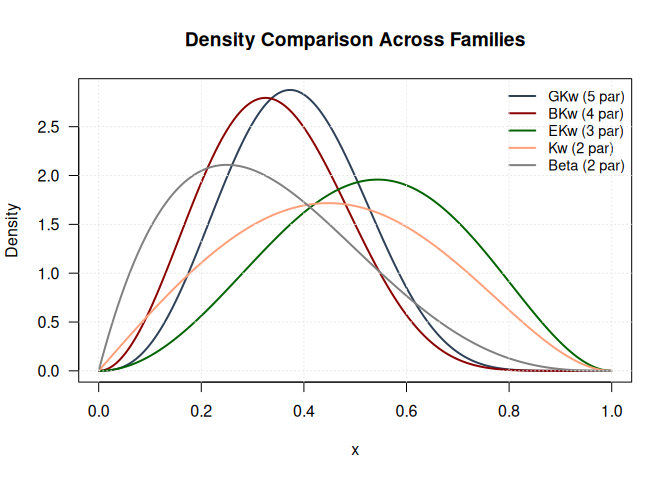{fig-alt="Plot of density comparisons"}

[grasps](https://cran.r-project.org/package=grasps) v0.1.0: Provides a unified framework for sparse-group regularization and precision matrix estimation in Gaussian graphical models and implements multiple sparse-group penalties, including sparse-group lasso, sparse-group adaptive lasso, sparse-group SCAD, and sparse-group MCP. The package is designed for high-dimensional network inference where both sparsity and group structure are present. There are two vignettes: [Selection Criteria](https://cran.r-project.org/web/packages/grasps/vignettes/crit.html) and [Penal Precision Matrix Estimation]https://cran.r-project.org/web/packages/grasps/vignettes/pen_est.html).

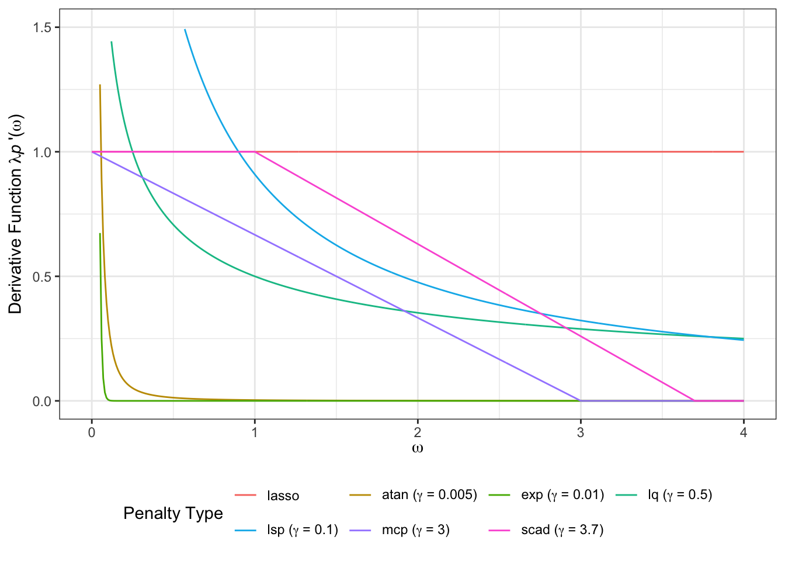{fig-alt="Plot comparing derivatives of various penalties"}

[PCBN](https://cran.r-project.org/package=PCBN) v0.1.1: Provides functions to create fit and sample Pair-Copula Bayesian networks (PCBN) under some restrictions on the underlying Directed Acyclic Graph (DAG), that is, no active cycles nor interfering v-structures. See [Derumigny, Horsman and Kurowicka (2025)]() for background and the vignettes [B-sets and interfering v-structures](https://cran.r-project.org/web/packages/PCBN/vignettes/Bsets-v-structs.html) and [How to use the estimation procedures](https://cran.r-project.org/web/packages/PCBN/vignettes/internals-estimation.html)

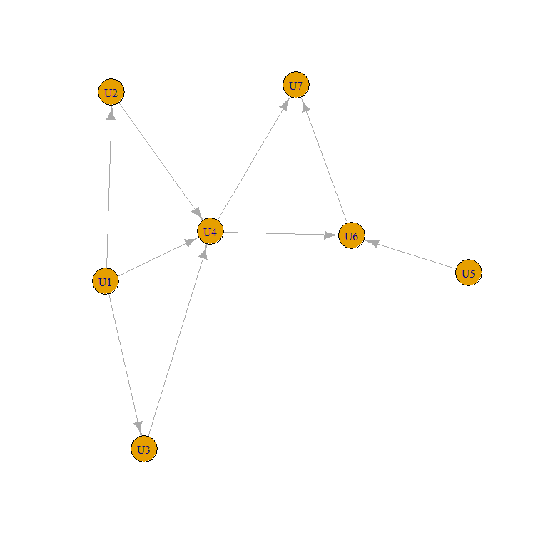{fig-alt="Saple DAG"}

[PublicationBiasBenchmark](https://cran.r-project.org/package=PublicationBiasBenchmark) v0.1.3: Implements a unified interface for benchmarking meta-analytic publication bias correction methods through simulation studies which provide predefined data-generating mechanisms from the literature, functions for running meta-analytic methods on simulated data, pre-simulated datasets and pre-computed results for reproducible benchmarks, and tools for visualizing and comparing method performance. See [Bartoš et al.(2025)](https://arxiv.org/abs/2510.19489) for background. There seven vignettes including [Computing Method Measures](https://cran.r-project.org/web/packages/PublicationBiasBenchmark/vignettes/Computing_Method_Measures.html) and [Adding New Methods](https://cran.r-project.org/web/packages/PublicationBiasBenchmark/vignettes/Adding_New_Methods.html).

[SelectBoost.gamlss](https://cran.r-project.org/package=SelectBoost.gamlss) v0.2.2: Extends the `SelectBoost` approach to Generalized Additive Models for Location, Scale and Shape (GAMLSS). Implements bootstrap stability-selection across parameter-specific formulas (mu, sigma, nu, tau) via gamlss::stepGAIC(). Includes optional standardization of predictors and helper functions for corrected AIC calculation. See [Bertrand and Maumy (2024)](ttps://hal.science/hal-05352041) for details on correlation-aware resampling to improve variable selection for GAMLSS and quantile regression. There are nine vignettes including [Advanced data examples](https://cran.r-project.org/web/packages/SelectBoost.gamlss/vignettes/advanced-real-data-examples.html) and [Confidence Functionals](https://cran.r-project.org/web/packages/SelectBoost.gamlss/vignettes/confidence-functionals.html).

[SCoRES](https://cran.r-project.org/package=SCoRES) v0.1.2: Provides computational tools for estimating inverse regions and constructing the corresponding simultaneous outer and inner confidence regions for logistic, functional, and spatial generalized least squares regression models. Functions are also available for constructing simultaneous confidence bands. See [Sommerfeld et al. (2018)](https://www.tandfonline.com/doi/full/10.1080/01621459.2017.1341838) for the definition of a simultaneous confidence region, and see [Ren et al. (2024)](https://academic.oup.com/jrsssc/article/73/4/1082/7685821?login=false), [Crainiceanu et al. (2024)](https://www.taylorfrancis.com/books/mono/10.1201/9781003278726/functional-data-analysis-ciprian-crainiceanu-jeff-goldsmith-andrew-leroux-erjia-cui), and [Telschow et al. (2022)](https://www.sciencedirect.com/science/article/abs/pii/S0378375821000598?via%3Dihub) for background. There are four vignettes including [Methods](https://cran.r-project.org/web/packages/SCoRES/vignettes/Methods.html) and Functional Data Example](https://cran.r-project.org/web/packages/SCoRES/vignettes/Functional_Data_Example.html).

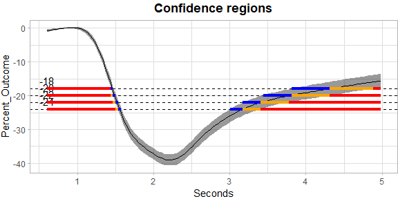{fig-alt="Plot ofconfidence regions"}
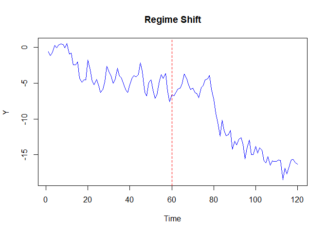{fig-alt="Time series plot with regime shift"}

[UGarima](https://cran.r-project.org/package=UGarima) v0.1.0: Provides density, distribution function, quantile function, and random generating function of the Unit-Garima distribution based on [Ayuyuen & Bodhisuwan (2024)](https://pjsor.com/pjsor/article/view/4307).

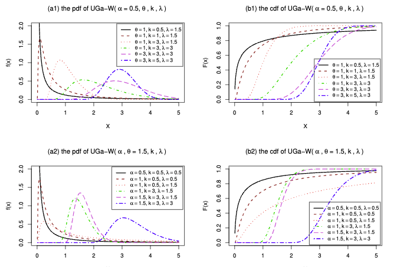{fig-alt="Plots of the pdf and cdf of X∼UGa-W(α,θ,k,λ)"}

### Time Series

[aplms](https://cran.r-project.org/package=aplms) v0.1.0: Provides tools for fitting the additive partial linear models with symmetric autoregressive errors of order p, or APLMS-AR(p) enabling the modeling of a time series response variable using linear and nonlinear structures of a set of explanatory variables, with nonparametric components approximated by natural cubic splines or P-splines. Functions include various error distributions, such as normal, generalized normal, Student's t, generalized Student's t, power-exponential, and Cauchy distributions. [Chou-Chen et al. (2024)](https://link.springer.com/article/10.1007/s00362-024-01590-w) for background. Look [here](https://github.com/shuwei325/aplms) for examples.

[BLSloadR](https://cran.r-project.org/package=BLSloadR) v0.2: Implements an interface for downloading data from the [U.S. Bureau of Labor Statistics](https://www.bls.gov). Files include employment, unemployment, wages, prices, industry and occupational data at a national, state, and sub-state level, depending on the series. Individual functions are included for those programs which have data available at the state level. The core functions provide direct access to the Current Employment Statistics [CES](https://www.bls.gov/ces/), Local Area Unemployment Statistics [LAUS](https://www.bls.gov/lau/), Occupational Employment and Wage Statistics [OEWS](https://www.bls.gov/oes/), and Alternative Measures of Labor Underutilization [SALT](https://www.bls.gov/lau/stalt.htm). See the [vignette](https://cran.r-project.org/web/packages/BLSloadR/vignettes/BLSloadR-intro.html)

[makicoint](https://cran.r-project.org/package=makicoint) v1.0.0: Implements the [Maki (2012)](https://www.sciencedirect.com/science/article/abs/pii/S0264999312001162) cointegration test that allows for an unknown number of structural breaks. The test detects cointegration relationships in the presence of up to five structural breaks in the intercept and/or slope coefficients. Four different model specifications are supported: level shifts, level shifts with trend, regime shifts, and trend with regime shifts. See the [vignette](https://cran.r-project.org/web/packages/makicoint/vignettes/introduction.html).

[organik](https://cran.r-project.org/package=organik) v1.0.1: Provides functions to train per-horizon probabilistic ensembles from a univariate time series. It supports `rpart`, `glmnet`, and `kNN` engines with flexible residual distributions and heteroscedastic scale models, weighting variants by calibration-aware scores. A Gaussian/t copula couples the marginals to simulate joint forecast paths, returning quantiles, means, and step increments across horizons. Look [here](https://rpubs.com/giancarlo_vercellino/organik) for the details.

{fig-alt="The organik process"}

[trendseries](https://cran.r-project.org/package=trendseries) v1.1.0: Provides functions to extract trends from monthly and quarterly economic time series: `augment_trends()` for pipe-friendly `tibble` workflows and `extract_trends()` for direct time series analysis. Includes key econometric filters and modern parameter experimentation tools. There are three vignettes: [Getting Started](https://cran.r-project.org/web/packages/trendseries/vignettes/trendseries.html), [Moving Averages](https://cran.r-project.org/web/packages/trendseries/vignettes/moving-averages.html), and [Economic Filters for Business Cycle Analysis](https://cran.r-project.org/web/packages/trendseries/vignettes/economic-filters.html).

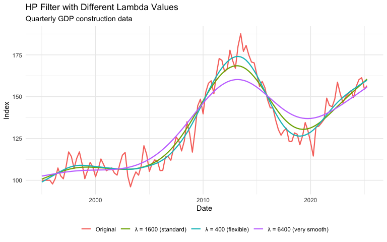{fig-alt="Plot of HP filter with different lambda values"}

### Utilities

[hdf5lib](https://cran.r-project.org/package=hdf5lib) v2.0.0.4:  [HDF5](https://www.hdfgroup.org/) (Hierarchical Data Format 5) is a high-performance library and file format for storing and managing large, complex data. This package, which provides the static libraries and headers for the `HDF5` `C` library (release 2.0.0), is intended for developers to use in the LinkingTo field, which eliminates the need for users to install system-level dependencies. This build is compiled with thread-safety enabled and supports dynamic loading of external compression filters. Look [here](https://cmmr.github.io/hdf5lib/) for more information.

[privacyR](https://cran.r-project.org/package=privacyR) v1.0.1: Provides tools for anonymizing sensitive patient and research data. Helps protect privacy while keeping data useful for analysis. Anonymizes IDs, names, dates, locations, and ages while maintaining referential integrity. Methods based on: [Sweeney (2002)](https://www.worldscientific.com/doi/abs/10.1142/S0218488502001648), [Dwork et al. (2006)](https://link.springer.com/chapter/10.1007/11681878_14), [El Emam et al. (2011)](https://journals.plos.org/plosone/article?id=10.1371/journal.pone.0028071), and [Fung et al. (2010)](https://dl.acm.org/doi/10.1145/1749603.1749605). See the [vignette](https://cran.r-project.org/web/packages/privacyR/vignettes/privacyR.html).

### Visualization

[colorify](https://cran.r-project.org/package=colorify) v0.1.2: Provides one-stop shop for intuitive and dependency-free color and palette creation and modification. Includes palettes and functionality from popular packages such as `viridis`, `RColorBrewer`, and base R `grDevices`, as well as `ggplot2` plot bindings. Users can generate perceptually uniform and colorblind-friendly palettes, adjust palettes in HSL and RGB color spaces, map color gradients to value ranges, and create color-generating functions. See the [vignette](https://cran.r-project.org/web/packages/colorify/vignettes/colorify.html).

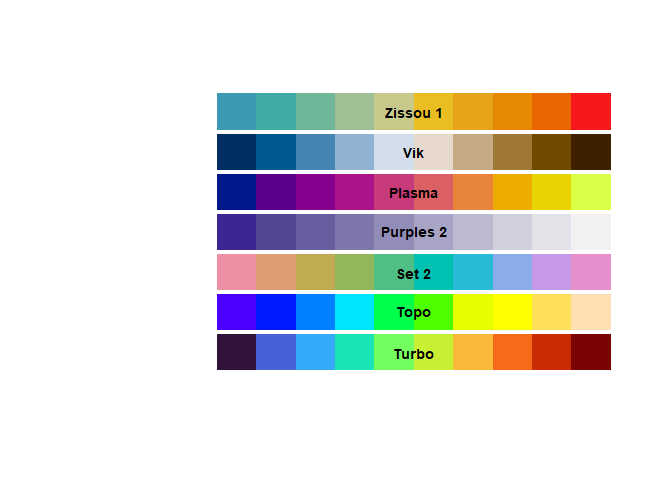{fig-alt="Sample palettes"}

[GGenemy](https://cran.r-project.org/package=GGenemy) v0.1.0: Audits `ggplot2` visualizations for accessibility issues, misleading practices, and readability problems. Checks for color accessibility concerns including colorblind-unfriendly palettes, misleading scale manipulations such as truncated axes and dual y-axes, text readability issues like small fonts and overlapping labels, and general accessibility barriers. Provides comprehensive audit reports with actionable suggestions for improvement. Color vision deficiency simulation uses methods from the `colorspace` package [Zeileis et al. (2020)](https://www.jstatsoft.org/article/view/v096i01) <doi:10.18637/jss.v096.i01>. Contrast calculations follow [WCAG 2.1 guidelines (W3C 2018)](https://www.w3.org/WAI/WCAG21/Understanding/contrast-minimum). See the [vignette](https://cran.r-project.org/web/packages/GGenemy/vignettes/getting-started.html).

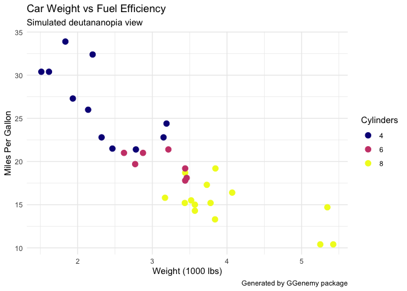{fig-alt="Simulated deutananopia view of a ggplot2 scatter plot"}

[ggincerta](https://cran.r-project.org/package=ggincerta) v0.1.0: Extends `ggplot2` with Layers and Scales for Spatial Uncertainty Visualization. See [README](https://cran.r-project.org/web/packages/ggincerta/readme/README.html).

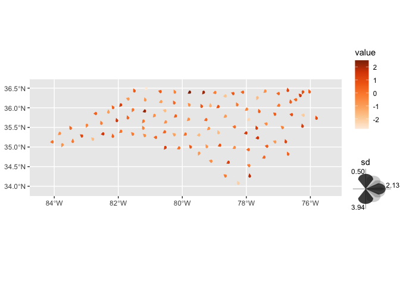{fig-alt="Example glyph map"}

[poisonfrogs](https://cran.r-project.org/package=poisonfrogs) v1.0.2: Provides a collection of color palettes inspired by the enormous diversity of skin colors in Neotropical poison frog species. Suitable for use with `ggplot2` and base R graphics. See [README](https://cran.r-project.org/web/packages/poisonfrogs/readme/README.html)

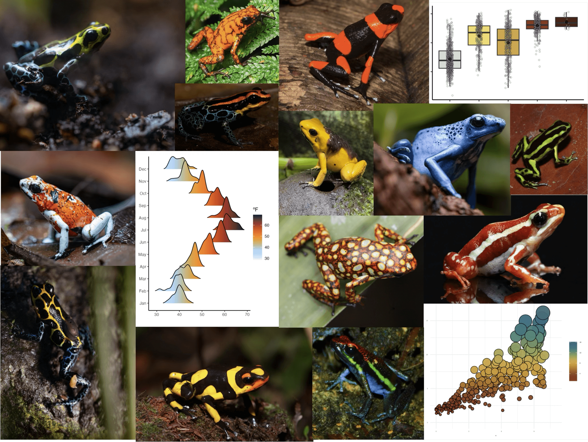{fig-alt="Poison frogs pallettes"}

:::

::::

