:::: {.columns}

::: {.column width="45%"}

### Data

[AlgeriAPIs](https://cran.r-project.org/package=AlgeriAPIs) v0.1.0: Provides functions to access data from public RESTful APIs, including *World Bank API* and *REST Countries API*, retrieving real-time or historical information related to Algeria. The package enables users to query economic indicators and international demographic and geopolitical statistics in a reproducible way. See the [vignette](https://cran.r-project.org/web/packages/AlgeriAPIs/vignettes/AlgeriAPIs_vignette.html).

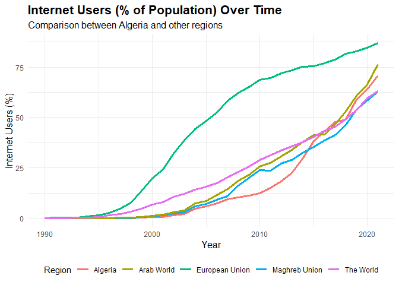{fig-alt="% of Algerian population using internet compared to other regions"}

[CopernicusClimate](https://cran.r-project.org/package=CopernicusClimate) v0.0.3: Provides functions to subset and download data from [EU Copernicus Climate Data Service](https://cds.climate.copernicus.eu/), including information about the Earth's past, present, and future climate. See the vignettes [Downloading from Copernicus](https://cran.r-project.org/web/packages/CopernicusClimate/vignettes/download.html) and [Translate API Code](https://cran.r-project.org/web/packages/CopernicusClimate/vignettes/translate.html).

[FakeDataR](https://cran.r-project.org/package=FakeDataR) v0.2.2: Provides functions to generate privacy-preserving synthetic datasets that mirror structure, types, factor levels, and missingness; export bundles for LLM workflows and build fake data directly from `SQL` database tables without reading real rows. See [Nowok et al. (2016)](https://journal.r-project.org/articles/RJ-2016-019/index.html) for background methods and [Bommasani et al. (2021)](https://arxiv.org/abs/2108.07258) for an overview of the foundation model. There are three vignettes, including [Getting started](https://cran.r-project.org/web/packages/FakeDataR/vignettes/getting-started.html) and [Privacy and validation](https://cran.r-project.org/web/packages/FakeDataR/vignettes/privacy-and-validation.html).

[faunabr](https://cran.r-project.org/package=faunabr) v1.0.0: Provides functions to retrieve, filter, and spatialize data from the [Catálogo Taxônomico da Faunado Brasil](https://fauna.jbrj.gov.br/fauna/listaBrasil/PrincipalUC/PrincipalUC.do;jsessionid=224496C2BF225A44F7B2B31C67858904). There are eight vignettes, including [Getting Started](https://cran.r-project.org/web/packages/faunabr/vignettes/getting_started.html) and [Flag Erroneous Records](https://cran.r-project.org/web/packages/faunabr/vignettes/Spatialize_faunabr.html). 

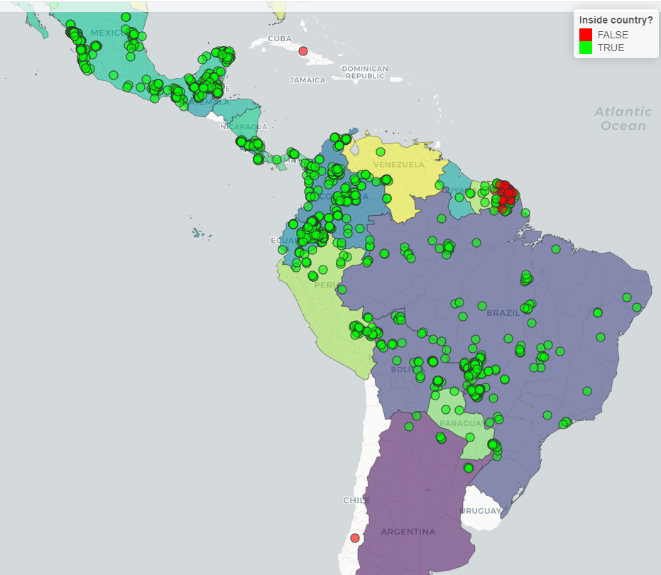{fig-alt="Map showing true and false records."}

[ForCausality](https://CRAN.R-project.org/package=ForCausality) v0.1.0: Provides a comprehensive set of datasets and tools for causal inference research that includes data from clinical trials, cancer studies, epidemiological surveys, environmental exposures, and health-related observational studies. The package is inspired by the foundational work of [Pearl (2009)](https://www.cambridge.org/core/books/causality/B0046844FAE10CBF274D4ACBDAEB5F5B). See the [vignette](https://cran.r-project.org/web/packages/ForCausality/vignettes/ForCausality_vignette.html).

[healthmotionR](https://cran.r-project.org/package=healthmotionR) v0.2.0: Provides a broad collection of datasets focused on health, biomechanics, and human motion, including clinical, physiological, and kinematic information from diverse sources, covering aspects such as surgery outcomes, vital signs, rheumatoid arthritis, osteoarthritis, accelerometry, gait analysis, motion sensing, and biomechanics experiments. See the [vignette](https://cran.r-project.org/web/packages/healthmotionR/vignettes/healthmotionR_vignette.html).

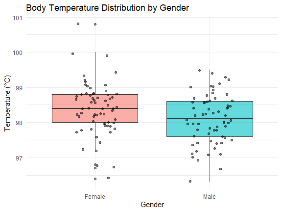{fig-alt="Distribution of Body Temperature by Sex"}

[imfapi](https://cran.r-project.org/package=imfapi) v0.1.2: Provides user-friendly functions for programmatic access to macroeconomic data from the International Monetary Fund's [SDMX 3.0 IMF Data API](https://data.imf.org/en/Resource-Pages/IMF-API). See [README](https://cran.r-project.org/web/packages/imfapi/readme/README.html) to get started.

[scf](https://cran.r-project.org/package=scf) v1.0.5: Provides functions to analyze public use microdata from the [Survey of Consumer Finances](https://www.federalreserve.gov/econres/scfindex.htm), including tools to download prepared data files, construct replicate-weighted multiply imputed survey designs, compute descriptive statistics and model estimates, and produce plots and tables. See the [vignette](https://cran.r-project.org/web/packages/scf/vignettes/SCF-guide.html).

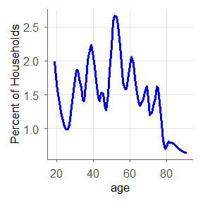{fig-alt="Plot of households by age"}

### Decision Analysis

[andorR](https://cran.r-project.org/package=andorR) v0.3.1: Implements a decision support tool to strategically prioritize evidence gathering in complex, hierarchical AND-OR decision trees. It is designed for situations with incomplete or uncertain information where the goal is to reach a confident conclusion as efficiently as possible (responding to the minimum number of questions, and only spending resources on generating improved evidence when it is of significant value to the final decision). There are five vignettes, including [Introduction](https://cran.r-project.org/web/packages/andorR/vignettes/andorR-intro.html) and [Example Data Files](https://cran.r-project.org/web/packages/andorR/vignettes/example-data-files.html).

### Ecology

[greenSD](https://cran.r-project.org/package=greenSD) v0.1.1: Access and analyze multi-band greenspace seasonality data cubes (available for 1,028 major global cities), global Normalized Difference Vegetation Index / land cover data from the European Space Agency WorldCover 10m Dataset, and Sentinel-2-l2a images.  The package also supports calculating human exposure to greenspace using a population-weighted greenspace exposure model introduced by [Chen et al. (2022)](https://www.nature.com/articles/s41467-022-32258-4) based on Global Human Settlement Layer population data. See the vignette to [get data](https://cran.r-project.org/web/packages/greenSD/vignettes/get_data.html), and look [here](https://billbillbilly.github.io/greenSD/) for additional information.

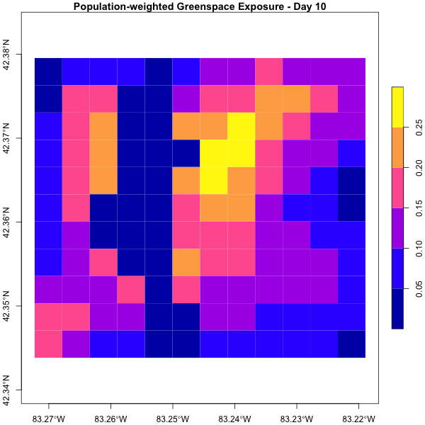{fig-alt="Population weighted greenspace exposure"}

[paisaje](https://cran.r-project.org/package=paisaje) v0.1.1: Provides functions for landscape analysis and data retrieval, which allow users to download environmental variables from global datasets (e.g., WorldClim, ESA WorldCover, Nighttime Lights), and to compute spatial and landscape metrics using a hexagonal grid system based on the H3 spatial index. See [Fick and Hijmans (2017)](https://rmets.onlinelibrary.wiley.com/doi/10.1002/joc.5086) and [Zanaga et al. (2022)](https://zenodo.org/records/7254221) for background and the [vignette](https://cran.r-project.org/web/packages/paisaje/vignettes/paisaje.html) for examples. 

### Econometrics

[BayesianDisaggregation](https://cran.r-project.org/package=BayesianDisaggregation) v0.1.2: Implements a novel Bayesian disaggregation framework that combines Principal Component Analysis (PCA) and Singular Value Decomposition (SVD) dimension reduction of prior weight matrices with deterministic Bayesian updating rules. The method provides Markov Chain Monte Carlo (MCMC) free posterior estimation with built-in diagnostic metrics. Read the vignette in [English](https://cran.r-project.org/web/packages/BayesianDisaggregation/vignettes/USERMANUAL-ENG.html) or [Spanish](https://cran.r-project.org/web/packages/BayesianDisaggregation/vignettes/MANUALUSUARIO-ESP.html).

[pvars](https://cran.r-project.org/package=pvars) v1.1.1: Implements panel cointegration rank tests and estimators for panel vector autoregressive models, and identification methods for panel structural vector autoregressive models. Functions allow accounting for cross-sectional dependence and for structural breaks in the deterministic terms of the VAR processes. Particularly noteworthy are the correlation-augmented inverse normal test on the cointegration rank by [Arsova and Oersal (2021)](https://www.sciencedirect.com/science/article/pii/S2452306220300484), the two-step estimator for pooled cointegrating vectors by [Breitung (2005)](https://www.tandfonline.com/doi/abs/10.1081/ETC-200067895), and the pooled identification based on independent component analysis by [Herwartz and Wang (2024)](https://onlinelibrary.wiley.com/doi/10.1002/jae.3044). See the [vignette](https://cran.r-project.org/web/packages/pvars/vignettes/pvars_vignette.pdf) for a detailed introduction to the package and underlying theory.

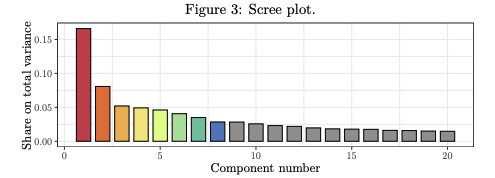{fig-alt="Scree plot showing share of variance"}

### Finance

[amsSim](https://cran.r-project.org/package=amsSim) v0.1.0: Implements simulation and pricing routines for rare-event options using adaptive multilevel splitting and standard Monte Carlo under Black-Scholes and Heston models. Core routines are implemented in `C++` via `Rcpp` and `RcppArmadillo` with lightweight `R` wrappers. Look [here](https://arxiv.org/html/2510.23461v1) for the theory and see the [README](https://cran.r-project.org/web/packages/amsSim/readme/README.html) to get started.

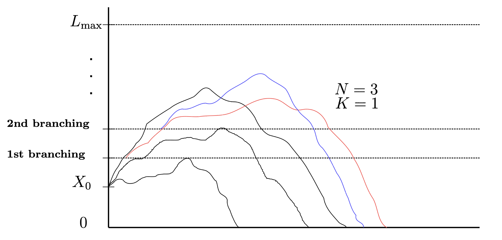{fig-alt="Plot illustrating first 2 iterations of AMS algorithm"}

### Genomics

[BTIME](https://cran.r-project.org/package=BTIME) v1.0.0: Implements Bayesian Hierarchical beta-binomial models for modeling cell population to predictors/exposures. This package utilizes `runjags` to run Gibbs sampling with parallel chains. Options allow for different covariances/relationship structures among parameters of interest. There is an [Introduction](https://cran.r-project.org/web/packages/BTIME/vignettes/BICAM.html) and a vignette on [Covariance Structures](https://cran.r-project.org/web/packages/BTIME/vignettes/BICAM_Cov.html).

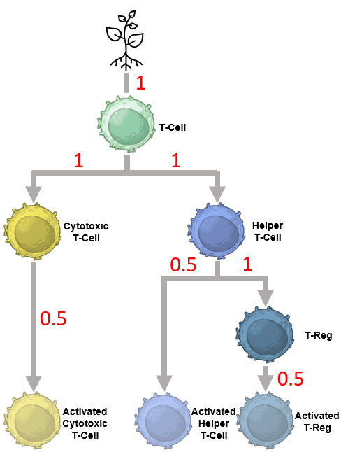{fig-alt="T cell hierarchy"}

### Logic

[Pinference](https://cran.r-project.org/package=Pinference) v0.2.5: Implements T. Hailperin's procedure for calculating lower and upper probability bounds for a propositional-logic expression, given equality and inequality constraints on the probabilities for other expressions. Truth-valuation is included as a special case. Applications range from decision-making and probabilistic reasoning, to pedagogical for probability and logic courses. See [Hailperin (1965)](https://www.tandfonline.com/doi/abs/10.1080/00029890.1965.11970533) background on logic and the [vignette](https://cran.r-project.org/web/packages/Pinference/vignettes/inferP.html) for an analysis of the **Monty Hall Problem** and more.

### Machine Learning

[bigPCAcpp](https://cran.r-project.org/package=bigPCAcpp) v0.9.0: Implements high performance principal component analysis routines that operate directly on `bigmemory::big.matrix` objects. Functions avoid materializing large matrices in memory by streaming data through `BLAS` and `LAPACK` kernels and include helpers to derive scores, loadings, correlations, and diagnostics, and include utilities to stream results into `bigmemory` matrices for file-based workflows. Also implemented is the Scalable principal component analysis of [Elgamal et al. (2015)](https://dl.acm.org/doi/10.1145/2723372.2751520). There is an [Introduction](https://cran.r-project.org/web/packages/bigPCAcpp/vignettes/bigPCAcpp.html) and a vignette on [Benchmarking](https://cran.r-project.org/web/packages/bigPCAcpp/vignettes/bigPCA-benchmarks.html).

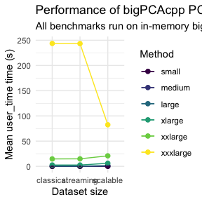{fig-alt="Plot showing benchmark times"}

[FuzzySpec](https://cran.r-project.org/package=FuzzySpec) v1.0.0: Implements FVIBES, the Fuzzy Variable-Importance Based Eigenspace Separation algorithm. See the [vignette](https://cran.r-project.org/web/packages/FuzzySpec/vignettes/FuzzySpec.html).

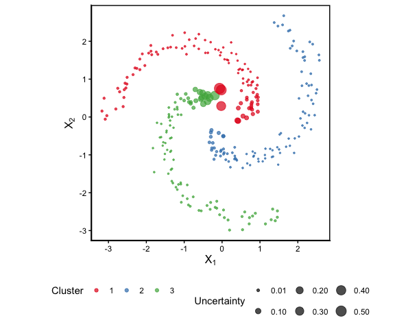{fig-alt="Plot showing fuzzy spectral clustering of spiral data"}

[roclab](https://cran.r-project.org/package=roclab) v0.1.4: Implements ROC (Receiver Operating Characteristic)–Optimizing Binary Classifiers, supporting both linear and kernel models. Scalability for large datasets is achieved through approximation-based options, which accelerate training and make fitting feasible on large data. Utilities are provided for model training, prediction, and cross-validation. See [Hernàndez-Orallo et al. (2004)](https://dl.acm.org/doi/10.1145/1046456.1046489) background and the [vignette](https://cran.r-project.org/web/packages/roclab/vignettes/roclab-intro.html) for examples.

[rSDR](https://cran.r-project.org/package=rSDR) v1.0.3.0: Implements a novel, sufficient dimension reduction method that is robust against outliers using alpha-distance covariance and manifold-learning. See [Huang et al.(2024)](https://www.tandfonline.com/doi/full/10.1080/10485252.2024.2313137) for details and the [vignette](https://cran.r-project.org/web/packages/rSDR/vignettes/rSDR_vignette.html) for examples. 

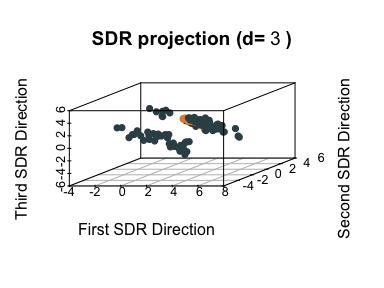{fig-alt="3D projectio plot"}

### Mathematics

[SimplicialComplex](https://cran.r-project.org/package=SimplicialComplex) v0.1.0: Implements simplicial complexes for Topological Data Analysis (TDA) and includes functions to compute faces, boundary operators, Betti numbers, and Euler characteristics. It also provides tools for studying persistent homology with the aim of helping readers understand the core concepts of computational topology. [Zomorodian and Carlsson (2005)](https://link.springer.com/article/10.1007/s00454-004-1146-y) and [Chazal and Michel (2021)](https://www.frontiersin.org/journals/artificial-intelligence/articles/10.3389/frai.2021.667963/full) for background and look [here](https://github.com/TDA-R/SimplicialComplex) to access the `Shiny` App [playground](https://tf3q5u-0-0.shinyapps.io/simplicialcomplex/), which allows exploring the concepts underlying TDA.

{fig-alt="Simple simplicial complex"}

:::

::: {.column width="10%"}

:::

::: {.column width="45%"}

### Medical Statistics

[PERSUADE](https://cran.r-project.org/package=PERSUADE) v0.1.2: Provides a standardized framework to support the selection and evaluation of parametric survival models for time-to-event data. Includes tools for visualizing survival data, checking proportional hazards assumptions ([Grambsch and Therneau (1994)](https://academic.oup.com/biomet/article-abstract/81/3/515/257037?redirectedFrom=fulltext&login=false)), comparing parametric ([Ishak et al. (2013)](https://link.springer.com/article/10.1007/s40273-013-0064-3)), spline ([Royston and Parmar (2002)](https://onlinelibrary.wiley.com/doi/10.1002/sim.1203)) and cure models, examining hazard functions, and evaluating model extrapolation. Methods are consistent with recommendations in the NICE Decision Support Unit Technical Support [Documents 14 and 21](https://sheffield.ac.uk/nice-dsu/tsds/survival-analysis). See [README](https://cran.r-project.org/web/packages/PERSUADE/readme/README.html) to get started.

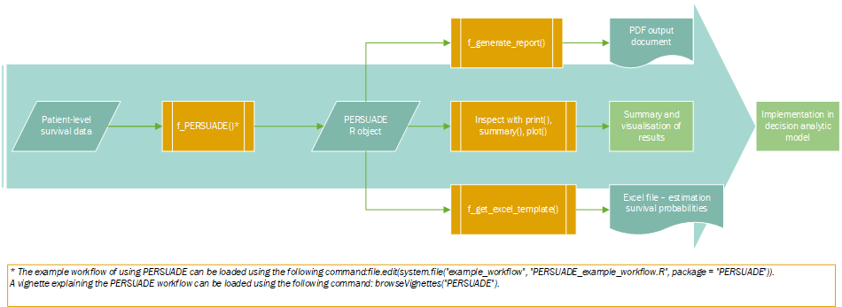{fig-alt="Workflow diagram"}

[shinymrp](https://cran.r-project.org/package=shinymrp) v0.9.1: Provides a dual interface, graphical and programmatic for multilevel regression and post stratification applications, offering tools for data cleaning, exploratory analysis, model building, and visualization. Users can apply the method to a variety of datasets including electronic health records and sample survey data. See [Si (2025)](https://projecteuclid.org/journals/statistical-science/volume-40/issue-2/On-the-Use-of-Auxiliary-Variables-in-Multilevel-Regression-and/10.1214/24-STS932.short) for background. There are five vignettes, including [Getting Started](https://cran.r-project.org/web/packages/shinymrp/vignettes/getting-started.html) and [Programmatic workflow demonstration](https://cran.r-project.org/web/packages/shinymrp/vignettes/workflow.html).

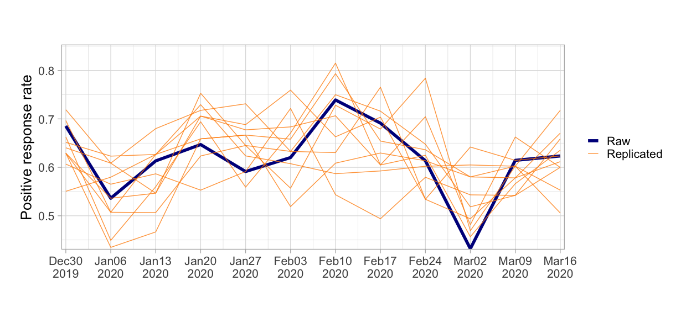{fig-alt="Model Comparison Plot"}

### Statistics

[choicedata](https://cran.r-project.org/package=choicedata) v0.1.0: Offers a set of objects tailored to simplify working with choice data. It enables the computation of choice probabilities and the likelihood of various types of choice models based on given data. Look [here](https://loelschlaeger.de/choicedata/) for a detailed introduction.

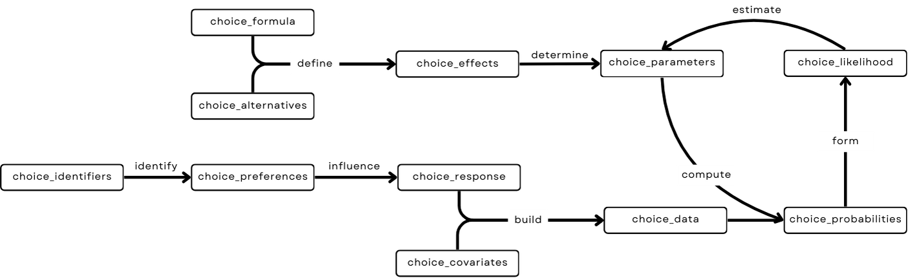{fig-alt="Workflow diagram"}

[GPpenalty](https://cran.r-project.org/package=GPpenalty) v1.0.0: Implements maximum likelihood estimation for Gaussian processes, supporting both isotropic and separable models with predictive capabilities. Includes penalized likelihood estimation following [Li and Sudjianto (2005)](https://www.tandfonline.com/doi/abs/10.1198/004017004000000671). Functions use decorrelated prediction error metrics to account for uncertainty, and cross validation techniques for tuning parameter selection. Designed specifically for small datasets. See [README](https://cran.r-project.org/web/packages/GPpenalty/readme/README.html) for an example.

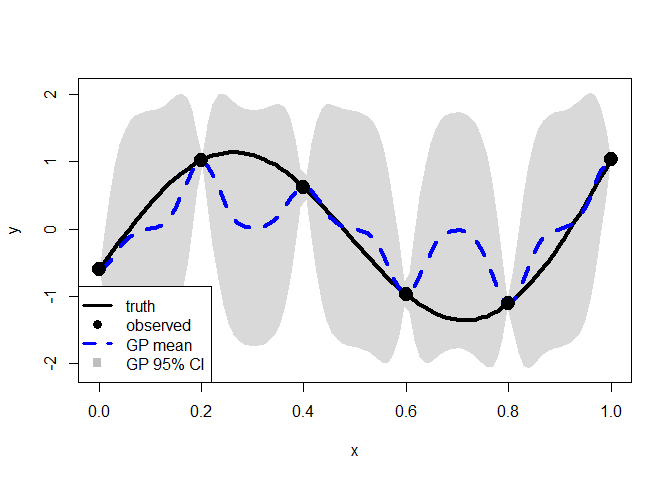{fig-alt="Plot comparing target function with estimation"}

[mda.biber](https://cran.r-project.org/package=mda.biber) v1.0.1: Implements the factor analysis developed in [Biber (1992)](https://link.springer.com/article/10.1007/BF00136979) most commonly used to describe language as it varies by genre, register, and use. Functions describe and plot MDA results, including dimension scores, dimension means, and factor loadings. See the [vignette](https://cran.r-project.org/web/packages/mda.biber/vignettes/introduction.html) for an introduction.

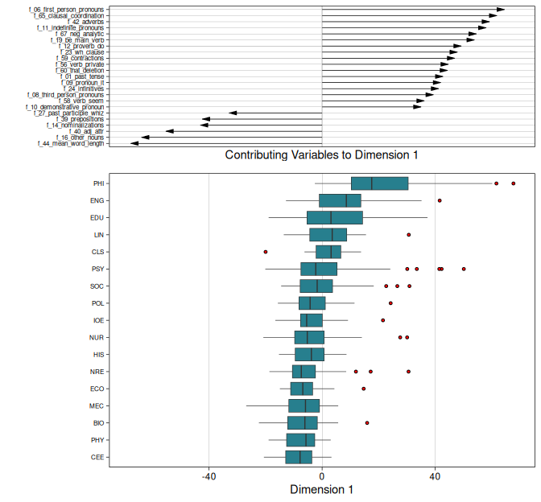{fig-alt="Boxplots of contributing variables"}

[PanelSelect](https://cran.r-project.org/package=PanelSelect) v1.0.0: Extends the Heckman selection framework to panel data with individual random effects. The first stage models participation via a panel Probit specification, while the second stage can take a panel linear, Probit, Poisson, or Poisson log-normal form. Model details are provided in [Bailey and Peng (2025)](https://papers.ssrn.com/sol3/papers.cfm?abstract_id=5475626) and [Peng and Van den Bulte (2024)](https://pubsonline.informs.org/doi/10.1287/mnsc.2019.01897). See the [vignette](https://cran.r-project.org/web/packages/PanelSelect/vignettes/vignette.html) for an introduction.

[partialling.out](https://cran.r-project.org/package=partialling.out) v0.2.0: Creates a data frame with the residuals of partial regressions of the main explanatory variable and other variables of interest. This method follows the Frisch-Waugh-Lovell theorem, as explained in [Lovell (2008)](https://www.tandfonline.com/doi/abs/10.3200/JECE.39.1.88-91). See the [vignette](https://cran.r-project.org/web/packages/partialling.out/vignettes/partialling_out.html).

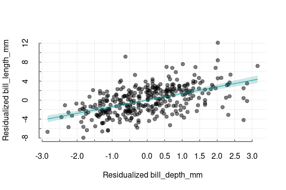{fig-alt="Residual Plot"}

[projoint](https://cran.r-project.org/package=projoint) v1.0.6: Provides tools for analyzing data generated from conjoint survey experiments, including functions to estimate marginal means and average marginal component effects, with corrections for measurement error and methods for profile-level and choice-level estimators, bias correction using intra-respondent reliability, and visualization utilities. For details on the methodology, see [Clayton et al. (2025)](https://gking.harvard.edu/conjointE>). There are seven vignettes including [Analyze and Visualize Important QOIs](https://cran.r-project.org/web/packages/projoint/vignettes/analyze.html) and [Explore and Compare Further](https://cran.r-project.org/web/packages/projoint/vignettes/explore.html).

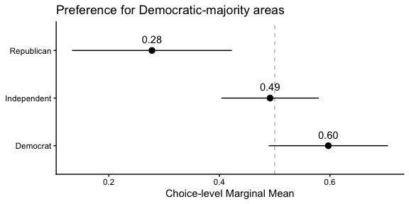{fig-alt="Plot of mean preferences"}

[RegCalReliab](https://cran.r-project.org/package=RegCalReliab) v0.2.0: Implements regression calibration methods for correcting measurement error in regression models using external or internal reliability studies. Methods are described in [Carroll et al. (2006)](https://www.taylorfrancis.com/books/mono/10.1201/9781420010138/measurement-error-nonlinear-models-ciprian-crainiceanu-raymond-carroll-leonard-stefanski-david-ruppert). See the [vignette](https://cran.r-project.org/web/packages/RegCalReliab/vignettes/regcal_example.html).

[RTMBdist](https://cran.r-project.org/package=RTMBdist) v0.1.0: Extends the functionality of the [`RTMB`](https://kaskr.r-universe.dev/RTMB) package by providing a collection of non-standard probability distributions compatible with automatic differentiation. Automatic differentiation and Laplace approximation are described in [Kristensen et al. (2016)](https://www.jstatsoft.org/article/view/v070i05). See the vignettes, [Examples](https://cran.r-project.org/web/packages/RTMBdist/vignettes/Examples.html) and [distlist](https://cran.r-project.org/web/packages/RTMBdist/vignettes/distlist.html).

### Time Series

[conformalForecast](https://cran.r-project.org/package=conformalForecast) v0.1.0: Provides methods and tools for performing multistep-ahead time series forecasting using conformal prediction methods, including classical conformal prediction, adaptive conformal prediction, conformal PID (Proportional-Integral-Derivative) control, and autocorrelated multistep-ahead conformal prediction. The methods were described by [Wang and Hyndman (2024)](https://arxiv.org/abs/2410.13115). See the [vignette](https://cran.r-project.org/web/packages/conformalForecast/vignettes/conformalForecast.html) for examples.

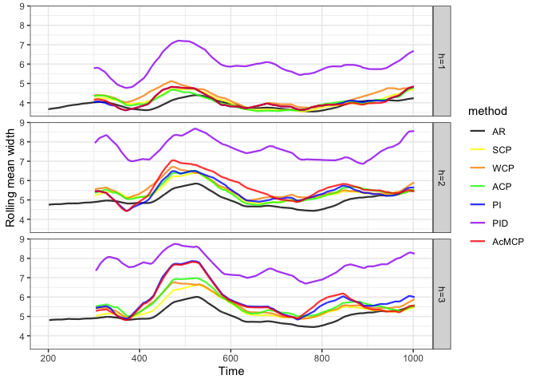{fig-alt="Time series plots for various methods and parameter settings"}
[funbootband](https://cran.r-project.org/package=funbootband) v0.2.0: Provides methods to compute simultaneous prediction and confidence bands for dense time series data. The implementation builds on the functional bootstrap approach proposed by [Lenhoff et al. (1999)](https://www.sciencedirect.com/science/article/abs/pii/S0966636298000435) and extended by [Koska et al. (2023)](https://www.sciencedirect.com/science/article/abs/pii/S0021929023000751) to support both independent and clustered (hierarchical) data. See the [vignette](https://cran.r-project.org/web/packages/funbootband/vignettes/funbootband-intro.html).

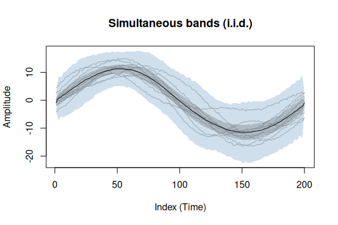{fig-alt="Time series with multiple confidence bands"}

[kardl](https://cran.r-project.org/package=kardl) v0.1.1: Implements estimation procedures for Autoregressive Distributed Lag (ARDL) and Nonlinear ARDL (NARDL) models, which allow researchers to investigate both short and long-run relationships in time series data under mixed orders of integration. The package includes several cointegration testing approaches, such as the [Pesaran et al. (2001)](https://www.sciencedirect.com/science/article/abs/pii/S0304407601000495) F and t bounds tests, the Banerjee error correction test, and the restricted ECM test, together with diagnostic tools, including Wald tests for asymmetry, ARCH tests, and stability procedures. See [README](https://cran.r-project.org/web/packages/kardl/readme/README.html) to get started.

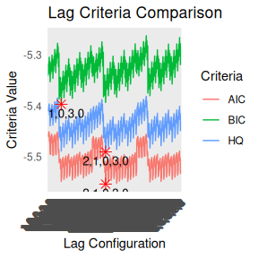{fig-alt="Plot showing lag criteria comparison"}

### Utilities

[bakerrr](https://cran.r-project.org/package=bakerrr) v0.2.0: Provides functions to  launch, track, and control background-parallel jobs and includes utilities for job status, error handling, resource monitoring, and result collection. Designed for scalable workflows in interactive and automated settings (local or remote). Look [here](https://anirbanshaw24.github.io/bakerrr/) for more information. There are four vignettes, including [Logging to File](https://cran.r-project.org/web/packages/bakerrr/vignettes/log_file.html) and [Orchestrating Multiple Functions in Parallel and in Background](https://cran.r-project.org/web/packages/bakerrr/vignettes/multi_function.html).

[localLLM](https://cran.r-project.org/package=localLLM) v1.0.1:  Provides `R` bindings to the `llama.cpp` library for running large language models. The package uses a lightweight architecture where the `C++` backend library is downloaded at runtime rather than bundled with the package. Package features include text generation, reproducible generation, and parallel inference. Look [here](https://github.com/EddieYang211/localLLM) to get started.

[rixpress](https://cran.r-project.org/package=rixpress) v0.10.1: Provides functions to streamline the creation of reproducible analytical pipelines using `default.nix` expressions generated via the `rix` package for reproducibility. Define derivations in `R`, `Python` or `Julia`, chain them into a composition of pure functions, and build the resulting pipeline using `Nix` as the underlying end-to-end build tool. Functions to plot the pipeline as a directed acyclic graph are included, as well as functions to load and inspect intermediary results for interactive analysis. There are twelve vignettes, including [introductory concepts](https://cran.r-project.org/web/packages/rixpress/vignettes/intro-concepts.html) and [core functions](https://cran.r-project.org/web/packages/rixpress/vignettes/core-functions.html).

<iframe width="400" height="250" src="https://www.youtube.com/embed/a1eNG9TFZ_o" title="Nix for Data Science: a 2-min intro to rixpress, a package for multilanguage reproducible pipelines" frameborder="0" allow="accelerometer; autoplay; clipboard-write; encrypted-media; gyroscope; picture-in-picture; web-share" referrerpolicy="strict-origin-when-cross-origin" allowfullscreen></iframe>

[summarytabl](https://cran.r-project.org/package=summarytabl) v0.2.1: Provides functions to tabulate and summarize categorical, multiple response, ordinal, and continuous variables in `R` data frames, making it easy to create clear, structured summary tables. See the [vignette](https://cran.r-project.org/web/packages/summarytabl/vignettes/summarytabl-intro.html).

[tabler](https://cran.r-project.org/package=tabler) v0.1.0: Provides functions to build interactive dashboards combining the `Tabler UI Kit` with `Shiny`, making it easy to create professional-looking web applications. Dashboards are fully responsive and compatible with all modern browsers. Offers customizable layouts and components built with `HTML5` and `CSS3`. See [README](https://cran.r-project.org/web/packages/tabler/readme/README.html) to get started.

<iframe width="400" height="250" src="https://www.youtube.com/embed/_PWVmmis-AE" title="Tabler short demo using Shiny" frameborder="0" allow="accelerometer; autoplay; clipboard-write; encrypted-media; gyroscope; picture-in-picture; web-share" referrerpolicy="strict-origin-when-cross-origin" allowfullscreen></iframe>

### Visualization

[graphonmix](https://cran.r-project.org/package=graphonmix) v0.0.1.0: Generates (U,W) mixture graphs where U is a line graph graphon and W is a dense graphon. Graphons are graph limits and graphon U can be written as a sequence of positive numbers adding to 1. Graphs are sampled from U and W and joined randomly to obtain the mixture graph. Given a mixture graph, U can be inferred. See [Kandanaarachchi and Ong (2025)](https://arxiv.org/abs/2505.13864) for background and the vignettes [Introduction](https://cran.r-project.org/web/packages/graphonmix/vignettes/graphonmix.html) and [Sparse graphs from line graphons](https://cran.r-project.org/web/packages/graphonmix/vignettes/linegraphons.html).

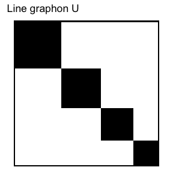{fig-alt="Line graphon U"}

[SimpleUpset](https://cran.r-project.org/package=SimpleUpset) v0.1.3: Provides functions to create Upset plots using a combination of `ggplot2` and `patchwork`. See [Lex et al. (2014)](https://ieeexplore.ieee.org/document/6876017) for background and the [vignette](https://cran.r-project.org/web/packages/SimpleUpset/vignettes/introduction.html) for examples.

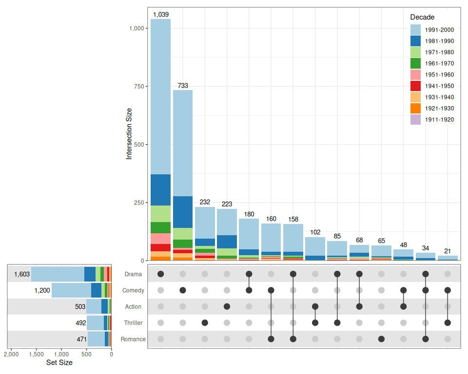{fig-alt="Example of an Upset Plot"}

:::

::::

