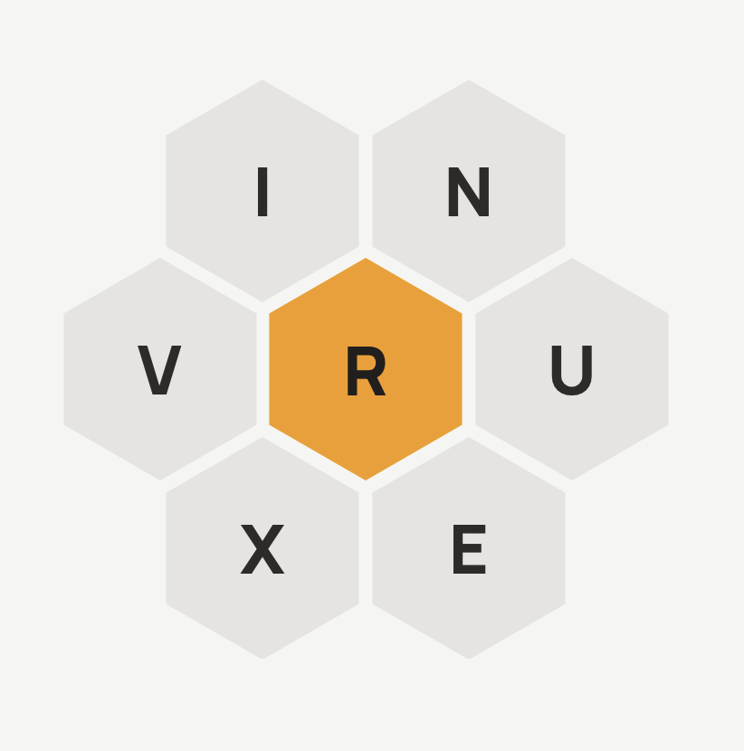
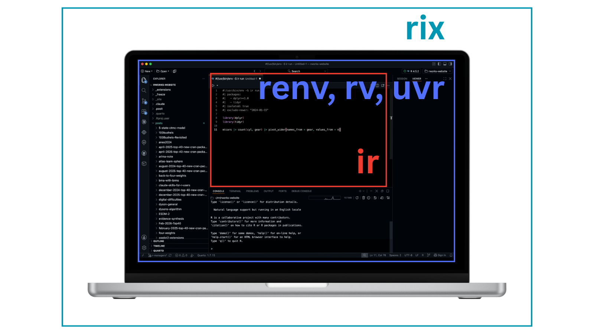
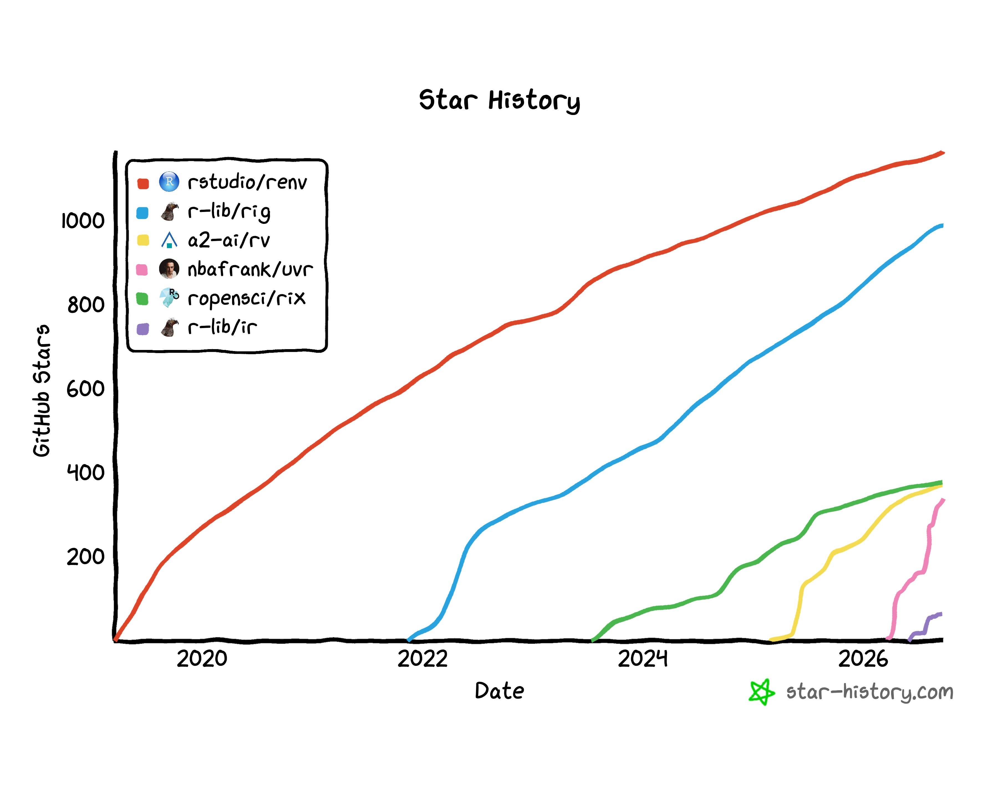

There has been an explosion of package/environment/platform managers in the R ecosystem recently and their names create a fun [Spelling Bee game](https://mywordle.strivemath.com/spellbee?l=rgtvgicp):

{width=40% fig-align="center" fig-alt="A Spelling Bee game made up of the letters RENUIX"}

R is really reaping the rewards of so many ripe and riveting managers. But if you are like me, it’s been rough to keep track of them all and understand what they are and how they are different!

I suspect I am not the only one. My colleague Libby Heeren and I recently held a [Data Science Lab](https://pos.it/dslab) with Eric Nantz to showcase {rix} and Nix (which was awesome! Keep an eye out on the [Posit YouTube channel](https://www.youtube.com/playlist?list=PL9HYL-VRX0oSeWeMEGQt0id7adYQXebhT) for when the recording is published), and the first three or so questions from the audience were all about how {rix} compares to X ({renv}, rv, uvr), and so I thought it’d be helpful to write a short summary of five tools that I’ve heard about: {renv}, rv, uvr, {rix}, and {ir}.[^1]

[^1]: I'm distinguishing between R packages and CLI tools by wrapping the R packages in `{}`.

The first thing to note is that while they're all about tracking or isolating dependencies, they don't all do the same thing. [TL;DR](https://en.wikipedia.org/wiki/TL;DR):

- {renv}, rv, and uvr manage package dependencies within a single R project
- rix operate one level up, snapshotting the entire system environment
- {ir} operates one level down, handling dependencies for a single script rather than a project

{fig-align="center"}

I don't want to/can't pass judgement on which is the best or which I recommend, because I honestly haven’t had the opportunity to explore all of them fully (a very diplomatic way of saying that I haven’t yet used all of them in a real-world context), but I would love to hear everybody else’s opinions on which they think is the best tool because BOY, I IMAGINE PEOPLE HAVE THEM! 😀

It's an unsatisfactory proxy for quality/experience, but here is the GitHub star trajectory of each:

{width=60% fig-align="center"}

(Take that as you will).

With that, let's begin!

## **{renv}**

[Repo](https://github.com/rstudio/renv) | ⭐1.2k GitHub stars | ✅ Packages ❌ R version ❌ Environments

### Use case

This is a long-established package supported by Posit (creators of RStudio) used for **project-local R package management**.

### How to use {renv}

{renv} is iterative and *retrospective*: you install the packages first, and then take a snapshot.

1. Install the {renv} package:

```{.r filename="Terminal"}
install.packages("renv")
```

2. Within a project, initialize {renv}:

```{.bash filename="Console"}
renv::init()
```

3. Install packages:

Install packages the regular way, i.e., `install.packages()`.

When you install packages, they will be installed into a project-specific library.

4. Snapshot your library's packages into a lock file:

```{.bash filename="Console"}
renv::snapshot()
```

This lockfile captures the exact versions of those packages:

```{.json filename="renv.lock"}
{
  "R": {
    "Version": "4.5.2",
    "Repositories": [
      {
        "Name": "CRAN",
        "URL": "https://cloud.r-project.org"
      }
    ]
  },
  "Packages": {
    "dplyr": {
      "Package": "dplyr",
      "Version": "1.1.4",
      "Source": "Repository",
      "Repository": "CRAN",
      "Hash": "fedd9d00c2944ff00a0e2696ccf048ec"
    },
    "ggplot2": {
      "Package": "ggplot2",
      "Version": "3.5.1",
      "Source": "Repository",
      "Repository": "CRAN",
      "Hash": "44c6a2f8202d5b7e6c72a95ca7ea1795"
    }
  }
}
```

5. Iterate:

As you continue adding packages, continue snapshotting to update the lock file.

### How to share using {renv}

When someone wants to run your project using the packages stored in its {renv} lockfile, they can restore the library on their machine by running `renv::restore()`.

```{.bash filename="Console"}
renv::restore()
```

### Some considerations

Because renv is iterative and retrospective, you can accidentally install packages that conflict with the packages that you had installed earlier.

## **rv**

[Repo](https://github.com/A2-ai/rv) | ⭐371 GitHub stars | ✅ Packages ❌ R version ❌ Environments

### Use case

This is a relatively new tool by A2-ai, written in the ever-so-popular [Rust](https://rust-lang.org/) language, used for **project-local R package management**. 

It supports multiple package repositories with per-package source control (e.g., forcing a specific package to build from source vs. binary), and claims large speed improvements (20x+) over renv for installs.

rv is *declarative*: you write your desired packages and versions into a config file, and rv resolves the entire dependency graph upfront before installing anything.

### How to use rv

1. Install rv:

rv is a standalone command-line tool, not an R package. There are a few installation instructions; [see the documentation for more](https://a2-ai.github.io/rv-docs/intro/installation/). I have Homebrew on my Mac, so I can run:

```{.bash filename="Terminal"}
brew install rv-r
```

2. Start a new project:

Start a new project with `rv init`. For example, running the below creates a new folder called `hello_world`:

```{.bash filename="Terminal"}
rv init hello_world
```

If you open up the `hello_world` folder, you'll see that rv created various files and folders in your project folder:

```bash
hello_world/
  rv/
  library/
  scripts/
    activate.R
    rvr.R
  .gitignore
  .Rprofile
  rproject.toml
```

3. Update config file:

I don't want to just repeat the documentation because [it's quite excellent](https://a2-ai.github.io/rv-docs/intro/getting-started/), but essentially, you would fill in your packages as dependencies in `rproject.toml`:

```bash
# A list of packages to install and any additional configuration
# Examples:
    # "dplyr",
    # {name = "dplyr", repository = "CRAN"},
    # {name = "dplyr", git = "https://github.com/tidyverse/dplyr.git", tag = "v1.1.4"},
dependencies = [

]
```

4. Install packages:

Then, run `rv sync` to install the packages in the config file, as well as all of their dependencies:

```{.bash filename="Terminal"}
rv sync
```

This resolves the dependency graph and writes the exact versions to an `rv.lock` file, something like:

```{.toml filename="rv.lock"}
[[packages]]
name = "dplyr"
version = "1.1.4"
repository = "CRAN"
source = "Repository"
hash = "fedd9d00c2944ff00a0e2696ccf048ec"

[[packages]]
name = "ggplot2"
version = "3.5.1"
repository = "CRAN"
source = "Repository"
hash = "44c6a2f8202d5b7e6c72a95ca7ea1795"
```

### How to share using rv

If someone wants to open your rv project, they can clone your folder (including the .toml) and then run `rv init`.

### Some considerations

Because rv is declarative and resolves the whole dependency graph upfront, it's less forgiving of "install whatever you need as you go" exploratory work that renv accommodates; you're expected to know (or figure out) your dependencies before you can sync.

You may notice that rv's `rproject.toml` has an `r_version` field, but this does not actually manage the R version. During `rv init`, it records whatever R is found on your PATH (or is passed via `--r-version`), and then rv validates that the R you're running matches that pinned version. It does not download, install, or switch R versions for you. If this functionality is something you need, you may want to check out...

## **uvr**

[Repo](https://github.com/nbafrank/uvr) | ⭐343 GitHub stars | ✅ Packages ✅ R version ❌ Environments

### Use case

uvr is built by nbafrank, an independent developer. Like rv, it's also written in Rust, and it is explicitly modeled on Python's [uv](https://docs.astral.sh/uv/), a.k.a., [the best thing to happen to the Python ecosystem in a decade](https://emily.space/posts/251023-uv).

It bundles **package management and R version management** (two things that renv and rv treat separately), backed by a single lockfile (`uvr.lock`) that is meant to be the “source of truth” for a project.

### How to use uvr

uvr, like rv, is *declarative*: you add packages (and optionally an R version constraint) to a manifest, and uvr resolves and locks the whole dependency graph before installing anything.

1. Install uvr:

uvr is a standalone binary, not an R package (though a companion R package, [uvr-r](https://github.com/nbafrank/uvr-r), lets you drive it from the R console instead of the terminal).

```{.bash filename="Terminal"}
curl -fsSL https://raw.githubusercontent.com/nbafrank/uvr/main/install.sh | sh
```

2. Start a new project:

```{.bash filename="Terminal"}
mkdir my-project && cd my-project
uvr init --r-version ">=4.3.0"
```

This creates a `uvr.toml` manifest in the project folder.

3. Add packages:

```{.bash filename="Terminal"}
uvr add ggplot2 dplyr
uvr add DESeq2 --bioc
uvr add user/repo@main
```

Each `add` updates `uvr.toml` and re-resolves `uvr.lock`.

4. Install everything from the lockfile:

```{.bash filename="Terminal"}
uvr sync
```

This is what generates and keeps `uvr.lock` up to date, capturing both the R version and package versions, something like:

```{.toml filename="uvr.lock"}
r-version = "4.4.2"

[[packages]]
name = "dplyr"
version = "1.1.4"
source = "cran"
hash = "fedd9d00c2944ff00a0e2696ccf048ec"

[[packages]]
name = "ggplot2"
version = "3.5.1"
source = "cran"
hash = "44c6a2f8202d5b7e6c72a95ca7ea1795"
```

5. Run scripts inside the isolated environment:

```{.bash filename="Terminal"}
uvr run analysis.R
```

### How to share using uvr

Commit `uvr.toml` and `uvr.lock` alongside your project. Someone who wants to reproduce your environment (including your pinned R version) clones the repo and runs:

```{.bash filename="Terminal"}
uvr sync --frozen
```

`--frozen` will fail if the lockfile is stale.

## **rix**

[Repo](https://github.com/ropensci/rix) | ⭐381 GitHub stars | ✅ Packages ✅ R version ✅ Environments

### Use case

rix operates one level up from the other tools on this list. Instead of managing packages within an R installation, rix uses [Nix](https://nixos.org/), a general-purpose package manager, to snapshot **an entire software environment**: R itself, packages, *and* any system-level dependencies they need.

### How to use rix

rix is retrospective but in a different sense than renv. You declare the environment you want up front, and Nix builds it from scratch (pulling from a package index rather than your currently-installed library).

1. Install Nix and the rix R package:

```{.r filename="Terminal"}
install.packages("rix")
```

2. Declare your environment:

Write a small script (e.g., `generate_env.R`) describing the R version and packages you need:

```{.r filename="generate_env.R"}
library(rix)

rix(
  r_ver = "4.3.3",
  r_pkgs = c("dplyr", "ggplot2"),
  project_path = "."
)
```

Running this script generates a `default.nix` file, a plain-text description of the environment.

3. Build the environment:

```{.bash filename="Terminal"}
nix-build
```

or drop into it interactively with `nix-shell`.

### How to share using rix

Share the `default.nix` file (typically committed alongside your project). Anyone with Nix installed can rebuild the exact same environment, byte for byte, regardless of their operating system, by running `nix-build` or `nix-shell` against that file.

### Some considerations

Because rix depends on Nix, there's a bigger lift required to install and learn Nix itself. In exchange, you get reproducibility that extends beyond R packages to system dependencies and even R itself.

## **ir**

[Repo](https://github.com/r-lib/ir) | ⭐65 GitHub stars | ✅ Packages ✅ R version ❌ Environments

### Use case

ir operates one level *down* from the project-level tools. It's built for single scripts or Quarto documents rather than whole projects. It's a command-line tool for running portable R scripts and rendering Quarto documents whose package requirements (and optionally an R version) live inside the file itself for **single-file workflows** that don't quite need a project, but still need to be easy to share and rerun later.

### How to use ir

1. Install ir:

Follow the [installation instructions in the repo](https://github.com/r-lib/ir).

2. Declare requirements in the file itself:

Add frontmatter (for `.qmd`/`.Rmd`) or a header comment (for `.R` scripts) listing the packages and, optionally, an R version or a Posit Package Manager snapshot date:

```{.r filename="script.R"}
#!/usr/bin/env -S ir run
#| packages:
#|   - dplyr>=1.0
#|   - tidyr
#| isolated: true
#| exclude-newer: "2024-01-15"

library(dplyr)
library(tidyr)

mtcars |> count(cyl, gear) |> pivot_wider(names_from = gear, values_from = n)
```

```{.r filename="report.qmd"}
---
title: My report
ir:
  packages:
    - dplyr>=1.0
    - gt@1.0
  isolated: true
  exclude-newer: 2025-05-15
---
```

3. Run or render the file:

```{.bash filename="Terminal"}
ir run script.R
ir render report.qmd
```

When you run or render the file, ir resolves the requirements, prepares cached package libraries, and launches R or Quarto with a runtime ready to use.

### How to share using ir

Send the single `.R` or `.qmd` file (there's no separate lockfile or project directory to keep track of). On first use, ir prepares its own resolver tooling in its cache, so the recipient doesn't need to pre-install pak or renv; they can run `ir run` or `ir render` and ir takes care of resolving and caching the right packages.

### Some considerations

ir is the newest tool here (first released mid-2026) and intentionally narrow in scope: it solves reproducibility for a *single* file, not a whole project. So, it's a complement to, not a replacement for, renv/rv/uvr/rix when you actually do need a shared project-level environment.

## Even more package and environment managers

This is just the surface of what is available out there. The amazing Novica Nakov has created a [new R tooling webpage](https://r-devs.com/) to track new R tools as they show up. So, if you want to follow an evolving list, I recommend keeping an eye out there! As always, the R community abides.

While doing my research, I ran into a few more tools that I considered adding to this post and decided to not. Here are what they are, and why I left them out:

- [devenv](https://devenv.sh/): a general-purpose Nix-based dev environment manager, not specifically for R. It shares rix's core mechanism but doesn't have rix's R-specific niceties like date-pinned CRAN/Bioconductor snapshots.
- [rpx](https://github.com/rrepo-org/rpx), which I discovered on [this Reddit thread](https://www.reddit.com/r/rstats/comments/1wjvk8h/rpx_v200_why_package_managers_need_backtracking/) as I was writing this: I didn't add it because I'd waffled on finishing this post for too long and it would have messed up my Spelling Bee game. If anybody wants to write about it for R Works, let me know!
- [rig](https://github.com/r-lib/rig):  a command-line tool for installing, listing, and switching between multiple R versions on your machine. I didn't add it because there's nothing to share with others, it's more a personal R version manager.