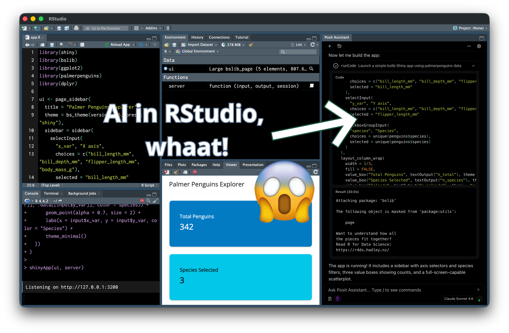
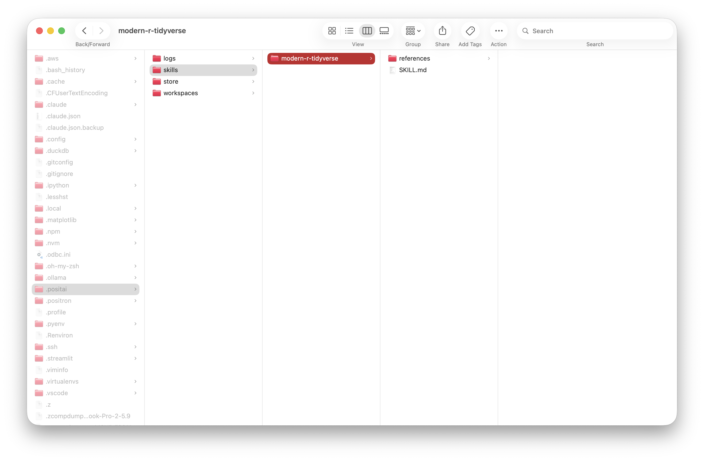
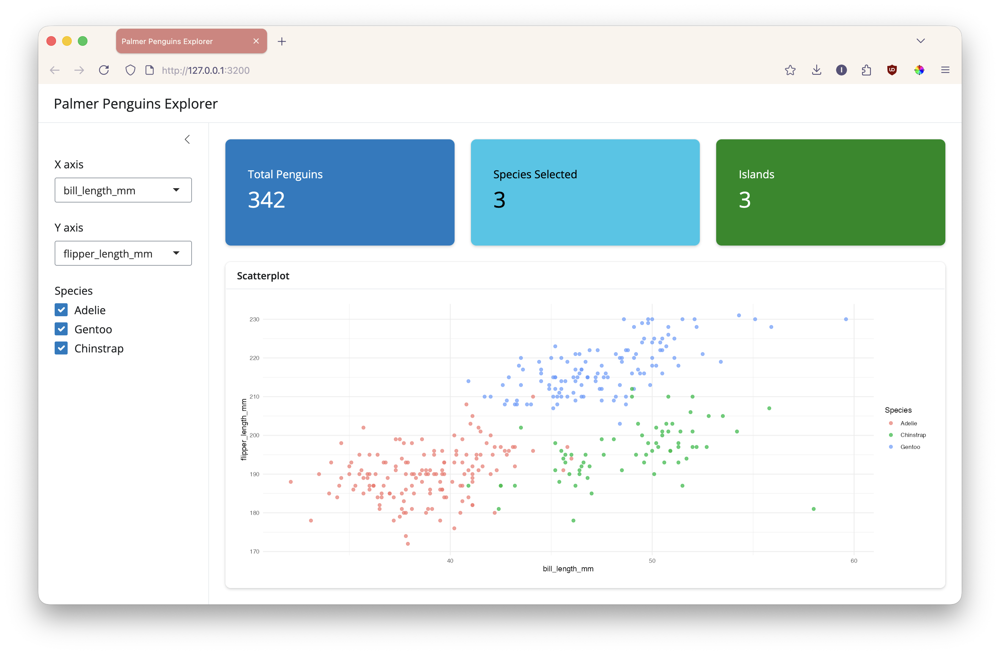

I recently shared a blog post on [Claude Skills for R Users](https://rworks.dev/posts/claude-skills-for-r-users/){target="_blank"}, featuring excellent Skills developed by several community members. It brought me a lot of joy to share these impactful resources from the community.

One question that I got repeatedly (ok, two times) was: Can I use Skills with Posit Assistant?

In case you are not aware, [Posit Assistant](https://posit.co/blog/introducing-ai-in-rstudio/){target="_blank"} is the new offering from Posit that integrates a specialized AI chatbot directly into RStudio. It uses live session context, including loaded packages and environment variables, to perform data visualization, debugging, and complex transformations.



And, like in many other AI coding tools, Skills are supported in Posit Assistant! So, if you've been using Skills for Claude Code or other platforms, port 'em on over. I asked Posit Assistant how to do exactly that; read a summary of what I learned below and see the full conversation export at the bottom of this post.

## 1. Can you use Skills with Posit Assistant?

Yes! Posit Assistant has several built-in Skills that it can load on demand, sourced from the [posit-dev/skills repo](https://github.com/posit-dev/skills){target="_blank"}. It will load the relevant Skill automatically when your request matches its domain; for example, if you ask it to build a Shiny app, it will load the `shiny-bslib` Skill before it starts. You can also explicitly ask Posit Assistant to use a specific Skill.

| Skill | Purpose |
|---|---|
| `predictive-modeling` | ML and modeling with tidymodels |
| `quarto-authoring` | Writing and authoring Quarto documents |
| `quarto-report` | Creating Quarto reports from conversations |
| `shiny-bslib` | Building Shiny apps with bslib |
| `shiny-bslib-theming` | Advanced Shiny/bslib theming |
| `connect-cloud-deploy` | Deploying to Posit Connect Cloud |
| `snowflake` | Connecting to and querying Snowflake |
| `create-skill` | Creating new Agent Skills |

## 2. Can you add a new Skill to Posit Assistant?

Yes!

## 2.5 How do you add a Skill to Posit Assistant?

There are various ways. For the [Modern R Development Guide](https://gist.github.com/sj-io/3828d64d0969f2a0f05297e59e6c15ad){target="_blank"}, I gave it the URL and asked it to create a Skill from the gist. It worked, but it did require me approving a lot of permissions first!

There are two locations for Skills, depending on scope:

| Type | Location | Use when... |
|---|---|---|
| **User Skill** | `~/.positai/skills/{skill-name}/SKILL.md` | You want it available across all projects |
| **Project Skill** | `.positai/skills/{skill-name}/SKILL.md` | You want it scoped to one project |

Each Skill needs at minimum a `SKILL.md` file. You can optionally add `scripts/`, `references/`, and `assets/` subdirectories. The Skill name must be:

* lowercase
* hyphen-separated
* max 64 characters

The easiest way to get started is to ask Posit Assistant to create one using the `create-skill` Skill. It will write the `SKILL.md` for you following the official spec.

In terms of adding a Skill from a GitHub repo, the simplest approach is to clone or copy the Skill files directly into your user Skills directory:

```bash
cd ~/.positai/skills/
git clone https://github.com/someone/their-skill-repo skill-name
```

## 3. Where are Skills located?

Project/user Skills live at `~/.positai/skills/`. In my case, that's where the `modern-r-tidyverse` Skill is stored: `~/.positai/skills/modern-r-tidyverse/`.



Managed Skills (most of the built-ins like shiny-bslib, predictive-modeling, etc.) are bundled with Posit Assistant itself and aren't directly visible on disk. You can also place Skills inside a specific project by adding them to a `.positai/agents/skills/` directory within that project folder. 

## 4. How do you load a Skill?

Just ask! For example, I asked Posit Assistant, "Can you load the `shiny-bslib` Skill?" and it let me know when it was loaded. I then asked it to create a simple Shiny app with [palmerpenguins](https://allisonhorst.github.io/palmerpenguins/){target="_blank"} data, and it produced some lovely code:



## 5. Let's see Skill creation and activation, please

Inspired by my colleague Nick Rohrbaugh, here is a recording of me getting Posit Assistant to create and enable a Skill.



## Learn more

Hopefully this was a helpful overview of Skills and Posit Assistant! Try out one of the Skills from the [blog post](https://rworks.dev/posts/claude-skills-for-r-users/){target="_blank"}, and check out the [Post Assistant docs](https://docs.posit.co/posit-ai/user/getting-started/){target="_blank"} for more information.

<details><summary>Read the conversation export</summary>
````md
# Explained Skills and their locations, loaded the `shiny-bslib` and `create-skill` skills, built a simple bslib Shiny app with palmerpenguins data, and explained how to add a third-party Skill from GitHub by cloning into `~/.positai/skills/`.

## User

Can I use Skills with you?

## Databot

Yes! Skills are a way to give me specialized instructions for specific domains or tasks. I have several available that I can load on demand:

| Skill | Purpose |
|---|---|
| `modern-r-tidyverse` | Modern R/tidyverse best practices |
| `predictive-modeling` | ML and modeling with tidymodels |
| `quarto-authoring` | Writing and authoring Quarto documents |
| `quarto-report` | Creating Quarto reports from conversations |
| `shiny-bslib` | Building Shiny apps with bslib |
| `shiny-bslib-theming` | Advanced Shiny/bslib theming |
| `connect-cloud-deploy` | Deploying to Posit Connect Cloud |
| `snowflake` | Connecting to and querying Snowflake |
| `create-skill` | Creating new Agent Skills |

I load the relevant skill automatically when your request matches its domain — for example, if you ask me to build a Shiny app, I'll load the `shiny-bslib` skill before I start. You can also explicitly ask me to use a specific skill.

Is there something specific you'd like to work on?


## User

Where would the skills be located?

## Databot


<div><thinking id="thinking-1772570742217-rjb3w">
The user is asking where skills are located. Based on the system prompt, skills have a `location` property that can be either `project` or `managed`. Let me look at the available skills:

- `modern-r-tidyverse` - location: project
- `connect-cloud-deploy` - location: managed
- `create-skill` - location: managed
- `predictive-modeling` - location: managed
- `quarto-authoring` - location: managed
- `quarto-report` - location: managed
- `shiny-bslib` - location: managed
- `shiny-bslib-theming` - location: managed


- `snowflake` - location: managed

Most skills are managed by Posit, with only `modern-r-tidyverse` being a project-specific skill. Project skills would live in the project directory structure, while managed skills are built-in and handled by the Posit Assistant system. I should check if there's a skills directory in the workspace to understand the file structure better.
</thinking></div>


<div><tool-call id="toolu_01HKn16PWyMkc1921vNkpk5t"><script type="application/json">{"version":1,"name":"ls","input":{"path":"/Users/isabella.velasquez"},"caption":"./ (isabella.velasquez Workspace)"}</script></tool-call></div>

<div><tool-result call-id="toolu_01HKn16PWyMkc1921vNkpk5t"><script type="application/json">{"version":1,"status":"success","result":{"type":"text","value":".aws/\n.cache/\n.claude/\n.config/\n.duckdb/\n.ipython/\n.local/\n.matplotlib/\n.npm/\n.nvm/\n.oh-my...[truncated, total 1020 chars]"},"resultPreview":{"type":"code","value":".aws/\n.cache/\n.claude/\n.config/\n.duckdb/\n.ipython/\n.local/\n.matplotlib/\n.npm/\n.nvm/\n.oh-my-zsh/\n.ollama/\n.positai/\n.positron/\n.pyenv/\n.ssh/\n.streamlit/\n.Trash/\n.virtualenvs/\n.vscode/\n.zsh_sessions/\ndemo/\nDesktop/\nDocuments/\nDownloads/\ngasp2025-quarto-exercises/\nLibrary/\nMovies/\nMusic/\nmy-empty-project/\nmy-r-project/\nPictures/\nposit-blog-posts/\nposit-example/\nPublic/\npy/\nquarto-book/\nquarto-brand-codespaces/\nrpy/\nrrr/\nstarting-ragchatbot-codebase/\nsteph_fun/\nstreamlit-example/\ntypst-test/\nwhr/\nwhr-brand/\nwhr-typst-template/\nwhr2/\nworkflowtest/\n.bash_history\n.CFUserTextEncoding\n.claude.json\n.claude.json.backup\n.DS_Store\n.gitconfig\n.gitignore\n.lesshst\n.odbc.ini\n.profile\n.Renviron\n.viminfo\n.z\n.zcompdump-Isabellas-MacBook-Pro-2-5.9\n.zcompdump-Isabellas-MacBook-Pro-2-5.9.isabellavelás-M6HD.79211\n.zcompdump-Isabellas-MacBook-Pro-2-5.9.isabellavelás-M6HD.80854\n.zcompdump-Isabellas-MacBook-Pro-2-5.9.zwc\n.zcompdump-isabellavelás-M6HD-5.9\n.zprofile\n.zsh_history\n.zshrc\n.zshrc.swo\nlincoln-weather.R\nssh.txt\nssh.txt.pub"},"elapsedMs":14}</script></tool-result></div>


<div><tool-call id="toolu_017fondJSkxidffFAXdYS1Wg"><script type="application/json">{"version":1,"name":"ls","input":{"path":"/Users/isabella.velasquez/.positai"},"caption":".positai"}</script></tool-call></div>

<div><tool-result call-id="toolu_017fondJSkxidffFAXdYS1Wg"><script type="application/json">{"version":1,"status":"success","result":{"type":"text","value":"logs/\nskills/\nstore/\nworkspaces/"},"resultPreview":{"type":"code","value":"logs/\nskills/\nstore/\nworkspaces/"},"elapsedMs":0}</script></tool-result></div>


<div><tool-call id="toolu_01PtEbepMuCpLcunFDr8ZBjW"><script type="application/json">{"version":1,"name":"ls","input":{"path":"/Users/isabella.velasquez/.positai/skills"},"caption":".positai/skills"}</script></tool-call></div>

<div><tool-result call-id="toolu_01PtEbepMuCpLcunFDr8ZBjW"><script type="application/json">{"version":1,"status":"success","result":{"type":"text","value":"modern-r-tidyverse/"},"resultPreview":{"type":"code","value":"modern-r-tidyverse/"},"elapsedMs":0}</script></tool-result></div>

Skills are stored in two places:

**Managed skills** (most of the built-ins like `shiny-bslib`, `predictive-modeling`, etc.) are bundled with Posit Assistant itself and aren't directly visible on disk.

**Project/user skills** live at `~/.positai/skills/`. In your case, that's where the `modern-r-tidyverse` skill is stored:

```
~/.positai/skills/modern-r-tidyverse/
```

You can also place skills inside a specific project by adding them to a `.positai/agents/skills/` directory within that project folder. Would you like to explore the contents of the `modern-r-tidyverse` skill, or create a new one?


## User

Can you load the shiny-bslib Skill?

## Databot


<div><tool-call id="toolu_01BGpR8m16rPQZEqdX84RLma"><script type="application/json">{"version":1,"name":"skill","input":{"skill":"shiny-bslib"},"caption":"shiny-bslib"}</script></tool-call></div>

<div><tool-result call-id="toolu_01BGpR8m16rPQZEqdX84RLma"><script type="application/json">{"version":1,"status":"success","result":{"type":"text","value":"# Modern Shiny Apps with bslib\n\nBuild professional Shiny dashboards using bslib's Bootstra...[truncated, total 9293 chars]"},"resultPreview":{"type":"code","value":"# Modern Shiny Apps with bslib\n\nBuild professional Shiny dashboards using bslib's Bootstrap 5 components and layouts. This skill focuses on modern UI/UX patterns that replace legacy Shiny approaches.\n\n## Quick Start\n\n**Single-page dashboard:**\n```r\nlibrary(shiny)\nlibrary(bslib)\n...","language":"markdown"},"elapsedMs":1}</script></tool-result></div>

The `shiny-bslib` skill is now loaded! I'm ready to help you build modern Shiny dashboards using bslib. The skill covers:

- **Page layouts** (`page_sidebar()`, `page_navbar()`, etc.)
- **Grid systems** (`layout_column_wrap()`, `layout_columns()`)
- **Cards, value boxes, navigation, sidebars**
- **Theming** with `bs_theme()`
- **Migrating** legacy Shiny apps to modern bslib

What would you like to build?


## User

Can you build a simple app with palmerpenguins data?

## Databot


[Response canceled by user]


## User

What is the best way of adding a new Skill?

## Databot


<div><thinking id="thinking-1772571074173-9j2ja">
The user has two questions:
1. Build a simple Shiny app with palmerpenguins data
2. What is the best way of adding a new Skill?

Let me load the create-skill skill to answer the second question, and also build the Shiny app. Let me do both in parallel - load the create-skill skill and start building the app.

Actually, let me think about this. I should load the create-skill skill to answer question 2, and build the app for question 1. I can do these in parallel.

For the app, I'll build a simple `page_sidebar()` app with palmerpenguins data using bslib. Let me think about what to include:


I'll add a sidebar with species filtering and variable selection options, then display a scatter plot or histogram in the main area. I'll throw in a couple value boxes to keep it visually interesting while staying simple and showcasing what bslib can do.
</thinking></div>

I'll tackle both at once — loading the `create-skill` skill for your second question while building the app.

<div><tool-call id="toolu_01D73onbTXkfZ3k4L7DdfJ2B"><script type="application/json">{"version":1,"name":"skill","input":{"skill":"create-skill"},"caption":"create-skill"}</script></tool-call></div>

<div><tool-result call-id="toolu_01D73onbTXkfZ3k4L7DdfJ2B"><script type="application/json">{"version":1,"status":"success","result":{"type":"text","value":"# Create Skill\n\nThis skill guides you through creating new Agent Skills that conform to th...[truncated, total 1837 chars]"},"resultPreview":{"type":"code","value":"# Create Skill\n\nThis skill guides you through creating new Agent Skills that conform to the official specification.\n\n## Required Steps\n\nBefore creating any skill, you MUST:\n\n1. **Fetch the Agent Skills specification** from https://agentskills.io/specification.md\n2. **Fetch best practices** from https://platform.claude.com/docs/en/agents-and-tools/agent-skills/best-practices.md\n...","language":"markdown"},"elapsedMs":1}</script></tool-result></div>

Now let me build the app:

<div><tool-call id="toolu_017zyxQcZjkwfDe213nUuujb"><script type="application/json">{"version":1,"name":"runCode","input":{"code":"library(shiny)\nlibrary(bslib)\nlibrary(ggplot2)\nlibrary(palmerpenguins)\nlibrary(dplyr)\n\nui ...[truncated, total 1752 chars]","intent":"Launch a simple bslib Shiny app using palmerpenguins data"},"intent":"Launch a simple bslib Shiny app using palmerpenguins data","inputPreview":{"type":"code","value":"library(shiny)\nlibrary(bslib)\nlibrary(ggplot2)\nlibrary(palmerpenguins)\nlibrary(dplyr)\n\nui <- page_sidebar(\n  title = \"Palmer Penguins Explorer\",\n  theme = bs_theme(version = 5, preset = \"shiny\"),\n  sidebar = sidebar(\n    selectInput(\n      \"x_var\", \"X axis\",\n      choices = c(\"bill_length_mm\", \"bill_depth_mm\", \"flipper_length_mm\", \"body_mass_g\"),\n      selected = \"bill_length_mm\"\n    ),\n    selectInput(\n      \"y_var\", \"Y axis\",\n      choices = c(\"bill_length_mm\", \"bill_depth_mm\", \"flipper_length_mm\", \"body_mass_g\"),\n      selected = \"flipper_length_mm\"\n    ),\n    checkboxGroupInput(\n      \"species\", \"Species\",\n      choices = unique(penguins$species),\n      selected = unique(penguins$species)\n    )\n  ),\n  layout_column_wrap(\n    width = 1/3,\n    fill = FALSE,\n    value_box(\"Total Penguins\", textOutput(\"n_total\"), theme = \"primary\"),\n    value_box(\"Species Selected\", textOutput(\"n_species\"), theme = \"info\"),\n    value_box(\"Islands\", textOutput(\"n_islands\"), theme = \"success\")\n  ),\n  card(\n    full_screen = TRUE,\n    card_header(\"Scatterplot\"),\n    plotOutput(\"scatter\")\n  )\n)\n\nserver <- function(input, output, session) {\n  filtered <- reactive({\n    penguins |>\n      filter(species %in% input$species, !is.na(.data[[input$x_var]]), !is.na(.data[[input$y_var]]))\n  })\n\n  output$n_total    <- renderText(nrow(filtered()))\n  output$n_species  <- renderText(n_distinct(filtered()$species))\n  output$n_islands  <- renderText(n_distinct(filtered()$island))\n\n  output$scatter <- renderPlot({\n    ggplot(filtered(), aes(.data[[input$x_var]], .data[[input$y_var]], color = species)) +\n      geom_point(alpha = 0.7, size = 2) +\n      labs(x = input$x_var, y = input$y_var, color = \"Species\") +\n      theme_minimal()\n  })\n}\n\nshinyApp(ui, server)\n","language":"r"}}</script></tool-call></div>

<div><tool-result call-id="toolu_017zyxQcZjkwfDe213nUuujb"><script type="application/json">{"version":1,"status":"success","result":{"type":"content","value":[{"type":"text","text":"Output:\n\nAttaching package: ‘bslib’\n\nThe following object is masked from ‘package:utils’:\n...[truncated, total 223 chars]"}]},"resultPreview":{"type":"code","value":"Attaching package: ‘bslib’\n\nThe following object is masked from ‘package:utils’:\n\n    page\n\nWant to understand how all\nthe pieces fit together?\nRead R for Data Science:\nhttps://r4ds.hadley.nz/"},"elapsedMs":30003}</script></tool-result></div>

The app is running! It includes a sidebar with axis selectors and species filters, three value boxes showing counts, and a full-screen-capable scatterplot.

---

**Adding a new Skill** — there are two locations depending on scope:

| Type | Location | Use when... |
|---|---|---|
| **User skill** | `~/.positai/skills/{skill-name}/SKILL.md` | You want it available across all projects |
| **Project skill** | `.positai/skills/{skill-name}/SKILL.md` | You want it scoped to one project |

Each skill needs at minimum a `SKILL.md` file. You can optionally add `scripts/`, `references/`, and `assets/` subdirectories. The skill name must be lowercase, hyphen-separated, max 64 characters.

The easiest way to get started is to ask me to create one — I can write the `SKILL.md` for you following the official spec. Is there a skill you'd like to create?


## User

I have one from someone else's GitHub repo. What's the best way to add it?

## Databot


<div><thinking id="thinking-1772571242783-zngwa">
The user wants to add a skill from someone else's GitHub repo. The best way would be to clone or download the skill files and place them in the appropriate skills directory. Let me think about this...

The skill directory structure is:
- User skill: `~/.positai/skills/{skill-name}/SKILL.md`
- Project skill: `.positai/skills/{skill-name}/SKILL.md`

The best way to add a skill from a GitHub repo would be to either:
1. Clone the repo into the skills directory
2. Download/copy the relevant files into the skills directory

Let me think about what the most practical advice is. If someone has a skill on GitHub, they could:


1. `git clone` the repo directly into `~/.positai/skills/` 
2. Download just the skill files and place them in the right location

I don't need to fetch the spec for this - I can just give practical advice based on what I know about the skill directory structure.
</thinking></div>

The simplest approach is to clone or copy the skill files directly into your user skills directory:

```bash
cd ~/.positai/skills/
git clone https://github.com/someone/their-skill-repo skill-name
```

The cloned folder just needs to contain a `SKILL.md` at its root (e.g., `~/.positai/skills/skill-name/SKILL.md`) and Posit Assistant will pick it up automatically.

A few things to keep in mind:

- **Naming**: The folder name becomes the skill name, so make sure it's lowercase and hyphen-separated.
- **Review before use**: Since skills provide instructions that guide my behavior, it's worth reading the `SKILL.md` before loading it — treat it like any other code from a third party.
- **Updates**: Because it's a git clone, you can `git pull` inside the folder to get updates from the repo owner.

If the repo contains the skill nested inside a larger project (rather than at the root), you'd just copy the relevant subdirectory into `~/.positai/skills/` instead of cloning the whole repo.
````
</details>

