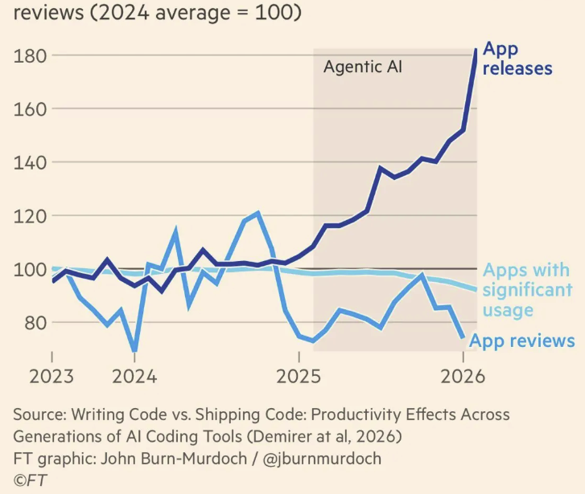

If you are reading this post on [R-bloggers](https://www.r-bloggers.com/), you will probably know that I have been publishing my selection of the "Top 40" new R packages on CRAN for quite some time. I did this first as part of my work at Revolution Analytics, then on [R Views](https://rviews.rstudio.com/) for RStudio and Posit, and now here on R Works. It used to take about a day's worth of pleasurable work spread out over a month to select forty interesting packages. For a hundred or so packages, I could look at all of the package webpages, download and play with a small number of them. Now, the "Top 40" has become a real hamster-on-the-wheel project. The following plot shows my count of the number of new packages to make it to CRAN since I began publishing on R Works.


```{r}
#| message: false
#| warning: false
#| code-fold: true
#| code-summary: "Show plot code"
library(tidyverse)
file_path <- "new-cran-pkgs.csv"

if (!file.exists(file_path)) {
  stop(paste("File not found! Please check the path:", file_path))
}

# Read text and numbers safely
raw_data <- read.csv(file_path, colClasses = c("character", "numeric"), stringsAsFactors = FALSE)

plot_data <- raw_data |> mutate(Date = my(Month)) |>
  arrange(Date)

new_pkg <- ggplot(plot_data, aes(x = Date, y = Num_pkgs, group = 1)) +
  geom_line(color = "#1f77b4", size = 1) +
  geom_point(color = "#d62728", size = 1.2) +

  labs(
    title = "Monthly Volume of New CRAN Packages",
    x = "Date",
    y = "Number of Packages",
    caption = "Source: R Works monthly Top 40 posts"
  ) +

  theme(
    plot.title = element_text(face = "bold"),
    panel.grid.minor = element_blank(),
    axis.text.x = element_text(angle = 45, hjust = 1)
  )

new_pkg
```

Why the sharp increase? What could possibly be going on? Well, I have a guess. It is apparently now just too easy to package up some code and ship it to CRAN. That's understandable: it's just too easy to write and deploy any kind of software. The following plot that John Burn-Murdoch recently published in the [Financial Times](https://www.ft.com/stream/e191658e-c66a-45bc-9bad-343bdc4210b3) based on [NBER research](https://www.nber.org/papers/w35275) shows the explosion of apps in our Agentic AI era.

{fig-alt="App releases over time"}


The plot also indicates that the new apps can't be making much of a positive contribution to people's lives or corporate profits. They are apparently not being used, or reviewed, or even discovered.

So let's ask the same kinds of questions about new R packages. Are most of them really making a contribution to R and the R Community? Are they contributing new statistical methods, extending the reach of R into new application areas, offering efficient high-performance code, or doing something else that would arguably benefit the R Community?

My impression as an engaged dilettante is no: most new R packages are not making a contribution. One obvious indicator of quality is documentation. A significant number of new R packages don't provide sufficient documentation to explain what they offer. For example, in May, 40 of the 323 new CRAN packages had no README file, no vignettes, and no URL linking to a repository. To my way of thinking, with the possible exceptions of packages that have some sort of discoverable out-of-band documentation (e.g., a journal publication) or are not meant to be called by end users because they are infrastructure for some suite of packages, packages that don't describe what, why, and how they work are not contributions.

As a hamster on the wheel, I would be very pleased to hear what you have to say. If you are motivated, please leave a comment at [Issue #68](https://github.com/r-community-works/rworks-website/issues/68) on the R Works GitHub repository.


